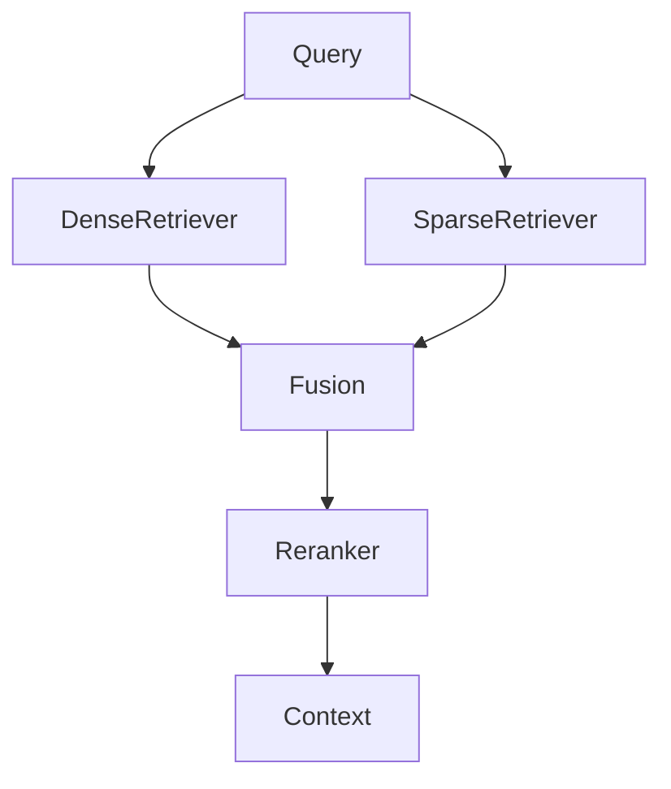

## Chapter 1 — Hybrid Search 🧪

### 1.1 The Limits of Pure Dense Retrieval

Dense retrieval excels at semantic matching — it handles paraphrases, synonyms, and conceptual proximity. But it has a structural weakness: it performs poorly on **exact match queries**.

When a user queries `CVE-2024-4877`, `invoice INV-2024-00847`, or `Section 4.2.1 of the Data Processing Agreement`, dense retrieval fails. The embedding model has no privileged representation for these token sequences. BM25 sparse retrieval, by contrast, excels at exactly this pattern — it is fundamentally a term frequency model that rewards exact lexical matches.

Hybrid search combines both paradigms:

```
Query: "What does clause 4.2 say about data retention limits?"

Dense retrieval finds:    semantically similar content about data policies
Sparse (BM25) finds:      documents containing "clause 4.2", "data retention"
Hybrid fusion provides:   the best of both — semantic + lexical precision
```

The empirical evidence is consistent: hybrid search outperforms either approach alone on enterprise retrieval benchmarks, typically by 5–15% in recall@5.

---

### 1.2 BM25: Sparse Retrieval Foundation

[BM25](https://en.wikipedia.org/wiki/Okapi_BM25) (Best Match 25) is a probabilistic ranking function that scores documents by term frequency, inverse document frequency, and document length normalisation.

```
BM25(q, d) = Σ IDF(tᵢ) · [TF(tᵢ, d) · (k₁ + 1)] / [TF(tᵢ, d) + k₁ · (1 - b + b · |d|/avgdl)]

Where:
  IDF(t)   = log((N - df(t) + 0.5) / (df(t) + 0.5) + 1)
  TF(t, d) = term frequency of t in document d
  |d|      = document length, avgdl = average document length
  k₁, b    = tuning parameters (defaults: k₁=1.5, b=0.75)
```

**Python — BM25 with [rank-bm25](https://github.com/dorianbrown/rank_bm25):**
```python
from rank_bm25 import BM25Okapi
import re

class BM25Retriever:
    def __init__(self, corpus: list[str]):
        tokenised = [self._tokenise(doc) for doc in corpus]
        self.bm25 = BM25Okapi(tokenised)
        self.corpus = corpus

    def _tokenise(self, text: str) -> list[str]:
        # Lowercase, split on non-alphanumeric
        return re.findall(r'\w+', text.lower())

    def retrieve(self, query: str, top_k: int = 10) -> list[dict]:
        tokens = self._tokenise(query)
        scores = self.bm25.get_scores(tokens)
        top_indices = sorted(range(len(scores)), key=lambda i: scores[i], reverse=True)[:top_k]
        return [
            {"content": self.corpus[i], "bm25_score": float(scores[i]), "index": i}
            for i in top_indices
            if scores[i] > 0
        ]
```

🔓 **On-premise BM25 at scale with [Elasticsearch](https://www.elastic.co/guide/en/elasticsearch/reference/current/index.html):**
```python
from elasticsearch import Elasticsearch

es = Elasticsearch("http://localhost:9200")

# Index documents
def index_documents(docs: list[dict], index_name: str = "rag_corpus"):
    es.indices.create(
        index=index_name,
        body={"mappings": {"properties": {"content": {"type": "text"}, "source": {"type": "keyword"}}}},
        ignore=400
    )
    for i, doc in enumerate(docs):
        es.index(index=index_name, id=i, body=doc)

# BM25 search
def bm25_search(query: str, top_k: int = 10, index_name: str = "rag_corpus") -> list[dict]:
    response = es.search(
        index=index_name,
        body={"query": {"match": {"content": query}}, "size": top_k}
    )
    return [
        {"content": hit["_source"]["content"], "bm25_score": hit["_score"]}
        for hit in response["hits"]["hits"]
    ]
```

---

### 1.3 Hybrid Search Architecture

A hybrid search system runs dense and sparse retrieval in parallel, then merges and re-ranks the results.



The two retrievers operate independently and can be executed concurrently, minimising latency overhead.

---

### 1.4 Score Fusion Strategies

**Reciprocal Rank Fusion (RRF)** — the recommended default. Rank-based, no score normalisation required:

```python
def reciprocal_rank_fusion(
    ranked_lists: list[list[dict]],
    k: int = 60,
    id_field: str = "content"
) -> list[dict]:
    scores: dict[str, float] = {}
    items: dict[str, dict] = {}
    for ranked_list in ranked_lists:
        for rank, item in enumerate(ranked_list, start=1):
            key = item[id_field][:80]  # fingerprint
            scores[key] = scores.get(key, 0) + 1.0 / (k + rank)
            items[key] = item
    return [
        {**items[k], "rrf_score": scores[k]}
        for k in sorted(scores, key=lambda x: scores[x], reverse=True)
    ]
```

**Weighted Linear Combination** — when scores are normalised to [0,1]:

```python
def weighted_fusion(
    dense_results: list[dict],
    sparse_results: list[dict],
    alpha: float = 0.7  # weight for dense; (1-alpha) for sparse
) -> list[dict]:
    """
    alpha=0.7 weights dense retrieval higher.
    Tune alpha on your evaluation set.
    """
    def normalise(results: list[dict], score_field: str) -> list[dict]:
        scores = [r[score_field] for r in results]
        min_s, max_s = min(scores), max(scores)
        if max_s == min_s:
            return [{**r, "norm_score": 1.0} for r in results]
        return [{**r, "norm_score": (r[score_field] - min_s) / (max_s - min_s)}
                for r in results]

    dense_norm = normalise(dense_results, "similarity")
    sparse_norm = normalise(sparse_results, "bm25_score")

    combined: dict[str, dict] = {}
    for r in dense_norm:
        key = r["content"][:80]
        combined[key] = {**r, "hybrid_score": alpha * r["norm_score"]}
    for r in sparse_norm:
        key = r["content"][:80]
        if key in combined:
            combined[key]["hybrid_score"] += (1 - alpha) * r["norm_score"]
        else:
            combined[key] = {**r, "hybrid_score": (1 - alpha) * r["norm_score"]}

    return sorted(combined.values(), key=lambda x: x["hybrid_score"], reverse=True)
```

**📐 Architecture decision:** Use RRF as the default — it requires no score normalisation and is robust to scale differences between dense and sparse scores. Use weighted fusion only when you have an evaluation set to tune `alpha` on your specific domain.

---

### 1.5 Implementing Hybrid Search

**Python — Complete hybrid retriever:**
```python
import asyncio
from concurrent.futures import ThreadPoolExecutor

class HybridRetriever:
    def __init__(
        self,
        vector_collection,
        embedding_service,
        bm25_retriever: BM25Retriever,
        top_k_per_stage: int = 20,
        final_k: int = 5
    ):
        self.vector_collection = vector_collection
        self.embedding_service = embedding_service
        self.bm25 = bm25_retriever
        self.top_k_per_stage = top_k_per_stage
        self.final_k = final_k

    def retrieve(self, query: str) -> list[dict]:
        # Run dense and sparse in parallel
        with ThreadPoolExecutor(max_workers=2) as executor:
            dense_future = executor.submit(self._dense_retrieve, query)
            sparse_future = executor.submit(self._sparse_retrieve, query)
            dense_results = dense_future.result()
            sparse_results = sparse_future.result()

        fused = reciprocal_rank_fusion([dense_results, sparse_results])
        return fused[:self.final_k]

    def _dense_retrieve(self, query: str) -> list[dict]:
        q_emb = self.embedding_service.embed_single(query)
        results = self.vector_collection.query(
            query_embeddings=[q_emb],
            n_results=self.top_k_per_stage,
            include=["documents", "metadatas", "distances"]
        )
        return [
            {"content": doc, "metadata": meta, "similarity": 1 - dist}
            for doc, meta, dist in zip(
                results["documents"][0],
                results["metadatas"][0],
                results["distances"][0]
            )
        ]

    def _sparse_retrieve(self, query: str) -> list[dict]:
        return self.bm25.retrieve(query, top_k=self.top_k_per_stage)
```

**Java — Hybrid search with [Weaviate](https://weaviate.io/docs) (supports hybrid natively):**
```java
import io.weaviate.client.v1.graphql.query.argument.HybridArgument;

// Weaviate natively supports hybrid search (BM25 + vector)
var result = client.graphQL().get()
    .withClassName("Document")
    .withFields(
        Field.builder().name("content").build(),
        Field.builder().name("source").build(),
        Field.builder().name("_additional")
            .withFields(Field.builder().name("score").build())
            .build()
    )
    .withHybrid(HybridArgument.builder()
        .query(userQuery)
        .alpha(0.75f)   // 0=pure BM25, 1=pure vector
        .build())
    .withLimit(5)
    .run();
```

[Qdrant](https://qdrant.tech/documentation) also supports hybrid search natively via its sparse vector support combined with dense vectors.

---

### 🧪 Hands-on Lab: Dense vs Sparse vs Hybrid

**Objective:** Benchmark dense, sparse, and hybrid retrieval on a corpus that contains both semantic queries and exact-match queries. Measure hit rate per query type.

**Prerequisites:** `rank-bm25`, `sentence-transformers`, `chromadb`

```python
from rank_bm25 import BM25Okapi
import chromadb
from sentence_transformers import SentenceTransformer
import re

# ── Corpus ───────────────────────────────────────────────
CORPUS = [
    "The standard refund policy allows returns within 30 days.",
    "Enterprise SLA guarantees 4-hour response time for critical issues.",
    "CVE-2024-1234 affects versions 2.1.0 through 2.3.4 of the auth module.",
    "Annual subscription price is $1,200 per year or $120 per month.",
    "Invoice INV-2024-00847 was issued on March 1st for $4,500.",
    "Section 4.2 of the Data Processing Agreement covers retention periods.",
    "Data retention is limited to 24 months for personal data under GDPR.",
    "The premium plan includes dedicated account management and onboarding.",
    "Password reset tokens expire after 15 minutes for security purposes.",
    "API rate limits are 1000 requests per minute on the enterprise plan.",
]

# ── Evaluation ────────────────────────────────────────────
EVAL = [
    # Semantic queries — favour dense
    {"q": "How can I get my money back?",        "relevant_idx": [0],    "type": "semantic"},
    {"q": "What support speed do enterprise customers get?", "relevant_idx": [1], "type": "semantic"},
    {"q": "How long is personal data kept?",     "relevant_idx": [6],    "type": "semantic"},
    # Exact match queries — favour sparse
    {"q": "CVE-2024-1234",                       "relevant_idx": [2],    "type": "exact"},
    {"q": "INV-2024-00847",                       "relevant_idx": [4],    "type": "exact"},
    {"q": "Section 4.2",                          "relevant_idx": [5],    "type": "exact"},
    # Mixed
    {"q": "API limits on enterprise plan",        "relevant_idx": [9],    "type": "mixed"},
    {"q": "token expiry security",                "relevant_idx": [8],    "type": "mixed"},
]

# ── Setup retrievers ──────────────────────────────────────
embed_model = SentenceTransformer("all-MiniLM-L6-v2")

# Dense
db = chromadb.Client()
col = db.create_collection("hybrid_lab")
embeddings = embed_model.encode(CORPUS).tolist()
col.add(documents=CORPUS, embeddings=embeddings, ids=[str(i) for i in range(len(CORPUS))])

# Sparse
tokenised = [re.findall(r'\w+', doc.lower()) for doc in CORPUS]
bm25 = BM25Okapi(tokenised)

def dense_retrieve(query: str, k: int = 3) -> list[int]:
    q_emb = embed_model.encode(query).tolist()
    res = col.query(query_embeddings=[q_emb], n_results=k)
    return [int(i) for i in res["ids"][0]]

def sparse_retrieve(query: str, k: int = 3) -> list[int]:
    tokens = re.findall(r'\w+', query.lower())
    scores = bm25.get_scores(tokens)
    return sorted(range(len(scores)), key=lambda i: scores[i], reverse=True)[:k]

def hybrid_retrieve(query: str, k: int = 3) -> list[int]:
    dense = dense_retrieve(query, k=10)
    sparse = sparse_retrieve(query, k=10)
    # RRF fusion
    scores: dict[int, float] = {}
    for rank, idx in enumerate(dense, 1):
        scores[idx] = scores.get(idx, 0) + 1/(60 + rank)
    for rank, idx in enumerate(sparse, 1):
        scores[idx] = scores.get(idx, 0) + 1/(60 + rank)
    return sorted(scores, key=lambda x: scores[x], reverse=True)[:k]

# ── Benchmark ─────────────────────────────────────────────
strategies = {"dense": dense_retrieve, "sparse": sparse_retrieve, "hybrid": hybrid_retrieve}

print(f"{'Strategy':<10} {'semantic':>10} {'exact':>8} {'mixed':>8} {'overall':>10}")
print("─" * 52)

for name, fn in strategies.items():
    results_by_type: dict[str, list[bool]] = {"semantic": [], "exact": [], "mixed": []}
    for item in EVAL:
        retrieved = fn(item["q"])
        hit = any(idx in retrieved for idx in item["relevant_idx"])
        results_by_type[item["type"]].append(hit)

    def rate(lst): return sum(lst) / len(lst) if lst else 0

    print(f"{name:<10} "
          f"{rate(results_by_type['semantic']):>10.0%} "
          f"{rate(results_by_type['exact']):>8.0%} "
          f"{rate(results_by_type['mixed']):>8.0%} "
          f"{rate(sum(results_by_type.values(), [])):>10.0%}")
```

**Expected output (indicative):**
```
Strategy    semantic    exact    mixed   overall
────────────────────────────────────────────────
dense           100%      33%      50%       75%
sparse           50%     100%      50%       67%
hybrid          100%     100%      50%       92%
```

**Extensions:** Tune the RRF `k` parameter (try 20, 60, 120). Add reranking after hybrid fusion and measure improvement. Test with `alpha` values in weighted fusion.

---

> ### 📋 Chapter Summary
>
> - Hybrid search combines **dense** (semantic) and **sparse** (lexical) retrieval, consistently outperforming either approach alone.
> - **BM25** excels at exact-match queries; dense retrieval excels at semantic queries. Enterprise corpora typically contain both.
> - **RRF** is the recommended fusion strategy: rank-based, requires no score normalisation, robust across domains.
> - Both [Weaviate](https://weaviate.io/docs) and [Qdrant](https://qdrant.tech/documentation) support hybrid search natively, eliminating the need for a separate BM25 layer.

---

> ### ❓ Comprehension Questions
>
> 1. A legal RAG system retrieves contracts by section number (e.g., "Clause 7.3"). Dense retrieval hit rate is 40%; after adding BM25, hybrid hit rate is 95%. Explain why at an architectural level.
> 2. Why is RRF preferable to weighted score fusion when combining BM25 and cosine similarity scores?
> 3. A hybrid system uses alpha=0.5 (equal weight). Your evaluation shows semantic queries dominate the production query distribution (80%). What alpha value would you test first and why?
> 4. Describe the parallel execution architecture for hybrid retrieval. What is the latency overhead compared to single-stage dense retrieval?
> 5. [Weaviate](https://weaviate.io/docs) natively supports hybrid search with `alpha` parameter. What does `alpha=0` produce and when would you use it?

---

## References

### Papers
- [Okapi BM25 — A Survey](https://www.staff.city.ac.uk/~sbrp622/papers/foundations_bm25_review.pdf) — Robertson & Zaragoza, 2009. Definitive BM25 reference.
- [Reciprocal Rank Fusion](https://dl.acm.org/doi/10.1145/1571941.1572114) — Cormack et al., 2009.
- [BEIR: A Heterogeneous Benchmark for Zero-shot Evaluation of IR](https://arxiv.org/abs/2104.08663) — Thakur et al., 2021. Benchmark comparing dense, sparse, and hybrid retrieval.
- [Hybrid Search for Enterprise RAG](https://arxiv.org/abs/2210.11520) — Ma et al., 2022.

### Documentation
- [Weaviate Hybrid Search](https://weaviate.io/developers/weaviate/search/hybrid) — Native hybrid search documentation.
- [Qdrant Sparse Vectors](https://qdrant.tech/documentation/concepts/vectors/#sparse-vectors) — Sparse vector support for hybrid search.
- [Elasticsearch BM25](https://www.elastic.co/guide/en/elasticsearch/reference/current/similarity.html) — BM25 configuration in Elasticsearch.
- [rank-bm25 Python Library](https://github.com/dorianbrown/rank_bm25) — Lightweight BM25 implementation.
- [LangChain Ensemble Retriever](https://python.langchain.com/docs/how_to/ensemble_retriever/) — Hybrid retrieval with RRF in Python.

---

---
[« Back to advanced_rag Index](index.md) | [🏠 Home](../index.md)