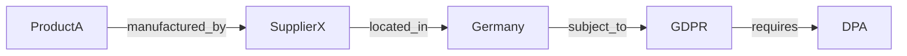
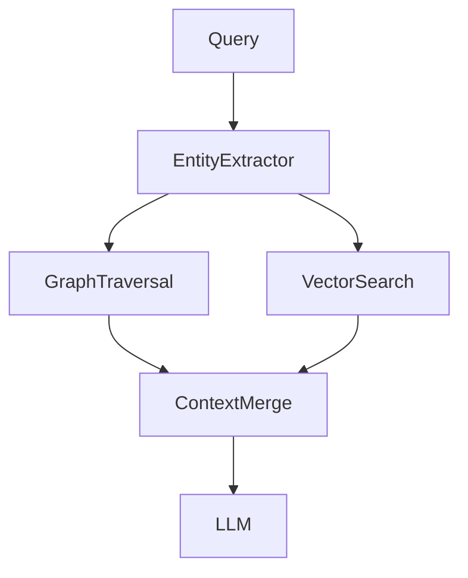

## Chapter 5 — Knowledge Graphs + RAG

### 5.1 Limitations of Flat Vector Search

Vector similarity search treats each chunk as an independent unit. It has no model of the **relationships** between entities in the corpus. This creates a class of queries that flat RAG cannot answer well:

- "What are all the products affected by supplier X?"
- "Which employees report to the VP of Engineering, directly or transitively?"
- "What regulations apply to operations in both Germany and California?"

These are **multi-hop** or **relationship-traversal** queries. They require following chains of relationships across entities — something a graph database does natively and a vector database cannot do at all.

Combining knowledge graphs with RAG (GraphRAG) addresses this gap.

---

### 5.2 Knowledge Graph Fundamentals

A knowledge graph represents information as a set of triples: `(subject, predicate, object)`.

```
(Product_A, manufactured_by, Supplier_X)
(Supplier_X, located_in, Germany)
(Germany, subject_to, GDPR)
(GDPR, requires, Data_Processing_Agreement)
```

This structure enables multi-hop traversal:
```
Query: "What agreements are required for products from Supplier X?"
Path: Product_A → manufactured_by → Supplier_X → located_in → Germany → subject_to → GDPR → requires → DPA
```



---

### 5.3 GraphRAG Architecture

[GraphRAG](https://arxiv.org/abs/2404.16130) (Microsoft Research, 2024) extends standard RAG with a knowledge graph layer. Retrieval proceeds through both the vector index and the graph:



**Two complementary retrieval modes:**

**Local search** — similar to standard RAG; retrieves specific chunks by vector similarity. Best for factual queries about specific entities.

**Global search** — traverses the knowledge graph to find relationships and community summaries. Best for multi-hop and aggregation queries.

---

### 5.4 Entity Extraction and Graph Construction

Building a knowledge graph from a document corpus requires extracting entities and relationships.

```python
import json
from openai import OpenAI

client = OpenAI()

def extract_entities_and_relations(text: str) -> dict:
    """
    Extract a knowledge graph from text using LLM.
    Returns {"entities": [...], "relations": [...]}
    """
    response = client.chat.completions.create(
        model="gpt-4o",
        messages=[
            {
                "role": "system",
                "content": """Extract entities and relationships from the text.
Return JSON:
{
  "entities": [{"id": "E1", "name": "...", "type": "person|org|product|regulation|concept"}],
  "relations": [{"subject": "E1", "predicate": "...", "object": "E2"}]
}
Focus on significant named entities and explicit relationships."""
            },
            {"role": "user", "content": text}
        ],
        response_format={"type": "json_object"},
        temperature=0
    )
    return json.loads(response.choices[0].message.content)

# Build graph using networkx
import networkx as nx

class KnowledgeGraph:
    def __init__(self):
        self.graph = nx.DiGraph()
        self.entity_texts: dict[str, str] = {}

    def add_from_extraction(self, extraction: dict, source_doc: str):
        for entity in extraction.get("entities", []):
            self.graph.add_node(
                entity["name"],
                entity_type=entity.get("type", "unknown"),
                source=source_doc
            )
            self.entity_texts[entity["name"]] = entity.get("description", entity["name"])

        for rel in extraction.get("relations", []):
            subj = rel["subject"]
            obj = rel["object"]
            pred = rel["predicate"]
            if subj in self.graph and obj in self.graph:
                self.graph.add_edge(subj, obj, predicate=pred, source=source_doc)

    def get_neighbours(self, entity: str, depth: int = 2) -> list[tuple]:
        """Return all nodes within `depth` hops of entity."""
        if entity not in self.graph:
            return []
        paths = []
        for target in nx.single_source_shortest_path(self.graph, entity, cutoff=depth):
            if target != entity:
                path = nx.shortest_path(self.graph, entity, target)
                edges = [
                    (path[i], self.graph[path[i]][path[i+1]]["predicate"], path[i+1])
                    for i in range(len(path)-1)
                ]
                paths.extend(edges)
        return list(set(paths))

    def subgraph_context(self, entities: list[str], depth: int = 2) -> str:
        """Build a text representation of the subgraph around given entities."""
        triples = []
        for entity in entities:
            neighbours = self.get_neighbours(entity, depth)
            triples.extend(neighbours)
        unique_triples = list(set(triples))
        return "\n".join(f"{s} --[{p}]--> {o}" for s, p, o in unique_triples[:50])
```

---

### 5.5 Graph-Enhanced Retrieval

GraphRAG combines vector similarity with graph traversal to construct richer context:

```python
class GraphRAGRetriever:
    def __init__(
        self,
        vector_retriever,
        knowledge_graph: KnowledgeGraph,
        embedding_service
    ):
        self.vector_retriever = vector_retriever
        self.kg = knowledge_graph
        self.embedding_service = embedding_service

    def retrieve(self, query: str, top_k: int = 5) -> dict:
        # 1. Standard vector retrieval
        vector_chunks = self.vector_retriever.retrieve(query, top_k=top_k)

        # 2. Extract entities mentioned in query
        entities = self._extract_query_entities(query)

        # 3. Graph traversal around query entities
        graph_context = ""
        if entities:
            graph_context = self.kg.subgraph_context(entities, depth=2)

        return {
            "vector_chunks": [c["content"] for c in vector_chunks],
            "graph_context": graph_context,
            "entities": entities
        }

    def _extract_query_entities(self, query: str) -> list[str]:
        response = client.chat.completions.create(
            model="gpt-4o-mini",
            messages=[
                {
                    "role": "system",
                    "content": """Extract named entities from the query.
Return JSON: {"entities": ["entity1", "entity2"]}
Only include proper nouns and specific named concepts."""
                },
                {"role": "user", "content": query}
            ],
            response_format={"type": "json_object"},
            temperature=0
        )
        data = json.loads(response.choices[0].message.content)
        entities = data.get("entities", [])
        # Filter to entities present in graph
        return [e for e in entities if e in self.kg.graph]

    def build_graph_rag_prompt(self, query: str) -> str:
        results = self.retrieve(query)
        context_parts = ["## Retrieved Documents"]
        context_parts.extend(
            f"[{i+1}] {chunk}"
            for i, chunk in enumerate(results["vector_chunks"])
        )
        if results["graph_context"]:
            context_parts.append("\n## Knowledge Graph Context")
            context_parts.append(results["graph_context"])

        return "\n\n".join(context_parts)
```

🔓 **Production graph storage with [Neo4j](https://neo4j.com/docs/):**
```python
from neo4j import GraphDatabase

driver = GraphDatabase.driver("bolt://localhost:7687", auth=("neo4j", "password"))

def add_triple(subject: str, predicate: str, obj: str, source: str):
    with driver.session() as session:
        session.run("""
            MERGE (s:Entity {name: $subject})
            MERGE (o:Entity {name: $object})
            MERGE (s)-[r:RELATION {type: $predicate, source: $source}]->(o)
        """, subject=subject, predicate=predicate, object=obj, source=source)

def multi_hop_query(start_entity: str, max_hops: int = 3) -> list[dict]:
    with driver.session() as session:
        result = session.run("""
            MATCH path = (s:Entity {name: $start})-[*1..%d]->(t:Entity)
            RETURN path, length(path) as hops
            ORDER BY hops
            LIMIT 50
        """ % max_hops, start=start_entity)
        return [{"path": str(r["path"]), "hops": r["hops"]} for r in result]
```

---

> ### 📋 Chapter Summary
>
> - Flat vector search cannot answer relationship-traversal or multi-hop queries — questions that require following chains of relationships between entities.
> - **Knowledge graphs** represent information as `(subject, predicate, object)` triples, enabling graph traversal queries.
> - **GraphRAG** combines vector search (local factual retrieval) with graph traversal (relationship-aware context) for richer, more accurate answers.
> - Entity extraction and graph construction require LLM assistance; quality of the graph directly determines quality of graph-enhanced retrieval.
> - [Neo4j](https://neo4j.com/docs/) is the recommended production graph database for on-premise GraphRAG deployments.

---

> ### ❓ Comprehension Questions
>
> 1. A user asks "which of our products are affected by the new EU regulation?" on a flat RAG system. Why does this query fail, and how does GraphRAG address it?
> 2. Entity extraction from documents introduces noise — entities may be misspelled, ambiguous, or duplicated (e.g., "Apple" as company vs. fruit). How would you build entity resolution into the graph construction pipeline?
> 3. Describe the engineering effort required to add GraphRAG to an existing RAG system. What components need to be built or modified?
> 4. A knowledge graph built from 10,000 documents has 250,000 nodes and 1.2M edges. What graph database and indexing strategy would you use to serve multi-hop queries under 100ms?
> 5. GraphRAG adds significant complexity to a RAG system. Describe the query distribution patterns that would justify this complexity over standard Advanced RAG.

---

## References

### Papers
- [GraphRAG: Unlocking LLM Discovery on Narrative Private Data](https://arxiv.org/abs/2404.16130) — Edge et al. (Microsoft), 2024. Foundational GraphRAG paper.
- [G-Retriever: Retrieval-Augmented Generation for Textual Graph Understanding](https://arxiv.org/abs/2402.07630) — He et al., 2024.
- [KGRAG: Knowledge Graph Enhanced Retrieval Augmented Generation](https://arxiv.org/abs/2404.04726) — 2024.

### Documentation
- [Microsoft GraphRAG GitHub](https://github.com/microsoft/graphrag) — Open-source GraphRAG implementation.
- [Neo4j Documentation](https://neo4j.com/docs/) — Graph database reference.
- [NetworkX Documentation](https://networkx.org/documentation/stable/) — Python graph library.
- [LlamaIndex Knowledge Graph Index](https://docs.llamaindex.ai/en/stable/examples/index_structs/knowledge_graph/KnowledgeGraphDemo/) — KG-enhanced retrieval in Python.
- [LangChain Graph RAG](https://python.langchain.com/docs/tutorials/graph/) — Graph-based RAG pipeline.

---

---
[« Back to advanced_rag Index](index.md) | [🏠 Home](../index.md)