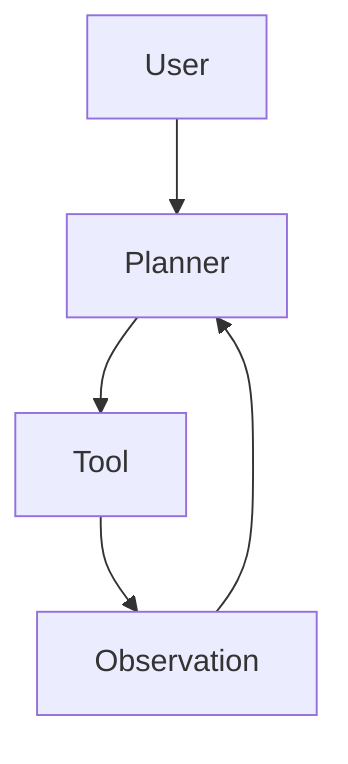
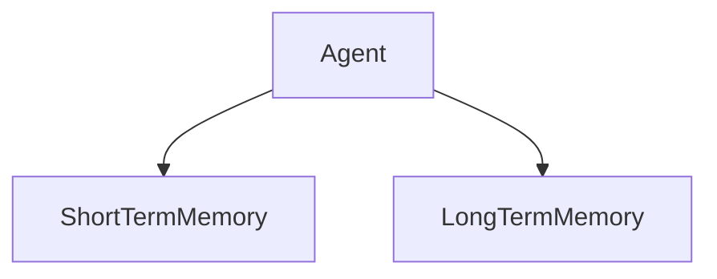
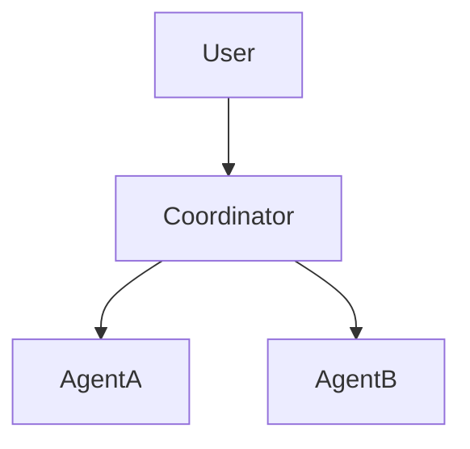

## Chapter 5 — Agent Architectures 🧪

### 5.1 From Pipelines to Agents

The architectural patterns covered so far — prompt-only, RAG, tool-augmented — share a common property: **the execution flow is defined by the developer**. The code determines what happens, in what order, and under what conditions. The LLM is a component in a pipeline, not a decision-maker.

Agent architectures invert this relationship. In an agentic system, **the LLM drives execution**: it decides which tools to call, in what sequence, and when the task is complete. The developer defines the available tools and the constraints; the model plans the path to the goal.

```
Traditional pipeline:           Agent loop:

Developer-defined flow:         LLM-driven flow:
Step 1 → Step 2 → Step 3       Goal → Plan → Act → Observe → Plan → ...
(deterministic)                 (adaptive)
```

This shift introduces significant power — and significant engineering complexity. Agent systems can handle tasks that no fixed pipeline could anticipate. They also introduce failure modes — infinite loops, incorrect tool selection, runaway costs — that require explicit architectural mitigations.

---

### 5.2 The ReAct Pattern

ReAct (Reasoning + Acting) is the foundational agent pattern. The LLM alternates between **Thought** (reasoning about what to do), **Action** (invoking a tool), and **Observation** (processing the tool result), until it reaches a final answer.

```
User: "What were the total sales for Q3 2024 and how does it compare to Q3 2023?"

Thought: I need to retrieve sales data for Q3 2024 and Q3 2023.
Action: query_sales_db(period="Q3_2024")
Observation: {"total": 4_250_000, "currency": "USD", "period": "Q3_2024"}

Thought: Now I need Q3 2023 data.
Action: query_sales_db(period="Q3_2023")
Observation: {"total": 3_890_000, "currency": "USD", "period": "Q3_2023"}

Thought: I can now compute the comparison: +360,000 (+9.2%). I have all data.
Answer: Q3 2024 total sales were $4.25M, up 9.2% from Q3 2023 ($3.89M).
```



The loop continues until the model issues a final answer rather than another tool call.

**Python — ReAct agent with [OpenAI](https://platform.openai.com/docs):**
```python
import json
from openai import OpenAI

client = OpenAI()

def run_react_agent(
    user_query: str,
    tools: list[dict],
    tool_registry: dict,
    system_prompt: str,
    max_iterations: int = 10
) -> str:
    messages = [
        {"role": "system", "content": system_prompt},
        {"role": "user", "content": user_query}
    ]

    for iteration in range(max_iterations):
        response = client.chat.completions.create(
            model="gpt-4o",
            messages=messages,
            tools=tools,
            tool_choice="auto"
        )
        choice = response.choices[0]

        # Model reached a final answer
        if choice.finish_reason == "stop":
            return choice.message.content

        # Model requested tool calls
        if choice.finish_reason == "tool_calls":
            messages.append(choice.message)
            for tool_call in choice.message.tool_calls:
                fn_name = tool_call.function.name
                fn_args = json.loads(tool_call.function.arguments)
                fn = tool_registry.get(fn_name)
                result = fn(**fn_args) if fn else {"error": f"Unknown tool: {fn_name}"}
                messages.append({
                    "role": "tool",
                    "tool_call_id": tool_call.id,
                    "content": json.dumps(result)
                })

    return "Max iterations reached without a final answer."
```

---

### 5.3 Planner-Executor Architecture

For complex multi-step tasks, a two-component architecture separates planning from execution. A **planner** LLM decomposes the goal into a sequence of steps; an **executor** LLM (or deterministic code) carries out each step.

```
User Goal
     │
     ▼
Planner LLM
│  "To answer this, I need to:
│   1. Retrieve Q3 sales data
│   2. Retrieve Q3 2023 data
│   3. Compute YoY change
│   4. Format as executive summary"
     │
     ▼
Task Queue: [task_1, task_2, task_3, task_4]
     │
     ▼
Executor (per task) → Tool calls → Results
     │
     ▼
Aggregator → Final response
```

**Python — Planner-Executor:**
```python
from pydantic import BaseModel
from typing import List
import json

class TaskPlan(BaseModel):
    tasks: List[str]
    rationale: str

PLANNER_PROMPT = """
You are a task planning agent. Given a user goal, decompose it into
a sequential list of concrete tasks that can each be executed independently.

Respond with valid JSON:
{
  "tasks": ["task description 1", "task description 2", ...],
  "rationale": "brief explanation of the decomposition"
}
"""

def plan_tasks(goal: str) -> TaskPlan:
    response = client.chat.completions.create(
        model="gpt-4o",
        messages=[
            {"role": "system", "content": PLANNER_PROMPT},
            {"role": "user", "content": f"Goal: {goal}"}
        ],
        response_format={"type": "json_object"},
        temperature=0
    )
    return TaskPlan(**json.loads(response.choices[0].message.content))

def execute_task(task: str, context: dict, tools: list, registry: dict) -> str:
    """Execute a single task within the broader context."""
    messages = [
        {
            "role": "system",
            "content": "Execute the given task using available tools. Be concise."
        },
        {
            "role": "user",
            "content": f"Task: {task}\nContext: {json.dumps(context)}"
        }
    ]
    # Single-step tool execution
    response = client.chat.completions.create(
        model="gpt-4o",
        messages=messages,
        tools=tools,
        tool_choice="auto"
    )
    # ... handle tool calls and return result

def run_planner_executor(goal: str, tools: list, registry: dict) -> str:
    plan = plan_tasks(goal)
    context = {}
    results = []
    for i, task in enumerate(plan.tasks):
        result = execute_task(task, context, tools, registry)
        context[f"task_{i+1}_result"] = result
        results.append(result)
    # Final synthesis
    return synthesize_results(goal, results)
```

---

### 5.4 Agent Memory Systems

Agents operating across long tasks or multiple sessions require memory beyond the current context window. Three memory types address different needs:



**Short-term memory (in-context):** The current conversation and intermediate reasoning steps. Limited by the context window. Managed as the `messages` list in the API call.

**Working memory (external store):** Intermediate results from tool calls, computed values, and partial results that accumulate during a single agent run. Stored in-process or in a fast key-value store (Redis).

**Long-term memory (vector store):** Persistent knowledge that spans sessions — user preferences, past interactions, learned facts. Stored in a vector database and retrieved semantically.

```python
import redis
import json

class AgentMemory:
    def __init__(self, session_id: str):
        self.session_id = session_id
        self.redis = redis.Redis(host="localhost", port=6379, decode_responses=True)
        self.key = f"agent:memory:{session_id}"

    def store(self, key: str, value: any):
        data = self.redis.get(self.key)
        memory = json.loads(data) if data else {}
        memory[key] = value
        self.redis.setex(self.key, 3600, json.dumps(memory))  # 1h TTL

    def retrieve(self, key: str) -> any:
        data = self.redis.get(self.key)
        if not data:
            return None
        return json.loads(data).get(key)

    def get_all(self) -> dict:
        data = self.redis.get(self.key)
        return json.loads(data) if data else {}
```

---

### 5.5 Multi-Agent Collaboration

Complex enterprise workflows often exceed the capabilities of a single agent. Multi-agent systems assign specialized agents to sub-tasks and coordinate their outputs.



**Common multi-agent patterns:**

**Coordinator-Worker:** A coordinator agent decomposes the task and delegates to specialized workers. Workers execute independently and report results to the coordinator.

**Pipeline:** Agents operate in sequence, each transforming the output of the previous. Similar to a data processing pipeline but with LLM-driven stages.

**Debate:** Multiple agents independently analyze a problem and a judge agent evaluates their reasoning. Useful for tasks requiring high accuracy or adversarial validation.

```python
class MultiAgentOrchestrator:
    def __init__(self, agents: dict[str, callable]):
        self.agents = agents

    def coordinate(self, task: str) -> str:
        # 1. Coordinator decomposes task
        subtasks = self._decompose(task)

        # 2. Route subtasks to specialist agents
        results = {}
        for subtask in subtasks:
            agent_name = self._route(subtask)
            agent = self.agents.get(agent_name)
            if agent:
                results[subtask] = agent(subtask)

        # 3. Synthesize results
        return self._synthesize(task, results)

    def _decompose(self, task: str) -> list[str]:
        # LLM-based decomposition
        ...

    def _route(self, subtask: str) -> str:
        # Route to specialist based on subtask type
        if "financial" in subtask.lower():
            return "financial_agent"
        elif "legal" in subtask.lower():
            return "legal_agent"
        return "general_agent"
```

---

### 5.6 Reliability and Control

Agent systems can fail in ways that have no equivalent in deterministic pipelines. Every production agent system must implement explicit safeguards:

**Iteration limits:** Prevent infinite reasoning loops.
```python
MAX_ITERATIONS = 15  # Hard ceiling on agent loop iterations
```

**Cost caps:** Monitor and limit token consumption per agent run.
```python
MAX_TOKENS_PER_RUN = 50_000  # Approximately $0.50 at GPT-4o pricing
```

**Timeout controls:** Agent tasks must complete within bounded time.
```python
import signal

def with_timeout(fn, timeout_seconds: int = 30):
    def handler(signum, frame):
        raise TimeoutError(f"Agent exceeded {timeout_seconds}s timeout")
    signal.signal(signal.SIGALRM, handler)
    signal.alarm(timeout_seconds)
    try:
        return fn()
    finally:
        signal.alarm(0)
```

**Observability:** Every agent step — thought, tool call, observation — must be logged for debugging.

```python
import logging

class InstrumentedAgent:
    def __init__(self, logger: logging.Logger):
        self.logger = logger

    def log_step(self, step_type: str, content: dict):
        self.logger.info(json.dumps({
            "step_type": step_type,
            "session_id": self.session_id,
            "iteration": self.current_iteration,
            **content
        }))
```

---

### 5.7 Agent Frameworks

Several frameworks abstract the agent loop, tool calling, and memory management:

| Framework | Language | Strengths | Best for |
|---|---|---|---|
| **[LangGraph](https://langchain-ai.github.io/langgraph)** | Python | Graph-based flows, fine-grained control | Complex multi-agent workflows |
| **[AutoGen](https://microsoft.github.io/autogen)** | Python | Multi-agent conversations, code execution | Research automation |
| **[CrewAI](https://docs.crewai.com)** | Python | Role-based agents, intuitive API | Team-style task decomposition |
| **[Semantic Kernel](https://learn.microsoft.com/en-us/semantic-kernel/overview/)** | Python / C# / Java | Enterprise integration, .NET ecosystem | Microsoft-stack enterprises |
| **[LangChain4j](https://docs.langchain4j.dev) Agents** | Java | Native Java, Spring integration | Java enterprise systems |

🔓 All listed frameworks are open-source and support on-premise LLM backends via [Ollama](https://ollama.com) or [vLLM](https://docs.vllm.ai).

---

### 🧪 Hands-on Lab: Build a Tool-Using Agent

**Objective:** Build a functional ReAct agent that answers questions about a company knowledge base using two tools: a vector search tool and a calculator tool.

**Prerequisites:**
- Python 3.11+
- `openai`, `[chromadb](https://docs.trychroma.com)`, `[sentence-transformers](https://www.sbert.net)` packages
- OpenAI API key (or Ollama running locally)

**Step 1 — Define the tools:**

```python
import json
import math
import chromadb
from sentence_transformers import SentenceTransformer
from openai import OpenAI

# Embedding model (local — no API cost)
embed_model = SentenceTransformer("all-MiniLM-L6-v2")

# Vector DB with sample documents
db_client = chromadb.Client()
collection = db_client.create_collection("company_kb")

sample_docs = [
    "The refund policy allows returns within 30 days of purchase.",
    "Enterprise plan includes unlimited users and priority support.",
    "Annual subscription costs $1,200 per year. Monthly is $120 per month.",
    "Support response time SLA is 4 hours for enterprise customers.",
    "The free tier supports up to 5 users and 10GB storage."
]

embeddings = embed_model.encode(sample_docs).tolist()
collection.add(
    documents=sample_docs,
    embeddings=embeddings,
    ids=[str(i) for i in range(len(sample_docs))]
)

# Tool 1: Knowledge base search
def search_knowledge_base(query: str, top_k: int = 3) -> dict:
    query_emb = embed_model.encode(query).tolist()
    results = collection.query(query_embeddings=[query_emb], n_results=top_k)
    return {"results": results["documents"][0]}

# Tool 2: Calculator
def calculate(expression: str) -> dict:
    try:
        # Safe eval — only math operations
        allowed = {k: getattr(math, k) for k in dir(math) if not k.startswith("_")}
        result = eval(expression, {"__builtins__": {}}, allowed)
        return {"result": result, "expression": expression}
    except Exception as e:
        return {"error": str(e)}

TOOL_REGISTRY = {
    "search_knowledge_base": search_knowledge_base,
    "calculate": calculate
}

TOOLS = [
    {
        "type": "function",
        "function": {
            "name": "search_knowledge_base",
            "description": "Search the company knowledge base for relevant information",
            "parameters": {
                "type": "object",
                "properties": {
                    "query": {"type": "string", "description": "Search query"},
                    "top_k": {"type": "integer", "default": 3}
                },
                "required": ["query"]
            }
        }
    },
    {
        "type": "function",
        "function": {
            "name": "calculate",
            "description": "Perform mathematical calculations",
            "parameters": {
                "type": "object",
                "properties": {
                    "expression": {"type": "string", "description": "Math expression to evaluate"}
                },
                "required": ["expression"]
            }
        }
    }
]
```

**Step 2 — Build the agent loop:**

```python
SYSTEM_PROMPT = """
You are a company knowledge assistant.
Use search_knowledge_base to find information, and calculate for math.
Always search before answering factual questions about the company.
Be concise and cite the specific information you found.
"""

client = OpenAI()

def run_agent(user_query: str, max_iterations: int = 8) -> str:
    messages = [
        {"role": "system", "content": SYSTEM_PROMPT},
        {"role": "user", "content": user_query}
    ]
    iterations = 0

    while iterations < max_iterations:
        iterations += 1
        response = client.chat.completions.create(
            model="gpt-4o-mini",  # Cost-optimized for this lab
            messages=messages,
            tools=TOOLS,
            tool_choice="auto"
        )
        choice = response.choices[0]

        if choice.finish_reason == "stop":
            return choice.message.content

        if choice.finish_reason == "tool_calls":
            messages.append(choice.message)
            for tool_call in choice.message.tool_calls:
                name = tool_call.function.name
                args = json.loads(tool_call.function.arguments)
                print(f"  → Tool call: {name}({args})")  # Debug output
                result = TOOL_REGISTRY[name](**args)
                messages.append({
                    "role": "tool",
                    "tool_call_id": tool_call.id,
                    "content": json.dumps(result)
                })

    return "Agent reached maximum iterations."
```

**Step 3 — Test the agent:**

```python
test_queries = [
    "What is the refund policy?",
    "How much does an annual subscription cost, and how much would 3 years cost?",
    "What are the SLA guarantees for enterprise customers?",
    "Compare the free tier and enterprise plan features."
]

for query in test_queries:
    print(f"\nQuery: {query}")
    print(f"Answer: {run_agent(query)}")
    print("-" * 60)
```

**Step 4 — Extend the lab (optional):**

- Add a third tool: `get_current_date()` that returns today's date
- Add iteration and cost logging
- Replace OpenAI with Ollama: change `client = OpenAI(base_url="http://localhost:11434/v1", api_key="ollama")`
- Add a maximum token counter that aborts the agent if cost exceeds a threshold

**Expected output:**
```
Query: How much does an annual subscription cost, and how much would 3 years cost?
  → Tool call: search_knowledge_base({'query': 'annual subscription cost'})
  → Tool call: calculate({'expression': '1200 * 3'})
Answer: The annual subscription costs $1,200 per year.
        For 3 years, the total cost would be $3,600.
```

---

> ### 📋 Chapter Summary
>
> - **Agent architectures** shift execution control from the developer (pipeline) to the LLM (adaptive reasoning loop).
> - The **ReAct pattern** (Reason + Act + Observe) is the foundational agent loop: the model reasons, calls a tool, observes the result, and continues until the task is complete.
> - **Planner-Executor** separates goal decomposition from execution, improving reliability for complex multi-step tasks.
> - **Memory systems** — short-term (in-context), working (external store), long-term (vector store) — address different temporal scopes of agent state.
> - **Multi-agent systems** assign specialized agents to sub-tasks; coordinator patterns, pipelines, and debate architectures address different collaboration needs.
> - **Reliability controls** — iteration limits, cost caps, timeouts, observability — are mandatory in production agent systems.

---

> ### ❓ Comprehension Questions
>
> 1. An agent system for customer support has been in production for a week. Engineers notice some agent runs are consuming 80,000+ tokens per request. What safeguards should have been in place, and how would you implement them?
> 2. Compare the debugging process for a deterministic RAG pipeline vs. an agent system. What makes agent debugging fundamentally harder?
> 3. A multi-agent system uses a Coordinator-Worker pattern with three specialist agents. The coordinator's context window is 32k tokens. What happens as the number of worker results grows, and how would you address this?
> 4. Why is it important to log every Thought-Action-Observation step in an agent system, even in production? What observability tool would you use?
> 5. Describe a scenario where a Planner-Executor architecture provides a significant reliability advantage over a simple ReAct loop.

---

## References

### Papers
- [ReAct: Synergizing Reasoning and Acting in Language Models](https://arxiv.org/abs/2210.03629) — Yao et al., 2022. Foundational ReAct agent pattern.
- [AutoGPT: An Autonomous GPT-4 Experiment](https://arxiv.org/abs/2306.02224) — Gravitas, 2023. Early autonomous agent system.
- [AutoGen: Enabling Next-Gen LLM Applications via Multi-Agent Conversation](https://arxiv.org/abs/2308.08155) — Wu et al., 2023.
- [Cognitive Architectures for Language Agents](https://arxiv.org/abs/2309.02427) — Sumers et al., 2023. Systematic taxonomy of agent memory and action.
- [Agent Bench: Evaluating LLMs as Agents](https://arxiv.org/abs/2308.03688) — Liu et al., 2023.

### Documentation
- [LangGraph Documentation](https://langchain-ai.github.io/langgraph) — Graph-based agent and workflow orchestration.
- [AutoGen Documentation](https://microsoft.github.io/autogen) — Multi-agent conversation framework.
- [CrewAI Documentation](https://docs.crewai.com) — Role-based multi-agent framework.
- [Semantic Kernel Documentation](https://learn.microsoft.com/en-us/semantic-kernel/overview/) — Microsoft enterprise agent SDK.
- [LangChain4j Agent Tools](https://docs.langchain4j.dev/tutorials/tools) — Java agent implementation.

### Articles
- [LLM Powered Autonomous Agents](https://lilianweng.github.io/posts/2023-06-23-agent/) — Lilian Weng (OpenAI), 2023. Comprehensive overview of agent components.

---
[« Back to architectures Index](index.md) | [🏠 Home](../index.md)