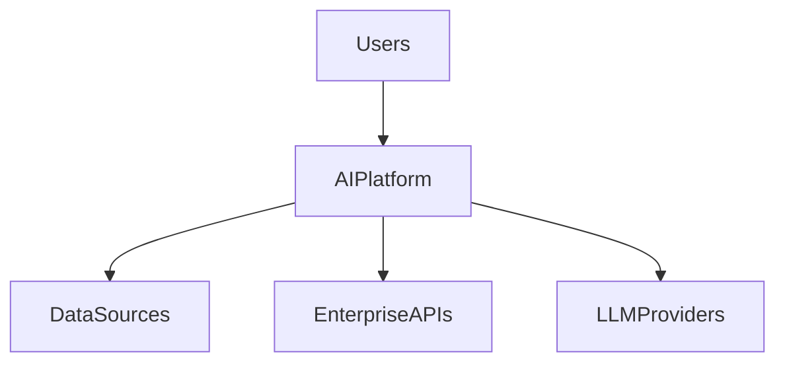
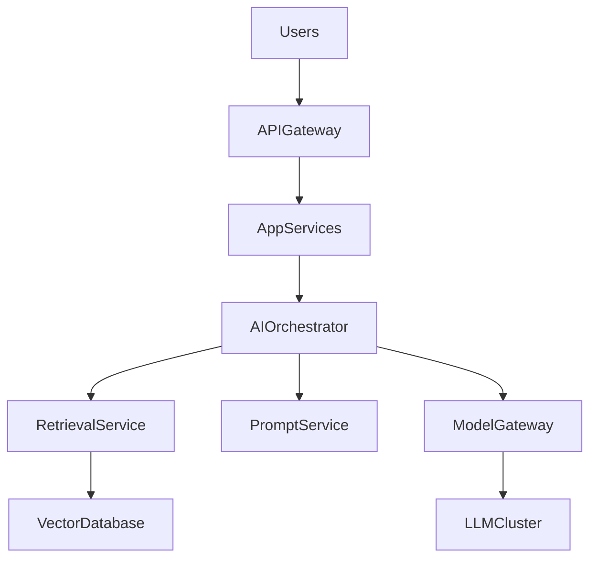
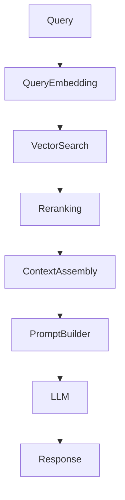

## Chapter 1 — Architectural Patterns

### 1.1 A Taxonomy of LLM System Architectures

LLM-based systems are not monolithic. Depending on the task, the data environment, and the required level of autonomy, different architectural patterns apply. Understanding this taxonomy is the first step toward sound design decisions.

The four primary patterns form a spectrum of increasing complexity and capability:

```
Prompt-Only → RAG → Tool-Augmented → Agentic
   simple         knowledge-grounded    autonomous
```

Each pattern builds on the previous: an agent can use tools, tools can include retrieval, and retrieval relies on well-engineered prompts. But the patterns are not strictly cumulative — a simple classification service needs only a well-crafted prompt, while an enterprise knowledge assistant requires RAG, and an autonomous research assistant requires full agent capabilities.

| Pattern | Data access | Autonomy | Complexity | Typical use case |
|---|---|---|---|---|
| **Prompt-Only** | Model training data only | None | Low | Classification, extraction, summarization |
| **RAG** | External knowledge base | None | Medium | Knowledge Q&A, document analysis |
| **Tool-Augmented** | Live APIs, databases | Limited | Medium-High | Data retrieval, computation, API orchestration |
| **Agentic** | All of the above | High | High | Multi-step research, workflow automation |

---

### 1.2 The Eight-Layer Reference Model

Enterprise LLM systems are structured in layers, each with a clearly defined responsibility. This model, introduced in Part I, serves as the structural backbone for understanding where each architectural component belongs.

```
┌─────────────────────────────────────────────────────────┐
│  Layer 8 — Interaction Layer                            │
│  Chat interfaces, APIs, embedded widgets                │
├─────────────────────────────────────────────────────────┤
│  Layer 7 — Application Layer                            │
│  Business logic, routing, workflow coordination         │
├─────────────────────────────────────────────────────────┤
│  Layer 6 — AI Orchestration Layer                       │
│  Prompt assembly, tool coordination, agent loops        │
├─────────────────────────────────────────────────────────┤
│  Layer 5 — Prompt Layer                                 │
│  Templates, versioning, dynamic construction            │
├─────────────────────────────────────────────────────────┤
│  Layer 4 — Retrieval Layer                              │
│  Vector search, reranking, context assembly             │
├─────────────────────────────────────────────────────────┤
│  Layer 3 — Model Layer                                  │
│  LLM inference, embedding generation                    │
├─────────────────────────────────────────────────────────┤
│  Layer 2 — Data Processing Layer                        │
│  Document ingestion, chunking, indexing                 │
├─────────────────────────────────────────────────────────┤
│  Layer 1 — Infrastructure Layer                         │
│  Compute, storage, networking, queues                   │
└─────────────────────────────────────────────────────────┘
```

Not all systems implement all eight layers. A prompt-only system may span only layers 5, 6, and 7. A full RAG platform engages all eight. Understanding which layers your system requires is fundamental to estimating engineering scope.

---

### 1.3 Choosing the Right Architecture

Architecture selection is not a technical preference — it is driven by concrete requirements. The following decision framework guides the selection:

```
Start here:
Does the system need to answer questions about private or
frequently updated organizational knowledge?
    │
    ├── Yes → Use RAG
    │          Does the system need to perform actions,
    │          call APIs, or execute multi-step tasks?
    │              ├── Yes → Tool-Augmented or Agentic
    │              └── No  → RAG is sufficient
    │
    └── No  → Does the model's training data cover the domain?
                  ├── Yes → Prompt-Only may be sufficient
                  └── No  → Consider fine-tuning or RAG
                            with curated domain content
```

**📐 Architecture decision:** Defaulting to the most complex architecture "for future flexibility" is a common and costly mistake. Start with the simplest pattern that meets requirements. Agentic systems introduce reliability, latency, and debugging complexity that is only justified when genuine multi-step autonomy is needed.

---

### 1.4 Architecture Decision Drivers

Beyond functional requirements, architecture selection is shaped by non-functional constraints that enterprise architects must evaluate explicitly:

| Driver | Implication |
|---|---|
| **Data privacy / sovereignty** | Cloud LLM APIs may be unacceptable; on-premise models required |
| **Latency requirements** | Agent loops add 3–10x latency vs. single-pass generation |
| **Cost at scale** | Agentic patterns multiply token consumption per user request |
| **Auditability** | Regulated environments require traceable reasoning chains |
| **Knowledge freshness** | Rapidly changing data requires RAG over fine-tuning |
| **Team capability** | Agent systems require specialized debugging and monitoring skills |

---

### 1.5 The C4 Model Applied to LLM Systems

The C4 model (Context, Container, Component, Code) provides a structured approach to documenting LLM platform architecture at multiple levels of abstraction. It is particularly well-suited to enterprise contexts where multiple stakeholder audiences need different views of the same system.

**Level 1 — System Context:** Who uses the system and what external dependencies does it have?



**Level 2 — Container Diagram:** What are the major deployable units?



**Level 3 — Component Diagram (RAG pipeline):**



Using the C4 model forces architectural clarity across levels and makes it easy to communicate the design to different stakeholders — from C-level sponsors (Level 1) to infrastructure engineers (Level 3).

---

> ### 📋 Chapter Summary
>
> - Four primary LLM architectural patterns: Prompt-Only, RAG, Tool-Augmented, and Agentic — each addressing different capability and complexity requirements.
> - The **eight-layer model** provides a structured decomposition of enterprise LLM systems.
> - Architecture selection must be driven by concrete requirements: data privacy, latency, cost, and auditability — not by complexity preferences.
> - The **C4 model** is a practical tool for documenting LLM architectures at multiple levels of abstraction.

---

> ### ❓ Comprehension Questions
>
> 1. An enterprise team wants to build a chatbot that answers questions about internal HR policies. The policies are updated monthly. Which architectural pattern is most appropriate and why?
> 2. A product manager argues that building an agentic system from the start provides "maximum flexibility." What engineering arguments would you use to challenge this?
> 3. Map the C4 Level 2 container diagram to the eight-layer model. Which containers correspond to which layers?
> 4. Your team is designing a system for a financial institution that cannot send customer data to external LLM providers. How does this constraint affect architecture selection?
> 5. Identify two non-functional requirements that would push an architecture from RAG toward Tool-Augmented. Justify your answer.

---

## References

### Papers
- [Retrieval-Augmented Generation for Knowledge-Intensive NLP Tasks](https://arxiv.org/abs/2005.11401) — Lewis et al., 2020. Foundational RAG architecture paper.
- [A Survey of Large Language Models](https://arxiv.org/abs/2303.18223) — Zhao et al., 2023. Comprehensive survey of LLM capabilities and limitations.
- [Toolformer: Language Models Can Teach Themselves to Use Tools](https://arxiv.org/abs/2302.04761) — Schick et al., 2023. Tool use in language models.

### Guides & Documentation
- [C4 Architecture Model](https://c4model.com) — Simon Brown's hierarchical architecture documentation approach.
- [AWS Well-Architected AI/ML Lens](https://docs.aws.amazon.com/wellarchitected/latest/machine-learning-lens/welcome.html) — Enterprise AI architecture guidance.
- [LangChain Architecture Overview](https://python.langchain.com/docs/concepts/) — Conceptual model for LLM application components.

### Books
- [Building LLM Powered Applications](https://www.oreilly.com/library/view/building-llm-powered/9781835462317/) — Valentina Alto, Packt, 2024.

---
[« Back to architectures Index](index.md) | [🏠 Home](../index.md)