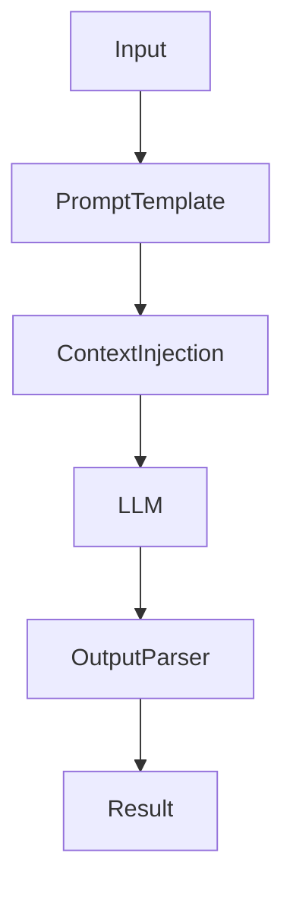

## Chapter 2 — Prompt-Only Systems

### 2.1 When No Retrieval Is Needed

Not every LLM system requires a vector database. Prompt-only systems — where the model responds based solely on its training knowledge and the content of the current prompt — are the appropriate choice for a specific class of tasks:

- **Classification** — assigning inputs to predefined categories
- **Extraction** — pulling structured data from unstructured text
- **Transformation** — reformatting, translating, or normalizing content
- **Summarization** — condensing text to its key points
- **Code generation** — writing or reviewing code given specifications
- **Scoring** — assigning numerical or categorical scores to inputs

These tasks share a common property: the information required to produce the output is either present in the input itself or reliably encoded in the model's training data. No external knowledge retrieval is necessary.

---

### 2.2 Architecture and Components

A prompt-only system is the simplest possible LLM architecture. Its components are minimal:



**Python — Minimal prompt-only classification service:**
```python
import json
from openai import OpenAI
from pydantic import BaseModel
from enum import Enum

class TicketCategory(str, Enum):
    AUTHENTICATION = "authentication"
    BILLING = "billing"
    TECHNICAL = "technical"
    OTHER = "other"

class ClassificationResult(BaseModel):
    category: TicketCategory
    confidence: str  # high | medium | low
    reasoning: str

SYSTEM_PROMPT = """
You are a support ticket classification engine.

Classify incoming tickets into exactly one of:
- authentication: login, password, MFA, account access
- billing: payments, invoices, subscriptions, refunds
- technical: errors, crashes, performance, data issues
- other: anything not fitting the above

Respond with valid JSON only matching this schema:
{"category": "...", "confidence": "high|medium|low", "reasoning": "..."}
"""

client = OpenAI()

def classify(ticket_text: str) -> ClassificationResult:
    response = client.chat.completions.create(
        model="gpt-4o-mini",
        messages=[
            {"role": "system", "content": SYSTEM_PROMPT},
            {"role": "user", "content": ticket_text}
        ],
        response_format={"type": "json_object"},
        temperature=0
    )
    data = json.loads(response.choices[0].message.content)
    return ClassificationResult(**data)

# Usage
result = classify("I cannot log into my account after the password reset")
print(result.category)    # → TicketCategory.AUTHENTICATION
print(result.confidence)  # → high
```

**Java — Prompt-only extraction with [LangChain4j](https://docs.langchain4j.dev):**
```java
import dev.langchain4j.model.openai.OpenAiChatModel;
import dev.langchain4j.service.AiServices;
import dev.langchain4j.service.SystemMessage;
import dev.langchain4j.service.UserMessage;

record TicketClassification(String category, String confidence, String reasoning) {}

interface TicketClassifier {
    @SystemMessage("""
        You are a support ticket classification engine.
        Classify tickets into: authentication, billing, technical, other.
        Respond with valid JSON: {"category":"...","confidence":"high|medium|low","reasoning":"..."}
        """)
    @UserMessage("{{ticketText}}")
    String classify(String ticketText);
}

// Service setup
OpenAiChatModel model = OpenAiChatModel.builder()
    .apiKey(System.getenv("OPENAI_API_KEY"))
    .modelName("gpt-4o-mini")
    .temperature(0.0)
    .build();

TicketClassifier classifier = AiServices.create(TicketClassifier.class, model);
String json = classifier.classify("Cannot log in after password reset");
// Parse JSON into TicketClassification record
```

🔓 **On-premise alternative with [Ollama](https://ollama.com):**
```python
import requests
import json

def classify_local(ticket_text: str) -> dict:
    response = requests.post(
        "http://localhost:11434/api/chat",
        json={
            "model": "mistral",
            "messages": [
                {"role": "system", "content": SYSTEM_PROMPT},
                {"role": "user", "content": ticket_text}
            ],
            "stream": False,
            "format": "json"
        }
    )
    return json.loads(response.json()["message"]["content"])
```

---

### 2.3 Structured Output Patterns

The most critical engineering concern in prompt-only systems is output reliability. When a downstream system depends on the LLM output — to route a ticket, populate a database field, trigger a workflow — output format must be predictable and parseable.

**Pattern 1 — JSON mode (OpenAI):**
```python
response = client.chat.completions.create(
    model="gpt-4o",
    messages=[...],
    response_format={"type": "json_object"},  # Guarantees valid JSON
    temperature=0
)
```

**Pattern 2 — Structured outputs with schema enforcement:**
```python
from pydantic import BaseModel
from openai import OpenAI

class ExtractionResult(BaseModel):
    invoice_number: str
    amount: float
    currency: str
    due_date: str
    vendor_name: str

client = OpenAI()

def extract_invoice_data(invoice_text: str) -> ExtractionResult:
    response = client.beta.chat.completions.parse(
        model="gpt-4o",
        messages=[
            {"role": "system", "content": "Extract invoice fields from the provided text."},
            {"role": "user", "content": invoice_text}
        ],
        response_format=ExtractionResult,
        temperature=0
    )
    return response.choices[0].message.parsed
```

**Pattern 3 — Defensive parsing with fallback:**
```python
import json
import re

def safe_parse_json(response_text: str) -> dict | None:
    """Attempts to parse JSON even if the model adds surrounding text."""
    # Direct parse
    try:
        return json.loads(response_text)
    except json.JSONDecodeError:
        pass
    # Extract first JSON block from response
    match = re.search(r'\{.*\}', response_text, re.DOTALL)
    if match:
        try:
            return json.loads(match.group())
        except json.JSONDecodeError:
            pass
    return None
```

**📐 Architecture decision:** Always use `response_format: json_object` or [Pydantic](https://docs.pydantic.dev)-based structured outputs in production prompt-only systems. Relying on the model to produce consistent format without schema enforcement leads to parsing failures that are difficult to debug and reproduce.

---

### 2.4 Multi-Turn Conversation Management

Many prompt-only systems need to maintain context across multiple turns of a conversation. This requires explicit conversation history management — the LLM has no memory between API calls.

**Python — Conversation manager:**
```python
from dataclasses import dataclass, field
from typing import List
from openai import OpenAI

@dataclass
class ConversationManager:
    system_prompt: str
    max_history_tokens: int = 4000
    messages: List[dict] = field(default_factory=list)

    def __post_init__(self):
        self.messages = [{"role": "system", "content": self.system_prompt}]
        self.client = OpenAI()

    def chat(self, user_message: str, model: str = "gpt-4o") -> str:
        self.messages.append({"role": "user", "content": user_message})
        self._trim_history()

        response = self.client.chat.completions.create(
            model=model,
            messages=self.messages,
            temperature=0.3
        )
        assistant_message = response.choices[0].message.content
        self.messages.append({"role": "assistant", "content": assistant_message})
        return assistant_message

    def _trim_history(self):
        """Keep system prompt + trim oldest turns if history grows too large."""
        # Simple token estimation: 1 token ≈ 4 chars
        total_chars = sum(len(m["content"]) for m in self.messages)
        while total_chars > self.max_history_tokens * 4 and len(self.messages) > 2:
            # Remove oldest user/assistant pair (keep system prompt at index 0)
            self.messages.pop(1)
            if len(self.messages) > 1:
                self.messages.pop(1)
            total_chars = sum(len(m["content"]) for m in self.messages)
```

**Java — Conversation management with LangChain4j:**
```java
import dev.langchain4j.memory.chat.MessageWindowChatMemory;
import dev.langchain4j.service.AiServices;
import dev.langchain4j.service.SystemMessage;

interface ConversationalAssistant {
    @SystemMessage("You are a helpful technical support assistant.")
    String chat(String userMessage);
}

// MessageWindowChatMemory keeps the last N messages
ConversationalAssistant assistant = AiServices.builder(ConversationalAssistant.class)
    .chatLanguageModel(model)
    .chatMemory(MessageWindowChatMemory.withMaxMessages(20))
    .build();

String response1 = assistant.chat("What is RAG?");
String response2 = assistant.chat("Can you give me a Python example?");
// Second call automatically includes the first turn in context
```

---

### 2.5 Strengths and Limitations

| Aspect | Prompt-Only | Implication |
|---|---|---|
| **Latency** | Single API call | Lowest possible response time |
| **Cost** | Minimal token usage | Most cost-efficient pattern |
| **Knowledge scope** | Model training data only | Knowledge cutoff applies |
| **Consistency** | Requires structured output engineering | Non-trivial in production |
| **Scalability** | Stateless | Trivially horizontal |
| **Auditability** | Full prompt/response logging | Simple to implement |

---

> ### 📋 Chapter Summary
>
> - Prompt-only systems are the correct pattern for classification, extraction, transformation, and summarization tasks that do not require external knowledge.
> - **Structured output enforcement** (JSON mode, Pydantic schemas) is mandatory in production — do not rely on free-form output parsing.
> - **Conversation history management** is the application's responsibility; the LLM has no state between API calls.
> - Prompt-only systems are the most cost-efficient and lowest-latency LLM architecture; use them wherever the use case allows.

---

> ### ❓ Comprehension Questions
>
> 1. A team is building a system to extract structured fields (amount, date, vendor) from invoice PDFs. Is a prompt-only architecture sufficient? What additional component might be needed upstream?
> 2. What is the risk of not specifying `response_format: json_object` in a production classification endpoint, and how would failures manifest in downstream systems?
> 3. Explain the conversation history trimming strategy. What information is lost when old turns are trimmed, and what are the alternatives?
> 4. A prompt-only service processes 500,000 tickets per day. The current model is GPT-4o. What architectural changes would you evaluate to reduce cost while maintaining accuracy?
> 5. A developer proposes storing conversation history in a relational database between sessions. What engineering considerations does this introduce?

---

## References

### Documentation
- [OpenAI Structured Outputs](https://platform.openai.com/docs/guides/structured-outputs) — JSON schema enforcement for reliable outputs.
- [OpenAI Chat Completions API](https://platform.openai.com/docs/api-reference/chat) — Full API reference.
- [Pydantic Documentation](https://docs.pydantic.dev) — Data validation library used for structured output parsing.
- [LangChain4j AI Services](https://docs.langchain4j.dev/tutorials/ai-services) — Declarative Java interface for LLM interaction.
- [Ollama API Reference](https://github.com/ollama/ollama/blob/main/docs/api.md) — On-premise LLM REST API.

### Articles
- [OpenAI Cookbook: Structured Outputs](https://cookbook.openai.com/examples/structured_outputs_intro) — Practical guide to reliable JSON generation.
- [How to Reliably Get JSON from LLMs](https://yonom.substack.com/p/native-json-output-from-gpt-4) — Community patterns for structured output.

---
[« Back to architectures Index](index.md) | [🏠 Home](../index.md)