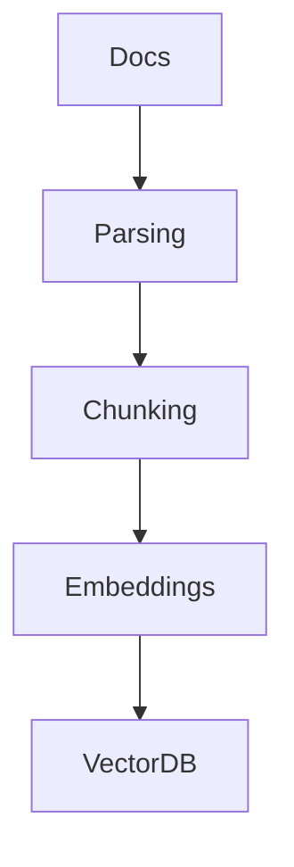

## Chapter 3 — Retrieval-Augmented Generation

### 3.1 Why RAG Is the Dominant Enterprise Pattern

Enterprise knowledge has three properties that make LLM-only approaches fundamentally unsuitable for production use:

**It is proprietary.** Internal policies, product documentation, customer data, contracts, and technical manuals exist nowhere in an LLM's training corpus. The model cannot answer questions about them.

**It changes frequently.** Regulatory updates, product releases, organizational changes — enterprise knowledge is a living corpus. Fine-tuning a model for every update is economically and operationally impractical.

**It is distributed.** A typical enterprise maintains knowledge across wikis, SharePoint, ticketing systems, databases, email archives, and cloud storage. No single ingestion pipeline covers all sources.

Retrieval-Augmented Generation (RAG) addresses all three: it dynamically fetches relevant fragments from a maintained knowledge base at query time, injecting them into the prompt. The model reasons over current, proprietary knowledge without retraining.

---

### 3.2 RAG Architecture Overview

A RAG system consists of two distinct pipelines that operate independently:



**Ingestion pipeline** (offline, batch or event-driven): transforms raw documents into a searchable vector index.

```
User Query
     │
     ▼
Query Embedding → Vector Search → Reranking → Context Assembly
                                                      │
                                                      ▼
                                               Prompt Builder → LLM → Answer
```

**Query pipeline** (online, per-request): retrieves relevant context and generates the answer.

The separation is architecturally significant: the ingestion pipeline can be rerun independently when documents change, without affecting the query pipeline or the LLM.

---

### 3.3 Ingestion Pipeline

The ingestion pipeline transforms raw content into a searchable index. Each stage has design decisions with significant downstream impact.

**Stage 1 — Document Parsing**

Raw sources arrive in heterogeneous formats. A production parser handles each format and extracts clean text with metadata.

```python
from pathlib import Path
from dataclasses import dataclass
from typing import Optional

@dataclass
class ParsedDocument:
    content: str
    source: str
    title: Optional[str]
    metadata: dict

class DocumentParser:
    def parse(self, file_path: Path) -> ParsedDocument:
        suffix = file_path.suffix.lower()
        if suffix == ".pdf":
            return self._parse_pdf(file_path)
        elif suffix in (".html", ".htm"):
            return self._parse_html(file_path)
        elif suffix == ".md":
            return self._parse_markdown(file_path)
        else:
            return self._parse_text(file_path)

    def _parse_pdf(self, path: Path) -> ParsedDocument:
        import pdfplumber
        with pdfplumber.open(path) as pdf:
            text = "\n".join(
                page.extract_text() or "" for page in pdf.pages
            )
        return ParsedDocument(
            content=text,
            source=str(path),
            title=path.stem,
            metadata={"format": "pdf", "pages": len(pdf.pages)}
        )
```

**Stage 2 — Chunking**

Documents are split into retrievable fragments. Chunking strategy is one of the most consequential design decisions in a RAG system — covered in depth in **Part III, Chapter 1**. The core trade-off:

```
Chunk too small → insufficient context for the model to answer
Chunk too large → retrieval noise, token budget pressure, diluted relevance
```

A reasonable production default for general-purpose RAG:

```python
from langchain.text_splitter import RecursiveCharacterTextSplitter

splitter = RecursiveCharacterTextSplitter(
    chunk_size=512,        # tokens
    chunk_overlap=64,      # overlap to preserve cross-boundary context
    length_function=len,   # replace with token counter in production
    separators=["\n\n", "\n", ". ", " ", ""]
)

chunks = splitter.split_text(document.content)
```

**Stage 3 — Embedding Generation**

Each chunk is converted to a dense vector representation using an embedding model.

```python
from openai import OpenAI

client = OpenAI()

def generate_embeddings(texts: list[str], model: str = "text-embedding-3-small") -> list[list[float]]:
    response = client.embeddings.create(input=texts, model=model)
    return [item.embedding for item in response.data]
```

🔓 **On-premise embedding generation:**
```python
from sentence_transformers import SentenceTransformer

# No API calls — runs entirely locally
model = SentenceTransformer("BAAI/bge-large-en-v1.5")
embeddings = model.encode(chunks, batch_size=32, show_progress_bar=True)
```

**Stage 4 — Vector Indexing**

Embeddings and their associated metadata are stored in a vector database.

```python
import chromadb
from chromadb.config import Settings

client = chromadb.PersistentClient(path="./chroma_db")
collection = client.get_or_create_collection(
    name="enterprise_docs",
    metadata={"hnsw:space": "cosine"}
)

collection.add(
    documents=chunks,
    embeddings=embeddings,
    metadatas=[{"source": doc.source, "chunk_index": i} for i, _ in enumerate(chunks)],
    ids=[f"{doc.source}_{i}" for i in range(len(chunks))]
)
```

---

### 3.4 Query Pipeline

The query pipeline executes at request time. Every millisecond matters here.

```python
from openai import OpenAI
from sentence_transformers import SentenceTransformer
import chromadb

class RAGPipeline:
    def __init__(self):
        self.embedding_model = SentenceTransformer("BAAI/bge-large-en-v1.5")
        self.vector_db = chromadb.PersistentClient(path="./chroma_db")
        self.collection = self.vector_db.get_collection("enterprise_docs")
        self.llm_client = OpenAI()

    def retrieve(self, query: str, top_k: int = 5) -> list[str]:
        query_embedding = self.embedding_model.encode(query).tolist()
        results = self.collection.query(
            query_embeddings=[query_embedding],
            n_results=top_k
        )
        return results["documents"][0]

    def generate(self, query: str, context_chunks: list[str]) -> str:
        context = "\n\n---\n\n".join(context_chunks)
        prompt = f"""You are a corporate knowledge assistant.
Answer the question using only the provided context.
If the answer is not in the context, state that explicitly.

Context:
{context}

Question: {query}

Answer:"""
        response = self.llm_client.chat.completions.create(
            model="gpt-4o",
            messages=[{"role": "user", "content": prompt}],
            temperature=0
        )
        return response.choices[0].message.content

    def ask(self, query: str) -> dict:
        chunks = self.retrieve(query)
        answer = self.generate(query, chunks)
        return {"answer": answer, "sources": chunks}
```

**Java — RAG pipeline with [LangChain4j](https://docs.langchain4j.dev):**
```java
import dev.langchain4j.data.document.Document;
import dev.langchain4j.data.document.splitter.DocumentSplitters;
import dev.langchain4j.data.segment.TextSegment;
import dev.langchain4j.model.embedding.EmbeddingModel;
import dev.langchain4j.model.openai.OpenAiEmbeddingModel;
import dev.langchain4j.rag.content.retriever.EmbeddingStoreContentRetriever;
import dev.langchain4j.service.AiServices;
import dev.langchain4j.store.embedding.EmbeddingStore;
import dev.langchain4j.store.embedding.inmemory.InMemoryEmbeddingStore;

interface KnowledgeAssistant {
    @dev.langchain4j.service.SystemMessage("""
        You are a corporate knowledge assistant.
        Answer using only the provided context.
        State explicitly if the answer is not in the context.
        """)
    String answer(String question);
}

// Setup
EmbeddingModel embeddingModel = OpenAiEmbeddingModel.builder()
    .apiKey(System.getenv("OPENAI_API_KEY"))
    .modelName("text-embedding-3-small")
    .build();

EmbeddingStore<TextSegment> store = new InMemoryEmbeddingStore<>();

// Ingest documents
Document doc = Document.from(documentText);
DocumentSplitters.recursive(512, 64)
    .split(doc)
    .forEach(segment -> {
        var embedding = embeddingModel.embed(segment).content();
        store.add(embedding, segment);
    });

// Build assistant with RAG
KnowledgeAssistant assistant = AiServices.builder(KnowledgeAssistant.class)
    .chatLanguageModel(chatModel)
    .contentRetriever(EmbeddingStoreContentRetriever.from(store))
    .build();

String answer = assistant.answer("What is the company refund policy?");
```

---

### 3.5 RAG Variants

Standard RAG is the baseline. Several variants address specific limitations:

**Naive RAG** — The pattern described above: retrieve, inject, generate. Simple and effective for well-structured knowledge bases.

**Advanced RAG** — Adds pre-retrieval query processing (rewriting, expansion) and post-retrieval refinement (reranking, compression). Covered in **Part IV**.

**Modular RAG** — Treats each pipeline stage as a configurable module. Different retrievers, rerankers, and generators can be swapped independently. Enables systematic experimentation.

**[Self-RAG](https://arxiv.org/abs/2310.11511)** — The LLM decides at generation time whether retrieval is needed, and critiques its own retrieved context before generating the final answer. Reduces unnecessary retrieval overhead.

**Corrective RAG (CRAG)** — Evaluates retrieved document quality and falls back to web search or alternative sources when retrieval quality is low.

> **📐 Architecture recommendation:** Start with Naive RAG. Measure retrieval quality with explicit metrics (Recall@K, precision). Only introduce Advanced RAG complexity where measurement confirms it addresses a specific, quantified quality gap.

---

> ### 📋 Chapter Summary
>
> - RAG is the dominant enterprise LLM pattern because enterprise knowledge is proprietary, dynamic, and distributed — properties that LLM training cannot address.
> - RAG consists of two independent pipelines: **ingestion** (offline) and **query** (online).
> - Ingestion stages — parsing, chunking, embedding, indexing — each have design decisions that propagate through the entire system.
> - **Chunking strategy** is the single most impactful RAG design decision; it is covered in depth in Part III.
> - Multiple RAG variants (Advanced, Modular, Self-RAG, CRAG) address specific limitations of the basic pattern; select based on measured quality gaps.

---

> ### ❓ Comprehension Questions
>
> 1. A RAG system returns correct chunks during retrieval but the LLM still produces hallucinated answers. What are the most likely causes, and how would you diagnose each?
> 2. Explain why the embedding model used during ingestion and the one used at query time must be the same. What would happen if they differed?
> 3. A knowledge base is updated daily with new regulatory documents. Describe the ingestion pipeline architecture that handles incremental updates without rebuilding the entire index.
> 4. Compare Naive RAG and Modular RAG in terms of operational complexity, debuggability, and suitability for a team building their first RAG system.
> 5. Why is `temperature=0` recommended for RAG generation tasks, and in what scenario might a higher temperature be appropriate?

---

## References

### Papers
- [Retrieval-Augmented Generation for Knowledge-Intensive NLP Tasks](https://arxiv.org/abs/2005.11401) — Lewis et al., 2020. The original RAG paper.
- [Self-RAG: Learning to Retrieve, Generate and Critique](https://arxiv.org/abs/2310.11511) — Asai et al., 2023. Adaptive retrieval and self-critique.
- [CRAG: Corrective Retrieval Augmented Generation](https://arxiv.org/abs/2401.15884) — Shi et al., 2024. Quality-aware retrieval with fallback strategies.
- [RAGAS: Automated Evaluation of Retrieval Augmented Generation](https://arxiv.org/abs/2309.15217) — Es et al., 2023. Evaluation framework for RAG systems.

### Documentation
- [LangChain RAG Tutorial](https://python.langchain.com/docs/tutorials/rag/) — End-to-end RAG implementation guide.
- [LangChain4j RAG](https://docs.langchain4j.dev/tutorials/rag) — Java RAG implementation.
- [Chroma Getting Started](https://docs.trychroma.com/getting-started) — Embedded vector database.
- [Weaviate RAG Guide](https://weaviate.io/developers/weaviate/starter-guides/generative) — RAG with Weaviate.
- [pdfplumber Documentation](https://github.com/jsvine/pdfplumber) — PDF text extraction.

### Guides
- [OpenAI Cookbook: RAG](https://cookbook.openai.com/examples/vector_databases/readme) — Practical RAG examples.

---
[« Back to architectures Index](index.md) | [🏠 Home](../index.md)