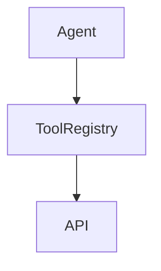

## Chapter 4 — Tool-Augmented LLM

### 4.1 Extending LLMs with External Capabilities

LLMs have two fundamental limitations that cannot be addressed by prompt engineering alone: they cannot access live data, and they cannot perform precise computation. Tool augmentation addresses both by giving the model the ability to invoke external functions and APIs.

A tool-augmented LLM system intercepts the model's output, detects tool invocations encoded as structured function calls, executes the corresponding function, and returns the result to the model for further reasoning.

```
User query
     │
     ▼
LLM reasons → decides a tool is needed
     │
     ▼
Tool call specification (structured JSON)
     │
     ▼
Application executes tool → returns result
     │
     ▼
LLM continues reasoning with tool result
     │
     ▼
Final response
```



This architecture transforms the LLM from a passive text generator into an active participant in multi-system workflows.

---

### 4.2 Function Calling

Modern LLM APIs ([OpenAI](https://platform.openai.com/docs), [Anthropic](https://docs.anthropic.com), Gemini) expose a standardized function calling interface. The developer defines available tools as JSON schemas; the model decides when and how to call them.

**Python — Function calling with OpenAI:**
```python
import json
from openai import OpenAI

client = OpenAI()

# Tool definitions as JSON schemas
tools = [
    {
        "type": "function",
        "function": {
            "name": "get_customer_account",
            "description": "Retrieve account information for a customer by email",
            "parameters": {
                "type": "object",
                "properties": {
                    "email": {
                        "type": "string",
                        "description": "Customer email address"
                    }
                },
                "required": ["email"]
            }
        }
    },
    {
        "type": "function",
        "function": {
            "name": "calculate_refund",
            "description": "Calculate the refund amount for an order",
            "parameters": {
                "type": "object",
                "properties": {
                    "order_id": {"type": "string"},
                    "reason": {"type": "string"}
                },
                "required": ["order_id", "reason"]
            }
        }
    }
]

# Actual tool implementations
def get_customer_account(email: str) -> dict:
    # In production: query your CRM or database
    return {"email": email, "name": "Jane Smith", "plan": "enterprise", "status": "active"}

def calculate_refund(order_id: str, reason: str) -> dict:
    # In production: query your billing system
    return {"order_id": order_id, "refund_amount": 149.99, "currency": "USD"}

TOOL_REGISTRY = {
    "get_customer_account": get_customer_account,
    "calculate_refund": calculate_refund
}

def run_tool_call(tool_name: str, tool_args: dict) -> str:
    fn = TOOL_REGISTRY.get(tool_name)
    if fn is None:
        return json.dumps({"error": f"Unknown tool: {tool_name}"})
    result = fn(**tool_args)
    return json.dumps(result)

def query_with_tools(user_message: str) -> str:
    messages = [{"role": "user", "content": user_message}]

    while True:
        response = client.chat.completions.create(
            model="gpt-4o",
            messages=messages,
            tools=tools,
            tool_choice="auto"
        )
        choice = response.choices[0]

        # If no tool call, return final answer
        if choice.finish_reason == "stop":
            return choice.message.content

        # Execute tool calls
        messages.append(choice.message)
        for tool_call in choice.message.tool_calls:
            args = json.loads(tool_call.function.arguments)
            result = run_tool_call(tool_call.function.name, args)
            messages.append({
                "role": "tool",
                "tool_call_id": tool_call.id,
                "content": result
            })
```

**Java — Function calling with [LangChain4j](https://docs.langchain4j.dev):**
```java
import dev.langchain4j.agent.tool.Tool;
import dev.langchain4j.service.AiServices;
import dev.langchain4j.service.SystemMessage;

// Tool implementations as annotated methods
class CustomerTools {

    @Tool("Retrieve account information for a customer by email")
    public String getCustomerAccount(String email) {
        // Query CRM/database
        return String.format(
            "{\"email\":\"%s\",\"name\":\"Jane Smith\",\"plan\":\"enterprise\"}",
            email
        );
    }

    @Tool("Calculate refund amount for an order")
    public String calculateRefund(String orderId, String reason) {
        // Query billing system
        return String.format(
            "{\"order_id\":\"%s\",\"refund_amount\":149.99,\"currency\":\"USD\"}",
            orderId
        );
    }
}

interface SupportAssistant {
    @SystemMessage("""
        You are a customer support assistant with access to account and billing tools.
        Use tools to retrieve accurate information before answering.
        """)
    String assist(String userQuery);
}

SupportAssistant assistant = AiServices.builder(SupportAssistant.class)
    .chatLanguageModel(model)
    .tools(new CustomerTools())
    .build();

String response = assistant.assist(
    "What is the refund status for customer jane@example.com, order ORD-4892?"
);
```

---

### 4.3 Tool Registry Design

In production systems with many tools, a registry pattern centralizes tool management and enables dynamic tool loading.

```python
from typing import Callable, Any
from dataclasses import dataclass

@dataclass
class ToolDefinition:
    name: str
    description: str
    parameters_schema: dict
    handler: Callable
    requires_approval: bool = False  # For sensitive operations

class ToolRegistry:
    def __init__(self):
        self._tools: dict[str, ToolDefinition] = {}

    def register(self, tool: ToolDefinition):
        self._tools[tool.name] = tool

    def get_openai_schemas(self) -> list[dict]:
        return [
            {
                "type": "function",
                "function": {
                    "name": t.name,
                    "description": t.description,
                    "parameters": t.parameters_schema
                }
            }
            for t in self._tools.values()
        ]

    def execute(self, tool_name: str, args: dict) -> str:
        tool = self._tools.get(tool_name)
        if tool is None:
            return json.dumps({"error": f"Tool not found: {tool_name}"})
        if tool.requires_approval:
            raise PermissionError(f"Tool '{tool_name}' requires human approval")
        return json.dumps(tool.handler(**args))
```

---

### 4.4 Tool Safety and Sandboxing

Tools that execute code, modify data, or call external APIs introduce serious security risks if not properly controlled. The LLM must never be trusted to self-authorize sensitive operations.

**Risk levels by tool type:**

| Tool type | Risk level | Mitigation |
|---|---|---|
| Read-only data retrieval | Low | Input validation only |
| Write operations (DB, files) | Medium | Explicit user confirmation |
| API calls (external services) | Medium-High | Rate limiting, input sanitization |
| Code execution | High | Sandbox isolation, timeout limits |
| Financial transactions | Critical | Human-in-the-loop approval |

**Python — Human-in-the-loop gate for sensitive tools:**
```python
class SafeToolExecutor:
    def __init__(self, registry: ToolRegistry, approval_callback=None):
        self.registry = registry
        self.approval_callback = approval_callback

    def execute(self, tool_name: str, args: dict) -> str:
        tool = self.registry._tools.get(tool_name)
        if tool and tool.requires_approval:
            if self.approval_callback:
                approved = self.approval_callback(tool_name, args)
                if not approved:
                    return json.dumps({"status": "rejected", "reason": "Human approval denied"})
            else:
                return json.dumps({"status": "rejected", "reason": "No approval mechanism configured"})
        return self.registry.execute(tool_name, args)
```

---

### 4.5 Structured Tool Output Handling

Tool outputs must be sanitized before returning to the model. Raw API responses may contain excessive data, sensitive fields, or formats that confuse the model.

```python
def sanitize_tool_output(raw_output: dict, max_length: int = 2000) -> str:
    """
    Sanitize tool output before returning to LLM:
    - Remove sensitive fields
    - Truncate large responses
    - Ensure JSON serializable
    """
    sensitive_fields = {"password", "api_key", "secret", "token", "ssn", "credit_card"}
    cleaned = {k: v for k, v in raw_output.items() if k.lower() not in sensitive_fields}

    serialized = json.dumps(cleaned, default=str)
    if len(serialized) > max_length:
        serialized = serialized[:max_length] + "... [truncated]"
    return serialized
```

---

> ### 📋 Chapter Summary
>
> - Tool augmentation extends LLMs with the ability to call external functions, APIs, and databases — addressing the fundamental limitations of knowledge cutoff and computational precision.
> - **Function calling** is the standard interface: developer-defined JSON schemas, model-generated invocations, application-executed handlers.
> - A **tool registry** centralizes tool management and enables fine-grained access control.
> - **Tool safety** is a first-class engineering concern: sensitive operations require explicit human approval gates, not LLM self-authorization.
> - Tool outputs must be sanitized before returning to the model to prevent data leakage and context confusion.

---

> ### ❓ Comprehension Questions
>
> 1. A tool-augmented LLM has access to a tool that can delete database records. What architectural controls would you put in place before deploying this system to production?
> 2. Explain the execution loop for function calling. Why does the application (not the LLM) execute the actual tool call?
> 3. A financial services company wants to use tool-augmented LLM to automate expense approvals. The LLM would call a payment API to approve or reject expenses. What concerns does this raise, and how would you architect the system?
> 4. What is the risk of returning raw API responses directly to the LLM without sanitization?
> 5. Compare the tool registry pattern to a Java ServiceLocator or Spring ApplicationContext. What does the analogy reveal about the engineering requirements?

---

## References

### Papers
- [Toolformer: Language Models Can Teach Themselves to Use Tools](https://arxiv.org/abs/2302.04761) — Schick et al., 2023.
- [HotpotQA: A Dataset for Diverse, Explainable Multi-hop Question Answering](https://arxiv.org/abs/1809.09600) — Yang et al., 2018. Multi-step reasoning foundation.
- [API-Bank: A Comprehensive Benchmark for Tool-Augmented LLMs](https://arxiv.org/abs/2304.08244) — Li et al., 2023.

### Documentation
- [OpenAI Function Calling Guide](https://platform.openai.com/docs/guides/function-calling) — Official function calling reference.
- [LangChain4j Tools](https://docs.langchain4j.dev/tutorials/tools) — Java tool integration.
- [Anthropic Tool Use](https://docs.anthropic.com/en/docs/build-with-claude/tool-use) — Claude tool use documentation.
- [OWASP LLM Top 10 — LLM07: Insecure Plugin Design](https://owasp.org/www-project-top-10-for-large-language-model-applications/) — Security guidance for tool-augmented systems.

---
[« Back to architectures Index](index.md) | [🏠 Home](../../index.md)