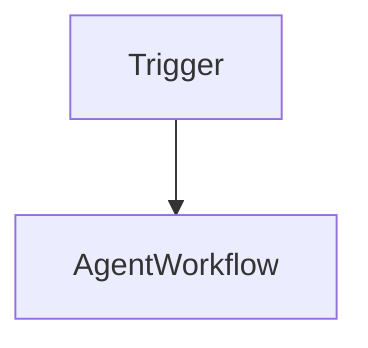

## Chapter 6 — Workflow Systems

### 6.1 Workflow Orchestration for LLM Systems

Agent architectures give the LLM control over execution flow. Workflow systems take a different approach: the developer defines a structured graph of steps — nodes and transitions — and the LLM operates within each node, but the overall flow is explicitly controlled by the application.

This distinction is fundamental:

| | Agent | Workflow |
|---|---|---|
| **Execution control** | LLM-driven | Developer-defined graph |
| **Predictability** | Low | High |
| **Flexibility** | High | Medium |
| **Debuggability** | Hard | Easy |
| **Cost predictability** | Variable | Bounded |
| **Best for** | Open-ended tasks | Structured business processes |

Workflow systems are the preferred pattern for Java/enterprise architects building production systems: they provide the reliability guarantees of deterministic software while incorporating LLM capabilities where they add value.

---

### 6.2 Deterministic vs. Adaptive Workflows

**Deterministic workflows** follow a fixed sequence:

```
Input → Validate → Classify → Route → Process → Output
```

Every execution follows the same graph. The LLM performs specific steps (classification, extraction) but does not influence the overall flow.

**Adaptive workflows** use LLM decisions to determine transitions:

```
Input → LLM Decision → Branch A or Branch B → ...
```

The LLM output determines which path the workflow follows, but the available paths are still developer-defined — unlike a pure agent where paths are dynamically generated.



---

### 6.3 LangGraph: Graph-Based Workflow Orchestration

LangGraph represents workflows as directed graphs where nodes are processing steps (LLM calls, tool calls, or Python functions) and edges are transitions (conditional or unconditional).

**Python — Document analysis workflow with LangGraph:**
```python
from langgraph.graph import StateGraph, END
from typing import TypedDict, Annotated
import operator

# Define shared state
class WorkflowState(TypedDict):
    document: str
    classification: str
    extracted_entities: dict
    summary: str
    routing_decision: str
    final_output: dict

# Node functions
def classify_document(state: WorkflowState) -> WorkflowState:
    response = client.chat.completions.create(
        model="gpt-4o-mini",
        messages=[
            {"role": "system", "content": "Classify document as: invoice, contract, report, other"},
            {"role": "user", "content": state["document"]}
        ],
        temperature=0
    )
    return {"classification": response.choices[0].message.content.strip()}

def extract_entities(state: WorkflowState) -> WorkflowState:
    response = client.chat.completions.create(
        model="gpt-4o",
        messages=[
            {"role": "system", "content": "Extract key entities as JSON"},
            {"role": "user", "content": state["document"]}
        ],
        response_format={"type": "json_object"},
        temperature=0
    )
    return {"extracted_entities": json.loads(response.choices[0].message.content)}

def summarize_document(state: WorkflowState) -> WorkflowState:
    response = client.chat.completions.create(
        model="gpt-4o-mini",
        messages=[
            {"role": "system", "content": "Summarize in 2-3 sentences"},
            {"role": "user", "content": state["document"]}
        ],
        temperature=0.3
    )
    return {"summary": response.choices[0].message.content}

def route_by_classification(state: WorkflowState) -> str:
    """Conditional edge: returns name of next node based on state."""
    classification = state["classification"].lower()
    if "invoice" in classification:
        return "process_invoice"
    elif "contract" in classification:
        return "process_contract"
    return "process_general"

def process_invoice(state: WorkflowState) -> WorkflowState:
    return {"final_output": {"type": "invoice", "entities": state["extracted_entities"]}}

def process_contract(state: WorkflowState) -> WorkflowState:
    return {"final_output": {"type": "contract", "summary": state["summary"]}}

def process_general(state: WorkflowState) -> WorkflowState:
    return {"final_output": {"type": "general", "summary": state["summary"]}}

# Build graph
workflow = StateGraph(WorkflowState)

workflow.add_node("classify", classify_document)
workflow.add_node("extract", extract_entities)
workflow.add_node("summarize", summarize_document)
workflow.add_node("process_invoice", process_invoice)
workflow.add_node("process_contract", process_contract)
workflow.add_node("process_general", process_general)

workflow.set_entry_point("classify")
workflow.add_edge("classify", "extract")
workflow.add_edge("classify", "summarize")
workflow.add_conditional_edges("extract", route_by_classification)
workflow.add_edge("process_invoice", END)
workflow.add_edge("process_contract", END)
workflow.add_edge("process_general", END)

app = workflow.compile()

# Execute
result = app.invoke({"document": "Invoice #INV-2024-0847, Amount: $4,500, Due: 2024-12-15"})
print(result["final_output"])
```

---

### 6.4 Workflow Systems for Java Architects

Java architects will find strong parallels between LLM workflow systems and familiar enterprise patterns:

| LLM Workflow concept | Java/Enterprise equivalent |
|---|---|
| State object | Command pattern payload / Event object |
| Graph node | Service bean / Use case handler |
| Conditional edge | Business rule router / Strategy pattern |
| Workflow engine | BPM engine (Activiti, Camunda) |
| LangGraph | Orchestration layer with LLM-enabled nodes |

**Java — Workflow with [LangChain4j](https://docs.langchain4j.dev) and Spring:**
```java
import dev.langchain4j.service.AiServices;
import org.springframework.stereotype.Service;

@Service
public class DocumentWorkflow {

    private final DocumentClassifier classifier;
    private final EntityExtractor extractor;
    private final DocumentSummarizer summarizer;
    private final InvoiceProcessor invoiceProcessor;
    private final ContractProcessor contractProcessor;

    public WorkflowResult process(String documentText) {
        // Step 1: Classify
        String classification = classifier.classify(documentText);

        // Step 2: Parallel extraction and summarization
        var entities = extractor.extract(documentText);
        var summary = summarizer.summarize(documentText);

        // Step 3: Route by classification
        return switch (classification.toLowerCase()) {
            case "invoice"   -> invoiceProcessor.process(entities, summary);
            case "contract"  -> contractProcessor.process(entities, summary);
            default          -> new GeneralResult(summary, entities);
        };
    }
}
```

🔓 **On-premise workflow with [Temporal](https://docs.temporal.io) + [Ollama](https://ollama.com):**
Temporal provides durable workflow execution with retries, timeouts, and state persistence — ideal for long-running AI workflows in air-gapped environments. Combined with Ollama for local LLM inference, it delivers a fully self-contained enterprise AI workflow platform.

---

### 6.5 Production Workflow Patterns

**Pattern 1 — Map-Reduce:** Distribute processing across many documents in parallel, then aggregate results.

```python
from concurrent.futures import ThreadPoolExecutor

def analyze_document_batch(documents: list[str]) -> list[dict]:
    with ThreadPoolExecutor(max_workers=10) as executor:
        futures = [executor.submit(analyze_single, doc) for doc in documents]
        return [f.result() for f in futures]

def aggregate_results(results: list[dict]) -> dict:
    # LLM-based synthesis of individual results
    summary_prompt = f"Synthesize these {len(results)} analyses into a report:\n{json.dumps(results)}"
    ...
```

**Pattern 2 — Human-in-the-Loop:** Pause workflow execution pending human review at critical decision points.

```python
class HumanReviewGate:
    def __init__(self, review_queue_client):
        self.queue = review_queue_client

    def submit_for_review(self, task_id: str, content: dict) -> str:
        """Submit to review queue and wait for decision."""
        self.queue.push({"task_id": task_id, "content": content})
        decision = self.queue.wait_for_decision(task_id, timeout_seconds=86400)
        return decision  # "approved" | "rejected" | "modified"
```

**Pattern 3 — Retry with Fallback:** Handle LLM failures gracefully with model fallback.

```python
def resilient_llm_call(prompt: str, primary_model: str = "gpt-4o",
                        fallback_model: str = "gpt-4o-mini") -> str:
    for model in [primary_model, fallback_model]:
        try:
            response = client.chat.completions.create(
                model=model,
                messages=[{"role": "user", "content": prompt}],
                timeout=30
            )
            return response.choices[0].message.content
        except Exception as e:
            if model == fallback_model:
                raise
            continue
```

---

> ### 📋 Chapter Summary
>
> - **Workflow systems** define explicit execution graphs where the developer controls flow; LLMs operate within individual nodes.
> - The agent vs. workflow trade-off is predictability vs. flexibility: workflows are the preferred pattern for production enterprise systems.
> - **LangGraph** represents workflows as stateful directed graphs with conditional edges driven by LLM output.
> - Java architects will find strong parallels between LLM workflow patterns and established enterprise patterns (Command, Strategy, BPM).
> - Production workflow patterns — Map-Reduce, Human-in-the-Loop, Retry with Fallback — address scale, compliance, and reliability requirements respectively.

---

> ### ❓ Comprehension Questions
>
> 1. A compliance team requires that all AI-generated contract summaries be reviewed by a lawyer before being stored. How would you integrate a Human-in-the-Loop gate into a document workflow?
> 2. Compare LangGraph to a BPM engine like Camunda. What capabilities does each provide that the other lacks?
> 3. A document processing workflow must handle 10,000 documents per day. The current sequential implementation takes 8 hours. Design a parallel workflow architecture that reduces this to under 1 hour.
> 4. In a workflow with conditional edges, the LLM classification step occasionally returns an unexpected value that doesn't match any defined route. How would you handle this defensively?
> 5. A financial institution wants to use LLM-based workflows for loan approval decisions. What workflow pattern would you recommend, and what human oversight mechanisms are non-negotiable?

## References

### Documentation
- [LangGraph Documentation](https://langchain-ai.github.io/langgraph) — Graph-based workflow orchestration for LLM systems.
- [Temporal Documentation](https://docs.temporal.io) — Durable workflow execution engine (on-premise).
- [Apache Airflow Documentation](https://airflow.apache.org/docs) — Workflow orchestration for data pipelines.
- [Prefect Documentation](https://docs.prefect.io) — Modern Python workflow orchestration.
- [Argo Workflows](https://argoproj.github.io/argo-workflows/) — Kubernetes-native workflow engine.
- [Spring AI Documentation](https://docs.spring.io/spring-ai/reference) — Spring-native AI integration for Java.
- [Camunda BPMN Platform](https://docs.camunda.io) — Enterprise BPM engine for comparison.

### Papers
- [Agents: An Open-source Framework for Autonomous Language Agents](https://arxiv.org/abs/2309.07870) — Zhou et al., 2023.
- [TaskBench: Benchmarking Large Language Models for Task Automation](https://arxiv.org/abs/2311.18760) — Shen et al., 2023.

### Articles
- [Building Production-Ready LLM Applications](https://huyenchip.com/2023/04/11/llm-engineering.html) — Chip Huyen, 2023.

---
[« Back to architectures Index](index.md) | [🏠 Home](../index.md)