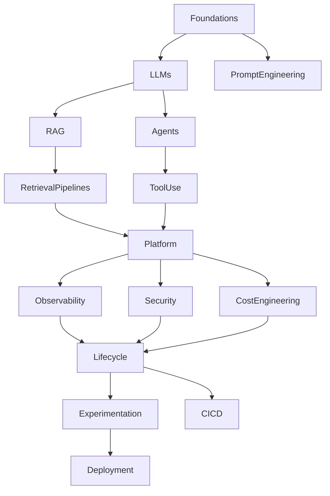

# AI Systems Engineering

## Designing, Building and Operating LLM Platforms

[🏠 Back to Home](index.md)

---

## About This Book

This book is a comprehensive technical guide for **solution architects and senior engineers** with deep experience in enterprise software development — Java ecosystems, distributed systems, microservices, event-driven architectures — who are transitioning into the design and operation of AI-based systems.

The assumption throughout is that you already know how to build complex, production-grade software. What you need is a rigorous engineering framework for the new class of problems that Large Language Models introduce: probabilistic behavior, artifact-rich systems, evaluation-driven development, and novel failure modes.

This is not a book about machine learning theory, nor a beginner's guide to AI. It is an **engineering reference** — oriented toward architecture decisions, design trade-offs, and operational concerns — written for engineers who build systems that other people depend on.

---

## How to Use This Book

The book is organized into nineteen parts, each corresponding to a major domain of AI Systems Engineering. Parts are designed to be read sequentially for a complete foundation, but each part is also independently usable as a reference for a specific domain.

**Parts I–II** establish the conceptual and architectural foundations. They are essential reading before diving into later parts.

**Parts III–VI** cover the core engineering disciplines: RAG, advanced retrieval, dataset engineering, and artifact management. These are the parts most directly applicable to building production systems.

**Parts VII–X** address software engineering practices adapted for AI systems: repository organization, lifecycle management, evaluation, and testing.

**Parts XI–XIII** cover platform engineering, infrastructure, and observability — the operational layer.

**Parts XIV–XVI** address security, governance, and operational management.

**Parts XVII–XVIII** provide reference architectures and end-to-end case studies that integrate all previous concepts.

**Part XIX** closes the book with a forward-looking perspective on the evolution of AI Systems Engineering as a discipline.

---

## Conventions Used in This Book

**Code examples** are provided in both Python and Java for every technical concept. Python examples use the OpenAI SDK, [LangChain](https://python.langchain.com), or [Hugging Face](https://huggingface.co/docs) libraries. Java examples use [LangChain4j](https://docs.langchain4j.dev) and Spring Boot.

**🔓 Open-source and on-premise alternatives** are highlighted throughout. Where a cloud-based solution is shown, the equivalent on-premise or open-source option is explicitly provided.

**📐 Architecture diagrams** are provided in Mermaid format and can be rendered in any Markdown viewer with Mermaid support, or converted to images using the Mermaid CLI.

**🧪 Hands-on labs** appear in selected critical chapters. Each lab provides a self-contained, runnable exercise that reinforces chapter concepts with real code.

**📋 Chapter summaries** appear at the end of every chapter as a structured recap of key concepts.

**❓ Comprehension questions** follow each summary to verify understanding before proceeding.

---

## Technology Landscape

| Category                   | Cloud / Managed                                                                                                    | 🔓 Open-source / On-premise                                                                                                                                                                                              |
| -------------------------- | ------------------------------------------------------------------------------------------------------------------ | ------------------------------------------------------------------------------------------------------------------------------------------------------------------------------------------------------------------------ |
| **LLM inference**          | [OpenAI](https://platform.openai.com/docs) (GPT-4o, GPT-4o-mini), [Anthropic](https://docs.anthropic.com) (Claude) | [Ollama](https://ollama.com), [vLLM](https://docs.vllm.ai), [llama.cpp](https://github.com/ggerganov/llama.cpp)                                                                                                          |
| **LLM models**             | GPT-4o, Claude 3.5 Sonnet                                                                                          | [Llama 3](https://ai.meta.com/llama/), [Mistral](https://docs.mistral.ai), [Qwen](https://huggingface.co/Qwen) 2.5, Phi-3                                                                                                |
| **Embeddings**             | OpenAI text-embedding-3, [Cohere](https://docs.cohere.com) embed-v3                                                | [sentence-transformers](https://www.sbert.net), [nomic-embed](https://huggingface.co/nomic-ai/nomic-embed-text-v1), BGE                                                                                                  |
| **Vector databases**       | [Pinecone](https://docs.pinecone.io), Azure AI Search                                                              | [Weaviate](https://weaviate.io/docs), [Chroma](https://docs.trychroma.com), [Qdrant](https://qdrant.tech/documentation), [Milvus](https://milvus.io/docs), [FAISS](https://faiss.ai)                                     |
| **Orchestration (Python)** | [LangChain](https://python.langchain.com), [LlamaIndex](https://docs.llamaindex.ai)                                | LangChain (OSS), [DSPy](https://dspy-docs.vercel.app), [Haystack](https://haystack.deepset.ai)                                                                                                                           |
| **Orchestration (Java)**   | [LangChain4j](https://docs.langchain4j.dev)                                                                        | LangChain4j (OSS), [Spring AI](https://docs.spring.io/spring-ai/reference)                                                                                                                                               |
| **Agent frameworks**       | —                                                                                                                  | [LangGraph](https://langchain-ai.github.io/langgraph), [AutoGen](https://microsoft.github.io/autogen), [CrewAI](https://docs.crewai.com), [Semantic Kernel](https://learn.microsoft.com/en-us/semantic-kernel/overview/) |
| **Observability**          | [Langfuse](https://langfuse.com/docs), [Helicone](https://docs.helicone.ai), [Arize](https://docs.arize.com)       | [Prometheus](https://prometheus.io/docs), [Grafana](https://grafana.com/docs), [OpenTelemetry](https://opentelemetry.io/docs), [Jaeger](https://www.jaegertracing.io/docs)                                               |
| **Experiment tracking**    | Weights & Biases (cloud)                                                                                           | [MLflow](https://mlflow.org/docs/latest/index.html), W&B (self-hosted), Neptune                                                                                                                                          |
| **Dataset versioning**     | —                                                                                                                  | [DVC](https://dvc.org/doc), [LakeFS](https://docs.lakefs.io), Git LFS                                                                                                                                                    |
| **Model serving**          | OpenAI API, Azure OpenAI                                                                                           | vLLM, TGI (HuggingFace), [Triton Inference Server](https://developer.nvidia.com/triton-inference-server)                                                                                                                 |

---

## AI Systems Engineering Knowledge Map

The following map summarizes the structural relationship between the domains covered in this book. It serves as a navigation aid — each node corresponds to one or more parts of the book.

| Node                                | Book coverage       |
| ----------------------------------- | ------------------- |
| Foundations                         | Parts I             |
| LLMs · PromptEngineering            | Part I              |
| RAG · RetrievalPipelines            | Parts III, IV       |
| Agents · ToolUse                    | Part II             |
| Platform                            | Parts XI, XII       |
| Observability                       | Part XIII           |
| Security                            | Part XIV            |
| CostEngineering                     | Parts XI, XVI       |
| Lifecycle · Experimentation · CI/CD | Parts VI, VII, VIII |
| Deployment                          | Parts XVII, XVIII   |

---

## Table of Contents

### [Part I — Foundations of AI Systems Engineering](foundations/index.md)

- [Chapter 1 — Introduction to AI Systems Engineering](foundations/index.md)
- [Chapter 2 — Software 1.0 vs [Software 2.0](https://karpathy.medium.com/software-2-0-a64152b37c35)](foundations/index.md)
- [Chapter 3 — Machine Learning vs LLM](foundations/index.md)
- [Chapter 4 — Tokens and Context](foundations/index.md)
- [Chapter 5 — Prompt Engineering](foundations/index.md)
- [Chapter 6 — Limitations of LLMs](foundations/index.md)

### [Part II — LLM Architectures](architectures/index.md)

- [Chapter 1 — Architectural Patterns](architectures/index.md)
- [Chapter 2 — Prompt-Only Systems](architectures/index.md)
- [Chapter 3 — Retrieval-Augmented Generation](architectures/index.md)
- [Chapter 4 — Tool-Augmented LLM](architectures/index.md)
- [Chapter 5 — Agent Architectures 🧪](architectures/index.md)
- [Chapter 6 — Workflow Systems](architectures/index.md)

### [Part III — RAG Engineering](rag-engineering/index.md)

- [Chapter 1 — Chunking 🧪](rag-engineering/index.md)
- [Chapter 2 — Embeddings](rag-engineering/index.md)
- [Chapter 3 — Vector Databases](rag-engineering/index.md)
- [Chapter 4 — Retrieval Strategies 🧪](rag-engineering/index.md)
- [Chapter 5 — Reranking](rag-engineering/index.md)
- [Chapter 6 — Context Construction](rag-engineering/index.md)

### [Part IV — Advanced RAG](advanced-rag/index.md)

- [Chapter 1 — Hybrid Search 🧪](advanced-rag/index.md)
- [Chapter 2 — Multi-Stage Retrieval](advanced-rag/index.md)
- [Chapter 3 — Query Rewriting 🧪](advanced-rag/index.md)
- [Chapter 4 — Context Compression](advanced-rag/index.md)
- [Chapter 5 — Knowledge Graphs + RAG](advanced-rag/index.md)
- [Chapter 6 — Retrieval Evaluation](advanced-rag/index.md)

### [Part V — Dataset Engineering](dataset-engineering/index.md)

- [Chapter 1 — Dataset Lifecycle](dataset-engineering/index.md)
- [Chapter 2 — Dataset Versioning](dataset-engineering/index.md)
- [Chapter 3 — Synthetic Dataset Generation 🧪](dataset-engineering/index.md)
- [Chapter 4 — Data Quality](dataset-engineering/index.md)
- [Chapter 5 — Data Augmentation](dataset-engineering/index.md)

### [Part VI — Artifact Engineering](artifact-engineering/index.md)

- [Chapter 1 — Artifact Taxonomy](artifact-engineering/index.md)
- [Chapter 2 — Artifact Dependency Graph 🧪](artifact-engineering/index.md)
- [Chapter 3 — Artifact Versioning](artifact-engineering/index.md)
- [Chapter 4 — Release Bundles](artifact-engineering/index.md)
- [Chapter 5 — Reproducibility](artifact-engineering/index.md)

### [Part VII — Layouts and Repositories](layouts-repositories/index.md)

- [Chapter 1 — Monorepo vs Multirepo](layouts-repositories/index.md)
- [Chapter 2 — AI Project Layouts](layouts-repositories/index.md)
- [Chapter 3 — Prompts as Code](layouts-repositories/index.md)
- [Chapter 4 — Configuration Management](layouts-repositories/index.md)

### [Part VIII — AI Systems SDLC](sdlc/index.md)

- [Chapter 1 — Prompt SDLC](sdlc/index.md)
- [Chapter 2 — Dataset SDLC](sdlc/index.md)
- [Chapter 3 — Pipeline SDLC 🧪](sdlc/index.md)
- [Chapter 4 — Experiment Pipelines](sdlc/index.md)

### [Part IX — Evaluation Engineering](evaluation-engineering/index.md)

- [Chapter 1 — Offline Evaluation](evaluation-engineering/index.md)
- [Chapter 2 — Retrieval Evaluation 🧪](evaluation-engineering/index.md)
- [Chapter 3 — Generation Evaluation](evaluation-engineering/index.md)
- [Chapter 4 — [LLM-as-Judge](https://arxiv.org/abs/2306.05685) 🧪](evaluation-engineering/index.md)
- [Chapter 5 — Human Evaluation](evaluation-engineering/index.md)

### [Part X — Testing LLM Systems](testing/index.md)

- [Chapter 1 — Unit Testing](testing/index.md)
- [Chapter 2 — Prompt Testing 🧪](testing/index.md)
- [Chapter 3 — Regression Testing](testing/index.md)
- [Chapter 4 — Adversarial Testing 🧪](testing/index.md)

### [Part XI — AI Platform Engineering](platform-engineering/index.md)

- [Chapter 1 — AI Platform Architecture](platform-engineering/index.md)
- [Chapter 2 — Model Routing](platform-engineering/index.md)
- [Chapter 3 — LLM Gateway 🧪](platform-engineering/index.md)
- [Chapter 4 — Semantic Caching 🧪](platform-engineering/index.md)
- [Chapter 5 — Cost Optimization](platform-engineering/index.md)

### [Part XII — Infrastructure](infrastructure/index.md)

- [Chapter 1 — GPUs and Compute](infrastructure/index.md)
- [Chapter 2 — Vector DB Deployment](infrastructure/index.md)
- [Chapter 3 — Message Queues](infrastructure/index.md)
- [Chapter 4 — Storage Architectures](infrastructure/index.md)
- [Chapter 5 — On-Premise LLM Platform Design](infrastructure/index.md)

### [Part XIII — Observability](observability/index.md)

- [Chapter 1 — LLM Metrics](observability/index.md)
- [Chapter 2 — Artifact Logging](observability/index.md)
- [Chapter 3 — Traceability 🧪](observability/index.md)
- [Chapter 4 — Telemetry](observability/index.md)

### [Part XIV — Security](security/index.md)

- [Chapter 1 — Prompt Injection 🧪](security/index.md)
- [Chapter 2 — Data Leakage](security/index.md)
- [Chapter 3 — Guardrails 🧪](security/index.md)
- [Chapter 4 — Red Teaming](security/index.md)

### [Part XV — Governance](governance/index.md)

- [Chapter 1 — AI Governance](governance/index.md)
- [Chapter 2 — EU AI Act and Regulatory Frameworks](governance/index.md)
- [Chapter 3 — Compliance](governance/index.md)
- [Chapter 4 — Explainability](governance/index.md)

### [Part XVI — Operations](operations/index.md)

- [Chapter 1 — Cost Management](operations/index.md)
- [Chapter 2 — Reliability Engineering](operations/index.md)
- [Chapter 3 — Model Lifecycle](operations/index.md)
- [Chapter 4 — Continuous Improvement](operations/index.md)

### [Part XVII — Reference Architectures](reference-architectures/index.md)

- [Chapter 1 — Enterprise Chatbot](reference-architectures/index.md)
- [Chapter 2 — Internal Copilot](reference-architectures/index.md)
- [Chapter 3 — Knowledge Assistant](reference-architectures/index.md)
- [Chapter 4 — Document Intelligence](reference-architectures/index.md)

### [Part XVIII — Practical Case Studies](case-studies/index.md)

- [Chapter 1 — Complete RAG Platform 🧪](case-studies/index.md)
- [Chapter 2 — LLM Evaluation System 🧪](case-studies/index.md)
- [Chapter 3 — Experimentation Platform](case-studies/index.md)
- [Chapter 4 — Enterprise AI Gateway 🧪](case-studies/index.md)
- [Chapter 5 — Financial Document Analysis](case-studies/index.md)

### [Part XIX — The Future of AI Systems Engineering](future/index.md)

- [Chapter 1 — AI-Native Software Systems](future/index.md)
- [Chapter 2 — Autonomous and Agentic Platforms](future/index.md)
- [Chapter 3 — Hardware Acceleration and Edge AI](future/index.md)
- [Chapter 4 — The Evolving Role of the Solution Architect](future/index.md)

---

## Further Reading

### Books

| Title                                   | Author           | Relevance                                       |
| --------------------------------------- | ---------------- | ----------------------------------------------- |
| _Designing Machine Learning Systems_    | Chip Huyen       | ML systems lifecycle and production patterns    |
| _Machine Learning Engineering_          | Andriy Burkov    | Engineering practices for ML                    |
| _Designing Data-Intensive Applications_ | Martin Kleppmann | Distributed systems foundations                 |
| _Building LLM Applications_             | O'Reilly         | Applied LLM development                         |
| _The Pragmatic Programmer_              | Hunt & Thomas    | Engineering principles applicable to AI systems |

### Research Papers

| Paper                                                                       | Authors                                                 | Key Contribution            |
| --------------------------------------------------------------------------- | ------------------------------------------------------- | --------------------------- |
| _[Attention Is All You Need](https://arxiv.org/abs/1706.03762)_             | Vaswani et al. (2017)                                   | Transformer architecture    |
| _[RAG for Knowledge-Intensive NLP Tasks](https://arxiv.org/abs/2005.11401)_ | [Lewis et al. (2020)](https://arxiv.org/abs/2005.11401) | RAG architecture foundation |
| _[LLM-as-a-Judge](https://arxiv.org/abs/2306.05685)_                        | Zheng et al. (2023)                                     | LLM evaluation methodology  |
| _[RAGAS](https://docs.ragas.io): Automated Evaluation of RAG_               | Es et al. (2023)                                        | RAG evaluation framework    |
| _[Self-RAG](https://arxiv.org/abs/2310.11511)_                              | Asai et al. (2023)                                      | Adaptive retrieval patterns |

### Standards and Regulation

| Resource                          | Scope                                       |
| --------------------------------- | ------------------------------------------- |
| EU Artificial Intelligence Act    | Risk-based AI regulation framework          |
| GDPR Documentation                | Data protection requirements for AI systems |
| OECD AI Principles                | International AI governance guidelines      |
| NIST AI Risk Management Framework | AI risk assessment and management           |
| ISO/IEC 42001                     | AI Management Systems standard              |

### Key Open-Source Projects

| Project                                                                                                                                    | Category                      |
| ------------------------------------------------------------------------------------------------------------------------------------------ | ----------------------------- |
| [LangChain](https://python.langchain.com) / [LangChain4j](https://docs.langchain4j.dev)                                                    | Python and Java orchestration |
| [LlamaIndex](https://docs.llamaindex.ai)                                                                                                   | Python RAG framework          |
| [Ollama](https://ollama.com)                                                                                                               | Local LLM runtime             |
| [vLLM](https://docs.vllm.ai)                                                                                                               | High-performance LLM serving  |
| [Weaviate](https://weaviate.io/docs) / [Chroma](https://docs.trychroma.com) / [Qdrant](https://qdrant.tech/documentation)                  | Vector databases              |
| [MLflow](https://mlflow.org/docs/latest/index.html)                                                                                        | Experiment tracking           |
| [Langfuse](https://langfuse.com/docs)                                                                                                      | LLM observability             |
| RAGAS                                                                                                                                      | RAG evaluation                |
| [DSPy](https://dspy-docs.vercel.app)                                                                                                       | Prompt optimization           |
| [LangGraph](https://langchain-ai.github.io/langgraph) / [AutoGen](https://microsoft.github.io/autogen) / [CrewAI](https://docs.crewai.com) | Agent frameworks              |

## Parts Overview

- [introduction](foundations/index.md)
- [foundations](./foundations/index.md)
- [architectures](./architectures/index.md)
- [rag_engineering](./rag-engineering/index.md)
- [advanced_rag](./advanced-rag/index.md)
- [dataset_engineering](./dataset-engineering/index.md)
- [artifact_engineering](./artifact-engineering/index.md)
- [layouts_repositories](./layouts-repositories/index.md)
- [sdlc](./sdlc/index.md)
- [evaluation_engineering](./evaluation-engineering/index.md)
- [testing](./testing/index.md)
- [platform_engineering](./platform-engineering/index.md)
- [infrastructure](./infrastructure/index.md)
- [observability](./observability/index.md)
- [security](./security/index.md)
- [governance](./governance/index.md)
- [operations](./operations/index.md)
- [reference_architectures](./reference-architectures/index.md)
- [case_studies](./case-studies/index.md)
- [future](./future/index.md)
