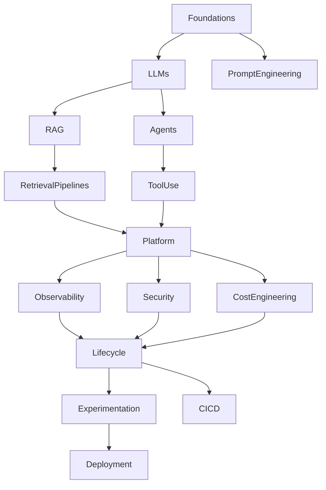

## AI Systems Engineering Knowledge Map

The following map summarizes the structural relationship between the domains covered in this book. It serves as a navigation aid — each node corresponds to one or more parts of the book.

| Node | Book coverage |
|---|---|
| Foundations | Parts I |
| LLMs · PromptEngineering | Part I |
| RAG · RetrievalPipelines | Parts III, IV |
| Agents · ToolUse | Part II |
| Platform | Parts XI, XII |
| Observability | Part XIII |
| Security | Part XIV |
| CostEngineering | Parts XI, XVI |
| Lifecycle · Experimentation · CI/CD | Parts VI, VII, VIII |
| Deployment | Parts XVII, XVIII |

---

---
[« Back to introduction Index](index.md) | [🏠 Home](../../index.md)