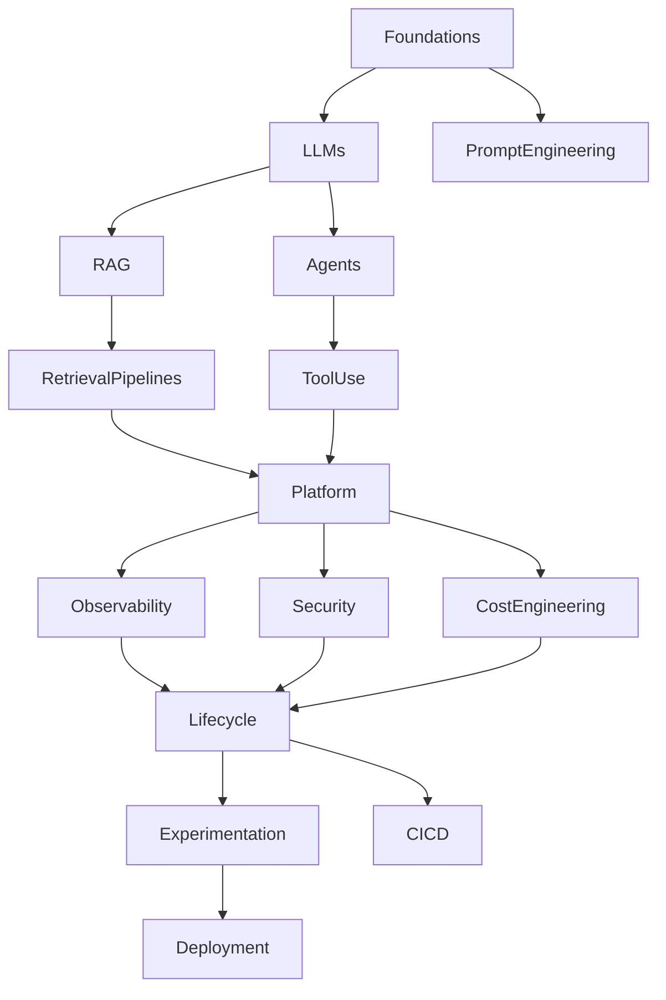

# AI Systems Engineering
## Designing, Building and Operating LLM Platforms

---

> **Navigation**
> [→ Part I — Foundations of AI Systems Engineering](part_01_foundations.md)

---

## About This Book

This book is a comprehensive technical guide for **solution architects and senior engineers** with deep experience in enterprise software development — Java ecosystems, distributed systems, microservices, event-driven architectures — who are transitioning into the design and operation of AI-based systems.

The assumption throughout is that you already know how to build complex, production-grade software. What you need is a rigorous engineering framework for the new class of problems that Large Language Models introduce: probabilistic behavior, artifact-rich systems, evaluation-driven development, and novel failure modes.

This is not a book about machine learning theory, nor a beginner's guide to AI. It is an **engineering reference** — oriented toward architecture decisions, design trade-offs, and operational concerns — written for engineers who build systems that other people depend on.

---

## How to Use This Book

The book is organized into nineteen parts, each corresponding to a major domain of AI Systems Engineering. Parts are designed to be read sequentially for a complete foundation, but each part is also independently usable as a reference for a specific domain.

**Parts I–II** establish the conceptual and architectural foundations. They are essential reading before diving into later parts.

**Parts III–VI** cover the core engineering disciplines: RAG, advanced retrieval, dataset engineering, and artifact management. These are the parts most directly applicable to building production systems.

**Parts VII–X** address software engineering practices adapted for AI systems: repository organization, lifecycle management, evaluation, and testing.

**Parts XI–XIII** cover platform engineering, infrastructure, and observability — the operational layer.

**Parts XIV–XVI** address security, governance, and operational management.

**Parts XVII–XVIII** provide reference architectures and end-to-end case studies that integrate all previous concepts.

**Part XIX** closes the book with a forward-looking perspective on the evolution of AI Systems Engineering as a discipline.

---

## Conventions Used in This Book

**Code examples** are provided in both Python and Java for every technical concept. Python examples use the OpenAI SDK, [LangChain](https://python.langchain.com), or [Hugging Face](https://huggingface.co/docs) libraries. Java examples use [LangChain4j](https://docs.langchain4j.dev) and Spring Boot.

**🔓 Open-source and on-premise alternatives** are highlighted throughout. Where a cloud-based solution is shown, the equivalent on-premise or open-source option is explicitly provided.

**📐 Architecture diagrams** are provided in Mermaid format and can be rendered in any Markdown viewer with Mermaid support, or converted to images using the Mermaid CLI.

**🧪 Hands-on labs** appear in selected critical chapters. Each lab provides a self-contained, runnable exercise that reinforces chapter concepts with real code.

**📋 Chapter summaries** appear at the end of every chapter as a structured recap of key concepts.

**❓ Comprehension questions** follow each summary to verify understanding before proceeding.

---

## Technology Landscape

| Category | Cloud / Managed | 🔓 Open-source / On-premise |
|---|---|---|
| **LLM inference** | [OpenAI](https://platform.openai.com/docs) (GPT-4o, GPT-4o-mini), [Anthropic](https://docs.anthropic.com) (Claude) | [Ollama](https://ollama.com), [vLLM](https://docs.vllm.ai), [llama.cpp](https://github.com/ggerganov/llama.cpp) |
| **LLM models** | GPT-4o, Claude 3.5 Sonnet | [Llama 3](https://ai.meta.com/llama/), [Mistral](https://docs.mistral.ai), [Qwen](https://huggingface.co/Qwen) 2.5, Phi-3 |
| **Embeddings** | OpenAI text-embedding-3, [Cohere](https://docs.cohere.com) embed-v3 | [sentence-transformers](https://www.sbert.net), [nomic-embed](https://huggingface.co/nomic-ai/nomic-embed-text-v1), BGE |
| **Vector databases** | [Pinecone](https://docs.pinecone.io), Azure AI Search | [Weaviate](https://weaviate.io/docs), [Chroma](https://docs.trychroma.com), [Qdrant](https://qdrant.tech/documentation), [Milvus](https://milvus.io/docs), [FAISS](https://faiss.ai) |
| **Orchestration (Python)** | [LangChain](https://python.langchain.com), [LlamaIndex](https://docs.llamaindex.ai) | LangChain (OSS), [DSPy](https://dspy-docs.vercel.app), [Haystack](https://haystack.deepset.ai) |
| **Orchestration (Java)** | [LangChain4j](https://docs.langchain4j.dev) | LangChain4j (OSS), [Spring AI](https://docs.spring.io/spring-ai/reference) |
| **Agent frameworks** | — | [LangGraph](https://langchain-ai.github.io/langgraph), [AutoGen](https://microsoft.github.io/autogen), [CrewAI](https://docs.crewai.com), [Semantic Kernel](https://learn.microsoft.com/en-us/semantic-kernel/overview/) |
| **Observability** | [Langfuse](https://langfuse.com/docs), [Helicone](https://docs.helicone.ai), [Arize](https://docs.arize.com) | [Prometheus](https://prometheus.io/docs), [Grafana](https://grafana.com/docs), [OpenTelemetry](https://opentelemetry.io/docs), [Jaeger](https://www.jaegertracing.io/docs) |
| **Experiment tracking** | Weights & Biases (cloud) | [MLflow](https://mlflow.org/docs/latest/index.html), W&B (self-hosted), Neptune |
| **Dataset versioning** | — | [DVC](https://dvc.org/doc), [LakeFS](https://docs.lakefs.io), Git LFS |
| **Model serving** | OpenAI API, Azure OpenAI | vLLM, TGI (HuggingFace), [Triton Inference Server](https://developer.nvidia.com/triton-inference-server) |

---

## AI Systems Engineering Knowledge Map

The following map summarizes the structural relationship between the domains covered in this book. It serves as a navigation aid — each node corresponds to one or more parts of the book.

| Node | Book coverage |
|---|---|
| Foundations | Parts I |
| LLMs · PromptEngineering | Part I |
| RAG · RetrievalPipelines | Parts III, IV |
| Agents · ToolUse | Part II |
| Platform | Parts XI, XII |
| Observability | Part XIII |
| Security | Part XIV |
| CostEngineering | Parts XI, XVI |
| Lifecycle · Experimentation · CI/CD | Parts VI, VII, VIII |
| Deployment | Parts XVII, XVIII |

---

## Table of Contents

### [Part I — Foundations of AI Systems Engineering](part_01_foundations.md)
- [Chapter 1 — Introduction to AI Systems Engineering](part_01_foundations.md#chapter-1--introduction-to-ai-systems-engineering)
- [Chapter 2 — Software 1.0 vs [Software 2.0](https://karpathy.medium.com/software-2-0-a64152b37c35)](part_01_foundations.md#chapter-2--software-10-vs-software-20)
- [Chapter 3 — Machine Learning vs LLM](part_01_foundations.md#chapter-3--machine-learning-vs-llm)
- [Chapter 4 — Tokens and Context](part_01_foundations.md#chapter-4--tokens-and-context)
- [Chapter 5 — Prompt Engineering](part_01_foundations.md#chapter-5--prompt-engineering)
- [Chapter 6 — Limitations of LLMs](part_01_foundations.md#chapter-6--limitations-of-llms)

### [Part II — LLM Architectures](part_02_architectures.md)
- [Chapter 1 — Architectural Patterns](part_02_architectures.md#chapter-1--architectural-patterns)
- [Chapter 2 — Prompt-Only Systems](part_02_architectures.md#chapter-2--prompt-only-systems)
- [Chapter 3 — Retrieval-Augmented Generation](part_02_architectures.md#chapter-3--retrieval-augmented-generation)
- [Chapter 4 — Tool-Augmented LLM](part_02_architectures.md#chapter-4--tool-augmented-llm)
- [Chapter 5 — Agent Architectures 🧪](part_02_architectures.md#chapter-5--agent-architectures)
- [Chapter 6 — Workflow Systems](part_02_architectures.md#chapter-6--workflow-systems)

### [Part III — RAG Engineering](part_03_rag_engineering.md)
- [Chapter 1 — Chunking 🧪](part_03_rag_engineering.md#chapter-1--chunking)
- [Chapter 2 — Embeddings](part_03_rag_engineering.md#chapter-2--embeddings)
- [Chapter 3 — Vector Databases](part_03_rag_engineering.md#chapter-3--vector-databases)
- [Chapter 4 — Retrieval Strategies 🧪](part_03_rag_engineering.md#chapter-4--retrieval-strategies)
- [Chapter 5 — Reranking](part_03_rag_engineering.md#chapter-5--reranking)
- [Chapter 6 — Context Construction](part_03_rag_engineering.md#chapter-6--context-construction)

### [Part IV — Advanced RAG](part_04_advanced_rag.md)
- [Chapter 1 — Hybrid Search 🧪](part_04_advanced_rag.md#chapter-1--hybrid-search)
- [Chapter 2 — Multi-Stage Retrieval](part_04_advanced_rag.md#chapter-2--multi-stage-retrieval)
- [Chapter 3 — Query Rewriting 🧪](part_04_advanced_rag.md#chapter-3--query-rewriting)
- [Chapter 4 — Context Compression](part_04_advanced_rag.md#chapter-4--context-compression)
- [Chapter 5 — Knowledge Graphs + RAG](part_04_advanced_rag.md#chapter-5--knowledge-graphs--rag)
- [Chapter 6 — Retrieval Evaluation](part_04_advanced_rag.md#chapter-6--retrieval-evaluation)

### [Part V — Dataset Engineering](part_05_dataset_engineering.md)
- [Chapter 1 — Dataset Lifecycle](part_05_dataset_engineering.md#chapter-1--dataset-lifecycle)
- [Chapter 2 — Dataset Versioning](part_05_dataset_engineering.md#chapter-2--dataset-versioning)
- [Chapter 3 — Synthetic Dataset Generation 🧪](part_05_dataset_engineering.md#chapter-3--synthetic-dataset-generation)
- [Chapter 4 — Data Quality](part_05_dataset_engineering.md#chapter-4--data-quality)
- [Chapter 5 — Data Augmentation](part_05_dataset_engineering.md#chapter-5--data-augmentation)

### [Part VI — Artifact Engineering](part_06_artifact_engineering.md)
- [Chapter 1 — Artifact Taxonomy](part_06_artifact_engineering.md#chapter-1--artifact-taxonomy)
- [Chapter 2 — Artifact Dependency Graph 🧪](part_06_artifact_engineering.md#chapter-2--artifact-dependency-graph)
- [Chapter 3 — Artifact Versioning](part_06_artifact_engineering.md#chapter-3--artifact-versioning)
- [Chapter 4 — Release Bundles](part_06_artifact_engineering.md#chapter-4--release-bundles)
- [Chapter 5 — Reproducibility](part_06_artifact_engineering.md#chapter-5--reproducibility)

### [Part VII — Layouts and Repositories](part_07_layouts_repositories.md)
- [Chapter 1 — Monorepo vs Multirepo](part_07_layouts_repositories.md#chapter-1--monorepo-vs-multirepo)
- [Chapter 2 — AI Project Layouts](part_07_layouts_repositories.md#chapter-2--ai-project-layouts)
- [Chapter 3 — Prompts as Code](part_07_layouts_repositories.md#chapter-3--prompts-as-code)
- [Chapter 4 — Configuration Management](part_07_layouts_repositories.md#chapter-4--configuration-management)

### [Part VIII — AI Systems SDLC](part_08_sdlc.md)
- [Chapter 1 — Prompt SDLC](part_08_sdlc.md#chapter-1--prompt-sdlc)
- [Chapter 2 — Dataset SDLC](part_08_sdlc.md#chapter-2--dataset-sdlc)
- [Chapter 3 — Pipeline SDLC 🧪](part_08_sdlc.md#chapter-3--pipeline-sdlc)
- [Chapter 4 — Experiment Pipelines](part_08_sdlc.md#chapter-4--experiment-pipelines)

### [Part IX — Evaluation Engineering](part_09_evaluation.md)
- [Chapter 1 — Offline Evaluation](part_09_evaluation.md#chapter-1--offline-evaluation)
- [Chapter 2 — Retrieval Evaluation 🧪](part_09_evaluation.md#chapter-2--retrieval-evaluation)
- [Chapter 3 — Generation Evaluation](part_09_evaluation.md#chapter-3--generation-evaluation)
- [Chapter 4 — [LLM-as-Judge](https://arxiv.org/abs/2306.05685) 🧪](part_09_evaluation.md#chapter-4--llm-as-judge)
- [Chapter 5 — Human Evaluation](part_09_evaluation.md#chapter-5--human-evaluation)

### [Part X — Testing LLM Systems](part_10_testing.md)
- [Chapter 1 — Unit Testing](part_10_testing.md#chapter-1--unit-testing)
- [Chapter 2 — Prompt Testing 🧪](part_10_testing.md#chapter-2--prompt-testing)
- [Chapter 3 — Regression Testing](part_10_testing.md#chapter-3--regression-testing)
- [Chapter 4 — Adversarial Testing 🧪](part_10_testing.md#chapter-4--adversarial-testing)

### [Part XI — AI Platform Engineering](part_11_platform_engineering.md)
- [Chapter 1 — AI Platform Architecture](part_11_platform_engineering.md#chapter-1--ai-platform-architecture)
- [Chapter 2 — Model Routing](part_11_platform_engineering.md#chapter-2--model-routing)
- [Chapter 3 — LLM Gateway 🧪](part_11_platform_engineering.md#chapter-3--llm-gateway)
- [Chapter 4 — Semantic Caching 🧪](part_11_platform_engineering.md#chapter-4--semantic-caching)
- [Chapter 5 — Cost Optimization](part_11_platform_engineering.md#chapter-5--cost-optimization)

### [Part XII — Infrastructure](part_12_infrastructure.md)
- [Chapter 1 — GPUs and Compute](part_12_infrastructure.md#chapter-1--gpus-and-compute)
- [Chapter 2 — Vector DB Deployment](part_12_infrastructure.md#chapter-2--vector-db-deployment)
- [Chapter 3 — Message Queues](part_12_infrastructure.md#chapter-3--message-queues)
- [Chapter 4 — Storage Architectures](part_12_infrastructure.md#chapter-4--storage-architectures)
- [Chapter 5 — On-Premise LLM Platform Design](part_12_infrastructure.md#chapter-5--on-premise-llm-platform-design)

### [Part XIII — Observability](part_13_observability.md)
- [Chapter 1 — LLM Metrics](part_13_observability.md#chapter-1--llm-metrics)
- [Chapter 2 — Artifact Logging](part_13_observability.md#chapter-2--artifact-logging)
- [Chapter 3 — Traceability 🧪](part_13_observability.md#chapter-3--traceability)
- [Chapter 4 — Telemetry](part_13_observability.md#chapter-4--telemetry)

### [Part XIV — Security](part_14_security.md)
- [Chapter 1 — Prompt Injection 🧪](part_14_security.md#chapter-1--prompt-injection)
- [Chapter 2 — Data Leakage](part_14_security.md#chapter-2--data-leakage)
- [Chapter 3 — Guardrails 🧪](part_14_security.md#chapter-3--guardrails)
- [Chapter 4 — Red Teaming](part_14_security.md#chapter-4--red-teaming)

### [Part XV — Governance](part_15_governance.md)
- [Chapter 1 — AI Governance](part_15_governance.md#chapter-1--ai-governance)
- [Chapter 2 — EU AI Act and Regulatory Frameworks](part_15_governance.md#chapter-2--eu-ai-act-and-regulatory-frameworks)
- [Chapter 3 — Compliance](part_15_governance.md#chapter-3--compliance)
- [Chapter 4 — Explainability](part_15_governance.md#chapter-4--explainability)

### [Part XVI — Operations](part_16_operations.md)
- [Chapter 1 — Cost Management](part_16_operations.md#chapter-1--cost-management)
- [Chapter 2 — Reliability Engineering](part_16_operations.md#chapter-2--reliability-engineering)
- [Chapter 3 — Model Lifecycle](part_16_operations.md#chapter-3--model-lifecycle)
- [Chapter 4 — Continuous Improvement](part_16_operations.md#chapter-4--continuous-improvement)

### [Part XVII — Reference Architectures](part_17_reference_architectures.md)
- [Chapter 1 — Enterprise Chatbot](part_17_reference_architectures.md#chapter-1--enterprise-chatbot)
- [Chapter 2 — Internal Copilot](part_17_reference_architectures.md#chapter-2--internal-copilot)
- [Chapter 3 — Knowledge Assistant](part_17_reference_architectures.md#chapter-3--knowledge-assistant)
- [Chapter 4 — Document Intelligence](part_17_reference_architectures.md#chapter-4--document-intelligence)

### [Part XVIII — Practical Case Studies](part_18_case_studies.md)
- [Chapter 1 — Complete RAG Platform 🧪](part_18_case_studies.md#chapter-1--complete-rag-platform)
- [Chapter 2 — LLM Evaluation System 🧪](part_18_case_studies.md#chapter-2--llm-evaluation-system)
- [Chapter 3 — Experimentation Platform](part_18_case_studies.md#chapter-3--experimentation-platform)
- [Chapter 4 — Enterprise AI Gateway 🧪](part_18_case_studies.md#chapter-4--enterprise-ai-gateway)
- [Chapter 5 — Financial Document Analysis](part_18_case_studies.md#chapter-5--financial-document-analysis)

### [Part XIX — The Future of AI Systems Engineering](part_19_future.md)
- [Chapter 1 — AI-Native Software Systems](part_19_future.md#chapter-1--ai-native-software-systems)
- [Chapter 2 — Autonomous and Agentic Platforms](part_19_future.md#chapter-2--autonomous-and-agentic-platforms)
- [Chapter 3 — Hardware Acceleration and Edge AI](part_19_future.md#chapter-3--hardware-acceleration-and-edge-ai)
- [Chapter 4 — The Evolving Role of the Solution Architect](part_19_future.md#chapter-4--the-evolving-role-of-the-solution-architect)

---

## Further Reading

### Books

| Title | Author | Relevance |
|---|---|---|
| *Designing Machine Learning Systems* | Chip Huyen | ML systems lifecycle and production patterns |
| *Machine Learning Engineering* | Andriy Burkov | Engineering practices for ML |
| *Designing Data-Intensive Applications* | Martin Kleppmann | Distributed systems foundations |
| *Building LLM Applications* | O'Reilly | Applied LLM development |
| *The Pragmatic Programmer* | Hunt & Thomas | Engineering principles applicable to AI systems |

### Research Papers

| Paper | Authors | Key Contribution |
|---|---|---|
| *[Attention Is All You Need](https://arxiv.org/abs/1706.03762)* | Vaswani et al. (2017) | Transformer architecture |
| *[RAG for Knowledge-Intensive NLP Tasks](https://arxiv.org/abs/2005.11401)* | [Lewis et al. (2020)](https://arxiv.org/abs/2005.11401) | RAG architecture foundation |
| *[LLM-as-a-Judge](https://arxiv.org/abs/2306.05685)* | Zheng et al. (2023) | LLM evaluation methodology |
| *[RAGAS](https://docs.ragas.io): Automated Evaluation of RAG* | Es et al. (2023) | RAG evaluation framework |
| *[Self-RAG](https://arxiv.org/abs/2310.11511)* | Asai et al. (2023) | Adaptive retrieval patterns |

### Standards and Regulation

| Resource | Scope |
|---|---|
| EU Artificial Intelligence Act | Risk-based AI regulation framework |
| GDPR Documentation | Data protection requirements for AI systems |
| OECD AI Principles | International AI governance guidelines |
| NIST AI Risk Management Framework | AI risk assessment and management |
| ISO/IEC 42001 | AI Management Systems standard |

### Key Open-Source Projects

| Project | Category |
|---|---|
| [LangChain](https://python.langchain.com) / [LangChain4j](https://docs.langchain4j.dev) | Python and Java orchestration |
| [LlamaIndex](https://docs.llamaindex.ai) | Python RAG framework |
| [Ollama](https://ollama.com) | Local LLM runtime |
| [vLLM](https://docs.vllm.ai) | High-performance LLM serving |
| [Weaviate](https://weaviate.io/docs) / [Chroma](https://docs.trychroma.com) / [Qdrant](https://qdrant.tech/documentation) | Vector databases |
| [MLflow](https://mlflow.org/docs/latest/index.html) | Experiment tracking |
| [Langfuse](https://langfuse.com/docs) | LLM observability |
| RAGAS | RAG evaluation |
| [DSPy](https://dspy-docs.vercel.app) | Prompt optimization |
| [LangGraph](https://langchain-ai.github.io/langgraph) / [AutoGen](https://microsoft.github.io/autogen) / [CrewAI](https://docs.crewai.com) | Agent frameworks |

---

> **Navigation**
> [→ Part I — Foundations of AI Systems Engineering](part_01_foundations.md)
