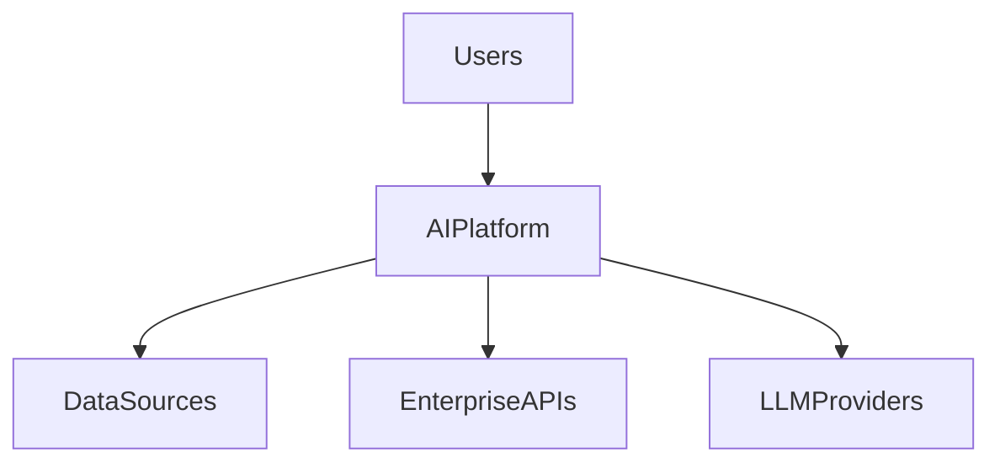
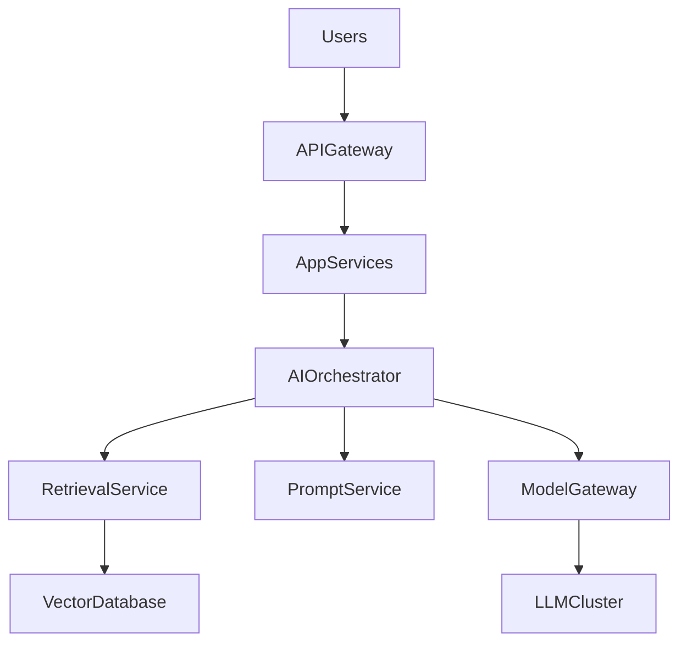
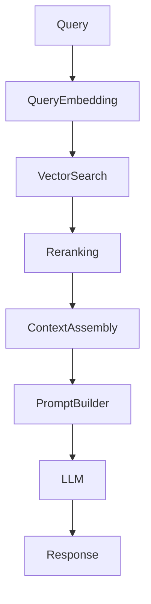
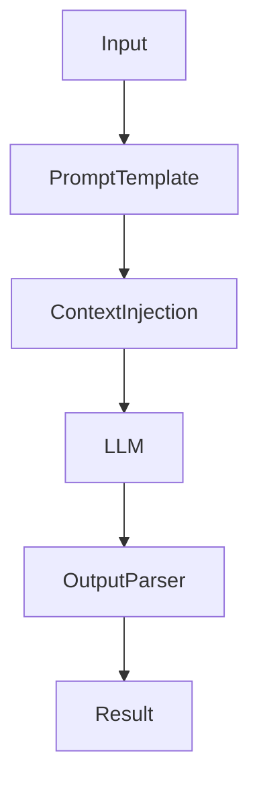
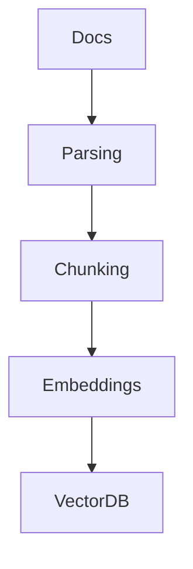
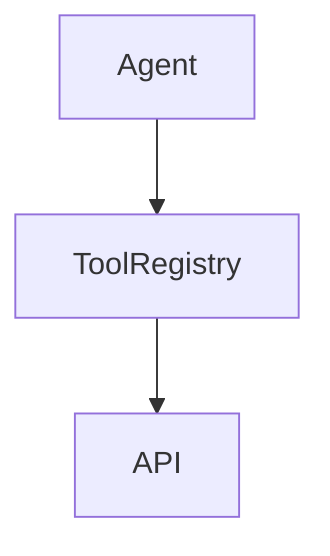
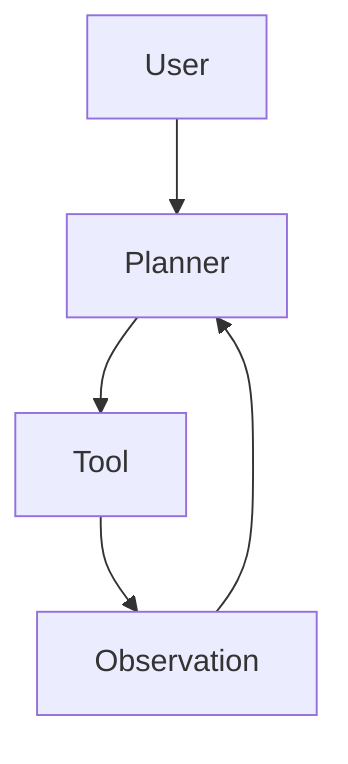
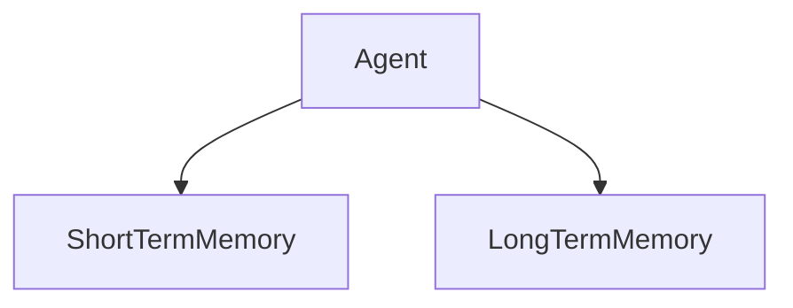
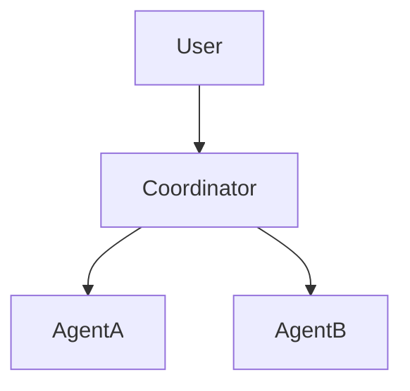
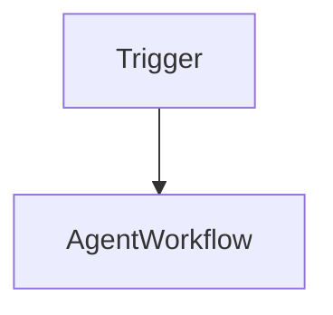

# Part II — LLM Architectures

---

> **Navigation**
> [← Part I — Foundations](part_01_foundations.md) | [→ Part III — RAG Engineering](part_03_rag_engineering.md)

---

## Contents

- [Chapter 1 — Architectural Patterns](#chapter-1--architectural-patterns)
  - [1.1 A Taxonomy of LLM System Architectures](#11-a-taxonomy-of-llm-system-architectures)
  - [1.2 The Eight-Layer Reference Model](#12-the-eight-layer-reference-model)
  - [1.3 Choosing the Right Architecture](#13-choosing-the-right-architecture)
  - [1.4 Architecture Decision Drivers](#14-architecture-decision-drivers)
  - [1.5 The C4 Model Applied to LLM Systems](#15-the-c4-model-applied-to-llm-systems)
- [Chapter 2 — Prompt-Only Systems](#chapter-2--prompt-only-systems)
  - [2.1 When No Retrieval Is Needed](#21-when-no-retrieval-is-needed)
  - [2.2 Architecture and Components](#22-architecture-and-components)
  - [2.3 Structured Output Patterns](#23-structured-output-patterns)
  - [2.4 Multi-Turn Conversation Management](#24-multi-turn-conversation-management)
  - [2.5 Strengths and Limitations](#25-strengths-and-limitations)
- [Chapter 3 — Retrieval-Augmented Generation](#chapter-3--retrieval-augmented-generation)
  - [3.1 Why RAG Is the Dominant Enterprise Pattern](#31-why-rag-is-the-dominant-enterprise-pattern)
  - [3.2 RAG Architecture Overview](#32-rag-architecture-overview)
  - [3.3 Ingestion Pipeline](#33-ingestion-pipeline)
  - [3.4 Query Pipeline](#34-query-pipeline)
  - [3.5 RAG Variants](#35-rag-variants)
- [Chapter 4 — Tool-Augmented LLM](#chapter-4--tool-augmented-llm)
  - [4.1 Extending LLMs with External Capabilities](#41-extending-llms-with-external-capabilities)
  - [4.2 Function Calling](#42-function-calling)
  - [4.3 Tool Registry Design](#43-tool-registry-design)
  - [4.4 Tool Safety and Sandboxing](#44-tool-safety-and-sandboxing)
  - [4.5 Structured Tool Output Handling](#45-structured-tool-output-handling)
- [Chapter 5 — Agent Architectures 🧪](#chapter-5--agent-architectures-)
  - [5.1 From Pipelines to Agents](#51-from-pipelines-to-agents)
  - [5.2 The ReAct Pattern](#52-the-react-pattern)
  - [5.3 Planner-Executor Architecture](#53-planner-executor-architecture)
  - [5.4 Agent Memory Systems](#54-agent-memory-systems)
  - [5.5 Multi-Agent Collaboration](#55-multi-agent-collaboration)
  - [5.6 Reliability and Control](#56-reliability-and-control)
  - [5.7 Agent Frameworks](#57-agent-frameworks)
  - [🧪 Hands-on Lab: Build a Tool-Using Agent](#-hands-on-lab-build-a-tool-using-agent)
- [Chapter 6 — Workflow Systems](#chapter-6--workflow-systems)
  - [6.1 Workflow Orchestration for LLM Systems](#61-workflow-orchestration-for-llm-systems)
  - [6.2 Deterministic vs. Adaptive Workflows](#62-deterministic-vs-adaptive-workflows)
  - [6.3 LangGraph: Graph-Based Workflow Orchestration](#63-langgraph-graph-based-workflow-orchestration)
  - [6.4 Workflow Systems for Java Architects](#64-workflow-systems-for-java-architects)
  - [6.5 Production Workflow Patterns](#65-production-workflow-patterns)

---

## Chapter 1 — Architectural Patterns

### 1.1 A Taxonomy of LLM System Architectures

LLM-based systems are not monolithic. Depending on the task, the data environment, and the required level of autonomy, different architectural patterns apply. Understanding this taxonomy is the first step toward sound design decisions.

The four primary patterns form a spectrum of increasing complexity and capability:

```
Prompt-Only → RAG → Tool-Augmented → Agentic
   simple         knowledge-grounded    autonomous
```

Each pattern builds on the previous: an agent can use tools, tools can include retrieval, and retrieval relies on well-engineered prompts. But the patterns are not strictly cumulative — a simple classification service needs only a well-crafted prompt, while an enterprise knowledge assistant requires RAG, and an autonomous research assistant requires full agent capabilities.

| Pattern | Data access | Autonomy | Complexity | Typical use case |
|---|---|---|---|---|
| **Prompt-Only** | Model training data only | None | Low | Classification, extraction, summarization |
| **RAG** | External knowledge base | None | Medium | Knowledge Q&A, document analysis |
| **Tool-Augmented** | Live APIs, databases | Limited | Medium-High | Data retrieval, computation, API orchestration |
| **Agentic** | All of the above | High | High | Multi-step research, workflow automation |

---

### 1.2 The Eight-Layer Reference Model

Enterprise LLM systems are structured in layers, each with a clearly defined responsibility. This model, introduced in Part I, serves as the structural backbone for understanding where each architectural component belongs.

```
┌─────────────────────────────────────────────────────────┐
│  Layer 8 — Interaction Layer                            │
│  Chat interfaces, APIs, embedded widgets                │
├─────────────────────────────────────────────────────────┤
│  Layer 7 — Application Layer                            │
│  Business logic, routing, workflow coordination         │
├─────────────────────────────────────────────────────────┤
│  Layer 6 — AI Orchestration Layer                       │
│  Prompt assembly, tool coordination, agent loops        │
├─────────────────────────────────────────────────────────┤
│  Layer 5 — Prompt Layer                                 │
│  Templates, versioning, dynamic construction            │
├─────────────────────────────────────────────────────────┤
│  Layer 4 — Retrieval Layer                              │
│  Vector search, reranking, context assembly             │
├─────────────────────────────────────────────────────────┤
│  Layer 3 — Model Layer                                  │
│  LLM inference, embedding generation                    │
├─────────────────────────────────────────────────────────┤
│  Layer 2 — Data Processing Layer                        │
│  Document ingestion, chunking, indexing                 │
├─────────────────────────────────────────────────────────┤
│  Layer 1 — Infrastructure Layer                         │
│  Compute, storage, networking, queues                   │
└─────────────────────────────────────────────────────────┘
```

Not all systems implement all eight layers. A prompt-only system may span only layers 5, 6, and 7. A full RAG platform engages all eight. Understanding which layers your system requires is fundamental to estimating engineering scope.

---

### 1.3 Choosing the Right Architecture

Architecture selection is not a technical preference — it is driven by concrete requirements. The following decision framework guides the selection:

```
Start here:
Does the system need to answer questions about private or
frequently updated organizational knowledge?
    │
    ├── Yes → Use RAG
    │          Does the system need to perform actions,
    │          call APIs, or execute multi-step tasks?
    │              ├── Yes → Tool-Augmented or Agentic
    │              └── No  → RAG is sufficient
    │
    └── No  → Does the model's training data cover the domain?
                  ├── Yes → Prompt-Only may be sufficient
                  └── No  → Consider fine-tuning or RAG
                            with curated domain content
```

**📐 Architecture decision:** Defaulting to the most complex architecture "for future flexibility" is a common and costly mistake. Start with the simplest pattern that meets requirements. Agentic systems introduce reliability, latency, and debugging complexity that is only justified when genuine multi-step autonomy is needed.

---

### 1.4 Architecture Decision Drivers

Beyond functional requirements, architecture selection is shaped by non-functional constraints that enterprise architects must evaluate explicitly:

| Driver | Implication |
|---|---|
| **Data privacy / sovereignty** | Cloud LLM APIs may be unacceptable; on-premise models required |
| **Latency requirements** | Agent loops add 3–10x latency vs. single-pass generation |
| **Cost at scale** | Agentic patterns multiply token consumption per user request |
| **Auditability** | Regulated environments require traceable reasoning chains |
| **Knowledge freshness** | Rapidly changing data requires RAG over fine-tuning |
| **Team capability** | Agent systems require specialized debugging and monitoring skills |

---

### 1.5 The C4 Model Applied to LLM Systems

The C4 model (Context, Container, Component, Code) provides a structured approach to documenting LLM platform architecture at multiple levels of abstraction. It is particularly well-suited to enterprise contexts where multiple stakeholder audiences need different views of the same system.

**Level 1 — System Context:** Who uses the system and what external dependencies does it have?



**Level 2 — Container Diagram:** What are the major deployable units?



**Level 3 — Component Diagram (RAG pipeline):**



Using the C4 model forces architectural clarity across levels and makes it easy to communicate the design to different stakeholders — from C-level sponsors (Level 1) to infrastructure engineers (Level 3).

---

> ### 📋 Chapter Summary
>
> - Four primary LLM architectural patterns: Prompt-Only, RAG, Tool-Augmented, and Agentic — each addressing different capability and complexity requirements.
> - The **eight-layer model** provides a structured decomposition of enterprise LLM systems.
> - Architecture selection must be driven by concrete requirements: data privacy, latency, cost, and auditability — not by complexity preferences.
> - The **C4 model** is a practical tool for documenting LLM architectures at multiple levels of abstraction.

---

> ### ❓ Comprehension Questions
>
> 1. An enterprise team wants to build a chatbot that answers questions about internal HR policies. The policies are updated monthly. Which architectural pattern is most appropriate and why?
> 2. A product manager argues that building an agentic system from the start provides "maximum flexibility." What engineering arguments would you use to challenge this?
> 3. Map the C4 Level 2 container diagram to the eight-layer model. Which containers correspond to which layers?
> 4. Your team is designing a system for a financial institution that cannot send customer data to external LLM providers. How does this constraint affect architecture selection?
> 5. Identify two non-functional requirements that would push an architecture from RAG toward Tool-Augmented. Justify your answer.

---
## References

### Papers
- [Retrieval-Augmented Generation for Knowledge-Intensive NLP Tasks](https://arxiv.org/abs/2005.11401) — Lewis et al., 2020. Foundational RAG architecture paper.
- [A Survey of Large Language Models](https://arxiv.org/abs/2303.18223) — Zhao et al., 2023. Comprehensive survey of LLM capabilities and limitations.
- [Toolformer: Language Models Can Teach Themselves to Use Tools](https://arxiv.org/abs/2302.04761) — Schick et al., 2023. Tool use in language models.

### Guides & Documentation
- [C4 Architecture Model](https://c4model.com) — Simon Brown's hierarchical architecture documentation approach.
- [AWS Well-Architected AI/ML Lens](https://docs.aws.amazon.com/wellarchitected/latest/machine-learning-lens/welcome.html) — Enterprise AI architecture guidance.
- [LangChain Architecture Overview](https://python.langchain.com/docs/concepts/) — Conceptual model for LLM application components.

### Books
- [Building LLM Powered Applications](https://www.oreilly.com/library/view/building-llm-powered/9781835462317/) — Valentina Alto, Packt, 2024.
## Chapter 2 — Prompt-Only Systems

### 2.1 When No Retrieval Is Needed

Not every LLM system requires a vector database. Prompt-only systems — where the model responds based solely on its training knowledge and the content of the current prompt — are the appropriate choice for a specific class of tasks:

- **Classification** — assigning inputs to predefined categories
- **Extraction** — pulling structured data from unstructured text
- **Transformation** — reformatting, translating, or normalizing content
- **Summarization** — condensing text to its key points
- **Code generation** — writing or reviewing code given specifications
- **Scoring** — assigning numerical or categorical scores to inputs

These tasks share a common property: the information required to produce the output is either present in the input itself or reliably encoded in the model's training data. No external knowledge retrieval is necessary.

---

### 2.2 Architecture and Components

A prompt-only system is the simplest possible LLM architecture. Its components are minimal:



**Python — Minimal prompt-only classification service:**
```python
import json
from openai import OpenAI
from pydantic import BaseModel
from enum import Enum

class TicketCategory(str, Enum):
    AUTHENTICATION = "authentication"
    BILLING = "billing"
    TECHNICAL = "technical"
    OTHER = "other"

class ClassificationResult(BaseModel):
    category: TicketCategory
    confidence: str  # high | medium | low
    reasoning: str

SYSTEM_PROMPT = """
You are a support ticket classification engine.

Classify incoming tickets into exactly one of:
- authentication: login, password, MFA, account access
- billing: payments, invoices, subscriptions, refunds
- technical: errors, crashes, performance, data issues
- other: anything not fitting the above

Respond with valid JSON only matching this schema:
{"category": "...", "confidence": "high|medium|low", "reasoning": "..."}
"""

client = OpenAI()

def classify(ticket_text: str) -> ClassificationResult:
    response = client.chat.completions.create(
        model="gpt-4o-mini",
        messages=[
            {"role": "system", "content": SYSTEM_PROMPT},
            {"role": "user", "content": ticket_text}
        ],
        response_format={"type": "json_object"},
        temperature=0
    )
    data = json.loads(response.choices[0].message.content)
    return ClassificationResult(**data)

# Usage
result = classify("I cannot log into my account after the password reset")
print(result.category)    # → TicketCategory.AUTHENTICATION
print(result.confidence)  # → high
```

**Java — Prompt-only extraction with [LangChain4j](https://docs.langchain4j.dev):**
```java
import dev.langchain4j.model.openai.OpenAiChatModel;
import dev.langchain4j.service.AiServices;
import dev.langchain4j.service.SystemMessage;
import dev.langchain4j.service.UserMessage;

record TicketClassification(String category, String confidence, String reasoning) {}

interface TicketClassifier {
    @SystemMessage("""
        You are a support ticket classification engine.
        Classify tickets into: authentication, billing, technical, other.
        Respond with valid JSON: {"category":"...","confidence":"high|medium|low","reasoning":"..."}
        """)
    @UserMessage("{{ticketText}}")
    String classify(String ticketText);
}

// Service setup
OpenAiChatModel model = OpenAiChatModel.builder()
    .apiKey(System.getenv("OPENAI_API_KEY"))
    .modelName("gpt-4o-mini")
    .temperature(0.0)
    .build();

TicketClassifier classifier = AiServices.create(TicketClassifier.class, model);
String json = classifier.classify("Cannot log in after password reset");
// Parse JSON into TicketClassification record
```

🔓 **On-premise alternative with [Ollama](https://ollama.com):**
```python
import requests
import json

def classify_local(ticket_text: str) -> dict:
    response = requests.post(
        "http://localhost:11434/api/chat",
        json={
            "model": "mistral",
            "messages": [
                {"role": "system", "content": SYSTEM_PROMPT},
                {"role": "user", "content": ticket_text}
            ],
            "stream": False,
            "format": "json"
        }
    )
    return json.loads(response.json()["message"]["content"])
```

---

### 2.3 Structured Output Patterns

The most critical engineering concern in prompt-only systems is output reliability. When a downstream system depends on the LLM output — to route a ticket, populate a database field, trigger a workflow — output format must be predictable and parseable.

**Pattern 1 — JSON mode (OpenAI):**
```python
response = client.chat.completions.create(
    model="gpt-4o",
    messages=[...],
    response_format={"type": "json_object"},  # Guarantees valid JSON
    temperature=0
)
```

**Pattern 2 — Structured outputs with schema enforcement:**
```python
from pydantic import BaseModel
from openai import OpenAI

class ExtractionResult(BaseModel):
    invoice_number: str
    amount: float
    currency: str
    due_date: str
    vendor_name: str

client = OpenAI()

def extract_invoice_data(invoice_text: str) -> ExtractionResult:
    response = client.beta.chat.completions.parse(
        model="gpt-4o",
        messages=[
            {"role": "system", "content": "Extract invoice fields from the provided text."},
            {"role": "user", "content": invoice_text}
        ],
        response_format=ExtractionResult,
        temperature=0
    )
    return response.choices[0].message.parsed
```

**Pattern 3 — Defensive parsing with fallback:**
```python
import json
import re

def safe_parse_json(response_text: str) -> dict | None:
    """Attempts to parse JSON even if the model adds surrounding text."""
    # Direct parse
    try:
        return json.loads(response_text)
    except json.JSONDecodeError:
        pass
    # Extract first JSON block from response
    match = re.search(r'\{.*\}', response_text, re.DOTALL)
    if match:
        try:
            return json.loads(match.group())
        except json.JSONDecodeError:
            pass
    return None
```

**📐 Architecture decision:** Always use `response_format: json_object` or [Pydantic](https://docs.pydantic.dev)-based structured outputs in production prompt-only systems. Relying on the model to produce consistent format without schema enforcement leads to parsing failures that are difficult to debug and reproduce.

---

### 2.4 Multi-Turn Conversation Management

Many prompt-only systems need to maintain context across multiple turns of a conversation. This requires explicit conversation history management — the LLM has no memory between API calls.

**Python — Conversation manager:**
```python
from dataclasses import dataclass, field
from typing import List
from openai import OpenAI

@dataclass
class ConversationManager:
    system_prompt: str
    max_history_tokens: int = 4000
    messages: List[dict] = field(default_factory=list)

    def __post_init__(self):
        self.messages = [{"role": "system", "content": self.system_prompt}]
        self.client = OpenAI()

    def chat(self, user_message: str, model: str = "gpt-4o") -> str:
        self.messages.append({"role": "user", "content": user_message})
        self._trim_history()

        response = self.client.chat.completions.create(
            model=model,
            messages=self.messages,
            temperature=0.3
        )
        assistant_message = response.choices[0].message.content
        self.messages.append({"role": "assistant", "content": assistant_message})
        return assistant_message

    def _trim_history(self):
        """Keep system prompt + trim oldest turns if history grows too large."""
        # Simple token estimation: 1 token ≈ 4 chars
        total_chars = sum(len(m["content"]) for m in self.messages)
        while total_chars > self.max_history_tokens * 4 and len(self.messages) > 2:
            # Remove oldest user/assistant pair (keep system prompt at index 0)
            self.messages.pop(1)
            if len(self.messages) > 1:
                self.messages.pop(1)
            total_chars = sum(len(m["content"]) for m in self.messages)
```

**Java — Conversation management with LangChain4j:**
```java
import dev.langchain4j.memory.chat.MessageWindowChatMemory;
import dev.langchain4j.service.AiServices;
import dev.langchain4j.service.SystemMessage;

interface ConversationalAssistant {
    @SystemMessage("You are a helpful technical support assistant.")
    String chat(String userMessage);
}

// MessageWindowChatMemory keeps the last N messages
ConversationalAssistant assistant = AiServices.builder(ConversationalAssistant.class)
    .chatLanguageModel(model)
    .chatMemory(MessageWindowChatMemory.withMaxMessages(20))
    .build();

String response1 = assistant.chat("What is RAG?");
String response2 = assistant.chat("Can you give me a Python example?");
// Second call automatically includes the first turn in context
```

---

### 2.5 Strengths and Limitations

| Aspect | Prompt-Only | Implication |
|---|---|---|
| **Latency** | Single API call | Lowest possible response time |
| **Cost** | Minimal token usage | Most cost-efficient pattern |
| **Knowledge scope** | Model training data only | Knowledge cutoff applies |
| **Consistency** | Requires structured output engineering | Non-trivial in production |
| **Scalability** | Stateless | Trivially horizontal |
| **Auditability** | Full prompt/response logging | Simple to implement |

---

> ### 📋 Chapter Summary
>
> - Prompt-only systems are the correct pattern for classification, extraction, transformation, and summarization tasks that do not require external knowledge.
> - **Structured output enforcement** (JSON mode, Pydantic schemas) is mandatory in production — do not rely on free-form output parsing.
> - **Conversation history management** is the application's responsibility; the LLM has no state between API calls.
> - Prompt-only systems are the most cost-efficient and lowest-latency LLM architecture; use them wherever the use case allows.

---

> ### ❓ Comprehension Questions
>
> 1. A team is building a system to extract structured fields (amount, date, vendor) from invoice PDFs. Is a prompt-only architecture sufficient? What additional component might be needed upstream?
> 2. What is the risk of not specifying `response_format: json_object` in a production classification endpoint, and how would failures manifest in downstream systems?
> 3. Explain the conversation history trimming strategy. What information is lost when old turns are trimmed, and what are the alternatives?
> 4. A prompt-only service processes 500,000 tickets per day. The current model is GPT-4o. What architectural changes would you evaluate to reduce cost while maintaining accuracy?
> 5. A developer proposes storing conversation history in a relational database between sessions. What engineering considerations does this introduce?

---
## References

### Documentation
- [OpenAI Structured Outputs](https://platform.openai.com/docs/guides/structured-outputs) — JSON schema enforcement for reliable outputs.
- [OpenAI Chat Completions API](https://platform.openai.com/docs/api-reference/chat) — Full API reference.
- [Pydantic Documentation](https://docs.pydantic.dev) — Data validation library used for structured output parsing.
- [LangChain4j AI Services](https://docs.langchain4j.dev/tutorials/ai-services) — Declarative Java interface for LLM interaction.
- [Ollama API Reference](https://github.com/ollama/ollama/blob/main/docs/api.md) — On-premise LLM REST API.

### Articles
- [OpenAI Cookbook: Structured Outputs](https://cookbook.openai.com/examples/structured_outputs_intro) — Practical guide to reliable JSON generation.
- [How to Reliably Get JSON from LLMs](https://yonom.substack.com/p/native-json-output-from-gpt-4) — Community patterns for structured output.
## Chapter 3 — Retrieval-Augmented Generation

### 3.1 Why RAG Is the Dominant Enterprise Pattern

Enterprise knowledge has three properties that make LLM-only approaches fundamentally unsuitable for production use:

**It is proprietary.** Internal policies, product documentation, customer data, contracts, and technical manuals exist nowhere in an LLM's training corpus. The model cannot answer questions about them.

**It changes frequently.** Regulatory updates, product releases, organizational changes — enterprise knowledge is a living corpus. Fine-tuning a model for every update is economically and operationally impractical.

**It is distributed.** A typical enterprise maintains knowledge across wikis, SharePoint, ticketing systems, databases, email archives, and cloud storage. No single ingestion pipeline covers all sources.

Retrieval-Augmented Generation (RAG) addresses all three: it dynamically fetches relevant fragments from a maintained knowledge base at query time, injecting them into the prompt. The model reasons over current, proprietary knowledge without retraining.

---

### 3.2 RAG Architecture Overview

A RAG system consists of two distinct pipelines that operate independently:



**Ingestion pipeline** (offline, batch or event-driven): transforms raw documents into a searchable vector index.

```
User Query
     │
     ▼
Query Embedding → Vector Search → Reranking → Context Assembly
                                                      │
                                                      ▼
                                               Prompt Builder → LLM → Answer
```

**Query pipeline** (online, per-request): retrieves relevant context and generates the answer.

The separation is architecturally significant: the ingestion pipeline can be rerun independently when documents change, without affecting the query pipeline or the LLM.

---

### 3.3 Ingestion Pipeline

The ingestion pipeline transforms raw content into a searchable index. Each stage has design decisions with significant downstream impact.

**Stage 1 — Document Parsing**

Raw sources arrive in heterogeneous formats. A production parser handles each format and extracts clean text with metadata.

```python
from pathlib import Path
from dataclasses import dataclass
from typing import Optional

@dataclass
class ParsedDocument:
    content: str
    source: str
    title: Optional[str]
    metadata: dict

class DocumentParser:
    def parse(self, file_path: Path) -> ParsedDocument:
        suffix = file_path.suffix.lower()
        if suffix == ".pdf":
            return self._parse_pdf(file_path)
        elif suffix in (".html", ".htm"):
            return self._parse_html(file_path)
        elif suffix == ".md":
            return self._parse_markdown(file_path)
        else:
            return self._parse_text(file_path)

    def _parse_pdf(self, path: Path) -> ParsedDocument:
        import pdfplumber
        with pdfplumber.open(path) as pdf:
            text = "\n".join(
                page.extract_text() or "" for page in pdf.pages
            )
        return ParsedDocument(
            content=text,
            source=str(path),
            title=path.stem,
            metadata={"format": "pdf", "pages": len(pdf.pages)}
        )
```

**Stage 2 — Chunking**

Documents are split into retrievable fragments. Chunking strategy is one of the most consequential design decisions in a RAG system — covered in depth in **Part III, Chapter 1**. The core trade-off:

```
Chunk too small → insufficient context for the model to answer
Chunk too large → retrieval noise, token budget pressure, diluted relevance
```

A reasonable production default for general-purpose RAG:

```python
from langchain.text_splitter import RecursiveCharacterTextSplitter

splitter = RecursiveCharacterTextSplitter(
    chunk_size=512,        # tokens
    chunk_overlap=64,      # overlap to preserve cross-boundary context
    length_function=len,   # replace with token counter in production
    separators=["\n\n", "\n", ". ", " ", ""]
)

chunks = splitter.split_text(document.content)
```

**Stage 3 — Embedding Generation**

Each chunk is converted to a dense vector representation using an embedding model.

```python
from openai import OpenAI

client = OpenAI()

def generate_embeddings(texts: list[str], model: str = "text-embedding-3-small") -> list[list[float]]:
    response = client.embeddings.create(input=texts, model=model)
    return [item.embedding for item in response.data]
```

🔓 **On-premise embedding generation:**
```python
from sentence_transformers import SentenceTransformer

# No API calls — runs entirely locally
model = SentenceTransformer("BAAI/bge-large-en-v1.5")
embeddings = model.encode(chunks, batch_size=32, show_progress_bar=True)
```

**Stage 4 — Vector Indexing**

Embeddings and their associated metadata are stored in a vector database.

```python
import chromadb
from chromadb.config import Settings

client = chromadb.PersistentClient(path="./chroma_db")
collection = client.get_or_create_collection(
    name="enterprise_docs",
    metadata={"hnsw:space": "cosine"}
)

collection.add(
    documents=chunks,
    embeddings=embeddings,
    metadatas=[{"source": doc.source, "chunk_index": i} for i, _ in enumerate(chunks)],
    ids=[f"{doc.source}_{i}" for i in range(len(chunks))]
)
```

---

### 3.4 Query Pipeline

The query pipeline executes at request time. Every millisecond matters here.

```python
from openai import OpenAI
from sentence_transformers import SentenceTransformer
import chromadb

class RAGPipeline:
    def __init__(self):
        self.embedding_model = SentenceTransformer("BAAI/bge-large-en-v1.5")
        self.vector_db = chromadb.PersistentClient(path="./chroma_db")
        self.collection = self.vector_db.get_collection("enterprise_docs")
        self.llm_client = OpenAI()

    def retrieve(self, query: str, top_k: int = 5) -> list[str]:
        query_embedding = self.embedding_model.encode(query).tolist()
        results = self.collection.query(
            query_embeddings=[query_embedding],
            n_results=top_k
        )
        return results["documents"][0]

    def generate(self, query: str, context_chunks: list[str]) -> str:
        context = "\n\n---\n\n".join(context_chunks)
        prompt = f"""You are a corporate knowledge assistant.
Answer the question using only the provided context.
If the answer is not in the context, state that explicitly.

Context:
{context}

Question: {query}

Answer:"""
        response = self.llm_client.chat.completions.create(
            model="gpt-4o",
            messages=[{"role": "user", "content": prompt}],
            temperature=0
        )
        return response.choices[0].message.content

    def ask(self, query: str) -> dict:
        chunks = self.retrieve(query)
        answer = self.generate(query, chunks)
        return {"answer": answer, "sources": chunks}
```

**Java — RAG pipeline with [LangChain4j](https://docs.langchain4j.dev):**
```java
import dev.langchain4j.data.document.Document;
import dev.langchain4j.data.document.splitter.DocumentSplitters;
import dev.langchain4j.data.segment.TextSegment;
import dev.langchain4j.model.embedding.EmbeddingModel;
import dev.langchain4j.model.openai.OpenAiEmbeddingModel;
import dev.langchain4j.rag.content.retriever.EmbeddingStoreContentRetriever;
import dev.langchain4j.service.AiServices;
import dev.langchain4j.store.embedding.EmbeddingStore;
import dev.langchain4j.store.embedding.inmemory.InMemoryEmbeddingStore;

interface KnowledgeAssistant {
    @dev.langchain4j.service.SystemMessage("""
        You are a corporate knowledge assistant.
        Answer using only the provided context.
        State explicitly if the answer is not in the context.
        """)
    String answer(String question);
}

// Setup
EmbeddingModel embeddingModel = OpenAiEmbeddingModel.builder()
    .apiKey(System.getenv("OPENAI_API_KEY"))
    .modelName("text-embedding-3-small")
    .build();

EmbeddingStore<TextSegment> store = new InMemoryEmbeddingStore<>();

// Ingest documents
Document doc = Document.from(documentText);
DocumentSplitters.recursive(512, 64)
    .split(doc)
    .forEach(segment -> {
        var embedding = embeddingModel.embed(segment).content();
        store.add(embedding, segment);
    });

// Build assistant with RAG
KnowledgeAssistant assistant = AiServices.builder(KnowledgeAssistant.class)
    .chatLanguageModel(chatModel)
    .contentRetriever(EmbeddingStoreContentRetriever.from(store))
    .build();

String answer = assistant.answer("What is the company refund policy?");
```

---

### 3.5 RAG Variants

Standard RAG is the baseline. Several variants address specific limitations:

**Naive RAG** — The pattern described above: retrieve, inject, generate. Simple and effective for well-structured knowledge bases.

**Advanced RAG** — Adds pre-retrieval query processing (rewriting, expansion) and post-retrieval refinement (reranking, compression). Covered in **Part IV**.

**Modular RAG** — Treats each pipeline stage as a configurable module. Different retrievers, rerankers, and generators can be swapped independently. Enables systematic experimentation.

**[Self-RAG](https://arxiv.org/abs/2310.11511)** — The LLM decides at generation time whether retrieval is needed, and critiques its own retrieved context before generating the final answer. Reduces unnecessary retrieval overhead.

**Corrective RAG (CRAG)** — Evaluates retrieved document quality and falls back to web search or alternative sources when retrieval quality is low.

> **📐 Architecture recommendation:** Start with Naive RAG. Measure retrieval quality with explicit metrics (Recall@K, precision). Only introduce Advanced RAG complexity where measurement confirms it addresses a specific, quantified quality gap.

---

> ### 📋 Chapter Summary
>
> - RAG is the dominant enterprise LLM pattern because enterprise knowledge is proprietary, dynamic, and distributed — properties that LLM training cannot address.
> - RAG consists of two independent pipelines: **ingestion** (offline) and **query** (online).
> - Ingestion stages — parsing, chunking, embedding, indexing — each have design decisions that propagate through the entire system.
> - **Chunking strategy** is the single most impactful RAG design decision; it is covered in depth in Part III.
> - Multiple RAG variants (Advanced, Modular, Self-RAG, CRAG) address specific limitations of the basic pattern; select based on measured quality gaps.

---

> ### ❓ Comprehension Questions
>
> 1. A RAG system returns correct chunks during retrieval but the LLM still produces hallucinated answers. What are the most likely causes, and how would you diagnose each?
> 2. Explain why the embedding model used during ingestion and the one used at query time must be the same. What would happen if they differed?
> 3. A knowledge base is updated daily with new regulatory documents. Describe the ingestion pipeline architecture that handles incremental updates without rebuilding the entire index.
> 4. Compare Naive RAG and Modular RAG in terms of operational complexity, debuggability, and suitability for a team building their first RAG system.
> 5. Why is `temperature=0` recommended for RAG generation tasks, and in what scenario might a higher temperature be appropriate?

---
## References

### Papers
- [Retrieval-Augmented Generation for Knowledge-Intensive NLP Tasks](https://arxiv.org/abs/2005.11401) — Lewis et al., 2020. The original RAG paper.
- [Self-RAG: Learning to Retrieve, Generate and Critique](https://arxiv.org/abs/2310.11511) — Asai et al., 2023. Adaptive retrieval and self-critique.
- [CRAG: Corrective Retrieval Augmented Generation](https://arxiv.org/abs/2401.15884) — Shi et al., 2024. Quality-aware retrieval with fallback strategies.
- [RAGAS: Automated Evaluation of Retrieval Augmented Generation](https://arxiv.org/abs/2309.15217) — Es et al., 2023. Evaluation framework for RAG systems.

### Documentation
- [LangChain RAG Tutorial](https://python.langchain.com/docs/tutorials/rag/) — End-to-end RAG implementation guide.
- [LangChain4j RAG](https://docs.langchain4j.dev/tutorials/rag) — Java RAG implementation.
- [Chroma Getting Started](https://docs.trychroma.com/getting-started) — Embedded vector database.
- [Weaviate RAG Guide](https://weaviate.io/developers/weaviate/starter-guides/generative) — RAG with Weaviate.
- [pdfplumber Documentation](https://github.com/jsvine/pdfplumber) — PDF text extraction.

### Guides
- [OpenAI Cookbook: RAG](https://cookbook.openai.com/examples/vector_databases/readme) — Practical RAG examples.
## Chapter 4 — Tool-Augmented LLM

### 4.1 Extending LLMs with External Capabilities

LLMs have two fundamental limitations that cannot be addressed by prompt engineering alone: they cannot access live data, and they cannot perform precise computation. Tool augmentation addresses both by giving the model the ability to invoke external functions and APIs.

A tool-augmented LLM system intercepts the model's output, detects tool invocations encoded as structured function calls, executes the corresponding function, and returns the result to the model for further reasoning.

```
User query
     │
     ▼
LLM reasons → decides a tool is needed
     │
     ▼
Tool call specification (structured JSON)
     │
     ▼
Application executes tool → returns result
     │
     ▼
LLM continues reasoning with tool result
     │
     ▼
Final response
```



This architecture transforms the LLM from a passive text generator into an active participant in multi-system workflows.

---

### 4.2 Function Calling

Modern LLM APIs ([OpenAI](https://platform.openai.com/docs), [Anthropic](https://docs.anthropic.com), Gemini) expose a standardized function calling interface. The developer defines available tools as JSON schemas; the model decides when and how to call them.

**Python — Function calling with OpenAI:**
```python
import json
from openai import OpenAI

client = OpenAI()

# Tool definitions as JSON schemas
tools = [
    {
        "type": "function",
        "function": {
            "name": "get_customer_account",
            "description": "Retrieve account information for a customer by email",
            "parameters": {
                "type": "object",
                "properties": {
                    "email": {
                        "type": "string",
                        "description": "Customer email address"
                    }
                },
                "required": ["email"]
            }
        }
    },
    {
        "type": "function",
        "function": {
            "name": "calculate_refund",
            "description": "Calculate the refund amount for an order",
            "parameters": {
                "type": "object",
                "properties": {
                    "order_id": {"type": "string"},
                    "reason": {"type": "string"}
                },
                "required": ["order_id", "reason"]
            }
        }
    }
]

# Actual tool implementations
def get_customer_account(email: str) -> dict:
    # In production: query your CRM or database
    return {"email": email, "name": "Jane Smith", "plan": "enterprise", "status": "active"}

def calculate_refund(order_id: str, reason: str) -> dict:
    # In production: query your billing system
    return {"order_id": order_id, "refund_amount": 149.99, "currency": "USD"}

TOOL_REGISTRY = {
    "get_customer_account": get_customer_account,
    "calculate_refund": calculate_refund
}

def run_tool_call(tool_name: str, tool_args: dict) -> str:
    fn = TOOL_REGISTRY.get(tool_name)
    if fn is None:
        return json.dumps({"error": f"Unknown tool: {tool_name}"})
    result = fn(**tool_args)
    return json.dumps(result)

def query_with_tools(user_message: str) -> str:
    messages = [{"role": "user", "content": user_message}]

    while True:
        response = client.chat.completions.create(
            model="gpt-4o",
            messages=messages,
            tools=tools,
            tool_choice="auto"
        )
        choice = response.choices[0]

        # If no tool call, return final answer
        if choice.finish_reason == "stop":
            return choice.message.content

        # Execute tool calls
        messages.append(choice.message)
        for tool_call in choice.message.tool_calls:
            args = json.loads(tool_call.function.arguments)
            result = run_tool_call(tool_call.function.name, args)
            messages.append({
                "role": "tool",
                "tool_call_id": tool_call.id,
                "content": result
            })
```

**Java — Function calling with [LangChain4j](https://docs.langchain4j.dev):**
```java
import dev.langchain4j.agent.tool.Tool;
import dev.langchain4j.service.AiServices;
import dev.langchain4j.service.SystemMessage;

// Tool implementations as annotated methods
class CustomerTools {

    @Tool("Retrieve account information for a customer by email")
    public String getCustomerAccount(String email) {
        // Query CRM/database
        return String.format(
            "{\"email\":\"%s\",\"name\":\"Jane Smith\",\"plan\":\"enterprise\"}",
            email
        );
    }

    @Tool("Calculate refund amount for an order")
    public String calculateRefund(String orderId, String reason) {
        // Query billing system
        return String.format(
            "{\"order_id\":\"%s\",\"refund_amount\":149.99,\"currency\":\"USD\"}",
            orderId
        );
    }
}

interface SupportAssistant {
    @SystemMessage("""
        You are a customer support assistant with access to account and billing tools.
        Use tools to retrieve accurate information before answering.
        """)
    String assist(String userQuery);
}

SupportAssistant assistant = AiServices.builder(SupportAssistant.class)
    .chatLanguageModel(model)
    .tools(new CustomerTools())
    .build();

String response = assistant.assist(
    "What is the refund status for customer jane@example.com, order ORD-4892?"
);
```

---

### 4.3 Tool Registry Design

In production systems with many tools, a registry pattern centralizes tool management and enables dynamic tool loading.

```python
from typing import Callable, Any
from dataclasses import dataclass

@dataclass
class ToolDefinition:
    name: str
    description: str
    parameters_schema: dict
    handler: Callable
    requires_approval: bool = False  # For sensitive operations

class ToolRegistry:
    def __init__(self):
        self._tools: dict[str, ToolDefinition] = {}

    def register(self, tool: ToolDefinition):
        self._tools[tool.name] = tool

    def get_openai_schemas(self) -> list[dict]:
        return [
            {
                "type": "function",
                "function": {
                    "name": t.name,
                    "description": t.description,
                    "parameters": t.parameters_schema
                }
            }
            for t in self._tools.values()
        ]

    def execute(self, tool_name: str, args: dict) -> str:
        tool = self._tools.get(tool_name)
        if tool is None:
            return json.dumps({"error": f"Tool not found: {tool_name}"})
        if tool.requires_approval:
            raise PermissionError(f"Tool '{tool_name}' requires human approval")
        return json.dumps(tool.handler(**args))
```

---

### 4.4 Tool Safety and Sandboxing

Tools that execute code, modify data, or call external APIs introduce serious security risks if not properly controlled. The LLM must never be trusted to self-authorize sensitive operations.

**Risk levels by tool type:**

| Tool type | Risk level | Mitigation |
|---|---|---|
| Read-only data retrieval | Low | Input validation only |
| Write operations (DB, files) | Medium | Explicit user confirmation |
| API calls (external services) | Medium-High | Rate limiting, input sanitization |
| Code execution | High | Sandbox isolation, timeout limits |
| Financial transactions | Critical | Human-in-the-loop approval |

**Python — Human-in-the-loop gate for sensitive tools:**
```python
class SafeToolExecutor:
    def __init__(self, registry: ToolRegistry, approval_callback=None):
        self.registry = registry
        self.approval_callback = approval_callback

    def execute(self, tool_name: str, args: dict) -> str:
        tool = self.registry._tools.get(tool_name)
        if tool and tool.requires_approval:
            if self.approval_callback:
                approved = self.approval_callback(tool_name, args)
                if not approved:
                    return json.dumps({"status": "rejected", "reason": "Human approval denied"})
            else:
                return json.dumps({"status": "rejected", "reason": "No approval mechanism configured"})
        return self.registry.execute(tool_name, args)
```

---

### 4.5 Structured Tool Output Handling

Tool outputs must be sanitized before returning to the model. Raw API responses may contain excessive data, sensitive fields, or formats that confuse the model.

```python
def sanitize_tool_output(raw_output: dict, max_length: int = 2000) -> str:
    """
    Sanitize tool output before returning to LLM:
    - Remove sensitive fields
    - Truncate large responses
    - Ensure JSON serializable
    """
    sensitive_fields = {"password", "api_key", "secret", "token", "ssn", "credit_card"}
    cleaned = {k: v for k, v in raw_output.items() if k.lower() not in sensitive_fields}

    serialized = json.dumps(cleaned, default=str)
    if len(serialized) > max_length:
        serialized = serialized[:max_length] + "... [truncated]"
    return serialized
```

---

> ### 📋 Chapter Summary
>
> - Tool augmentation extends LLMs with the ability to call external functions, APIs, and databases — addressing the fundamental limitations of knowledge cutoff and computational precision.
> - **Function calling** is the standard interface: developer-defined JSON schemas, model-generated invocations, application-executed handlers.
> - A **tool registry** centralizes tool management and enables fine-grained access control.
> - **Tool safety** is a first-class engineering concern: sensitive operations require explicit human approval gates, not LLM self-authorization.
> - Tool outputs must be sanitized before returning to the model to prevent data leakage and context confusion.

---

> ### ❓ Comprehension Questions
>
> 1. A tool-augmented LLM has access to a tool that can delete database records. What architectural controls would you put in place before deploying this system to production?
> 2. Explain the execution loop for function calling. Why does the application (not the LLM) execute the actual tool call?
> 3. A financial services company wants to use tool-augmented LLM to automate expense approvals. The LLM would call a payment API to approve or reject expenses. What concerns does this raise, and how would you architect the system?
> 4. What is the risk of returning raw API responses directly to the LLM without sanitization?
> 5. Compare the tool registry pattern to a Java ServiceLocator or Spring ApplicationContext. What does the analogy reveal about the engineering requirements?

---
## References

### Papers
- [Toolformer: Language Models Can Teach Themselves to Use Tools](https://arxiv.org/abs/2302.04761) — Schick et al., 2023.
- [HotpotQA: A Dataset for Diverse, Explainable Multi-hop Question Answering](https://arxiv.org/abs/1809.09600) — Yang et al., 2018. Multi-step reasoning foundation.
- [API-Bank: A Comprehensive Benchmark for Tool-Augmented LLMs](https://arxiv.org/abs/2304.08244) — Li et al., 2023.

### Documentation
- [OpenAI Function Calling Guide](https://platform.openai.com/docs/guides/function-calling) — Official function calling reference.
- [LangChain4j Tools](https://docs.langchain4j.dev/tutorials/tools) — Java tool integration.
- [Anthropic Tool Use](https://docs.anthropic.com/en/docs/build-with-claude/tool-use) — Claude tool use documentation.
- [OWASP LLM Top 10 — LLM07: Insecure Plugin Design](https://owasp.org/www-project-top-10-for-large-language-model-applications/) — Security guidance for tool-augmented systems.
## Chapter 5 — Agent Architectures 🧪

### 5.1 From Pipelines to Agents

The architectural patterns covered so far — prompt-only, RAG, tool-augmented — share a common property: **the execution flow is defined by the developer**. The code determines what happens, in what order, and under what conditions. The LLM is a component in a pipeline, not a decision-maker.

Agent architectures invert this relationship. In an agentic system, **the LLM drives execution**: it decides which tools to call, in what sequence, and when the task is complete. The developer defines the available tools and the constraints; the model plans the path to the goal.

```
Traditional pipeline:           Agent loop:

Developer-defined flow:         LLM-driven flow:
Step 1 → Step 2 → Step 3       Goal → Plan → Act → Observe → Plan → ...
(deterministic)                 (adaptive)
```

This shift introduces significant power — and significant engineering complexity. Agent systems can handle tasks that no fixed pipeline could anticipate. They also introduce failure modes — infinite loops, incorrect tool selection, runaway costs — that require explicit architectural mitigations.

---

### 5.2 The [ReAct](https://arxiv.org/abs/2210.03629) Pattern

ReAct (Reasoning + Acting) is the foundational agent pattern. The LLM alternates between **Thought** (reasoning about what to do), **Action** (invoking a tool), and **Observation** (processing the tool result), until it reaches a final answer.

```
User: "What were the total sales for Q3 2024 and how does it compare to Q3 2023?"

Thought: I need to retrieve sales data for Q3 2024 and Q3 2023.
Action: query_sales_db(period="Q3_2024")
Observation: {"total": 4_250_000, "currency": "USD", "period": "Q3_2024"}

Thought: Now I need Q3 2023 data.
Action: query_sales_db(period="Q3_2023")
Observation: {"total": 3_890_000, "currency": "USD", "period": "Q3_2023"}

Thought: I can now compute the comparison: +360,000 (+9.2%). I have all data.
Answer: Q3 2024 total sales were $4.25M, up 9.2% from Q3 2023 ($3.89M).
```



The loop continues until the model issues a final answer rather than another tool call.

**Python — ReAct agent with [OpenAI](https://platform.openai.com/docs):**
```python
import json
from openai import OpenAI

client = OpenAI()

def run_react_agent(
    user_query: str,
    tools: list[dict],
    tool_registry: dict,
    system_prompt: str,
    max_iterations: int = 10
) -> str:
    messages = [
        {"role": "system", "content": system_prompt},
        {"role": "user", "content": user_query}
    ]

    for iteration in range(max_iterations):
        response = client.chat.completions.create(
            model="gpt-4o",
            messages=messages,
            tools=tools,
            tool_choice="auto"
        )
        choice = response.choices[0]

        # Model reached a final answer
        if choice.finish_reason == "stop":
            return choice.message.content

        # Model requested tool calls
        if choice.finish_reason == "tool_calls":
            messages.append(choice.message)
            for tool_call in choice.message.tool_calls:
                fn_name = tool_call.function.name
                fn_args = json.loads(tool_call.function.arguments)
                fn = tool_registry.get(fn_name)
                result = fn(**fn_args) if fn else {"error": f"Unknown tool: {fn_name}"}
                messages.append({
                    "role": "tool",
                    "tool_call_id": tool_call.id,
                    "content": json.dumps(result)
                })

    return "Max iterations reached without a final answer."
```

---

### 5.3 Planner-Executor Architecture

For complex multi-step tasks, a two-component architecture separates planning from execution. A **planner** LLM decomposes the goal into a sequence of steps; an **executor** LLM (or deterministic code) carries out each step.

```
User Goal
     │
     ▼
Planner LLM
│  "To answer this, I need to:
│   1. Retrieve Q3 sales data
│   2. Retrieve Q3 2023 data
│   3. Compute YoY change
│   4. Format as executive summary"
     │
     ▼
Task Queue: [task_1, task_2, task_3, task_4]
     │
     ▼
Executor (per task) → Tool calls → Results
     │
     ▼
Aggregator → Final response
```

**Python — Planner-Executor:**
```python
from pydantic import BaseModel
from typing import List
import json

class TaskPlan(BaseModel):
    tasks: List[str]
    rationale: str

PLANNER_PROMPT = """
You are a task planning agent. Given a user goal, decompose it into
a sequential list of concrete tasks that can each be executed independently.

Respond with valid JSON:
{
  "tasks": ["task description 1", "task description 2", ...],
  "rationale": "brief explanation of the decomposition"
}
"""

def plan_tasks(goal: str) -> TaskPlan:
    response = client.chat.completions.create(
        model="gpt-4o",
        messages=[
            {"role": "system", "content": PLANNER_PROMPT},
            {"role": "user", "content": f"Goal: {goal}"}
        ],
        response_format={"type": "json_object"},
        temperature=0
    )
    return TaskPlan(**json.loads(response.choices[0].message.content))

def execute_task(task: str, context: dict, tools: list, registry: dict) -> str:
    """Execute a single task within the broader context."""
    messages = [
        {
            "role": "system",
            "content": "Execute the given task using available tools. Be concise."
        },
        {
            "role": "user",
            "content": f"Task: {task}\nContext: {json.dumps(context)}"
        }
    ]
    # Single-step tool execution
    response = client.chat.completions.create(
        model="gpt-4o",
        messages=messages,
        tools=tools,
        tool_choice="auto"
    )
    # ... handle tool calls and return result

def run_planner_executor(goal: str, tools: list, registry: dict) -> str:
    plan = plan_tasks(goal)
    context = {}
    results = []
    for i, task in enumerate(plan.tasks):
        result = execute_task(task, context, tools, registry)
        context[f"task_{i+1}_result"] = result
        results.append(result)
    # Final synthesis
    return synthesize_results(goal, results)
```

---

### 5.4 Agent Memory Systems

Agents operating across long tasks or multiple sessions require memory beyond the current context window. Three memory types address different needs:



**Short-term memory (in-context):** The current conversation and intermediate reasoning steps. Limited by the context window. Managed as the `messages` list in the API call.

**Working memory (external store):** Intermediate results from tool calls, computed values, and partial results that accumulate during a single agent run. Stored in-process or in a fast key-value store (Redis).

**Long-term memory (vector store):** Persistent knowledge that spans sessions — user preferences, past interactions, learned facts. Stored in a vector database and retrieved semantically.

```python
import redis
import json

class AgentMemory:
    def __init__(self, session_id: str):
        self.session_id = session_id
        self.redis = redis.Redis(host="localhost", port=6379, decode_responses=True)
        self.key = f"agent:memory:{session_id}"

    def store(self, key: str, value: any):
        data = self.redis.get(self.key)
        memory = json.loads(data) if data else {}
        memory[key] = value
        self.redis.setex(self.key, 3600, json.dumps(memory))  # 1h TTL

    def retrieve(self, key: str) -> any:
        data = self.redis.get(self.key)
        if not data:
            return None
        return json.loads(data).get(key)

    def get_all(self) -> dict:
        data = self.redis.get(self.key)
        return json.loads(data) if data else {}
```

---

### 5.5 Multi-Agent Collaboration

Complex enterprise workflows often exceed the capabilities of a single agent. Multi-agent systems assign specialized agents to sub-tasks and coordinate their outputs.



**Common multi-agent patterns:**

**Coordinator-Worker:** A coordinator agent decomposes the task and delegates to specialized workers. Workers execute independently and report results to the coordinator.

**Pipeline:** Agents operate in sequence, each transforming the output of the previous. Similar to a data processing pipeline but with LLM-driven stages.

**Debate:** Multiple agents independently analyze a problem and a judge agent evaluates their reasoning. Useful for tasks requiring high accuracy or adversarial validation.

```python
class MultiAgentOrchestrator:
    def __init__(self, agents: dict[str, callable]):
        self.agents = agents

    def coordinate(self, task: str) -> str:
        # 1. Coordinator decomposes task
        subtasks = self._decompose(task)

        # 2. Route subtasks to specialist agents
        results = {}
        for subtask in subtasks:
            agent_name = self._route(subtask)
            agent = self.agents.get(agent_name)
            if agent:
                results[subtask] = agent(subtask)

        # 3. Synthesize results
        return self._synthesize(task, results)

    def _decompose(self, task: str) -> list[str]:
        # LLM-based decomposition
        ...

    def _route(self, subtask: str) -> str:
        # Route to specialist based on subtask type
        if "financial" in subtask.lower():
            return "financial_agent"
        elif "legal" in subtask.lower():
            return "legal_agent"
        return "general_agent"
```

---

### 5.6 Reliability and Control

Agent systems can fail in ways that have no equivalent in deterministic pipelines. Every production agent system must implement explicit safeguards:

**Iteration limits:** Prevent infinite reasoning loops.
```python
MAX_ITERATIONS = 15  # Hard ceiling on agent loop iterations
```

**Cost caps:** Monitor and limit token consumption per agent run.
```python
MAX_TOKENS_PER_RUN = 50_000  # Approximately $0.50 at GPT-4o pricing
```

**Timeout controls:** Agent tasks must complete within bounded time.
```python
import signal

def with_timeout(fn, timeout_seconds: int = 30):
    def handler(signum, frame):
        raise TimeoutError(f"Agent exceeded {timeout_seconds}s timeout")
    signal.signal(signal.SIGALRM, handler)
    signal.alarm(timeout_seconds)
    try:
        return fn()
    finally:
        signal.alarm(0)
```

**Observability:** Every agent step — thought, tool call, observation — must be logged for debugging.

```python
import logging

class InstrumentedAgent:
    def __init__(self, logger: logging.Logger):
        self.logger = logger

    def log_step(self, step_type: str, content: dict):
        self.logger.info(json.dumps({
            "step_type": step_type,
            "session_id": self.session_id,
            "iteration": self.current_iteration,
            **content
        }))
```

---

### 5.7 Agent Frameworks

Several frameworks abstract the agent loop, tool calling, and memory management:

| Framework | Language | Strengths | Best for |
|---|---|---|---|
| **[LangGraph](https://langchain-ai.github.io/langgraph)** | Python | Graph-based flows, fine-grained control | Complex multi-agent workflows |
| **[AutoGen](https://microsoft.github.io/autogen)** | Python | Multi-agent conversations, code execution | Research automation |
| **[CrewAI](https://docs.crewai.com)** | Python | Role-based agents, intuitive API | Team-style task decomposition |
| **[Semantic Kernel](https://learn.microsoft.com/en-us/semantic-kernel/overview/)** | Python / C# / Java | Enterprise integration, .NET ecosystem | Microsoft-stack enterprises |
| **[LangChain4j](https://docs.langchain4j.dev) Agents** | Java | Native Java, Spring integration | Java enterprise systems |

🔓 All listed frameworks are open-source and support on-premise LLM backends via [Ollama](https://ollama.com) or [vLLM](https://docs.vllm.ai).

---

### 🧪 Hands-on Lab: Build a Tool-Using Agent

**Objective:** Build a functional ReAct agent that answers questions about a company knowledge base using two tools: a vector search tool and a calculator tool.

**Prerequisites:**
- Python 3.11+
- `openai`, `[chromadb](https://docs.trychroma.com)`, `[sentence-transformers](https://www.sbert.net)` packages
- OpenAI API key (or Ollama running locally)

**Step 1 — Define the tools:**

```python
import json
import math
import chromadb
from sentence_transformers import SentenceTransformer
from openai import OpenAI

# Embedding model (local — no API cost)
embed_model = SentenceTransformer("all-MiniLM-L6-v2")

# Vector DB with sample documents
db_client = chromadb.Client()
collection = db_client.create_collection("company_kb")

sample_docs = [
    "The refund policy allows returns within 30 days of purchase.",
    "Enterprise plan includes unlimited users and priority support.",
    "Annual subscription costs $1,200 per year. Monthly is $120 per month.",
    "Support response time SLA is 4 hours for enterprise customers.",
    "The free tier supports up to 5 users and 10GB storage."
]

embeddings = embed_model.encode(sample_docs).tolist()
collection.add(
    documents=sample_docs,
    embeddings=embeddings,
    ids=[str(i) for i in range(len(sample_docs))]
)

# Tool 1: Knowledge base search
def search_knowledge_base(query: str, top_k: int = 3) -> dict:
    query_emb = embed_model.encode(query).tolist()
    results = collection.query(query_embeddings=[query_emb], n_results=top_k)
    return {"results": results["documents"][0]}

# Tool 2: Calculator
def calculate(expression: str) -> dict:
    try:
        # Safe eval — only math operations
        allowed = {k: getattr(math, k) for k in dir(math) if not k.startswith("_")}
        result = eval(expression, {"__builtins__": {}}, allowed)
        return {"result": result, "expression": expression}
    except Exception as e:
        return {"error": str(e)}

TOOL_REGISTRY = {
    "search_knowledge_base": search_knowledge_base,
    "calculate": calculate
}

TOOLS = [
    {
        "type": "function",
        "function": {
            "name": "search_knowledge_base",
            "description": "Search the company knowledge base for relevant information",
            "parameters": {
                "type": "object",
                "properties": {
                    "query": {"type": "string", "description": "Search query"},
                    "top_k": {"type": "integer", "default": 3}
                },
                "required": ["query"]
            }
        }
    },
    {
        "type": "function",
        "function": {
            "name": "calculate",
            "description": "Perform mathematical calculations",
            "parameters": {
                "type": "object",
                "properties": {
                    "expression": {"type": "string", "description": "Math expression to evaluate"}
                },
                "required": ["expression"]
            }
        }
    }
]
```

**Step 2 — Build the agent loop:**

```python
SYSTEM_PROMPT = """
You are a company knowledge assistant.
Use search_knowledge_base to find information, and calculate for math.
Always search before answering factual questions about the company.
Be concise and cite the specific information you found.
"""

client = OpenAI()

def run_agent(user_query: str, max_iterations: int = 8) -> str:
    messages = [
        {"role": "system", "content": SYSTEM_PROMPT},
        {"role": "user", "content": user_query}
    ]
    iterations = 0

    while iterations < max_iterations:
        iterations += 1
        response = client.chat.completions.create(
            model="gpt-4o-mini",  # Cost-optimized for this lab
            messages=messages,
            tools=TOOLS,
            tool_choice="auto"
        )
        choice = response.choices[0]

        if choice.finish_reason == "stop":
            return choice.message.content

        if choice.finish_reason == "tool_calls":
            messages.append(choice.message)
            for tool_call in choice.message.tool_calls:
                name = tool_call.function.name
                args = json.loads(tool_call.function.arguments)
                print(f"  → Tool call: {name}({args})")  # Debug output
                result = TOOL_REGISTRY[name](**args)
                messages.append({
                    "role": "tool",
                    "tool_call_id": tool_call.id,
                    "content": json.dumps(result)
                })

    return "Agent reached maximum iterations."
```

**Step 3 — Test the agent:**

```python
test_queries = [
    "What is the refund policy?",
    "How much does an annual subscription cost, and how much would 3 years cost?",
    "What are the SLA guarantees for enterprise customers?",
    "Compare the free tier and enterprise plan features."
]

for query in test_queries:
    print(f"\nQuery: {query}")
    print(f"Answer: {run_agent(query)}")
    print("-" * 60)
```

**Step 4 — Extend the lab (optional):**

- Add a third tool: `get_current_date()` that returns today's date
- Add iteration and cost logging
- Replace OpenAI with Ollama: change `client = OpenAI(base_url="http://localhost:11434/v1", api_key="ollama")`
- Add a maximum token counter that aborts the agent if cost exceeds a threshold

**Expected output:**
```
Query: How much does an annual subscription cost, and how much would 3 years cost?
  → Tool call: search_knowledge_base({'query': 'annual subscription cost'})
  → Tool call: calculate({'expression': '1200 * 3'})
Answer: The annual subscription costs $1,200 per year.
        For 3 years, the total cost would be $3,600.
```

---

> ### 📋 Chapter Summary
>
> - **Agent architectures** shift execution control from the developer (pipeline) to the LLM (adaptive reasoning loop).
> - The **ReAct pattern** (Reason + Act + Observe) is the foundational agent loop: the model reasons, calls a tool, observes the result, and continues until the task is complete.
> - **Planner-Executor** separates goal decomposition from execution, improving reliability for complex multi-step tasks.
> - **Memory systems** — short-term (in-context), working (external store), long-term (vector store) — address different temporal scopes of agent state.
> - **Multi-agent systems** assign specialized agents to sub-tasks; coordinator patterns, pipelines, and debate architectures address different collaboration needs.
> - **Reliability controls** — iteration limits, cost caps, timeouts, observability — are mandatory in production agent systems.

---

> ### ❓ Comprehension Questions
>
> 1. An agent system for customer support has been in production for a week. Engineers notice some agent runs are consuming 80,000+ tokens per request. What safeguards should have been in place, and how would you implement them?
> 2. Compare the debugging process for a deterministic RAG pipeline vs. an agent system. What makes agent debugging fundamentally harder?
> 3. A multi-agent system uses a Coordinator-Worker pattern with three specialist agents. The coordinator's context window is 32k tokens. What happens as the number of worker results grows, and how would you address this?
> 4. Why is it important to log every Thought-Action-Observation step in an agent system, even in production? What observability tool would you use?
> 5. Describe a scenario where a Planner-Executor architecture provides a significant reliability advantage over a simple ReAct loop.

---
## References

### Papers
- [ReAct: Synergizing Reasoning and Acting in Language Models](https://arxiv.org/abs/2210.03629) — Yao et al., 2022. Foundational ReAct agent pattern.
- [AutoGPT: An Autonomous GPT-4 Experiment](https://arxiv.org/abs/2306.02224) — Gravitas, 2023. Early autonomous agent system.
- [AutoGen: Enabling Next-Gen LLM Applications via Multi-Agent Conversation](https://arxiv.org/abs/2308.08155) — Wu et al., 2023.
- [Cognitive Architectures for Language Agents](https://arxiv.org/abs/2309.02427) — Sumers et al., 2023. Systematic taxonomy of agent memory and action.
- [Agent Bench: Evaluating LLMs as Agents](https://arxiv.org/abs/2308.03688) — Liu et al., 2023.

### Documentation
- [LangGraph Documentation](https://langchain-ai.github.io/langgraph) — Graph-based agent and workflow orchestration.
- [AutoGen Documentation](https://microsoft.github.io/autogen) — Multi-agent conversation framework.
- [CrewAI Documentation](https://docs.crewai.com) — Role-based multi-agent framework.
- [Semantic Kernel Documentation](https://learn.microsoft.com/en-us/semantic-kernel/overview/) — Microsoft enterprise agent SDK.
- [LangChain4j Agent Tools](https://docs.langchain4j.dev/tutorials/tools) — Java agent implementation.

### Articles
- [LLM Powered Autonomous Agents](https://lilianweng.github.io/posts/2023-06-23-agent/) — Lilian Weng (OpenAI), 2023. Comprehensive overview of agent components.
## Chapter 6 — Workflow Systems

### 6.1 Workflow Orchestration for LLM Systems

Agent architectures give the LLM control over execution flow. Workflow systems take a different approach: the developer defines a structured graph of steps — nodes and transitions — and the LLM operates within each node, but the overall flow is explicitly controlled by the application.

This distinction is fundamental:

| | Agent | Workflow |
|---|---|---|
| **Execution control** | LLM-driven | Developer-defined graph |
| **Predictability** | Low | High |
| **Flexibility** | High | Medium |
| **Debuggability** | Hard | Easy |
| **Cost predictability** | Variable | Bounded |
| **Best for** | Open-ended tasks | Structured business processes |

Workflow systems are the preferred pattern for Java/enterprise architects building production systems: they provide the reliability guarantees of deterministic software while incorporating LLM capabilities where they add value.

---

### 6.2 Deterministic vs. Adaptive Workflows

**Deterministic workflows** follow a fixed sequence:

```
Input → Validate → Classify → Route → Process → Output
```

Every execution follows the same graph. The LLM performs specific steps (classification, extraction) but does not influence the overall flow.

**Adaptive workflows** use LLM decisions to determine transitions:

```
Input → LLM Decision → Branch A or Branch B → ...
```

The LLM output determines which path the workflow follows, but the available paths are still developer-defined — unlike a pure agent where paths are dynamically generated.



---

### 6.3 [LangGraph](https://langchain-ai.github.io/langgraph): Graph-Based Workflow Orchestration

LangGraph represents workflows as directed graphs where nodes are processing steps (LLM calls, tool calls, or Python functions) and edges are transitions (conditional or unconditional).

**Python — Document analysis workflow with LangGraph:**
```python
from langgraph.graph import StateGraph, END
from typing import TypedDict, Annotated
import operator

# Define shared state
class WorkflowState(TypedDict):
    document: str
    classification: str
    extracted_entities: dict
    summary: str
    routing_decision: str
    final_output: dict

# Node functions
def classify_document(state: WorkflowState) -> WorkflowState:
    response = client.chat.completions.create(
        model="gpt-4o-mini",
        messages=[
            {"role": "system", "content": "Classify document as: invoice, contract, report, other"},
            {"role": "user", "content": state["document"]}
        ],
        temperature=0
    )
    return {"classification": response.choices[0].message.content.strip()}

def extract_entities(state: WorkflowState) -> WorkflowState:
    response = client.chat.completions.create(
        model="gpt-4o",
        messages=[
            {"role": "system", "content": "Extract key entities as JSON"},
            {"role": "user", "content": state["document"]}
        ],
        response_format={"type": "json_object"},
        temperature=0
    )
    return {"extracted_entities": json.loads(response.choices[0].message.content)}

def summarize_document(state: WorkflowState) -> WorkflowState:
    response = client.chat.completions.create(
        model="gpt-4o-mini",
        messages=[
            {"role": "system", "content": "Summarize in 2-3 sentences"},
            {"role": "user", "content": state["document"]}
        ],
        temperature=0.3
    )
    return {"summary": response.choices[0].message.content}

def route_by_classification(state: WorkflowState) -> str:
    """Conditional edge: returns name of next node based on state."""
    classification = state["classification"].lower()
    if "invoice" in classification:
        return "process_invoice"
    elif "contract" in classification:
        return "process_contract"
    return "process_general"

def process_invoice(state: WorkflowState) -> WorkflowState:
    return {"final_output": {"type": "invoice", "entities": state["extracted_entities"]}}

def process_contract(state: WorkflowState) -> WorkflowState:
    return {"final_output": {"type": "contract", "summary": state["summary"]}}

def process_general(state: WorkflowState) -> WorkflowState:
    return {"final_output": {"type": "general", "summary": state["summary"]}}

# Build graph
workflow = StateGraph(WorkflowState)

workflow.add_node("classify", classify_document)
workflow.add_node("extract", extract_entities)
workflow.add_node("summarize", summarize_document)
workflow.add_node("process_invoice", process_invoice)
workflow.add_node("process_contract", process_contract)
workflow.add_node("process_general", process_general)

workflow.set_entry_point("classify")
workflow.add_edge("classify", "extract")
workflow.add_edge("classify", "summarize")
workflow.add_conditional_edges("extract", route_by_classification)
workflow.add_edge("process_invoice", END)
workflow.add_edge("process_contract", END)
workflow.add_edge("process_general", END)

app = workflow.compile()

# Execute
result = app.invoke({"document": "Invoice #INV-2024-0847, Amount: $4,500, Due: 2024-12-15"})
print(result["final_output"])
```

---

### 6.4 Workflow Systems for Java Architects

Java architects will find strong parallels between LLM workflow systems and familiar enterprise patterns:

| LLM Workflow concept | Java/Enterprise equivalent |
|---|---|
| State object | Command pattern payload / Event object |
| Graph node | Service bean / Use case handler |
| Conditional edge | Business rule router / Strategy pattern |
| Workflow engine | BPM engine (Activiti, Camunda) |
| LangGraph | Orchestration layer with LLM-enabled nodes |

**Java — Workflow with [LangChain4j](https://docs.langchain4j.dev) and Spring:**
```java
import dev.langchain4j.service.AiServices;
import org.springframework.stereotype.Service;

@Service
public class DocumentWorkflow {

    private final DocumentClassifier classifier;
    private final EntityExtractor extractor;
    private final DocumentSummarizer summarizer;
    private final InvoiceProcessor invoiceProcessor;
    private final ContractProcessor contractProcessor;

    public WorkflowResult process(String documentText) {
        // Step 1: Classify
        String classification = classifier.classify(documentText);

        // Step 2: Parallel extraction and summarization
        var entities = extractor.extract(documentText);
        var summary = summarizer.summarize(documentText);

        // Step 3: Route by classification
        return switch (classification.toLowerCase()) {
            case "invoice"   -> invoiceProcessor.process(entities, summary);
            case "contract"  -> contractProcessor.process(entities, summary);
            default          -> new GeneralResult(summary, entities);
        };
    }
}
```

🔓 **On-premise workflow with [Temporal](https://docs.temporal.io) + [Ollama](https://ollama.com):**
Temporal provides durable workflow execution with retries, timeouts, and state persistence — ideal for long-running AI workflows in air-gapped environments. Combined with Ollama for local LLM inference, it delivers a fully self-contained enterprise AI workflow platform.

---

### 6.5 Production Workflow Patterns

**Pattern 1 — Map-Reduce:** Distribute processing across many documents in parallel, then aggregate results.

```python
from concurrent.futures import ThreadPoolExecutor

def analyze_document_batch(documents: list[str]) -> list[dict]:
    with ThreadPoolExecutor(max_workers=10) as executor:
        futures = [executor.submit(analyze_single, doc) for doc in documents]
        return [f.result() for f in futures]

def aggregate_results(results: list[dict]) -> dict:
    # LLM-based synthesis of individual results
    summary_prompt = f"Synthesize these {len(results)} analyses into a report:\n{json.dumps(results)}"
    ...
```

**Pattern 2 — Human-in-the-Loop:** Pause workflow execution pending human review at critical decision points.

```python
class HumanReviewGate:
    def __init__(self, review_queue_client):
        self.queue = review_queue_client

    def submit_for_review(self, task_id: str, content: dict) -> str:
        """Submit to review queue and wait for decision."""
        self.queue.push({"task_id": task_id, "content": content})
        decision = self.queue.wait_for_decision(task_id, timeout_seconds=86400)
        return decision  # "approved" | "rejected" | "modified"
```

**Pattern 3 — Retry with Fallback:** Handle LLM failures gracefully with model fallback.

```python
def resilient_llm_call(prompt: str, primary_model: str = "gpt-4o",
                        fallback_model: str = "gpt-4o-mini") -> str:
    for model in [primary_model, fallback_model]:
        try:
            response = client.chat.completions.create(
                model=model,
                messages=[{"role": "user", "content": prompt}],
                timeout=30
            )
            return response.choices[0].message.content
        except Exception as e:
            if model == fallback_model:
                raise
            continue
```

---

> ### 📋 Chapter Summary
>
> - **Workflow systems** define explicit execution graphs where the developer controls flow; LLMs operate within individual nodes.
> - The agent vs. workflow trade-off is predictability vs. flexibility: workflows are the preferred pattern for production enterprise systems.
> - **LangGraph** represents workflows as stateful directed graphs with conditional edges driven by LLM output.
> - Java architects will find strong parallels between LLM workflow patterns and established enterprise patterns (Command, Strategy, BPM).
> - Production workflow patterns — Map-Reduce, Human-in-the-Loop, Retry with Fallback — address scale, compliance, and reliability requirements respectively.

---

> ### ❓ Comprehension Questions
>
> 1. A compliance team requires that all AI-generated contract summaries be reviewed by a lawyer before being stored. How would you integrate a Human-in-the-Loop gate into a document workflow?
> 2. Compare LangGraph to a BPM engine like Camunda. What capabilities does each provide that the other lacks?
> 3. A document processing workflow must handle 10,000 documents per day. The current sequential implementation takes 8 hours. Design a parallel workflow architecture that reduces this to under 1 hour.
> 4. In a workflow with conditional edges, the LLM classification step occasionally returns an unexpected value that doesn't match any defined route. How would you handle this defensively?
> 5. A financial institution wants to use LLM-based workflows for loan approval decisions. What workflow pattern would you recommend, and what human oversight mechanisms are non-negotiable?
## References

### Documentation
- [LangGraph Documentation](https://langchain-ai.github.io/langgraph) — Graph-based workflow orchestration for LLM systems.
- [Temporal Documentation](https://docs.temporal.io) — Durable workflow execution engine (on-premise).
- [Apache Airflow Documentation](https://airflow.apache.org/docs) — Workflow orchestration for data pipelines.
- [Prefect Documentation](https://docs.prefect.io) — Modern Python workflow orchestration.
- [Argo Workflows](https://argoproj.github.io/argo-workflows/) — Kubernetes-native workflow engine.
- [Spring AI Documentation](https://docs.spring.io/spring-ai/reference) — Spring-native AI integration for Java.
- [Camunda BPMN Platform](https://docs.camunda.io) — Enterprise BPM engine for comparison.

### Papers
- [Agents: An Open-source Framework for Autonomous Language Agents](https://arxiv.org/abs/2309.07870) — Zhou et al., 2023.
- [TaskBench: Benchmarking Large Language Models for Task Automation](https://arxiv.org/abs/2311.18760) — Shen et al., 2023.

### Articles
- [Building Production-Ready LLM Applications](https://huyenchip.com/2023/04/11/llm-engineering.html) — Chip Huyen, 2023.
