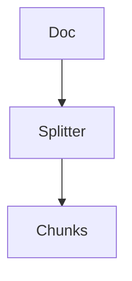
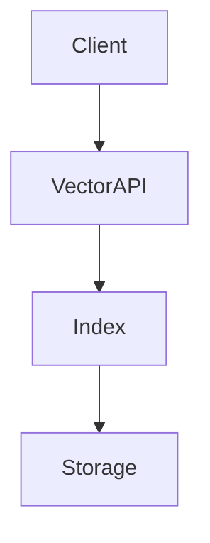

# Part III — RAG Engineering

---

> **Navigation**
> [← Part II — LLM Architectures](part_02_architectures.md) | [→ Part IV — Advanced RAG](part_04_advanced_rag.md)

---

## Contents

- [Chapter 1 — Chunking 🧪](#chapter-1--chunking-)
  - [1.1 Why Chunking Is the Most Critical RAG Decision](#11-why-chunking-is-the-most-critical-rag-decision)
  - [1.2 Fixed-Size Chunking](#12-fixed-size-chunking)
  - [1.3 Recursive Character Chunking](#13-recursive-character-chunking)
  - [1.4 Semantic Chunking](#14-semantic-chunking)
  - [1.5 Document-Structure-Aware Chunking](#15-document-structure-aware-chunking)
  - [1.6 Sliding Window Chunking](#16-sliding-window-chunking)
  - [1.7 Hierarchical Chunking (Parent-Child)](#17-hierarchical-chunking-parent-child)
  - [1.8 Choosing the Right Strategy](#18-choosing-the-right-strategy)
  - [1.9 Chunk Metadata Enrichment](#19-chunk-metadata-enrichment)
  - [🧪 Hands-on Lab: Chunking Strategy Comparison](#-hands-on-lab-chunking-strategy-comparison)
- [Chapter 2 — Embeddings](#chapter-2--embeddings)
  - [2.1 What Embeddings Represent](#21-what-embeddings-represent)
  - [2.2 Embedding Model Selection](#22-embedding-model-selection)
  - [2.3 Generating Embeddings in Production](#23-generating-embeddings-in-production)
  - [2.4 Embedding Dimensions and Trade-offs](#24-embedding-dimensions-and-trade-offs)
  - [2.5 Batch Embedding Pipelines](#25-batch-embedding-pipelines)
  - [2.6 Embedding Evaluation](#26-embedding-evaluation)
- [Chapter 3 — Vector Databases](#chapter-3--vector-databases)
  - [3.1 The Role of Vector Storage in RAG](#31-the-role-of-vector-storage-in-rag)
  - [3.2 ANN Indexing Algorithms](#32-ann-indexing-algorithms)
  - [3.3 Vector Database Comparison](#33-vector-database-comparison)
  - [3.4 Metadata Filtering](#34-metadata-filtering)
  - [3.5 Operational Considerations](#35-operational-considerations)
  - [3.6 Java Integration Patterns](#36-java-integration-patterns)
- [Chapter 4 — Retrieval Strategies 🧪](#chapter-4--retrieval-strategies-)
  - [4.1 Beyond Simple Similarity Search](#41-beyond-simple-similarity-search)
  - [4.2 Top-K Retrieval](#42-top-k-retrieval)
  - [4.3 Threshold-Based Retrieval](#43-threshold-based-retrieval)
  - [4.4 Maximum Marginal Relevance](#44-maximum-marginal-relevance)
  - [4.5 Multi-Query Retrieval](#45-multi-query-retrieval)
  - [4.6 Contextual Compression Retrieval](#46-contextual-compression-retrieval)
  - [4.7 Self-Querying Retrieval](#47-self-querying-retrieval)
  - [🧪 Hands-on Lab: Retrieval Strategy Benchmark](#-hands-on-lab-retrieval-strategy-benchmark)
- [Chapter 5 — Reranking](#chapter-5--reranking)
  - [5.1 Why First-Stage Retrieval Is Not Enough](#51-why-first-stage-retrieval-is-not-enough)
  - [5.2 Cross-Encoder Reranking](#52-cross-encoder-reranking)
  - [5.3 LLM-Based Reranking](#53-llm-based-reranking)
  - [5.4 Reciprocal Rank Fusion](#54-reciprocal-rank-fusion)
  - [5.5 Reranking in Production](#55-reranking-in-production)
- [Chapter 6 — Context Construction](#chapter-6--context-construction)
  - [6.1 From Retrieved Chunks to Model Input](#61-from-retrieved-chunks-to-model-input)
  - [6.2 Context Window Budget Management](#62-context-window-budget-management)
  - [6.3 Context Ordering Strategies](#63-context-ordering-strategies)
  - [6.4 Source Attribution and Citations](#64-source-attribution-and-citations)
  - [6.5 Dynamic Context Assembly](#65-dynamic-context-assembly)

---

## Chapter 1 — Chunking 🧪

### 1.1 Why Chunking Is the Most Critical RAG Decision

Every RAG system stores knowledge as discrete fragments — chunks — indexed in a vector database. The chunking strategy determines the size, boundaries, and structure of these fragments, and it is the single design decision with the greatest downstream impact on system quality.

Chunking affects three fundamental properties of a RAG system:

**Retrieval precision.** Small chunks produce more focused retrievals but may lack the surrounding context needed to answer a question. Large chunks contain more context but reduce the precision of similarity matching — the model must search for the relevant sentence within a large block of text.

**Context quality.** The LLM can only reason over what is placed in its context window. Poorly chunked content — fragments that cut mid-sentence, separate a question from its answer, or break structured tables — directly degrades generation quality.

**Token economics.** Every retrieved chunk consumes context window budget. Unnecessarily large chunks inflate costs and reduce the number of independent sources that can be consulted.

```
Too small (< 128 tokens):
  ✓ High retrieval precision
  ✗ Insufficient context for generation
  ✗ Many chunks needed to cover a document

Too large (> 1024 tokens):
  ✓ Rich context per chunk
  ✗ Low retrieval precision (noisy embeddings)
  ✗ High token cost per retrieval
  ✗ Fills context window with few sources

Sweet spot (256–512 tokens for most domains):
  ✓ Sufficient context for generation
  ✓ Meaningful embeddings
  ✓ Manageable token budget
```

The right chunk size depends heavily on document type, query pattern, and embedding model. There is no universal answer — but there is a systematic way to find it, covered in the hands-on lab at the end of this chapter.

---

### 1.2 Fixed-Size Chunking

Fixed-size chunking splits text into segments of a predetermined token or character count, regardless of content structure. It is the simplest strategy and the appropriate baseline.



**Python — Fixed-size chunking:**
```python
from dataclasses import dataclass
from typing import Iterator

@dataclass
class Chunk:
    content: str
    index: int
    source: str
    char_start: int
    char_end: int

def fixed_size_chunker(
    text: str,
    chunk_size: int = 512,
    overlap: int = 64,
    source: str = ""
) -> list[Chunk]:
    """
    Split text into fixed-size character chunks with overlap.
    overlap preserves cross-boundary context.
    """
    chunks = []
    step = chunk_size - overlap
    for i, start in enumerate(range(0, len(text), step)):
        end = min(start + chunk_size, len(text))
        content = text[start:end].strip()
        if content:
            chunks.append(Chunk(
                content=content,
                index=i,
                source=source,
                char_start=start,
                char_end=end
            ))
        if end == len(text):
            break
    return chunks
```

**Java — Fixed-size chunking with [LangChain4j](https://docs.langchain4j.dev):**
```java
import dev.langchain4j.data.document.Document;
import dev.langchain4j.data.document.splitter.DocumentSplitters;
import dev.langchain4j.data.segment.TextSegment;

List<TextSegment> chunks = DocumentSplitters
    .recursive(512, 64)          // chunkSize=512, overlap=64
    .split(Document.from(text));

chunks.forEach(chunk ->
    System.out.printf("Chunk [%d chars]: %s...%n",
        chunk.text().length(),
        chunk.text().substring(0, Math.min(80, chunk.text().length())))
);
```

**Strengths:** Simple, predictable, fast. Good for homogeneous text corpora (e.g., support tickets, product descriptions).

**Weaknesses:** Ignores document structure. A chunk boundary may fall mid-sentence, mid-table, or mid-code block, destroying semantic coherence.

---

### 1.3 Recursive Character Chunking

Recursive character splitting attempts to split on natural language boundaries in order of preference: paragraph breaks (`\n\n`), line breaks (`\n`), sentence boundaries (`. `), words, characters. It falls back to the next separator only when the current level would produce a chunk that is too large.

This is the default recommendation for general-purpose RAG and the strategy used by [LangChain](https://python.langchain.com)'s `RecursiveCharacterTextSplitter`.

```python
from langchain.text_splitter import RecursiveCharacterTextSplitter
import tiktoken

# Token-accurate splitting (preferred over character-based in production)
def get_token_splitter(
    chunk_size: int = 512,
    overlap: int = 64,
    model: str = "gpt-4o"
) -> RecursiveCharacterTextSplitter:
    encoding = tiktoken.encoding_for_model(model)

    def token_length(text: str) -> int:
        return len(encoding.encode(text))

    return RecursiveCharacterTextSplitter(
        chunk_size=chunk_size,
        chunk_overlap=overlap,
        length_function=token_length,
        separators=["\n\n", "\n", ". ", "! ", "? ", " ", ""]
    )

splitter = get_token_splitter(chunk_size=512, overlap=64)
chunks = splitter.split_text(document_text)
print(f"Produced {len(chunks)} chunks")
```

🔓 **On-premise token counting without OpenAI API:**
```python
from transformers import AutoTokenizer

# Works offline with any HuggingFace model
tokenizer = AutoTokenizer.from_pretrained("sentence-transformers/all-MiniLM-L6-v2")

def token_length_local(text: str) -> int:
    return len(tokenizer.encode(text, add_special_tokens=False))
```

**When to use:** Default strategy for mixed document corpora, wikis, manuals, and web content. Produces consistently coherent fragments with minimal configuration.

---

### 1.4 Semantic Chunking

Semantic chunking groups sentences that are topically related, using embedding similarity to detect topic boundaries. When the cosine similarity between consecutive sentence embeddings drops below a threshold, a new chunk begins.


```python
from sentence_transformers import SentenceTransformer
import numpy as np
from sklearn.metrics.pairwise import cosine_similarity

def semantic_chunker(
    text: str,
    model_name: str = "all-MiniLM-L6-v2",
    similarity_threshold: float = 0.75,
    min_chunk_size: int = 100,
    max_chunk_size: int = 800
) -> list[str]:
    """
    Split text at semantic boundary points where topic shifts occur.
    """
    model = SentenceTransformer(model_name)

    # Split into sentences
    sentences = [s.strip() for s in text.replace('\n', ' ').split('. ') if s.strip()]
    if len(sentences) < 2:
        return [text]

    # Embed all sentences
    embeddings = model.encode(sentences)

    # Detect breakpoints: where similarity between adjacent sentences drops
    breakpoints = []
    for i in range(len(sentences) - 1):
        sim = cosine_similarity([embeddings[i]], [embeddings[i + 1]])[0][0]
        if sim < similarity_threshold:
            breakpoints.append(i + 1)

    # Assemble chunks from breakpoints
    chunks = []
    prev = 0
    for bp in breakpoints:
        chunk = '. '.join(sentences[prev:bp]) + '.'
        if len(chunk) >= min_chunk_size:
            # Merge if chunk is too large
            if len(chunk) > max_chunk_size:
                # Fall back to fixed split within this segment
                chunks.extend(_split_large_segment(chunk, max_chunk_size))
            else:
                chunks.append(chunk)
            prev = bp
    # Final chunk
    final = '. '.join(sentences[prev:])
    if final:
        chunks.append(final)

    return chunks

def _split_large_segment(text: str, max_size: int) -> list[str]:
    """Fallback: split oversized semantic segments at sentence boundaries."""
    result, current = [], ""
    for sentence in text.split('. '):
        if len(current) + len(sentence) > max_size and current:
            result.append(current.strip())
            current = sentence + '. '
        else:
            current += sentence + '. '
    if current.strip():
        result.append(current.strip())
    return result
```

**Strengths:** Produces topically coherent chunks. Particularly effective for long-form documents, academic papers, and technical manuals where topics shift gradually.

**Weaknesses:** Computationally expensive during ingestion (requires embedding every sentence). More complex to tune than fixed-size splitting.

---

### 1.5 Document-Structure-Aware Chunking

Structured documents — Markdown files, HTML pages, PDFs with headers, legal contracts — encode their own natural chunk boundaries in their formatting. Structure-aware chunking respects and exploits this hierarchy.

```python
import re
from dataclasses import dataclass, field
from typing import Optional

@dataclass
class StructuredChunk:
    content: str
    heading: Optional[str]
    level: int  # Heading level: 1=H1, 2=H2, etc.
    source: str
    metadata: dict = field(default_factory=dict)

def markdown_chunker(
    markdown_text: str,
    source: str = "",
    max_chunk_size: int = 600
) -> list[StructuredChunk]:
    """
    Split Markdown by heading hierarchy.
    Each section becomes a chunk, split further if too large.
    """
    chunks = []
    heading_pattern = re.compile(r'^(#{1,6})\s+(.+)$', re.MULTILINE)
    headings = list(heading_pattern.finditer(markdown_text))

    for i, match in enumerate(headings):
        level = len(match.group(1))
        heading = match.group(2).strip()
        start = match.end()
        end = headings[i + 1].start() if i + 1 < len(headings) else len(markdown_text)
        section_text = markdown_text[start:end].strip()

        if not section_text:
            continue

        # Section fits in one chunk
        if len(section_text) <= max_chunk_size:
            chunks.append(StructuredChunk(
                content=f"# {heading}\n\n{section_text}",
                heading=heading,
                level=level,
                source=source,
                metadata={"heading_level": level}
            ))
        else:
            # Split large sections into paragraphs
            paragraphs = [p.strip() for p in section_text.split('\n\n') if p.strip()]
            current, current_len = [], 0
            for para in paragraphs:
                if current_len + len(para) > max_chunk_size and current:
                    chunks.append(StructuredChunk(
                        content=f"# {heading}\n\n" + '\n\n'.join(current),
                        heading=heading,
                        level=level,
                        source=source,
                        metadata={"heading_level": level, "partial": True}
                    ))
                    current, current_len = [para], len(para)
                else:
                    current.append(para)
                    current_len += len(para)
            if current:
                chunks.append(StructuredChunk(
                    content=f"# {heading}\n\n" + '\n\n'.join(current),
                    heading=heading,
                    level=level,
                    source=source,
                    metadata={"heading_level": level}
                ))

    return chunks
```

**When to use:** Internal documentation, wikis, API references, legal documents, and any corpus with consistent heading structure. The heading text preserved in each chunk significantly improves retrieval quality.

---

### 1.6 Sliding Window Chunking

Sliding window chunking creates heavily overlapping chunks to ensure no cross-boundary information is lost. Each chunk overlaps significantly with its neighbors.

```python
def sliding_window_chunker(
    text: str,
    window_size: int = 400,
    stride: int = 100,        # How far to advance per window
    source: str = ""
) -> list[Chunk]:
    """
    Dense overlapping chunks. stride < window_size creates overlap.
    overlap = window_size - stride
    """
    words = text.split()
    chunks = []
    for i, start in enumerate(range(0, len(words), stride)):
        end = min(start + window_size, len(words))
        content = ' '.join(words[start:end])
        if len(content.strip()) > 50:  # Skip near-empty trailing chunks
            chunks.append(Chunk(
                content=content,
                index=i,
                source=source,
                char_start=start,
                char_end=end
            ))
        if end == len(words):
            break
    return chunks
```

**When to use:** Documents where answers frequently span structural boundaries — technical specifications, legal clauses, contracts. High overlap increases retrieval recall at the cost of index size.

**📐 Architecture decision:** Sliding window significantly increases index size (by a factor of `window_size / stride`). For a corpus of 10GB of text with a stride of 100 and window of 400, expect ~4x storage compared to non-overlapping chunking. Only use when cross-boundary retrieval is a demonstrated quality problem.

---

### 1.7 Hierarchical Chunking (Parent-Child)

Hierarchical chunking maintains two levels of granularity: small child chunks for precise retrieval, and larger parent chunks for rich generation context. Retrieval uses child chunks; generation uses the corresponding parent.

```python
from dataclasses import dataclass
from typing import Optional

@dataclass
class HierarchicalChunk:
    chunk_id: str
    parent_id: Optional[str]
    content: str
    level: str  # "parent" | "child"
    source: str

def hierarchical_chunker(
    text: str,
    parent_size: int = 1024,
    child_size: int = 256,
    source: str = ""
) -> tuple[list[HierarchicalChunk], list[HierarchicalChunk]]:
    """
    Returns (parent_chunks, child_chunks).
    Each child references its parent by parent_id.
    Retrieval indexes child embeddings; generation uses parent content.
    """
    parents, children = [], []

    # Create parent chunks
    for pi, p_start in enumerate(range(0, len(text), parent_size)):
        p_text = text[p_start:p_start + parent_size].strip()
        if not p_text:
            continue
        parent_id = f"{source}_p{pi}"
        parents.append(HierarchicalChunk(
            chunk_id=parent_id,
            parent_id=None,
            content=p_text,
            level="parent",
            source=source
        ))
        # Create children within this parent
        for ci, c_start in enumerate(range(0, len(p_text), child_size)):
            c_text = p_text[c_start:c_start + child_size].strip()
            if c_text:
                children.append(HierarchicalChunk(
                    chunk_id=f"{parent_id}_c{ci}",
                    parent_id=parent_id,
                    content=c_text,
                    level="child",
                    source=source
                ))

    return parents, children

# At query time: retrieve children, return parent content
def retrieve_with_parent_expansion(
    query_embedding: list[float],
    child_collection,
    parent_store: dict[str, str],
    top_k: int = 5
) -> list[str]:
    # Search child index
    results = child_collection.query(
        query_embeddings=[query_embedding],
        n_results=top_k
    )
    child_ids = results["ids"][0]
    # Map to parent IDs and return parent content
    seen_parents = set()
    context_chunks = []
    for child_id in child_ids:
        # Extract parent_id from child_id
        parent_id = "_".join(child_id.split("_")[:-1])
        if parent_id not in seen_parents:
            seen_parents.add(parent_id)
            context_chunks.append(parent_store[parent_id])
    return context_chunks
```

**When to use:** Documents with high information density where precision of retrieval (child) and richness of generation context (parent) are both required. Particularly effective for technical manuals and knowledge bases.

---

### 1.8 Choosing the Right Strategy

```
Document type              → Recommended strategy
─────────────────────────────────────────────────
Plain text / blog posts    → Recursive character
Markdown / wikis / docs    → Structure-aware (heading-based)
Legal / contractual text   → Sliding window (high overlap)
Dense technical manuals    → Hierarchical (parent-child)
Q&A pairs / structured KB  → Fixed-size (one Q&A per chunk)
Long scientific papers      → Semantic chunking
```

**Chunk size guidelines by domain:**

| Domain | Recommended chunk size | Reasoning |
|---|---|---|
| Customer support KB | 256–384 tokens | Short, focused answers |
| Legal documents | 512–768 tokens (+ overlap) | Cross-boundary clauses |
| Technical documentation | 384–512 tokens | Code + explanation pairs |
| Financial reports | 512–1024 tokens | Dense numeric context |
| Academic papers | Semantic boundaries | Topic-driven structure |
| Code repositories | Function/class level | Structural unit integrity |

---

### 1.9 Chunk Metadata Enrichment

Raw text alone is insufficient for production RAG. Every chunk should carry metadata that enables filtering, attribution, and debugging.

```python
from datetime import datetime
from dataclasses import dataclass, field
from typing import Optional

@dataclass
class EnrichedChunk:
    content: str
    source: str
    chunk_index: int
    total_chunks: int
    heading: Optional[str]
    document_title: Optional[str]
    document_type: str          # pdf | markdown | html | txt
    created_at: str
    token_count: int
    language: str = "en"
    tags: list[str] = field(default_factory=list)

def enrich_chunk(
    raw_content: str,
    source: str,
    chunk_index: int,
    total_chunks: int,
    metadata: dict
) -> EnrichedChunk:
    import tiktoken
    enc = tiktoken.encoding_for_model("gpt-4o")
    return EnrichedChunk(
        content=raw_content,
        source=source,
        chunk_index=chunk_index,
        total_chunks=total_chunks,
        heading=metadata.get("heading"),
        document_title=metadata.get("title"),
        document_type=metadata.get("type", "txt"),
        created_at=datetime.utcnow().isoformat(),
        token_count=len(enc.encode(raw_content)),
        tags=metadata.get("tags", [])
    )
```

---

### 🧪 Hands-on Lab: Chunking Strategy Comparison

**Objective:** Compare four chunking strategies on the same document corpus. Measure retrieval quality using hit rate and average precision.

**Prerequisites:** Python 3.11+, packages: `langchain`, `sentence-transformers`, `chromadb`, `tiktoken`, `scikit-learn`

**Step 1 — Prepare a sample corpus:**

```python
import chromadb
from sentence_transformers import SentenceTransformer
from langchain.text_splitter import RecursiveCharacterTextSplitter
import tiktoken
import json

SAMPLE_DOCUMENT = """
# Refund Policy

Our standard refund policy allows customers to return products within 30 days
of purchase for a full refund. Items must be in original condition and packaging.
Digital products are non-refundable once downloaded.

## Enterprise Customers

Enterprise customers with active support contracts are eligible for extended
returns of up to 90 days. Refund requests must be submitted through the
enterprise portal with the original purchase order number.

## Processing Time

Standard refunds are processed within 5-7 business days. Enterprise refunds
may take up to 14 business days due to additional verification requirements.
Bank transfer refunds may add 3-5 additional business days depending on
the financial institution.

# Subscription Management

Subscriptions can be cancelled at any time from the account dashboard.
Cancellation takes effect at the end of the current billing period.
No partial refunds are issued for unused subscription time.

## Annual Subscriptions

Annual subscribers who cancel within the first 30 days receive a full refund.
Cancellations after 30 days receive a prorated refund for remaining full months.
"""

# Evaluation dataset: question → relevant section keywords
EVAL_DATASET = [
    {
        "question": "How long do I have to return a product?",
        "relevant_keywords": ["30 days", "return", "refund policy"]
    },
    {
        "question": "What is the refund policy for enterprise customers?",
        "relevant_keywords": ["enterprise", "90 days", "support contracts"]
    },
    {
        "question": "How long does a refund take to process?",
        "relevant_keywords": ["5-7 business days", "processing"]
    },
    {
        "question": "Can I get a refund on an annual subscription?",
        "relevant_keywords": ["annual", "30 days", "prorated"]
    },
    {
        "question": "Are digital products refundable?",
        "relevant_keywords": ["digital products", "non-refundable"]
    },
]
```

**Step 2 — Define chunking strategies:**

```python
import tiktoken

enc = tiktoken.encoding_for_model("gpt-4o")
token_len = lambda t: len(enc.encode(t))

def strategy_fixed(text: str) -> list[str]:
    """Fixed 256-character chunks, no overlap."""
    size = 256
    return [text[i:i+size].strip() for i in range(0, len(text), size) if text[i:i+size].strip()]

def strategy_recursive(text: str) -> list[str]:
    """Recursive character splitter, 256 tokens, 32 overlap."""
    splitter = RecursiveCharacterTextSplitter(
        chunk_size=256, chunk_overlap=32, length_function=token_len,
        separators=["\n\n", "\n", ". ", " ", ""]
    )
    return splitter.split_text(text)

def strategy_structure(text: str) -> list[str]:
    """Split on Markdown headings."""
    import re
    chunks = []
    sections = re.split(r'\n(?=#{1,3} )', text)
    for section in sections:
        if section.strip():
            chunks.append(section.strip())
    return chunks

def strategy_overlap(text: str) -> list[str]:
    """Sliding window: 256 tokens, 128 token stride (50% overlap)."""
    splitter = RecursiveCharacterTextSplitter(
        chunk_size=256, chunk_overlap=128, length_function=token_len
    )
    return splitter.split_text(text)

STRATEGIES = {
    "fixed":      strategy_fixed,
    "recursive":  strategy_recursive,
    "structure":  strategy_structure,
    "overlap":    strategy_overlap,
}
```

**Step 3 — Build a collection per strategy and evaluate:**

```python
embed_model = SentenceTransformer("all-MiniLM-L6-v2")
db_client = chromadb.Client()

def build_collection(name: str, chunks: list[str]):
    try:
        db_client.delete_collection(name)
    except Exception:
        pass
    col = db_client.create_collection(name)
    embeddings = embed_model.encode(chunks).tolist()
    col.add(
        documents=chunks,
        embeddings=embeddings,
        ids=[f"{name}_{i}" for i in range(len(chunks))]
    )
    return col

def evaluate_strategy(collection, eval_dataset: list[dict], top_k: int = 3) -> dict:
    hits = 0
    for item in eval_dataset:
        q_emb = embed_model.encode(item["question"]).tolist()
        results = collection.query(query_embeddings=[q_emb], n_results=top_k)
        retrieved = " ".join(results["documents"][0]).lower()
        # Hit: at least one keyword found in retrieved chunks
        if any(kw.lower() in retrieved for kw in item["relevant_keywords"]):
            hits += 1
    return {
        "hit_rate": hits / len(eval_dataset),
        "hits": hits,
        "total": len(eval_dataset)
    }

# Run comparison
print(f"{'Strategy':<12} {'Chunks':>7} {'Hit Rate':>10}  {'Hits':>6}")
print("-" * 42)
results = {}
for name, strategy_fn in STRATEGIES.items():
    chunks = strategy_fn(SAMPLE_DOCUMENT)
    col = build_collection(f"lab_{name}", chunks)
    metrics = evaluate_strategy(col, EVAL_DATASET)
    results[name] = {"chunks": len(chunks), **metrics}
    print(f"{name:<12} {len(chunks):>7} {metrics['hit_rate']:>10.0%}  {metrics['hits']:>4}/{metrics['total']}")
```

**Expected output (indicative):**
```
Strategy      Chunks   Hit Rate    Hits
──────────────────────────────────────────
fixed              9       60%    3/5
recursive          6       80%    4/5
structure          5      100%    5/5
overlap            9       80%    4/5
```

**Step 4 — Inspect what each strategy produced:**

```python
for name, strategy_fn in STRATEGIES.items():
    chunks = strategy_fn(SAMPLE_DOCUMENT)
    print(f"\n── {name.upper()} ({len(chunks)} chunks) ──")
    for i, c in enumerate(chunks):
        print(f"  [{i}] {len(c):>4} chars | {c[:80].strip()}...")
```

**Step 5 — Extend the lab (optional):**

- Add your own document (a company policy, technical spec, or product manual)
- Add the hierarchical strategy and compare
- Replace `all-MiniLM-L6-v2` with `BAAI/bge-large-en-v1.5` — does hit rate change?
- Vary chunk size (128, 256, 512, 1024) and plot hit rate vs. chunk size

---

> ### 📋 Chapter Summary
>
> - **Chunking is the most impactful RAG design decision**: chunk size and strategy directly determine retrieval precision, generation quality, and token cost.
> - **Fixed-size** chunking is the simplest baseline; **recursive character** splitting is the general-purpose default.
> - **Semantic chunking** respects topic boundaries but is computationally expensive; best for long-form documents.
> - **Structure-aware chunking** is the highest-quality strategy for well-formatted documents (Markdown, HTML, manuals).
> - **Hierarchical (parent-child)** chunking decouples retrieval precision from generation context richness.
> - Every chunk should carry enriched metadata (source, heading, token count, creation date) to enable filtering and attribution.

---

> ### ❓ Comprehension Questions
>
> 1. A RAG system built on a 10,000-article knowledge base shows high retrieval recall but poor generation quality — the LLM receives the right sections but produces vague answers. What chunking-related factors might explain this, and what strategy changes would you evaluate?
> 2. An enterprise deploys a RAG system over legal contracts. Lawyers report that retrieved chunks frequently cut in the middle of a clause. Which chunking strategies would best address this, and what are the trade-offs of each?
> 3. Explain the parent-child chunking pattern. What problem does it solve that standard recursive chunking cannot?
> 4. Your ingestion pipeline processes 50,000 PDF documents nightly. Semantic chunking takes 8 hours; recursive character splitting takes 45 minutes. At what quality difference would you justify the computational cost of semantic chunking?
> 5. A chunk contains the heading text from its parent section prepended to the body content. Why does this improve retrieval quality, and what metadata field would you use to store the heading separately?

---

## References

### Papers
- [Dense Passage Retrieval for Open-Domain Question Answering](https://arxiv.org/abs/2004.04906) — Karpukhin et al., 2020. Foundational paper on dense retrieval; chunk quality directly impacts DPR performance.
- [RAGAS: Automated Evaluation of Retrieval Augmented Generation](https://arxiv.org/abs/2309.15217) — Es et al., 2023. Framework for measuring chunking and retrieval quality.
- [Improving Document Retrieval via Contextual Chunk Headers](https://arxiv.org/abs/2312.11702) — Anthropic, 2023. Evidence for heading-enriched chunks.

### Documentation
- [LangChain Text Splitters](https://python.langchain.com/docs/concepts/text_splitters/) — Comprehensive guide to chunking strategies in Python.
- [LangChain4j Document Splitters](https://docs.langchain4j.dev/tutorials/rag#document-splitter) — Java chunking reference.
- [LlamaIndex Node Parsers](https://docs.llamaindex.ai/en/stable/module_guides/loading/node_parsers/) — Alternative chunking implementations.
- [tiktoken](https://github.com/openai/tiktoken) — Token counting library for accurate chunk sizing.
- [Sentence Transformers](https://www.sbert.net) — Open-source embedding models for semantic chunking.

### Articles
- [Evaluating RAG: How to Measure Chunk Quality](https://www.pinecone.io/learn/chunking-strategies/) — Pinecone, 2024. Practical chunking strategy guide with benchmarks.
- [Five Levels of Text Splitting](https://github.com/FullStackRetrieval-com/RetrievalTutorials) — Greg Kamradt, 2023. In-depth chunking comparison with evaluation.

---

## Chapter 2 — Embeddings

### 2.1 What Embeddings Represent

An embedding is a dense vector representation of text that encodes semantic meaning. Two texts with similar meaning will have embeddings close together in vector space, regardless of exact wording. This property is what enables semantic search.

```
"What is the refund policy?"   → [0.023, -0.187, 0.441, ...]
"How do I return a product?"   → [0.031, -0.201, 0.433, ...]
"Company financial results Q3" → [-0.312, 0.089, -0.123, ...]
```

The first two queries are semantically similar (high cosine similarity). The third is unrelated (low cosine similarity). A vector search will correctly retrieve chunks about refunds for both of the first queries, even though the words differ.

Understanding embeddings is critical not just for using them, but for diagnosing retrieval failures. Poor retrieval often traces to embedding model mismatch — using a general-purpose model for a specialised domain, or using different models for ingestion and query time.

---

### 2.2 Embedding Model Selection

The choice of embedding model is the second most important decision in a RAG system (after chunking). The [MTEB (Massive Text Embedding Benchmark)](https://arxiv.org/abs/2210.07316) leaderboard at [Hugging Face](https://huggingface.co/spaces/mteb/leaderboard) provides standardised retrieval quality scores across models.

| Model | Dimensions | Max tokens | Speed | Cost | Best for |
|---|---|---|---|---|---|
| `text-embedding-3-small` | 1536 | 8191 | Fast | $0.02/1M tokens | General English, cost-optimised |
| `text-embedding-3-large` | 3072 | 8191 | Medium | $0.13/1M tokens | High-accuracy English |
| `BAAI/bge-large-en-v1.5` 🔓 | 1024 | 512 | Medium | Free | On-premise English |
| `BAAI/bge-m3` 🔓 | 1024 | 8192 | Slow | Free | Multilingual, long context |
| `nomic-embed-text-v1.5` 🔓 | 768 | 8192 | Fast | Free | Long-context on-premise |
| `all-MiniLM-L6-v2` 🔓 | 384 | 256 | Very fast | Free | Development and prototyping |
| `Cohere embed-v3` | 1024 | 512 | Fast | Pay-per-use | Multilingual, Cohere stack |

**📐 Architecture decision:** Never mix embedding models between ingestion and query time. All documents in an index must be embedded with the same model. If you upgrade the model, the entire index must be rebuilt.

---

### 2.3 Generating Embeddings in Production

**Python — Production embedding service:**
```python
import time
import logging
from openai import OpenAI
from sentence_transformers import SentenceTransformer
from typing import Literal

logger = logging.getLogger(__name__)

class EmbeddingService:
    """
    Unified embedding service supporting both cloud and local models.
    Includes batching, retry logic, and rate limit handling.
    """
    def __init__(
        self,
        provider: Literal["openai", "local"] = "openai",
        model: str = "text-embedding-3-small",
        batch_size: int = 100,
        max_retries: int = 3
    ):
        self.provider = provider
        self.model = model
        self.batch_size = batch_size
        self.max_retries = max_retries

        if provider == "openai":
            self.client = OpenAI()
        else:
            logger.info(f"Loading local model: {model}")
            self.local_model = SentenceTransformer(model)

    def embed(self, texts: list[str]) -> list[list[float]]:
        """Embed a list of texts with automatic batching."""
        all_embeddings = []
        for batch_start in range(0, len(texts), self.batch_size):
            batch = texts[batch_start:batch_start + self.batch_size]
            embeddings = self._embed_batch_with_retry(batch)
            all_embeddings.extend(embeddings)
        return all_embeddings

    def _embed_batch_with_retry(self, batch: list[str]) -> list[list[float]]:
        for attempt in range(self.max_retries):
            try:
                if self.provider == "openai":
                    response = self.client.embeddings.create(
                        input=batch,
                        model=self.model
                    )
                    return [item.embedding for item in response.data]
                else:
                    return self.local_model.encode(
                        batch,
                        batch_size=32,
                        normalize_embeddings=True
                    ).tolist()
            except Exception as e:
                if attempt == self.max_retries - 1:
                    raise
                wait = 2 ** attempt  # Exponential backoff
                logger.warning(f"Embedding attempt {attempt+1} failed: {e}. Retrying in {wait}s")
                time.sleep(wait)
        return []

    def embed_single(self, text: str) -> list[float]:
        return self.embed([text])[0]
```

**Java — Embedding generation with [LangChain4j](https://docs.langchain4j.dev):**
```java
import dev.langchain4j.model.embedding.EmbeddingModel;
import dev.langchain4j.model.openai.OpenAiEmbeddingModel;
import dev.langchain4j.model.output.Response;
import dev.langchain4j.data.embedding.Embedding;

// Cloud: OpenAI
EmbeddingModel openAiModel = OpenAiEmbeddingModel.builder()
    .apiKey(System.getenv("OPENAI_API_KEY"))
    .modelName("text-embedding-3-small")
    .build();

// 🔓 On-premise: Ollama (nomic-embed-text running locally)
EmbeddingModel localModel = OllamaEmbeddingModel.builder()
    .baseUrl("http://localhost:11434")
    .modelName("nomic-embed-text")
    .build();

// Generate embedding
Response<Embedding> response = openAiModel.embed("What is the refund policy?");
float[] vector = response.content().vector();
System.out.println("Embedding dimensions: " + vector.length);
```

---

### 2.4 Embedding Dimensions and Trade-offs

Embedding dimensionality affects three system properties:

**Storage cost.** A 1536-dimension float32 embedding occupies 6.1KB. For 1 million chunks, that is 6.1GB of embedding storage — before the index overhead.

**Query latency.** Higher-dimensional vectors require more compute for similarity calculations. At scale, this becomes a latency concern.

**Quality.** Higher dimensions generally capture more semantic nuance, but with diminishing returns. `text-embedding-3-small` (1536d) achieves 90%+ of the quality of `text-embedding-3-large` (3072d) at 10% of the cost.

**Dimensionality reduction:** OpenAI's third-generation embedding models support Matryoshka Representation Learning (MRL), allowing truncation to lower dimensions with controlled quality loss:

```python
# Truncate to 256 dimensions — 6x storage reduction
response = client.embeddings.create(
    input=["text to embed"],
    model="text-embedding-3-small",
    dimensions=256  # Matryoshka truncation
)
```

---

### 2.5 Batch Embedding Pipelines

Production ingestion pipelines must process large corpora efficiently. Key optimisations:

```python
import asyncio
from openai import AsyncOpenAI

async def embed_corpus_async(
    texts: list[str],
    model: str = "text-embedding-3-small",
    batch_size: int = 100,
    max_concurrent: int = 5
) -> list[list[float]]:
    """
    Async batch embedding with concurrency control.
    Respects OpenAI rate limits while maximising throughput.
    """
    client = AsyncOpenAI()
    semaphore = asyncio.Semaphore(max_concurrent)
    all_embeddings = [None] * len(texts)

    async def embed_batch(batch: list[str], indices: list[int]):
        async with semaphore:
            response = await client.embeddings.create(
                input=batch,
                model=model
            )
            for i, item in zip(indices, response.data):
                all_embeddings[i] = item.embedding

    tasks = []
    for start in range(0, len(texts), batch_size):
        batch = texts[start:start + batch_size]
        indices = list(range(start, start + len(batch)))
        tasks.append(embed_batch(batch, indices))

    await asyncio.gather(*tasks)
    return all_embeddings
```

---

### 2.6 Embedding Evaluation

Embeddings should be evaluated on the specific domain and query patterns of your application, not just on general benchmarks.

```python
from sklearn.metrics.pairwise import cosine_similarity
import numpy as np

def evaluate_embedding_model(
    model_name: str,
    query_doc_pairs: list[tuple[str, str, float]],  # (query, doc, relevance_score)
    threshold: float = 0.7
) -> dict:
    """
    Evaluate an embedding model on domain-specific query-document pairs.
    relevance_score: 1.0 = highly relevant, 0.0 = irrelevant.
    """
    from sentence_transformers import SentenceTransformer
    model = SentenceTransformer(model_name)

    predicted_similarities = []
    true_relevances = []

    for query, doc, relevance in query_doc_pairs:
        q_emb = model.encode(query)
        d_emb = model.encode(doc)
        sim = cosine_similarity([q_emb], [d_emb])[0][0]
        predicted_similarities.append(sim)
        true_relevances.append(relevance)

    # Spearman correlation between predicted similarity and human relevance
    from scipy.stats import spearmanr
    correlation, p_value = spearmanr(predicted_similarities, true_relevances)

    return {
        "model": model_name,
        "spearman_correlation": round(correlation, 4),
        "p_value": round(p_value, 4),
        "mean_similarity_relevant": np.mean([
            s for s, r in zip(predicted_similarities, true_relevances) if r > 0.7
        ]),
        "mean_similarity_irrelevant": np.mean([
            s for s, r in zip(predicted_similarities, true_relevances) if r < 0.3
        ])
    }
```

---

> ### 📋 Chapter Summary
>
> - Embeddings encode semantic meaning as dense vectors; similarity in vector space corresponds to semantic relatedness.
> - The embedding model must be **identical** at ingestion time and query time.
> - Model selection involves explicit trade-offs between quality, dimensionality, cost, and on-premise viability.
> - The [MTEB leaderboard](https://huggingface.co/spaces/mteb/leaderboard) is the standard reference for comparing embedding models on retrieval tasks.
> - Production embedding pipelines require batching, retry logic, and async concurrency to handle large corpora efficiently.
> - Embedding quality should be validated on **domain-specific** query-document pairs, not only on general benchmarks.

---

> ### ❓ Comprehension Questions
>
> 1. A team rebuilds their knowledge base with a higher-quality embedding model. They update the query pipeline to use the new model but keep the existing index. What will happen and why?
> 2. Your corpus contains 2 million chunks. You are comparing `text-embedding-3-small` (1536d) and `all-MiniLM-L6-v2` (384d). Calculate the storage difference and explain when the smaller model would be the better architectural choice.
> 3. Explain Matryoshka Representation Learning. What is the engineering benefit of supporting truncatable embeddings?
> 4. An embedding model achieves state-of-the-art MTEB scores but performs poorly on your enterprise support knowledge base. What is the likely cause and how would you address it?
> 5. Design an A/B test to compare two embedding models in a production RAG system without taking the system offline.

---

## References

### Papers
- [MTEB: Massive Text Embedding Benchmark](https://arxiv.org/abs/2210.07316) — Muennighoff et al., 2022. Standard benchmark for embedding model evaluation.
- [BGE M3-Embedding: Multi-Lingual, Multi-Functionality, Multi-Granularity Text Embeddings](https://arxiv.org/abs/2402.03216) — Chen et al., 2024.
- [Matryoshka Representation Learning](https://arxiv.org/abs/2205.13147) — Kusupati et al., 2022. Flexible-dimension embeddings.
- [E5: Text Embeddings by Weakly-Supervised Contrastive Pre-training](https://arxiv.org/abs/2212.03533) — Wang et al., 2022.

### Documentation
- [OpenAI Embeddings Guide](https://platform.openai.com/docs/guides/embeddings) — Official embeddings API documentation and best practices.
- [Sentence Transformers Documentation](https://www.sbert.net) — Open-source embedding models and evaluation.
- [MTEB Leaderboard](https://huggingface.co/spaces/mteb/leaderboard) — Up-to-date embedding model comparison.
- [LangChain4j Embedding Models](https://docs.langchain4j.dev/integrations/embedding-models/) — Java embedding model integrations.
- [Cohere Embeddings Documentation](https://docs.cohere.com/docs/embeddings) — Multilingual embedding API.

---

## Chapter 3 — Vector Databases

### 3.1 The Role of Vector Storage in RAG

A vector database is specialised storage infrastructure designed to index high-dimensional vectors and serve approximate nearest-neighbour (ANN) queries efficiently. In a RAG system it fulfils three responsibilities:

**Index storage:** Persisting chunk embeddings and their associated metadata.

**Similarity search:** Finding the top-K vectors closest to a query vector in sub-linear time, using ANN algorithms.

**Metadata filtering:** Combining vector similarity with structured attribute filters (e.g., `source = "HR_Policy_2024.pdf"`) to constrain retrieval scope.



Vector databases are distinct from traditional databases in one fundamental way: queries are not exact matches (`WHERE id = 42`) but approximate similarity searches (`NEAREST TO [0.023, -0.187, ...]`). This probabilistic nature — trading exactness for speed — is a deliberate design choice that must be understood by architects making infrastructure decisions.

---

### 3.2 ANN Indexing Algorithms

The performance characteristics of a vector database are largely determined by its indexing algorithm. Understanding the trade-offs enables informed infrastructure decisions.

**HNSW (Hierarchical Navigable Small World)**

The dominant algorithm in most modern vector databases. Builds a multilayer graph where nodes at higher layers provide fast long-range navigation and lower layers provide precise local search.

```
Properties:
  ✓ High query throughput
  ✓ Excellent recall/speed trade-off
  ✓ Supports incremental updates
  ✗ High memory usage (graph structure in RAM)
  ✗ Index construction slower than IVF
Used by: Weaviate, Qdrant, Chroma, Milvus (default)
```

**IVF (Inverted File Index)**

Partitions the vector space into clusters (Voronoi cells). Queries search only nearby clusters rather than the full index.

```
Properties:
  ✓ Lower memory footprint than HNSW
  ✓ Scales to billions of vectors with quantisation
  ✗ Requires full index rebuild to add vectors
  ✗ Lower recall than HNSW at equivalent speed
Used by: FAISS, Milvus (IVF variant)
```

**Key index parameters (HNSW):**

| Parameter | Effect | Default |
|---|---|---|
| `M` (connections per node) | Higher → better recall, more memory | 16 |
| `ef_construction` | Higher → better index quality, slower build | 100 |
| `ef` (query time) | Higher → better recall, slower query | 64 |

---

### 3.3 Vector Database Comparison

| Database | Deployment | Index | Filtering | Highlights |
|---|---|---|---|---|
| [Pinecone](https://docs.pinecone.io) | Cloud only | HNSW + proprietary | ✓ | Fully managed, serverless option |
| [Weaviate](https://weaviate.io/docs) | Cloud + self-hosted | HNSW | ✓ (GraphQL) | GraphQL API, built-in modules |
| [Qdrant](https://qdrant.tech/documentation) | Cloud + self-hosted | HNSW | ✓ | Rust-based, payload filters, high performance |
| [Milvus](https://milvus.io/docs) | Self-hosted | HNSW + IVF | ✓ | Billion-scale, GPU acceleration |
| [Chroma](https://docs.trychroma.com) | Embedded + hosted | HNSW ([FAISS](https://faiss.ai)) | ✓ | Simple API, ideal for development |
| [FAISS](https://faiss.ai) | Library (embedded) | IVF + HNSW | ✗ | Meta's library; no persistence layer |
| Azure AI Search | Cloud (Azure) | Proprietary | ✓ | Native Azure integration, hybrid search |

**Selection framework:**

```
Development / prototyping    → Chroma (zero infrastructure)
Enterprise cloud             → Pinecone or Qdrant Cloud
Enterprise self-hosted       → Qdrant or Weaviate
Billion-scale on-premise     → Milvus
Java Spring ecosystem        → Qdrant or Weaviate (REST APIs)
Azure-native                 → Azure AI Search
```

---

### 3.4 Metadata Filtering

Hybrid queries — combining vector similarity with attribute filters — are essential in enterprise RAG systems where knowledge is segmented by department, document type, or date.

**Python — Metadata-filtered retrieval with [Qdrant](https://qdrant.tech/documentation):**
```python
from qdrant_client import QdrantClient
from qdrant_client.models import (
    Distance, VectorParams, PointStruct,
    Filter, FieldCondition, MatchValue, Range
)

client = QdrantClient(host="localhost", port=6333)

# Create collection
client.create_collection(
    collection_name="enterprise_docs",
    vectors_config=VectorParams(size=1536, distance=Distance.COSINE)
)

# Index chunks with metadata
points = [
    PointStruct(
        id=i,
        vector=embedding,
        payload={
            "content": chunk.content,
            "source": chunk.source,
            "department": "HR",
            "year": 2024,
            "doc_type": "policy"
        }
    )
    for i, (chunk, embedding) in enumerate(zip(chunks, embeddings))
]
client.upsert(collection_name="enterprise_docs", points=points)

# Query with filters
def search_with_filter(
    query_vector: list[float],
    department: str,
    min_year: int = 2023,
    top_k: int = 5
) -> list[dict]:
    results = client.search(
        collection_name="enterprise_docs",
        query_vector=query_vector,
        query_filter=Filter(
            must=[
                FieldCondition(key="department", match=MatchValue(value=department)),
                FieldCondition(key="year", range=Range(gte=min_year))
            ]
        ),
        limit=top_k
    )
    return [
        {"content": r.payload["content"], "score": r.score, "source": r.payload["source"]}
        for r in results
    ]
```

**Python — Metadata filtering with [Chroma](https://docs.trychroma.com) (development):**
```python
import chromadb

client = chromadb.PersistentClient(path="./chroma_db")
collection = client.get_or_create_collection("enterprise_docs")

# Query with metadata filter
results = collection.query(
    query_embeddings=[query_embedding],
    n_results=5,
    where={
        "$and": [
            {"department": {"$eq": "HR"}},
            {"year": {"$gte": 2023}}
        ]
    }
)
```

---

### 3.5 Operational Considerations

**Index persistence and backups:** HNSW indexes are stored in memory during operation. Ensure your deployment persists the index to disk and includes backup procedures, especially for [Qdrant](https://qdrant.tech/documentation) and [Weaviate](https://weaviate.io/docs) self-hosted deployments.

**Index rebuilding:** When embedding model or chunk strategy changes, the entire index must be rebuilt. Plan zero-downtime rebuilds using a blue-green index pattern: build the new index in parallel, then switch traffic.

**Scalability patterns:**

```python
# Blue-green index rotation
class VectorIndexManager:
    def __init__(self, client: QdrantClient):
        self.client = client
        self.active_collection = "docs_v1"

    def rebuild_index(self, new_collection: str, chunks_and_embeddings):
        """Build new index while old one serves traffic."""
        # 1. Build new collection
        self.client.create_collection(
            collection_name=new_collection,
            vectors_config=VectorParams(size=1536, distance=Distance.COSINE)
        )
        # 2. Populate in batches
        batch_size = 1000
        for i in range(0, len(chunks_and_embeddings), batch_size):
            batch = chunks_and_embeddings[i:i+batch_size]
            self.client.upsert(new_collection, points=batch)

        # 3. Atomic switch (in practice: update config/env var, no downtime)
        old = self.active_collection
        self.active_collection = new_collection
        # 4. Clean up old collection after validation
        self.client.delete_collection(old)
```

---

### 3.6 Java Integration Patterns

**Java — [Weaviate](https://weaviate.io/docs) client:**
```java
import io.weaviate.client.WeaviateClient;
import io.weaviate.client.Config;
import io.weaviate.client.v1.graphql.query.argument.NearVectorArgument;
import io.weaviate.client.v1.graphql.query.fields.Field;

WeaviateClient client = new WeaviateClient(
    new Config("http", "localhost:8080")
);

// Query by vector similarity
Float[] queryVector = /* embedding vector */;

var result = client.graphQL().get()
    .withClassName("Document")
    .withFields(
        Field.builder().name("content").build(),
        Field.builder().name("source").build(),
        Field.builder().name("_additional")
            .withFields(Field.builder().name("certainty").build())
            .build()
    )
    .withNearVector(NearVectorArgument.builder()
        .vector(queryVector)
        .certainty(0.7f)
        .build())
    .withLimit(5)
    .run();
```

**Java — [Qdrant](https://qdrant.tech/documentation) REST client (Spring WebClient):**
```java
import org.springframework.web.reactive.function.client.WebClient;
import java.util.Map;
import java.util.List;

@Service
public class VectorSearchService {
    private final WebClient qdrantClient;

    public VectorSearchService() {
        this.qdrantClient = WebClient.builder()
            .baseUrl("http://localhost:6333")
            .build();
    }

    public List<Map<String, Object>> search(
        float[] queryVector,
        String department,
        int topK
    ) {
        Map<String, Object> body = Map.of(
            "vector", queryVector,
            "filter", Map.of(
                "must", List.of(
                    Map.of("key", "department",
                           "match", Map.of("value", department))
                )
            ),
            "limit", topK,
            "with_payload", true
        );

        return qdrantClient.post()
            .uri("/collections/enterprise_docs/points/search")
            .bodyValue(body)
            .retrieve()
            .bodyToMono(Map.class)
            .map(r -> (List<Map<String, Object>>) r.get("result"))
            .block();
    }
}
```

---

> ### 📋 Chapter Summary
>
> - Vector databases provide ANN search over high-dimensional embeddings. The primary algorithms are **HNSW** (best recall/speed trade-off, high memory) and **IVF** (lower memory, batch-oriented).
> - **Metadata filtering** is essential in enterprise RAG for scoping retrieval to relevant document subsets.
> - Database selection follows a clear framework: [Chroma](https://docs.trychroma.com) for development, [Qdrant](https://qdrant.tech/documentation) or [Weaviate](https://weaviate.io/docs) for self-hosted enterprise, [Milvus](https://milvus.io/docs) for billion-scale.
> - **Index rebuilding** must be planned with zero-downtime strategies (blue-green) when changing embedding models or chunk strategies.

---

> ### ❓ Comprehension Questions
>
> 1. A RAG system uses HNSW indexing and achieves 95% recall at 50ms p99 latency. The team increases `M` from 16 to 64. What are the effects on recall, latency, and memory usage?
> 2. An enterprise knowledge base contains documents from 12 departments. Users should only retrieve documents from their own department. Describe the metadata schema and query architecture that enforces this.
> 3. The embedding model is being upgraded from `text-embedding-3-small` to `text-embedding-3-large`. Design a zero-downtime index migration strategy.
> 4. Compare [FAISS](https://faiss.ai) and [Qdrant](https://qdrant.tech/documentation) for a production RAG use case with 5 million documents, metadata filtering requirements, and a team of 3 engineers. Which would you choose and why?
> 5. A vector database query returns the correct top-5 results 95% of the time. The remaining 5% are false negatives (relevant chunks missed). What index parameters would you tune to improve recall, and what is the cost?

---

## References

### Papers
- [Efficient and Robust Approximate Nearest Neighbor Search Using HNSW](https://arxiv.org/abs/1603.09320) — Malkov & Yashunin, 2016. The foundational HNSW paper.
- [Billion-scale similarity search with GPUs](https://arxiv.org/abs/1702.08734) — Johnson et al. (Meta), 2017. FAISS and IVF at scale.
- [ANN Benchmarks](https://ann-benchmarks.com) — Aumuller et al. Comprehensive ANN algorithm comparison.

### Documentation
- [Weaviate Documentation](https://weaviate.io/docs) — Vector database with GraphQL interface.
- [Qdrant Documentation](https://qdrant.tech/documentation) — High-performance Rust-based vector database.
- [Milvus Documentation](https://milvus.io/docs) — Billion-scale vector database.
- [Chroma Documentation](https://docs.trychroma.com) — Embedded vector database for development.
- [FAISS Documentation](https://faiss.ai) — Meta's vector similarity search library.
- [Pinecone Documentation](https://docs.pinecone.io) — Managed vector database service.
- [LangChain4j Vector Stores](https://docs.langchain4j.dev/integrations/embedding-stores/) — Java vector store integrations.

---

## Chapter 4 — Retrieval Strategies 🧪

### 4.1 Beyond Simple Similarity Search

The baseline retrieval strategy — embed the query, find the top-K closest vectors — is the correct starting point. It is simple, fast, and effective for well-formed queries against well-chunked corpora. But production systems encounter conditions that strain this baseline:

**Ambiguous queries.** "Tell me about the plan" — plan could refer to a subscription tier, a project roadmap, or a compliance plan.

**Multi-part questions.** "What is the refund policy for enterprise customers and how does it compare to the standard tier?" — requires two distinct retrievals.

**Vocabulary mismatch.** A user asks about "termination of contract"; the knowledge base uses "contract cancellation". Embedding similarity may not bridge this gap sufficiently.

**Diversity requirements.** Top-K retrieval by similarity tends to return semantically redundant chunks. The model receives five versions of the same information rather than five distinct perspectives.

Each of the strategies in this chapter addresses one or more of these conditions. As with chunking, the right strategy depends on your query distribution and corpus structure — and should be validated with explicit metrics.

---

### 4.2 Top-K Retrieval

The standard retrieval strategy. Returns the K chunks with highest cosine similarity to the query embedding.

```python
class VectorRetriever:
    def __init__(self, collection, embedding_service: "EmbeddingService", top_k: int = 5):
        self.collection = collection
        self.embedding_service = embedding_service
        self.top_k = top_k

    def retrieve(self, query: str) -> list[dict]:
        query_embedding = self.embedding_service.embed_single(query)
        results = self.collection.query(
            query_embeddings=[query_embedding],
            n_results=self.top_k,
            include=["documents", "metadatas", "distances"]
        )
        return [
            {
                "content": doc,
                "metadata": meta,
                "similarity": 1 - dist  # Convert distance to similarity
            }
            for doc, meta, dist in zip(
                results["documents"][0],
                results["metadatas"][0],
                results["distances"][0]
            )
        ]
```

**Choosing K:** K is a balance between recall and context budget. A reasonable default is K=5 for 512-token chunks with a 16K context window. Measure [Recall@K](https://arxiv.org/abs/2309.15217) on your evaluation set to find the minimum K that captures the ground truth answer.

---

### 4.3 Threshold-Based Retrieval

Instead of always returning exactly K results, threshold-based retrieval returns only chunks above a minimum similarity score. This prevents the model from receiving low-quality, weakly relevant context.

```python
def threshold_retrieval(
    query: str,
    collection,
    embedding_service: "EmbeddingService",
    min_similarity: float = 0.75,
    max_results: int = 8
) -> list[dict]:
    query_embedding = embedding_service.embed_single(query)
    # Retrieve more than needed, then filter
    results = collection.query(
        query_embeddings=[query_embedding],
        n_results=max_results,
        include=["documents", "metadatas", "distances"]
    )
    filtered = [
        {"content": doc, "metadata": meta, "similarity": 1 - dist}
        for doc, meta, dist in zip(
            results["documents"][0],
            results["metadatas"][0],
            results["distances"][0]
        )
        if (1 - dist) >= min_similarity
    ]
    return filtered
```

**📐 Architecture decision:** Threshold retrieval can return zero results for out-of-domain queries, which is the correct behaviour — the model should not attempt to answer from irrelevant context. Implement a fallback response ("I cannot find relevant information in the knowledge base") rather than generating an answer from low-quality context.

---

### 4.4 Maximum Marginal Relevance

Maximum Marginal Relevance (MMR) balances relevance with diversity. It iteratively selects chunks that are relevant to the query but dissimilar to already-selected chunks, reducing redundancy.

```python
import numpy as np
from sklearn.metrics.pairwise import cosine_similarity

def mmr_retrieval(
    query_embedding: list[float],
    candidate_embeddings: list[list[float]],
    candidate_texts: list[str],
    top_k: int = 5,
    lambda_param: float = 0.5  # 0=max diversity, 1=max relevance
) -> list[str]:
    """
    MMR iteratively selects the next chunk that maximises:
    lambda * similarity(chunk, query) - (1-lambda) * max_similarity(chunk, selected)
    """
    if not candidate_embeddings:
        return []

    query_arr = np.array(query_embedding).reshape(1, -1)
    cand_arr = np.array(candidate_embeddings)

    # Relevance scores: similarity to query
    relevance = cosine_similarity(query_arr, cand_arr)[0]

    selected_indices = []
    remaining = list(range(len(candidate_texts)))

    for _ in range(min(top_k, len(candidate_texts))):
        if not selected_indices:
            # First: select most relevant
            best = remaining[np.argmax([relevance[i] for i in remaining])]
        else:
            # MMR score for each remaining candidate
            selected_arr = cand_arr[selected_indices]
            scores = []
            for idx in remaining:
                rel = relevance[idx]
                redundancy = cosine_similarity(
                    cand_arr[idx].reshape(1, -1), selected_arr
                ).max()
                scores.append(lambda_param * rel - (1 - lambda_param) * redundancy)
            best = remaining[np.argmax(scores)]

        selected_indices.append(best)
        remaining.remove(best)

    return [candidate_texts[i] for i in selected_indices]
```

**When to use MMR:** When evaluation shows top-K retrieval returns multiple near-duplicate chunks (common with overlapping chunking or highly repetitive corpora). Lambda=0.7 is a reasonable starting point — prioritises relevance while penalising redundancy.

---

### 4.5 Multi-Query Retrieval

Multi-query retrieval generates multiple paraphrases of the original query, retrieves independently for each, and merges the results. This addresses vocabulary mismatch and query ambiguity.

```python
from openai import OpenAI
import json

client = OpenAI()

def generate_query_variants(query: str, n_variants: int = 3) -> list[str]:
    """
    Generate semantically equivalent query paraphrases
    to improve retrieval recall.
    """
    response = client.chat.completions.create(
        model="gpt-4o-mini",
        messages=[
            {
                "role": "system",
                "content": f"""Generate {n_variants} different phrasings of the given question.
Each phrasing should retrieve different but relevant documents.
Respond with a JSON array of strings only."""
            },
            {"role": "user", "content": query}
        ],
        response_format={"type": "json_object"},
        temperature=0.7
    )
    data = json.loads(response.choices[0].message.content)
    # Handle both {"queries": [...]} and direct array
    if isinstance(data, dict):
        return list(data.values())[0]
    return data

def multi_query_retrieval(
    query: str,
    retriever: "VectorRetriever",
    n_variants: int = 3,
    top_k_per_query: int = 3
) -> list[dict]:
    """
    Retrieve for original query + N variants, deduplicate by content.
    """
    all_queries = [query] + generate_query_variants(query, n_variants)
    seen_contents = set()
    results = []

    for q in all_queries:
        for chunk in retriever.retrieve_top_k(q, k=top_k_per_query):
            # Deduplicate by content fingerprint
            fingerprint = chunk["content"][:100]
            if fingerprint not in seen_contents:
                seen_contents.add(fingerprint)
                results.append(chunk)

    # Re-rank merged results by similarity to original query
    results.sort(key=lambda x: x.get("similarity", 0), reverse=True)
    return results[:top_k_per_query * 2]
```

**Java — Multi-query retrieval with [LangChain4j](https://docs.langchain4j.dev):**
```java
interface QueryExpander {
    @dev.langchain4j.service.SystemMessage("""
        Generate 3 different phrasings of the given question.
        Return as JSON array. Example: ["phrasing 1", "phrasing 2", "phrasing 3"]
        """)
    String expand(String originalQuery);
}

List<String> allResults = new ArrayList<>();
String variantsJson = queryExpander.expand(userQuery);
List<String> variants = objectMapper.readValue(variantsJson, List.class);

// Retrieve for each variant and deduplicate
Set<String> seen = new HashSet<>();
for (String variant : variants) {
    List<Content> contents = contentRetriever.retrieve(
        new Query(variant, Metadata.from(userMessage, ChatMemory.SYSTEM_TOKEN))
    );
    contents.stream()
        .filter(c -> seen.add(c.textSegment().text().substring(0, 80)))
        .forEach(c -> allResults.add(c.textSegment().text()));
}
```

---

### 4.6 Contextual Compression Retrieval

Full retrieved chunks frequently contain content that is irrelevant to the specific question. Contextual compression passes each retrieved chunk through an LLM to extract only the relevant portion, reducing context noise.

```python
def contextual_compression(
    query: str,
    chunks: list[str],
    model: str = "gpt-4o-mini"
) -> list[str]:
    """
    Extract question-relevant content from each retrieved chunk.
    Returns empty string if chunk is irrelevant.
    """
    compressed = []
    for chunk in chunks:
        response = client.chat.completions.create(
            model=model,
            messages=[
                {
                    "role": "system",
                    "content": """Extract only the content relevant to the question.
If the chunk contains no relevant information, respond with exactly: IRRELEVANT
Do not add explanation. Return only the relevant excerpt."""
                },
                {
                    "role": "user",
                    "content": f"Question: {query}\n\nChunk:\n{chunk}"
                }
            ],
            temperature=0,
            max_tokens=300
        )
        result = response.choices[0].message.content.strip()
        if result != "IRRELEVANT" and len(result) > 20:
            compressed.append(result)

    return compressed
```

**Cost consideration:** Contextual compression adds one LLM call per retrieved chunk. For top-K=5, this adds 5 additional calls per query. Use `gpt-4o-mini` or a local model to minimise cost. Apply only when evaluation shows that context noise is a measured quality problem.

---

### 4.7 Self-Querying Retrieval

Self-querying retrieval allows the LLM to translate a natural language question into a structured query combining semantic search with precise metadata filters.

```python
def self_querying_retrieval(
    natural_language_query: str,
    collection,
    embedding_service: "EmbeddingService"
) -> list[dict]:
    """
    LLM generates both the semantic query and the metadata filters
    from the natural language question.
    """
    # Step 1: LLM extracts query intent and metadata filters
    response = client.chat.completions.create(
        model="gpt-4o",
        messages=[
            {
                "role": "system",
                "content": """Analyse the question and extract:
1. semantic_query: the core question for vector search
2. filters: metadata conditions (department, year, doc_type, etc.)

Respond with JSON:
{
  "semantic_query": "...",
  "filters": {"department": "HR", "year": 2024}
}
If no filters apply, set filters to {}."""
            },
            {"role": "user", "content": natural_language_query}
        ],
        response_format={"type": "json_object"},
        temperature=0
    )
    parsed = json.loads(response.choices[0].message.content)
    semantic_query = parsed["semantic_query"]
    filters = parsed.get("filters", {})

    # Step 2: Embed semantic query
    query_embedding = embedding_service.embed_single(semantic_query)

    # Step 3: Apply metadata filters if present
    where_clause = {f"${k}": {"$eq": v} for k, v in filters.items()} if filters else None

    results = collection.query(
        query_embeddings=[query_embedding],
        n_results=5,
        where=where_clause,
        include=["documents", "metadatas", "distances"]
    )

    return [
        {"content": doc, "metadata": meta}
        for doc, meta in zip(results["documents"][0], results["metadatas"][0])
    ]
```

---

### 🧪 Hands-on Lab: Retrieval Strategy Benchmark

**Objective:** Compare top-K, MMR, and multi-query retrieval on a shared evaluation dataset. Measure hit rate and response diversity.

**Step 1 — Build shared index:**
```python
import chromadb
from sentence_transformers import SentenceTransformer
import numpy as np

embed_model = SentenceTransformer("all-MiniLM-L6-v2")
db = chromadb.Client()
col = db.create_collection("retrieval_lab")

CORPUS = [
    "Enterprise customers receive priority support with a 4-hour response SLA.",
    "Standard support tier offers email support with 24-hour response time.",
    "The premium plan includes dedicated account management.",
    "Refunds for enterprise customers are processed within 14 business days.",
    "Standard refunds are processed within 5-7 business days.",
    "Annual subscriptions cancelled in the first 30 days receive a full refund.",
    "Monthly subscriptions have no minimum contract period.",
    "All plans include 99.9% uptime SLA for production environments.",
    "Downtime compensation is calculated as service credits for affected hours.",
    "Data export is available in CSV and JSON format for all paid plans.",
]

embeddings = embed_model.encode(CORPUS).tolist()
col.add(documents=CORPUS, embeddings=embeddings, ids=[str(i) for i in range(len(CORPUS))])

EVAL_QUERIES = [
    {"query": "What is the support SLA for enterprise?", "relevant_ids": ["0"]},
    {"query": "How long do standard refunds take?", "relevant_ids": ["4"]},
    {"query": "Can I cancel a monthly plan anytime?", "relevant_ids": ["6"]},
    {"query": "What formats can I export my data in?", "relevant_ids": ["9"]},
]
```

**Step 2 — Implement benchmark:**
```python
def top_k_retrieve(query: str, k: int = 3) -> list[str]:
    q_emb = embed_model.encode(query).tolist()
    res = col.query(query_embeddings=[q_emb], n_results=k)
    return res["ids"][0]

def mmr_retrieve(query: str, k: int = 3, candidate_k: int = 8, lam: float = 0.7) -> list[str]:
    q_emb = embed_model.encode(query).tolist()
    res = col.query(query_embeddings=[q_emb], n_results=candidate_k,
                    include=["embeddings", "documents"])
    ids = res["ids"][0]
    embs = res["embeddings"][0]
    docs = res["documents"][0]
    selected_docs = mmr_retrieval(q_emb, embs, docs, top_k=k, lambda_param=lam)
    # Map back to ids
    return [ids[docs.index(d)] for d in selected_docs if d in docs]

def evaluate(strategy_fn, name: str):
    hits = 0
    for item in EVAL_QUERIES:
        retrieved_ids = strategy_fn(item["query"])
        if any(rid in retrieved_ids for rid in item["relevant_ids"]):
            hits += 1
    rate = hits / len(EVAL_QUERIES)
    print(f"{name:<20} hit_rate={rate:.0%}  ({hits}/{len(EVAL_QUERIES)})")

evaluate(lambda q: top_k_retrieve(q, k=3), "Top-K (k=3)")
evaluate(lambda q: top_k_retrieve(q, k=5), "Top-K (k=5)")
evaluate(lambda q: mmr_retrieve(q, k=3, lam=0.7), "MMR (λ=0.7, k=3)")
evaluate(lambda q: mmr_retrieve(q, k=3, lam=0.3), "MMR (λ=0.3, k=3)")
```

**Step 3 — Extend the lab (optional):**

- Implement multi-query retrieval and add it to the benchmark (requires OpenAI API key)
- Add a diversity metric: measure average pairwise similarity among retrieved chunks (lower = more diverse)
- Vary the minimum similarity threshold in threshold-based retrieval and plot hit rate vs. threshold

---

> ### 📋 Chapter Summary
>
> - **Top-K retrieval** is the baseline; always start here and measure before adding complexity.
> - **Threshold-based retrieval** prevents low-confidence context from reaching the model; critical for out-of-domain query handling.
> - **MMR** reduces retrieval redundancy; most valuable when corpus contains repetitive or overlapping content.
> - **Multi-query retrieval** improves recall for ambiguous or vocabulary-mismatched queries at the cost of additional LLM calls.
> - **Contextual compression** reduces context noise; justified only when measured analysis shows it improves generation quality.
> - **Self-querying retrieval** enables natural language queries that combine semantic search with structured metadata filtering.

---

> ### ❓ Comprehension Questions
>
> 1. A RAG system returns 5 chunks for every query but 3 of them are near-identical. Which retrieval strategy addresses this, and how do you tune its primary parameter?
> 2. Explain the trade-off between `lambda=0.3` and `lambda=0.9` in MMR retrieval. For which query type would each extreme be appropriate?
> 3. A user asks "What is the refund policy for enterprise customers in Germany after 2023?". Which retrieval strategy is best suited to this query and why?
> 4. Contextual compression adds one LLM call per retrieved chunk. For a system processing 10,000 queries per day with K=5, calculate the additional cost using `gpt-4o-mini` (approximately $0.15 per million input tokens, 200 tokens per chunk).
> 5. Multi-query retrieval generates 3 paraphrases per query. If the original retrieval takes 50ms, estimate the additional latency and propose an architecture that parallelises the paraphrase queries.

---

## References

### Papers
- [Dense Passage Retrieval for Open-Domain Question Answering](https://arxiv.org/abs/2004.04906) — Karpukhin et al., 2020. DPR and top-K retrieval fundamentals.
- [The Diversity of Retrieval](https://arxiv.org/abs/2210.10816) — Carbonell & Goldstein, 1998. Original MMR paper.
- [Query2Doc: Query Expansion with Large Language Models](https://arxiv.org/abs/2303.07678) — Wang et al., 2023. LLM-based query expansion for retrieval.
- [RAGAS: Automated Evaluation of Retrieval Augmented Generation](https://arxiv.org/abs/2309.15217) — Es et al., 2023. Retrieval evaluation metrics.

### Documentation
- [LangChain Retrieval Strategies](https://python.langchain.com/docs/concepts/retrievers/) — Multi-query, contextual compression, and self-querying retrievers.
- [LangChain4j Content Retriever](https://docs.langchain4j.dev/tutorials/rag#content-retriever) — Java retrieval implementation.
- [LlamaIndex Retrieval Modes](https://docs.llamaindex.ai/en/stable/module_guides/querying/node_postprocessors/) — Node post-processing and reranking.
- [RAGAS Documentation](https://docs.ragas.io) — Retrieval evaluation framework.

---

## Chapter 5 — Reranking

### 5.1 Why First-Stage Retrieval Is Not Enough

Vector similarity search is a fast, approximate heuristic. It measures the geometric distance between dense embedding vectors — a proxy for semantic relevance that is effective but imperfect. Two failure modes are common in production:

**Semantic proximity ≠ answer relevance.** A chunk may be topically related to a query without actually containing the answer. A question about "annual subscription refund deadlines" may retrieve a chunk about "subscription benefits" (high cosine similarity) ahead of the specific refund policy (slightly lower similarity).

**Query-document asymmetry.** Bi-encoder embedding models encode queries and documents independently. They have no mechanism to reason about how well a specific document answers a specific question. Cross-encoder models, by contrast, attend jointly to query and document, producing significantly more accurate relevance scores.

Reranking addresses these failures by applying a more expensive, more accurate relevance model to the small candidate set returned by first-stage retrieval.

```
First stage:  Vector similarity → Top-20 candidates  (fast, approximate)
Second stage: Cross-encoder → Top-5 reranked         (slower, accurate)
```

This two-stage architecture — fast approximate retrieval followed by precise reranking — is the standard pattern in modern production RAG systems.

---

### 5.2 Cross-Encoder Reranking

A cross-encoder takes a (query, document) pair as joint input and produces a relevance score. Unlike bi-encoders (embedding models), cross-encoders attend to both texts simultaneously, capturing fine-grained relevance signals.

```python
from sentence_transformers import CrossEncoder

class CrossEncoderReranker:
    """
    Reranks retrieved chunks using a cross-encoder relevance model.
    🔓 Fully local — no API calls required.
    """
    def __init__(self, model_name: str = "cross-encoder/ms-marco-MiniLM-L-6-v2"):
        self.model = CrossEncoder(model_name)

    def rerank(
        self,
        query: str,
        chunks: list[str],
        top_k: int = 5
    ) -> list[dict]:
        if not chunks:
            return []

        # Score all (query, chunk) pairs
        pairs = [(query, chunk) for chunk in chunks]
        scores = self.model.predict(pairs)

        # Sort by score descending
        ranked = sorted(
            zip(chunks, scores),
            key=lambda x: x[1],
            reverse=True
        )
        return [
            {"content": text, "rerank_score": float(score)}
            for text, score in ranked[:top_k]
        ]

# Usage in RAG pipeline
retriever = VectorRetriever(collection, embedding_service, top_k=20)
reranker = CrossEncoderReranker("cross-encoder/ms-marco-MiniLM-L-6-v2")

def rag_with_reranking(query: str) -> str:
    # Stage 1: broad retrieval
    candidates = retriever.retrieve(query)
    candidate_texts = [c["content"] for c in candidates]

    # Stage 2: precise reranking
    reranked = reranker.rerank(query, candidate_texts, top_k=5)

    # Stage 3: generation with reranked context
    context = "\n\n".join([r["content"] for r in reranked])
    return generate_answer(query, context)
```

**Cross-encoder models ranked by quality/speed:**

| Model | Size | Latency | Quality | Use case |
|---|---|---|---|---|
| `cross-encoder/ms-marco-MiniLM-L-6-v2` | 22M | ~5ms/pair | Good | Production latency-sensitive |
| `cross-encoder/ms-marco-MiniLM-L-12-v2` | 33M | ~10ms/pair | Better | Production quality-focused |
| `BAAI/bge-reranker-large` | 560M | ~40ms/pair | Excellent | High-accuracy requirements |
| `Cohere rerank-english-v3.0` | API | ~200ms | Excellent | Managed service option |

---

### 5.3 LLM-Based Reranking

An LLM can act as a reranker by scoring or ordering retrieved chunks relative to a query. More flexible than cross-encoders but significantly more expensive.

```python
def llm_reranker(
    query: str,
    chunks: list[str],
    model: str = "gpt-4o-mini",
    top_k: int = 5
) -> list[str]:
    """
    Ask the LLM to rank chunks by relevance to the query.
    Returns top_k most relevant chunks.
    """
    numbered_chunks = "\n\n".join([
        f"[{i+1}] {chunk}" for i, chunk in enumerate(chunks)
    ])
    response = client.chat.completions.create(
        model=model,
        messages=[
            {
                "role": "system",
                "content": """Rank the provided text chunks by relevance to the question.
Return ONLY a JSON array of chunk numbers in order of relevance (most relevant first).
Example: [3, 1, 5, 2, 4]"""
            },
            {
                "role": "user",
                "content": f"Question: {query}\n\nChunks:\n{numbered_chunks}"
            }
        ],
        response_format={"type": "json_object"},
        temperature=0
    )
    import json
    ranking = json.loads(response.choices[0].message.content)
    # Handle both {"ranking": [...]} and direct array
    if isinstance(ranking, dict):
        ranking = list(ranking.values())[0]

    reranked = [chunks[i - 1] for i in ranking if 1 <= i <= len(chunks)]
    return reranked[:top_k]
```

**📐 Architecture decision:** LLM reranking adds 1-2 seconds of latency and significant cost per query. Use cross-encoder reranking (local, milliseconds) for standard RAG pipelines. Reserve LLM reranking for offline evaluation pipelines or very low-volume, high-stakes retrieval where cost is not a constraint.

---

### 5.4 Reciprocal Rank Fusion

Reciprocal Rank Fusion (RRF) is a score-free fusion algorithm that combines ranked lists from multiple retrieval strategies (e.g., vector search + BM25) into a single merged ranking.

```python
def reciprocal_rank_fusion(
    ranked_lists: list[list[str]],
    k: int = 60
) -> list[str]:
    """
    Fuse multiple ranked lists using RRF.
    RRF score = sum over lists of 1 / (k + rank)
    k=60 is the standard value from the original paper.
    """
    scores: dict[str, float] = {}
    for ranked_list in ranked_lists:
        for rank, doc in enumerate(ranked_list, start=1):
            scores[doc] = scores.get(doc, 0) + 1.0 / (k + rank)

    # Sort by descending RRF score
    return sorted(scores.keys(), key=lambda x: scores[x], reverse=True)

# Example: fuse vector search and BM25 results
vector_results = retriever.retrieve_texts(query)  # Top-20
bm25_results = bm25_retriever.retrieve_texts(query)  # Top-20

fused = reciprocal_rank_fusion([vector_results, bm25_results])
top_5 = fused[:5]
```

RRF is a key component of hybrid search, covered in depth in **[Part IV, Chapter 1](part_04_advanced_rag.md#chapter-1--hybrid-search-)**.

---

### 5.5 Reranking in Production

A complete two-stage retrieval pipeline:

```python
from dataclasses import dataclass
from typing import Optional

@dataclass
class RetrievalResult:
    content: str
    source: str
    vector_score: float
    rerank_score: Optional[float] = None

class TwoStageRetriever:
    def __init__(
        self,
        vector_retriever: "VectorRetriever",
        reranker: "CrossEncoderReranker",
        first_stage_k: int = 20,
        final_k: int = 5
    ):
        self.vector_retriever = vector_retriever
        self.reranker = reranker
        self.first_stage_k = first_stage_k
        self.final_k = final_k

    def retrieve(self, query: str) -> list[RetrievalResult]:
        # Stage 1: vector similarity
        candidates = self.vector_retriever.retrieve_top_k(query, k=self.first_stage_k)

        # Stage 2: cross-encoder reranking
        reranked = self.reranker.rerank(
            query,
            [c["content"] for c in candidates],
            top_k=self.final_k
        )

        # Build final results with both scores
        content_to_vector_score = {c["content"]: c["similarity"] for c in candidates}
        return [
            RetrievalResult(
                content=r["content"],
                source=content_to_vector_score.get(r["content"], 0),
                vector_score=content_to_vector_score.get(r["content"], 0),
                rerank_score=r["rerank_score"]
            )
            for r in reranked
        ]
```

---

> ### 📋 Chapter Summary
>
> - First-stage vector retrieval is fast but approximate; **cross-encoder reranking** applies a more accurate relevance model to the candidate set.
> - The two-stage architecture — broad retrieval (top-20 to 50) followed by precise reranking (top-5) — is the production standard.
> - **Cross-encoder models** run fully locally ([sentence-transformers](https://www.sbert.net)) with millisecond latency; no API calls needed.
> - **LLM-based reranking** is more flexible but too expensive for real-time query pipelines; best suited to offline evaluation.
> - **Reciprocal Rank Fusion** merges multiple ranked lists without requiring score normalisation; essential for hybrid search.

---

> ### ❓ Comprehension Questions
>
> 1. A RAG system without reranking returns the ground-truth answer in position 4 or 5 of the top-5 results 40% of the time. After adding cross-encoder reranking, position 1 hit rate improves to 72%. Explain why this improvement occurs at an architectural level.
> 2. Compare the computational cost of `ms-marco-MiniLM-L-6-v2` reranking 20 candidates vs. one `gpt-4o-mini` API call for LLM reranking. At what query volume would the cost difference become significant?
> 3. Why does a bi-encoder embedding model have an inherent disadvantage in relevance scoring compared to a cross-encoder?
> 4. A system uses vector retrieval (top-20) followed by cross-encoder reranking (top-5). P99 latency is 800ms. The cross-encoder accounts for 650ms of this. What optimisations would you evaluate?
> 5. Explain Reciprocal Rank Fusion. Why is it preferable to simple score averaging when fusing results from vector search and BM25?

---

## References

### Papers
- [Passage Re-ranking with BERT](https://arxiv.org/abs/1901.04085) — Nogueira & Cho, 2019. Cross-encoder reranking with BERT.
- [Reciprocal Rank Fusion Outperforms Condorcet and Individual Rank Learning Methods](https://dl.acm.org/doi/10.1145/1571941.1572114) — Cormack et al., 2009. Original RRF paper.
- [BGE Reranker](https://arxiv.org/abs/2312.15503) — Xiao et al., 2023. State-of-the-art open-source reranker.
- [RankLLM: Reranking with Large Language Models](https://arxiv.org/abs/2309.15088) — Pradeep et al., 2023.

### Documentation
- [Sentence Transformers Cross-Encoders](https://www.sbert.net/docs/cross_encoder/pretrained_models.html) — Available models and benchmarks.
- [Cohere Rerank API](https://docs.cohere.com/docs/reranking) — Managed reranking service.
- [LangChain Reranking](https://python.langchain.com/docs/concepts/retrievers/#document-compressors-and-rerankers) — Integration patterns.
- [LlamaIndex Reranking](https://docs.llamaindex.ai/en/stable/module_guides/querying/node_postprocessors/node_postprocessors/) — Reranker node postprocessors.

---

## Chapter 6 — Context Construction

### 6.1 From Retrieved Chunks to Model Input

Retrieval produces a set of ranked, relevant chunks. Context construction is the process of assembling these chunks into the prompt that the LLM will reason over. It is the bridge between the retrieval and generation stages.

Context construction decisions affect three things:

**Answer quality.** How the model receives and interprets the context — ordering, formatting, attribution — directly influences generation accuracy.

**Token budget.** Each chunk consumes tokens. Context construction must fit the available budget without truncating critical information.

**Traceability.** Well-constructed context enables the model to cite sources, enabling verification and trust.

---

### 6.2 Context Window Budget Management

A typical production context window budget allocation for a RAG system:

```
Total context window: 16,000 tokens
─────────────────────────────────────
System prompt:            ~800 tokens  (5%)
Conversation history:   ~2,000 tokens  (12.5%)
Retrieved context:      ~8,000 tokens  (50%)
Query + instructions:     ~500 tokens  (3%)
Reserved for output:    ~4,700 tokens  (29.5%)
```

```python
import tiktoken

class ContextBudgetManager:
    def __init__(
        self,
        model: str = "gpt-4o",
        total_budget: int = 16_000,
        output_reserve: int = 4_000
    ):
        self.enc = tiktoken.encoding_for_model(model)
        self.available = total_budget - output_reserve

    def count_tokens(self, text: str) -> int:
        return len(self.enc.encode(text))

    def fit_chunks_to_budget(
        self,
        chunks: list[str],
        system_prompt: str,
        query: str,
        history: str = ""
    ) -> list[str]:
        """
        Select as many top-ranked chunks as fit within the context budget.
        Chunks are assumed pre-ranked (best first).
        """
        fixed_tokens = (
            self.count_tokens(system_prompt)
            + self.count_tokens(query)
            + self.count_tokens(history)
            + 200  # Formatting overhead
        )
        remaining_budget = self.available - fixed_tokens
        selected, used = [], 0

        for chunk in chunks:
            chunk_tokens = self.count_tokens(chunk)
            if used + chunk_tokens <= remaining_budget:
                selected.append(chunk)
                used += chunk_tokens
            else:
                break  # No more budget

        return selected
```

---

### 6.3 Context Ordering Strategies

The order in which chunks are presented to the model affects generation quality. Research on the ["lost-in-the-middle"](https://arxiv.org/abs/2307.03172) phenomenon (Liu et al., 2023) shows that LLMs tend to use information at the beginning and end of the context window more effectively than information in the middle.

```python
from enum import Enum
from typing import Callable

class ContextOrder(Enum):
    RELEVANCE_DESC = "relevance_desc"   # Most relevant first (baseline)
    RELEVANCE_ASC = "relevance_asc"     # Most relevant last
    LOST_IN_MIDDLE = "lost_in_middle"   # Highest relevance at edges
    CHRONOLOGICAL = "chronological"     # By document date

def order_context_chunks(
    chunks: list[dict],  # Each: {"content": str, "rerank_score": float, "metadata": dict}
    strategy: ContextOrder = ContextOrder.LOST_IN_MIDDLE
) -> list[str]:
    if strategy == ContextOrder.RELEVANCE_DESC:
        ordered = sorted(chunks, key=lambda x: x.get("rerank_score", 0), reverse=True)

    elif strategy == ContextOrder.RELEVANCE_ASC:
        ordered = sorted(chunks, key=lambda x: x.get("rerank_score", 0))

    elif strategy == ContextOrder.LOST_IN_MIDDLE:
        # Place highest-scoring chunks at start and end, lower in middle
        sorted_chunks = sorted(chunks, key=lambda x: x.get("rerank_score", 0), reverse=True)
        if len(sorted_chunks) <= 2:
            ordered = sorted_chunks
        else:
            result = []
            left, right = [], []
            for i, chunk in enumerate(sorted_chunks):
                if i % 2 == 0:
                    left.append(chunk)
                else:
                    right.append(chunk)
            ordered = left + list(reversed(right))

    elif strategy == ContextOrder.CHRONOLOGICAL:
        ordered = sorted(chunks, key=lambda x: x.get("metadata", {}).get("created_at", ""))

    return [c["content"] for c in ordered]
```

---

### 6.4 Source Attribution and Citations

Production RAG systems in regulated or high-stakes domains must trace generated content back to specific source documents. Attribution enables verification, audit trails, and user trust.

```python
def build_attributed_context(
    chunks: list[dict],
    include_source_markers: bool = True
) -> tuple[str, list[dict]]:
    """
    Build context with inline source markers.
    Returns (context_text, sources_list).
    """
    context_parts = []
    sources = []

    for i, chunk in enumerate(chunks, start=1):
        source_id = f"[{i}]"
        source_info = {
            "id": i,
            "title": chunk.get("metadata", {}).get("document_title", "Unknown"),
            "source": chunk.get("metadata", {}).get("source", ""),
            "heading": chunk.get("metadata", {}).get("heading", "")
        }
        sources.append(source_info)

        if include_source_markers:
            context_parts.append(f"{source_id} {chunk['content']}")
        else:
            context_parts.append(chunk['content'])

    context_text = "\n\n".join(context_parts)
    return context_text, sources

ATTRIBUTED_SYSTEM_PROMPT = """
You are a corporate knowledge assistant.
Answer the question using only the provided context.
When citing information, reference the source number in brackets, e.g. [1], [2].
If the answer is not in the context, state: "I cannot find this information in the available documents."
Do not invent information.
"""

def generate_attributed_answer(query: str, chunks: list[dict]) -> dict:
    context, sources = build_attributed_context(chunks)
    response = client.chat.completions.create(
        model="gpt-4o",
        messages=[
            {"role": "system", "content": ATTRIBUTED_SYSTEM_PROMPT},
            {"role": "user", "content": f"Context:\n{context}\n\nQuestion: {query}"}
        ],
        temperature=0
    )
    return {
        "answer": response.choices[0].message.content,
        "sources": sources
    }
```

---

### 6.5 Dynamic Context Assembly

Advanced systems dynamically adapt context construction based on query type, available budget, and retrieval quality.

```python
from enum import Enum

class QueryType(Enum):
    FACTUAL = "factual"           # Single-fact lookup
    COMPARATIVE = "comparative"   # Comparing two or more items
    PROCEDURAL = "procedural"     # Step-by-step instructions
    ANALYTICAL = "analytical"     # Synthesis across sources

def classify_query_type(query: str) -> QueryType:
    response = client.chat.completions.create(
        model="gpt-4o-mini",
        messages=[
            {
                "role": "system",
                "content": """Classify query as: factual, comparative, procedural, or analytical.
Respond with one word only."""
            },
            {"role": "user", "content": query}
        ],
        temperature=0
    )
    raw = response.choices[0].message.content.strip().lower()
    try:
        return QueryType(raw)
    except ValueError:
        return QueryType.FACTUAL

def dynamic_context_assembly(
    query: str,
    retriever: "TwoStageRetriever",
    budget_manager: "ContextBudgetManager",
    system_prompt: str
) -> str:
    query_type = classify_query_type(query)

    # Adapt retrieval depth by query type
    k_map = {
        QueryType.FACTUAL: 3,
        QueryType.COMPARATIVE: 6,
        QueryType.PROCEDURAL: 5,
        QueryType.ANALYTICAL: 8
    }
    k = k_map[query_type]
    results = retriever.retrieve(query)[:k]

    # Apply lost-in-middle ordering for analytical queries
    ordering = (
        ContextOrder.LOST_IN_MIDDLE
        if query_type == QueryType.ANALYTICAL
        else ContextOrder.RELEVANCE_DESC
    )
    ordered_chunks = order_context_chunks(
        [{"content": r.content, "rerank_score": r.rerank_score, "metadata": {}}
         for r in results],
        strategy=ordering
    )

    # Fit to budget
    fitted = budget_manager.fit_chunks_to_budget(
        ordered_chunks, system_prompt, query
    )
    return "\n\n".join(fitted)
```

---

> ### 📋 Chapter Summary
>
> - Context construction assembles retrieved chunks into the model prompt: it determines which chunks are included, their order, and how they are formatted.
> - **Token budget management** is mandatory: system prompt, history, retrieved context, and output reserve must all be explicitly allocated.
> - **Context ordering matters**: the ["lost-in-the-middle"](https://arxiv.org/abs/2307.03172) effect shows LLMs favour information at the edges of the context window.
> - **Source attribution** — inline markers and a sources list — is essential for regulated or high-stakes RAG systems.
> - **Dynamic context assembly** adapts retrieval depth and ordering strategy based on query type classification.

---

> ### ❓ Comprehension Questions
>
> 1. A RAG system with a 128K context window is ingesting retrieved chunks without a budget manager. Describe the failure modes that emerge at scale and the engineering controls that prevent them.
> 2. Explain the "lost-in-the-middle" phenomenon. Design a context ordering strategy that mitigates it for a 10-chunk context window.
> 3. A compliance team requires that every AI-generated answer in a financial services application be traceable to a specific source document with page number. Design the metadata schema and context construction pipeline that supports this requirement.
> 4. A query is classified as "analytical". Why does this justify retrieving more chunks (K=8) than a factual query (K=3)?
> 5. A context budget manager receives 8 reranked chunks totalling 6,400 tokens but the available budget is 4,800 tokens. Describe two strategies for deciding which chunks to drop, and their respective trade-offs.

---

## References

### Papers
- [Lost in the Middle: How Language Models Use Long Contexts](https://arxiv.org/abs/2307.03172) — Liu et al., 2023. Empirical evidence for context position effects on LLM performance.
- [RAGAS: Automated Evaluation of Retrieval Augmented Generation](https://arxiv.org/abs/2309.15217) — Es et al., 2023. Context precision and recall metrics.
- [FActScoring: Fine-grained Atomic Evaluation of Factual Precision](https://arxiv.org/abs/2305.14251) — Min et al., 2023. Source attribution and factual grounding evaluation.

### Documentation
- [OpenAI Chat Completions — Context Management](https://platform.openai.com/docs/guides/conversations) — Managing conversation history and context.
- [tiktoken](https://github.com/openai/tiktoken) — Accurate token counting for budget management.
- [LangChain Context Construction](https://python.langchain.com/docs/concepts/rag/) — RAG pipeline and context assembly patterns.
- [LangChain4j RAG — Augmentation](https://docs.langchain4j.dev/tutorials/rag#augmentor) — Java context augmentation reference.
- [Anthropic Context Window Documentation](https://docs.anthropic.com/en/docs/about-claude/models/overview) — Claude model context specifications.

---

> **Navigation**
> [← Part II — LLM Architectures](part_02_architectures.md) | [→ Part IV — Advanced RAG](part_04_advanced_rag.md)
