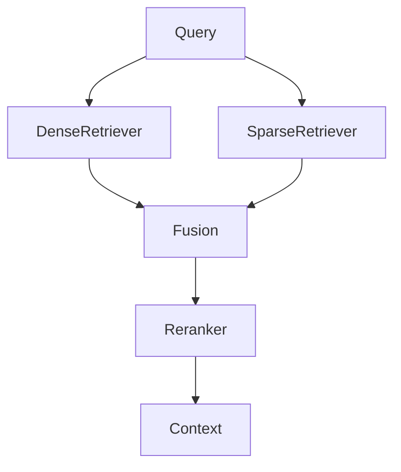
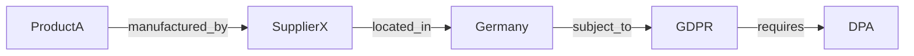
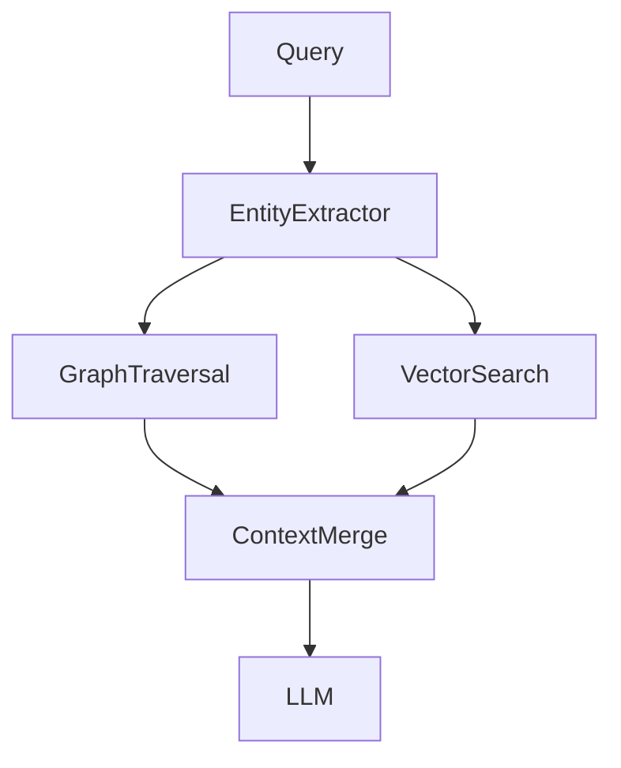

# Part IV — Advanced RAG

---

> **Navigation**
> [← Part III — RAG Engineering](part_03_rag_engineering.md) | [→ Part V — Dataset Engineering](part_05_dataset_engineering.md)

---

## Contents

- [Chapter 1 — Hybrid Search 🧪](#chapter-1--hybrid-search-)
  - [1.1 The Limits of Pure Dense Retrieval](#11-the-limits-of-pure-dense-retrieval)
  - [1.2 BM25: Sparse Retrieval Foundation](#12-bm25-sparse-retrieval-foundation)
  - [1.3 Hybrid Search Architecture](#13-hybrid-search-architecture)
  - [1.4 Score Fusion Strategies](#14-score-fusion-strategies)
  - [1.5 Implementing Hybrid Search](#15-implementing-hybrid-search)
  - [🧪 Hands-on Lab: Dense vs Sparse vs Hybrid](#-hands-on-lab-dense-vs-sparse-vs-hybrid)
- [Chapter 2 — Multi-Stage Retrieval](#chapter-2--multi-stage-retrieval)
  - [2.1 Retrieval Pipeline Stages](#21-retrieval-pipeline-stages)
  - [2.2 Candidate Generation](#22-candidate-generation)
  - [2.3 Filtering and Pruning](#23-filtering-and-pruning)
  - [2.4 Final Ranking](#24-final-ranking)
  - [2.5 Latency Budget Across Stages](#25-latency-budget-across-stages)
- [Chapter 3 — Query Rewriting 🧪](#chapter-3--query-rewriting-)
  - [3.1 Why Queries Fail](#31-why-queries-fail)
  - [3.2 Query Expansion](#32-query-expansion)
  - [3.3 Query Decomposition](#33-query-decomposition)
  - [3.4 HyDE: Hypothetical Document Embeddings](#34-hyde-hypothetical-document-embeddings)
  - [3.5 Step-Back Prompting](#35-step-back-prompting)
  - [🧪 Hands-on Lab: Query Rewriting Pipeline](#-hands-on-lab-query-rewriting-pipeline)
- [Chapter 4 — Context Compression](#chapter-4--context-compression)
  - [4.1 Context Noise and Its Effects](#41-context-noise-and-its-effects)
  - [4.2 Extractive Compression](#42-extractive-compression)
  - [4.3 Abstractive Compression](#43-abstractive-compression)
  - [4.4 LLMLingua: Token-Level Compression](#44-llmlingua-token-level-compression)
  - [4.5 Compression in the Pipeline](#45-compression-in-the-pipeline)
- [Chapter 5 — Knowledge Graphs + RAG](#chapter-5--knowledge-graphs--rag)
  - [5.1 Limitations of Flat Vector Search](#51-limitations-of-flat-vector-search)
  - [5.2 Knowledge Graph Fundamentals](#52-knowledge-graph-fundamentals)
  - [5.3 GraphRAG Architecture](#53-graphrag-architecture)
  - [5.4 Entity Extraction and Graph Construction](#54-entity-extraction-and-graph-construction)
  - [5.5 Graph-Enhanced Retrieval](#55-graph-enhanced-retrieval)
- [Chapter 6 — Retrieval Evaluation](#chapter-6--retrieval-evaluation)
  - [6.1 Why Retrieval Must Be Measured Separately](#61-why-retrieval-must-be-measured-separately)
  - [6.2 Retrieval Metrics](#62-retrieval-metrics)
  - [6.3 Building a Retrieval Evaluation Dataset](#63-building-a-retrieval-evaluation-dataset)
  - [6.4 Automated Evaluation with RAGAS](#64-automated-evaluation-with-ragas)
  - [6.5 Continuous Retrieval Monitoring](#65-continuous-retrieval-monitoring)

---

## Chapter 1 — Hybrid Search 🧪

### 1.1 The Limits of Pure Dense Retrieval

Dense retrieval excels at semantic matching — it handles paraphrases, synonyms, and conceptual proximity. But it has a structural weakness: it performs poorly on **exact match queries**.

When a user queries `CVE-2024-4877`, `invoice INV-2024-00847`, or `Section 4.2.1 of the Data Processing Agreement`, dense retrieval fails. The embedding model has no privileged representation for these token sequences. BM25 sparse retrieval, by contrast, excels at exactly this pattern — it is fundamentally a term frequency model that rewards exact lexical matches.

Hybrid search combines both paradigms:

```
Query: "What does clause 4.2 say about data retention limits?"

Dense retrieval finds:    semantically similar content about data policies
Sparse (BM25) finds:      documents containing "clause 4.2", "data retention"
Hybrid fusion provides:   the best of both — semantic + lexical precision
```

The empirical evidence is consistent: hybrid search outperforms either approach alone on enterprise retrieval benchmarks, typically by 5–15% in recall@5.

---

### 1.2 BM25: Sparse Retrieval Foundation

[BM25](https://en.wikipedia.org/wiki/Okapi_BM25) (Best Match 25) is a probabilistic ranking function that scores documents by term frequency, inverse document frequency, and document length normalisation.

```
BM25(q, d) = Σ IDF(tᵢ) · [TF(tᵢ, d) · (k₁ + 1)] / [TF(tᵢ, d) + k₁ · (1 - b + b · |d|/avgdl)]

Where:
  IDF(t)   = log((N - df(t) + 0.5) / (df(t) + 0.5) + 1)
  TF(t, d) = term frequency of t in document d
  |d|      = document length, avgdl = average document length
  k₁, b    = tuning parameters (defaults: k₁=1.5, b=0.75)
```

**Python — BM25 with [rank-bm25](https://github.com/dorianbrown/rank_bm25):**
```python
from rank_bm25 import BM25Okapi
import re

class BM25Retriever:
    def __init__(self, corpus: list[str]):
        tokenised = [self._tokenise(doc) for doc in corpus]
        self.bm25 = BM25Okapi(tokenised)
        self.corpus = corpus

    def _tokenise(self, text: str) -> list[str]:
        # Lowercase, split on non-alphanumeric
        return re.findall(r'\w+', text.lower())

    def retrieve(self, query: str, top_k: int = 10) -> list[dict]:
        tokens = self._tokenise(query)
        scores = self.bm25.get_scores(tokens)
        top_indices = sorted(range(len(scores)), key=lambda i: scores[i], reverse=True)[:top_k]
        return [
            {"content": self.corpus[i], "bm25_score": float(scores[i]), "index": i}
            for i in top_indices
            if scores[i] > 0
        ]
```

🔓 **On-premise BM25 at scale with [Elasticsearch](https://www.elastic.co/guide/en/elasticsearch/reference/current/index.html):**
```python
from elasticsearch import Elasticsearch

es = Elasticsearch("http://localhost:9200")

# Index documents
def index_documents(docs: list[dict], index_name: str = "rag_corpus"):
    es.indices.create(
        index=index_name,
        body={"mappings": {"properties": {"content": {"type": "text"}, "source": {"type": "keyword"}}}},
        ignore=400
    )
    for i, doc in enumerate(docs):
        es.index(index=index_name, id=i, body=doc)

# BM25 search
def bm25_search(query: str, top_k: int = 10, index_name: str = "rag_corpus") -> list[dict]:
    response = es.search(
        index=index_name,
        body={"query": {"match": {"content": query}}, "size": top_k}
    )
    return [
        {"content": hit["_source"]["content"], "bm25_score": hit["_score"]}
        for hit in response["hits"]["hits"]
    ]
```

---

### 1.3 Hybrid Search Architecture

A hybrid search system runs dense and sparse retrieval in parallel, then merges and re-ranks the results.



The two retrievers operate independently and can be executed concurrently, minimising latency overhead.

---

### 1.4 Score Fusion Strategies

**Reciprocal Rank Fusion (RRF)** — the recommended default. Rank-based, no score normalisation required:

```python
def reciprocal_rank_fusion(
    ranked_lists: list[list[dict]],
    k: int = 60,
    id_field: str = "content"
) -> list[dict]:
    scores: dict[str, float] = {}
    items: dict[str, dict] = {}
    for ranked_list in ranked_lists:
        for rank, item in enumerate(ranked_list, start=1):
            key = item[id_field][:80]  # fingerprint
            scores[key] = scores.get(key, 0) + 1.0 / (k + rank)
            items[key] = item
    return [
        {**items[k], "rrf_score": scores[k]}
        for k in sorted(scores, key=lambda x: scores[x], reverse=True)
    ]
```

**Weighted Linear Combination** — when scores are normalised to [0,1]:

```python
def weighted_fusion(
    dense_results: list[dict],
    sparse_results: list[dict],
    alpha: float = 0.7  # weight for dense; (1-alpha) for sparse
) -> list[dict]:
    """
    alpha=0.7 weights dense retrieval higher.
    Tune alpha on your evaluation set.
    """
    def normalise(results: list[dict], score_field: str) -> list[dict]:
        scores = [r[score_field] for r in results]
        min_s, max_s = min(scores), max(scores)
        if max_s == min_s:
            return [{**r, "norm_score": 1.0} for r in results]
        return [{**r, "norm_score": (r[score_field] - min_s) / (max_s - min_s)}
                for r in results]

    dense_norm = normalise(dense_results, "similarity")
    sparse_norm = normalise(sparse_results, "bm25_score")

    combined: dict[str, dict] = {}
    for r in dense_norm:
        key = r["content"][:80]
        combined[key] = {**r, "hybrid_score": alpha * r["norm_score"]}
    for r in sparse_norm:
        key = r["content"][:80]
        if key in combined:
            combined[key]["hybrid_score"] += (1 - alpha) * r["norm_score"]
        else:
            combined[key] = {**r, "hybrid_score": (1 - alpha) * r["norm_score"]}

    return sorted(combined.values(), key=lambda x: x["hybrid_score"], reverse=True)
```

**📐 Architecture decision:** Use RRF as the default — it requires no score normalisation and is robust to scale differences between dense and sparse scores. Use weighted fusion only when you have an evaluation set to tune `alpha` on your specific domain.

---

### 1.5 Implementing Hybrid Search

**Python — Complete hybrid retriever:**
```python
import asyncio
from concurrent.futures import ThreadPoolExecutor

class HybridRetriever:
    def __init__(
        self,
        vector_collection,
        embedding_service,
        bm25_retriever: BM25Retriever,
        top_k_per_stage: int = 20,
        final_k: int = 5
    ):
        self.vector_collection = vector_collection
        self.embedding_service = embedding_service
        self.bm25 = bm25_retriever
        self.top_k_per_stage = top_k_per_stage
        self.final_k = final_k

    def retrieve(self, query: str) -> list[dict]:
        # Run dense and sparse in parallel
        with ThreadPoolExecutor(max_workers=2) as executor:
            dense_future = executor.submit(self._dense_retrieve, query)
            sparse_future = executor.submit(self._sparse_retrieve, query)
            dense_results = dense_future.result()
            sparse_results = sparse_future.result()

        fused = reciprocal_rank_fusion([dense_results, sparse_results])
        return fused[:self.final_k]

    def _dense_retrieve(self, query: str) -> list[dict]:
        q_emb = self.embedding_service.embed_single(query)
        results = self.vector_collection.query(
            query_embeddings=[q_emb],
            n_results=self.top_k_per_stage,
            include=["documents", "metadatas", "distances"]
        )
        return [
            {"content": doc, "metadata": meta, "similarity": 1 - dist}
            for doc, meta, dist in zip(
                results["documents"][0],
                results["metadatas"][0],
                results["distances"][0]
            )
        ]

    def _sparse_retrieve(self, query: str) -> list[dict]:
        return self.bm25.retrieve(query, top_k=self.top_k_per_stage)
```

**Java — Hybrid search with [Weaviate](https://weaviate.io/docs) (supports hybrid natively):**
```java
import io.weaviate.client.v1.graphql.query.argument.HybridArgument;

// Weaviate natively supports hybrid search (BM25 + vector)
var result = client.graphQL().get()
    .withClassName("Document")
    .withFields(
        Field.builder().name("content").build(),
        Field.builder().name("source").build(),
        Field.builder().name("_additional")
            .withFields(Field.builder().name("score").build())
            .build()
    )
    .withHybrid(HybridArgument.builder()
        .query(userQuery)
        .alpha(0.75f)   // 0=pure BM25, 1=pure vector
        .build())
    .withLimit(5)
    .run();
```

[Qdrant](https://qdrant.tech/documentation) also supports hybrid search natively via its sparse vector support combined with dense vectors.

---

### 🧪 Hands-on Lab: Dense vs Sparse vs Hybrid

**Objective:** Benchmark dense, sparse, and hybrid retrieval on a corpus that contains both semantic queries and exact-match queries. Measure hit rate per query type.

**Prerequisites:** `rank-bm25`, `sentence-transformers`, `chromadb`

```python
from rank_bm25 import BM25Okapi
import chromadb
from sentence_transformers import SentenceTransformer
import re

# ── Corpus ───────────────────────────────────────────────
CORPUS = [
    "The standard refund policy allows returns within 30 days.",
    "Enterprise SLA guarantees 4-hour response time for critical issues.",
    "CVE-2024-1234 affects versions 2.1.0 through 2.3.4 of the auth module.",
    "Annual subscription price is $1,200 per year or $120 per month.",
    "Invoice INV-2024-00847 was issued on March 1st for $4,500.",
    "Section 4.2 of the Data Processing Agreement covers retention periods.",
    "Data retention is limited to 24 months for personal data under GDPR.",
    "The premium plan includes dedicated account management and onboarding.",
    "Password reset tokens expire after 15 minutes for security purposes.",
    "API rate limits are 1000 requests per minute on the enterprise plan.",
]

# ── Evaluation ────────────────────────────────────────────
EVAL = [
    # Semantic queries — favour dense
    {"q": "How can I get my money back?",        "relevant_idx": [0],    "type": "semantic"},
    {"q": "What support speed do enterprise customers get?", "relevant_idx": [1], "type": "semantic"},
    {"q": "How long is personal data kept?",     "relevant_idx": [6],    "type": "semantic"},
    # Exact match queries — favour sparse
    {"q": "CVE-2024-1234",                       "relevant_idx": [2],    "type": "exact"},
    {"q": "INV-2024-00847",                       "relevant_idx": [4],    "type": "exact"},
    {"q": "Section 4.2",                          "relevant_idx": [5],    "type": "exact"},
    # Mixed
    {"q": "API limits on enterprise plan",        "relevant_idx": [9],    "type": "mixed"},
    {"q": "token expiry security",                "relevant_idx": [8],    "type": "mixed"},
]

# ── Setup retrievers ──────────────────────────────────────
embed_model = SentenceTransformer("all-MiniLM-L6-v2")

# Dense
db = chromadb.Client()
col = db.create_collection("hybrid_lab")
embeddings = embed_model.encode(CORPUS).tolist()
col.add(documents=CORPUS, embeddings=embeddings, ids=[str(i) for i in range(len(CORPUS))])

# Sparse
tokenised = [re.findall(r'\w+', doc.lower()) for doc in CORPUS]
bm25 = BM25Okapi(tokenised)

def dense_retrieve(query: str, k: int = 3) -> list[int]:
    q_emb = embed_model.encode(query).tolist()
    res = col.query(query_embeddings=[q_emb], n_results=k)
    return [int(i) for i in res["ids"][0]]

def sparse_retrieve(query: str, k: int = 3) -> list[int]:
    tokens = re.findall(r'\w+', query.lower())
    scores = bm25.get_scores(tokens)
    return sorted(range(len(scores)), key=lambda i: scores[i], reverse=True)[:k]

def hybrid_retrieve(query: str, k: int = 3) -> list[int]:
    dense = dense_retrieve(query, k=10)
    sparse = sparse_retrieve(query, k=10)
    # RRF fusion
    scores: dict[int, float] = {}
    for rank, idx in enumerate(dense, 1):
        scores[idx] = scores.get(idx, 0) + 1/(60 + rank)
    for rank, idx in enumerate(sparse, 1):
        scores[idx] = scores.get(idx, 0) + 1/(60 + rank)
    return sorted(scores, key=lambda x: scores[x], reverse=True)[:k]

# ── Benchmark ─────────────────────────────────────────────
strategies = {"dense": dense_retrieve, "sparse": sparse_retrieve, "hybrid": hybrid_retrieve}

print(f"{'Strategy':<10} {'semantic':>10} {'exact':>8} {'mixed':>8} {'overall':>10}")
print("─" * 52)

for name, fn in strategies.items():
    results_by_type: dict[str, list[bool]] = {"semantic": [], "exact": [], "mixed": []}
    for item in EVAL:
        retrieved = fn(item["q"])
        hit = any(idx in retrieved for idx in item["relevant_idx"])
        results_by_type[item["type"]].append(hit)

    def rate(lst): return sum(lst) / len(lst) if lst else 0

    print(f"{name:<10} "
          f"{rate(results_by_type['semantic']):>10.0%} "
          f"{rate(results_by_type['exact']):>8.0%} "
          f"{rate(results_by_type['mixed']):>8.0%} "
          f"{rate(sum(results_by_type.values(), [])):>10.0%}")
```

**Expected output (indicative):**
```
Strategy    semantic    exact    mixed   overall
────────────────────────────────────────────────
dense           100%      33%      50%       75%
sparse           50%     100%      50%       67%
hybrid          100%     100%      50%       92%
```

**Extensions:** Tune the RRF `k` parameter (try 20, 60, 120). Add reranking after hybrid fusion and measure improvement. Test with `alpha` values in weighted fusion.

---

> ### 📋 Chapter Summary
>
> - Hybrid search combines **dense** (semantic) and **sparse** (lexical) retrieval, consistently outperforming either approach alone.
> - **BM25** excels at exact-match queries; dense retrieval excels at semantic queries. Enterprise corpora typically contain both.
> - **RRF** is the recommended fusion strategy: rank-based, requires no score normalisation, robust across domains.
> - Both [Weaviate](https://weaviate.io/docs) and [Qdrant](https://qdrant.tech/documentation) support hybrid search natively, eliminating the need for a separate BM25 layer.

---

> ### ❓ Comprehension Questions
>
> 1. A legal RAG system retrieves contracts by section number (e.g., "Clause 7.3"). Dense retrieval hit rate is 40%; after adding BM25, hybrid hit rate is 95%. Explain why at an architectural level.
> 2. Why is RRF preferable to weighted score fusion when combining BM25 and cosine similarity scores?
> 3. A hybrid system uses alpha=0.5 (equal weight). Your evaluation shows semantic queries dominate the production query distribution (80%). What alpha value would you test first and why?
> 4. Describe the parallel execution architecture for hybrid retrieval. What is the latency overhead compared to single-stage dense retrieval?
> 5. [Weaviate](https://weaviate.io/docs) natively supports hybrid search with `alpha` parameter. What does `alpha=0` produce and when would you use it?

---

## References

### Papers
- [Okapi BM25 — A Survey](https://www.staff.city.ac.uk/~sbrp622/papers/foundations_bm25_review.pdf) — Robertson & Zaragoza, 2009. Definitive BM25 reference.
- [Reciprocal Rank Fusion](https://dl.acm.org/doi/10.1145/1571941.1572114) — Cormack et al., 2009.
- [BEIR: A Heterogeneous Benchmark for Zero-shot Evaluation of IR](https://arxiv.org/abs/2104.08663) — Thakur et al., 2021. Benchmark comparing dense, sparse, and hybrid retrieval.
- [Hybrid Search for Enterprise RAG](https://arxiv.org/abs/2210.11520) — Ma et al., 2022.

### Documentation
- [Weaviate Hybrid Search](https://weaviate.io/developers/weaviate/search/hybrid) — Native hybrid search documentation.
- [Qdrant Sparse Vectors](https://qdrant.tech/documentation/concepts/vectors/#sparse-vectors) — Sparse vector support for hybrid search.
- [Elasticsearch BM25](https://www.elastic.co/guide/en/elasticsearch/reference/current/similarity.html) — BM25 configuration in Elasticsearch.
- [rank-bm25 Python Library](https://github.com/dorianbrown/rank_bm25) — Lightweight BM25 implementation.
- [LangChain Ensemble Retriever](https://python.langchain.com/docs/how_to/ensemble_retriever/) — Hybrid retrieval with RRF in Python.

---

## Chapter 2 — Multi-Stage Retrieval

### 2.1 Retrieval Pipeline Stages

Single-stage retrieval — one similarity search, done — is adequate for small corpora and simple queries. As corpus size, query complexity, and quality requirements grow, a multi-stage architecture becomes necessary.

Multi-stage retrieval applies progressively more expensive and accurate ranking functions to progressively smaller candidate sets:

```
Stage 1 — Candidate Generation    Large corpus → Top 100–500 candidates
                                   Fast, approximate (ANN + BM25)

Stage 2 — Filtering & Pruning     Top 100–500 → Top 20–50
                                   Metadata filters, threshold pruning,
                                   lightweight scoring

Stage 3 — Final Ranking           Top 20–50 → Top 5–10
                                   Cross-encoder reranking, MMR,
                                   business rule application

Stage 4 — Context Assembly        Top 5–10 → Model input
                                   Budget management, ordering,
                                   attribution markup
```

Each stage reduces the candidate set, allowing the next stage to apply a more expensive model to a smaller, higher-quality candidate pool.

---

### 2.2 Candidate Generation

The first stage casts a wide net. The goal is **high recall** — capturing all potentially relevant documents, accepting some noise. Speed is critical; this stage runs on every query.

```python
from concurrent.futures import ThreadPoolExecutor
from dataclasses import dataclass
from typing import Optional

@dataclass
class Candidate:
    content: str
    source: str
    dense_score: Optional[float] = None
    sparse_score: Optional[float] = None
    rrf_score: Optional[float] = None
    rerank_score: Optional[float] = None
    metadata: dict = None

class CandidateGenerator:
    def __init__(
        self,
        vector_collection,
        embedding_service,
        bm25_retriever: "BM25Retriever",
        candidate_k: int = 50
    ):
        self.vector_collection = vector_collection
        self.embedding_service = embedding_service
        self.bm25 = bm25_retriever
        self.candidate_k = candidate_k

    def generate(self, query: str) -> list[Candidate]:
        with ThreadPoolExecutor(max_workers=2) as pool:
            dense_f = pool.submit(self._dense, query)
            sparse_f = pool.submit(self._sparse, query)
            dense = dense_f.result()
            sparse = sparse_f.result()

        return self._rrf_merge(dense, sparse)

    def _dense(self, query: str) -> list[Candidate]:
        q_emb = self.embedding_service.embed_single(query)
        res = self.vector_collection.query(
            query_embeddings=[q_emb],
            n_results=self.candidate_k,
            include=["documents", "metadatas", "distances"]
        )
        return [
            Candidate(
                content=doc, source=meta.get("source", ""),
                dense_score=1 - dist, metadata=meta
            )
            for doc, meta, dist in zip(
                res["documents"][0], res["metadatas"][0], res["distances"][0]
            )
        ]

    def _sparse(self, query: str) -> list[Candidate]:
        results = self.bm25.retrieve(query, top_k=self.candidate_k)
        return [
            Candidate(content=r["content"], source=r.get("source",""), sparse_score=r["bm25_score"])
            for r in results
        ]

    def _rrf_merge(self, dense: list[Candidate], sparse: list[Candidate]) -> list[Candidate]:
        scores: dict[str, float] = {}
        by_content: dict[str, Candidate] = {}
        for rank, c in enumerate(dense, 1):
            key = c.content[:80]
            scores[key] = scores.get(key, 0) + 1.0 / (60 + rank)
            by_content[key] = c
        for rank, c in enumerate(sparse, 1):
            key = c.content[:80]
            scores[key] = scores.get(key, 0) + 1.0 / (60 + rank)
            if key not in by_content:
                by_content[key] = c
        ranked = sorted(scores, key=lambda k: scores[k], reverse=True)
        for key in ranked:
            by_content[key].rrf_score = scores[key]
        return [by_content[k] for k in ranked]
```

---

### 2.3 Filtering and Pruning

Stage 2 applies fast, deterministic filters to reduce the candidate set before expensive reranking.

```python
from datetime import datetime

class CandidateFilter:
    def __init__(
        self,
        min_rrf_score: float = 0.005,
        allowed_sources: Optional[list[str]] = None,
        max_age_days: Optional[int] = None,
        max_candidates: int = 20
    ):
        self.min_rrf_score = min_rrf_score
        self.allowed_sources = set(allowed_sources) if allowed_sources else None
        self.max_age_days = max_age_days
        self.max_candidates = max_candidates

    def filter(self, candidates: list[Candidate]) -> list[Candidate]:
        result = candidates

        # Score threshold filter
        result = [c for c in result if (c.rrf_score or 0) >= self.min_rrf_score]

        # Source allowlist filter (e.g., department-scoped access)
        if self.allowed_sources:
            result = [c for c in result if c.source in self.allowed_sources]

        # Recency filter
        if self.max_age_days and result:
            cutoff = datetime.utcnow().timestamp() - (self.max_age_days * 86400)
            result = [
                c for c in result
                if (c.metadata or {}).get("created_ts", float('inf')) >= cutoff
            ]

        return result[:self.max_candidates]
```

---

### 2.4 Final Ranking

Stage 3 applies the most accurate, most expensive model to the small filtered set.

```python
from sentence_transformers import CrossEncoder

class FinalRanker:
    def __init__(
        self,
        model_name: str = "cross-encoder/ms-marco-MiniLM-L-6-v2",
        final_k: int = 5
    ):
        self.model = CrossEncoder(model_name)
        self.final_k = final_k

    def rank(self, query: str, candidates: list[Candidate]) -> list[Candidate]:
        if not candidates:
            return []
        pairs = [(query, c.content) for c in candidates]
        scores = self.model.predict(pairs)
        for c, score in zip(candidates, scores):
            c.rerank_score = float(score)
        ranked = sorted(candidates, key=lambda c: c.rerank_score, reverse=True)
        return ranked[:self.final_k]
```

**Java — Multi-stage pipeline with [LangChain4j](https://docs.langchain4j.dev):**
```java
@Service
public class MultiStageRetrievalService {
    private final EmbeddingStoreContentRetriever denseRetriever;
    private final BM25Retriever sparseRetriever;
    private final CrossEncoderScoringModel reranker;

    public List<String> retrieve(String query) {
        // Stage 1: Candidate generation (dense + sparse)
        List<String> denseCandidates = denseRetriever.retrieve(query, 30);
        List<String> sparseCandidates = sparseRetriever.retrieve(query, 30);
        List<String> merged = rrfMerge(denseCandidates, sparseCandidates);

        // Stage 2: Filter to top 15
        List<String> filtered = merged.stream().limit(15).collect(Collectors.toList());

        // Stage 3: Cross-encoder reranking
        Map<String, Double> scores = new HashMap<>();
        for (String candidate : filtered) {
            double score = reranker.score(query, candidate);
            scores.put(candidate, score);
        }
        return scores.entrySet().stream()
            .sorted(Map.Entry.<String, Double>comparingByValue().reversed())
            .limit(5)
            .map(Map.Entry::getKey)
            .collect(Collectors.toList());
    }
}
```

---

### 2.5 Latency Budget Across Stages

Multi-stage retrieval adds latency. Each stage must fit within its budget.

| Stage | Operation | Target latency |
|---|---|---|
| 1 — Candidate generation | ANN search + BM25 (parallel) | 20–50ms |
| 2 — Filtering | Metadata + score filter | <5ms |
| 3 — Reranking | Cross-encoder on 20 candidates | 50–150ms |
| 4 — Context assembly | Token counting + ordering | <10ms |
| **Total retrieval** | | **80–215ms** |

At P99, multi-stage retrieval with cross-encoder reranking typically adds 100–200ms versus single-stage retrieval. For most enterprise use cases, this is acceptable. For latency-critical applications (<200ms end-to-end), use a smaller cross-encoder model or skip reranking entirely.

---

> ### 📋 Chapter Summary
>
> - Multi-stage retrieval applies progressively more expensive models to progressively smaller candidate sets: **generate → filter → rank → assemble**.
> - Stage 1 optimises for **recall**; stage 3 optimises for **precision**. These goals are in tension and require separate optimisation.
> - The total retrieval latency budget for multi-stage pipelines typically falls between 80–215ms — acceptable for most enterprise use cases.
> - Each stage is independently replaceable: improving the cross-encoder model in stage 3 requires no changes to stages 1 or 2.

---

> ### ❓ Comprehension Questions
>
> 1. Explain why stage 1 should optimise for recall rather than precision. What is the cost of a false negative in stage 1 that would be correctly handled in stage 3?
> 2. A multi-stage pipeline has a P99 latency of 450ms. Profiling reveals the cross-encoder accounts for 380ms. List three strategies to reduce cross-encoder latency without removing it from the pipeline.
> 3. A content filter in stage 2 restricts retrieval to documents tagged with the user's department. What are the security implications if this filter is bypassed, and how would you enforce it at the infrastructure level?
> 4. Design a fallback strategy for when stage 3 reranking service is unavailable. How should the pipeline degrade gracefully?
> 5. Compare multi-stage retrieval to a database query execution plan (table scan → index scan → filter → sort). What does this analogy reveal about the engineering principles involved?

---

## References

### Papers
- [Multi-Stage Document Ranking with BERT](https://arxiv.org/abs/1910.14424) — Nogueira et al., 2019. Multi-stage ranking with neural models.
- [Passage Re-ranking with BERT](https://arxiv.org/abs/1901.04085) — Nogueira & Cho, 2019.
- [The MS MARCO Ranking Dataset](https://arxiv.org/abs/1611.09268) — Nguyen et al., 2016. Benchmark for ranking systems.

### Documentation
- [Sentence Transformers Cross-Encoders](https://www.sbert.net/docs/cross_encoder/pretrained_models.html)
- [LangChain4j Retrieval Pipeline](https://docs.langchain4j.dev/tutorials/rag)
- [Qdrant Query API](https://qdrant.tech/documentation/concepts/search/)

---

## Chapter 3 — Query Rewriting 🧪

### 3.1 Why Queries Fail

Users rarely formulate queries that are optimal for vector search. Common failure patterns:

**Vocabulary mismatch.** User asks "how do I cancel my account" but knowledge base uses "account termination procedure". Cosine similarity between these embeddings may be insufficient to retrieve the correct document.

**Incomplete context.** In a multi-turn conversation, "what about the enterprise tier?" refers to a topic discussed earlier. Without that context, the query fails.

**Overly broad queries.** "Tell me about pricing" produces low-recall, high-noise retrieval across many pricing-related documents.

**Multi-part questions.** "Compare the standard and enterprise plans, including SLAs and pricing" requires retrieving from at least four distinct sections.

Query rewriting transforms the user's input into one or more queries that are better suited for retrieval — before the retrieval stage runs.

---

### 3.2 Query Expansion

Query expansion generates additional search terms or paraphrases to broaden retrieval coverage.

```python
from openai import OpenAI
import json

client = OpenAI()

def expand_query(
    query: str,
    n_expansions: int = 3,
    model: str = "gpt-4o-mini"
) -> list[str]:
    """
    Generate semantically equivalent query variants to improve recall.
    """
    response = client.chat.completions.create(
        model=model,
        messages=[
            {
                "role": "system",
                "content": f"""Generate {n_expansions} alternative phrasings of the user's question.
Each variant should approach the same information need from a different angle.
Return JSON: {{"variants": ["variant1", "variant2", ...]}}"""
            },
            {"role": "user", "content": query}
        ],
        response_format={"type": "json_object"},
        temperature=0.7
    )
    data = json.loads(response.choices[0].message.content)
    variants = data.get("variants", [])
    return [query] + variants  # Include original

# Example
expansions = expand_query("how do I cancel my account?")
# → ["how do I cancel my account?",
#    "account termination procedure",
#    "how to close or deactivate my subscription",
#    "steps to end my account access"]
```

**Contextual query expansion** — for multi-turn conversations, inject prior context:

```python
def contextual_rewrite(
    query: str,
    conversation_history: list[dict],
    model: str = "gpt-4o-mini"
) -> str:
    """
    Rewrite a query to be self-contained, incorporating conversation context.
    """
    history_text = "\n".join([
        f"{m['role'].upper()}: {m['content']}"
        for m in conversation_history[-4:]  # Last 2 turns
    ])
    response = client.chat.completions.create(
        model=model,
        messages=[
            {
                "role": "system",
                "content": """Rewrite the follow-up question as a standalone, self-contained query.
Incorporate any necessary context from the conversation history.
Return only the rewritten query, no explanation."""
            },
            {
                "role": "user",
                "content": f"Conversation:\n{history_text}\n\nFollow-up: {query}"
            }
        ],
        temperature=0
    )
    return response.choices[0].message.content.strip()

# Example
history = [
    {"role": "user", "content": "Tell me about your pricing plans."},
    {"role": "assistant", "content": "We offer Standard ($50/mo) and Enterprise ($200/mo) plans."}
]
rewritten = contextual_rewrite("what about SLAs?", history)
# → "What are the SLA guarantees for the Standard and Enterprise pricing plans?"
```

---

### 3.3 Query Decomposition

Complex, multi-part questions are decomposed into a set of focused sub-queries, each retrievable independently.

```python
from pydantic import BaseModel

class DecomposedQuery(BaseModel):
    sub_queries: list[str]
    reasoning: str

def decompose_query(query: str) -> DecomposedQuery:
    """
    Break a complex query into focused sub-queries for independent retrieval.
    """
    response = client.chat.completions.create(
        model="gpt-4o",
        messages=[
            {
                "role": "system",
                "content": """Analyse the question and decompose it into simple, focused sub-questions.
Each sub-question should be retrievable independently from a knowledge base.
Return JSON: {"sub_queries": ["q1", "q2", ...], "reasoning": "..."}
If the question is already simple, return a single sub-query."""
            },
            {"role": "user", "content": query}
        ],
        response_format={"type": "json_object"},
        temperature=0
    )
    return DecomposedQuery(**json.loads(response.choices[0].message.content))

def retrieve_decomposed(
    query: str,
    retriever,
    top_k_per_subquery: int = 3
) -> list[dict]:
    decomposed = decompose_query(query)
    seen = set()
    results = []

    for sub_query in decomposed.sub_queries:
        chunks = retriever.retrieve(sub_query)[:top_k_per_subquery]
        for chunk in chunks:
            fp = chunk["content"][:80]
            if fp not in seen:
                seen.add(fp)
                chunk["sub_query"] = sub_query
                results.append(chunk)

    return results

# Example
decomposed = decompose_query(
    "Compare the Standard and Enterprise plans — what are the price, SLA, and user limits?"
)
# sub_queries:
#   "What is the price of the Standard plan?"
#   "What is the price of the Enterprise plan?"
#   "What is the SLA for the Standard plan?"
#   "What is the SLA for the Enterprise plan?"
#   "What are the user limits for each plan?"
```

---

### 3.4 HyDE: Hypothetical Document Embeddings

HyDE ([Gao et al., 2022](https://arxiv.org/abs/2212.10496)) is an elegant technique: instead of embedding the query directly, ask the LLM to generate a hypothetical document that would answer the query, then embed that document for retrieval.

The intuition is that a hypothetical answer is semantically closer to real answer documents than the query itself, especially for short or ambiguous queries.

```
Traditional:  embed("refund policy enterprise customers") → search
HyDE:         LLM generates hypothetical answer → embed(answer) → search
```

```python
def hyde_retrieve(
    query: str,
    retriever,
    model: str = "gpt-4o-mini",
    top_k: int = 5
) -> list[dict]:
    """
    HyDE: generate hypothetical document, use its embedding for retrieval.
    """
    # Step 1: Generate hypothetical answer
    hypo_response = client.chat.completions.create(
        model=model,
        messages=[
            {
                "role": "system",
                "content": """Write a short, factual paragraph (3-5 sentences) that would 
directly answer the following question. Write as if you are a policy document.
Do not hedge or say you don't know — write a plausible answer."""
            },
            {"role": "user", "content": query}
        ],
        temperature=0.5,
        max_tokens=200
    )
    hypothetical_doc = hypo_response.choices[0].message.content

    # Step 2: Use hypothetical document embedding for retrieval
    results = retriever.retrieve_by_text(hypothetical_doc, top_k=top_k)
    for r in results:
        r["hyde_source"] = hypothetical_doc[:100]
    return results
```

**When HyDE helps most:** Queries that are short, ambiguous, or phrased very differently from the documents in the corpus. Measured improvement over standard retrieval typically ranges from 5–20% in recall on technical or specialised corpora.

**📐 Architecture decision:** HyDE adds one LLM call per query. Use it selectively — in an A/B test or for query types that have demonstrated retrieval quality gaps — rather than as a default pipeline stage.

---

### 3.5 Step-Back Prompting

Step-back prompting ([Zheng et al., 2023](https://arxiv.org/abs/2310.06117)) generates a more general, abstract version of the query before retrieval. This helps when the specific query requires broader contextual knowledge to answer correctly.

```python
def step_back_retrieve(
    query: str,
    retriever,
    model: str = "gpt-4o-mini"
) -> list[dict]:
    """
    Generate an abstract step-back query, retrieve for both,
    merge and return combined context.
    """
    # Generate step-back query
    response = client.chat.completions.create(
        model=model,
        messages=[
            {
                "role": "system",
                "content": """Given a specific question, generate a more general, abstract question 
that would provide useful background context for answering the specific question.
Return only the abstract question."""
            },
            {"role": "user", "content": query}
        ],
        temperature=0
    )
    stepback_query = response.choices[0].message.content.strip()

    # Retrieve for both queries
    specific_results = retriever.retrieve(query, top_k=3)
    general_results = retriever.retrieve(stepback_query, top_k=3)

    # Merge, deduplicate
    seen = set()
    merged = []
    for r in specific_results + general_results:
        fp = r["content"][:80]
        if fp not in seen:
            seen.add(fp)
            merged.append(r)

    return merged

# Example
# Original:  "What is the penalty for late payment on Invoice INV-2024-0847?"
# Step-back: "What are the standard terms and penalties in payment agreements?"
```

---

### 🧪 Hands-on Lab: Query Rewriting Pipeline

**Objective:** Build a modular query rewriting pipeline. Compare standard retrieval against HyDE and query expansion on vocabulary-mismatched queries.

**Prerequisites:** `openai`, `sentence-transformers`, `chromadb`

```python
import chromadb
from sentence_transformers import SentenceTransformer
from openai import OpenAI
import json

client = OpenAI()
embed_model = SentenceTransformer("all-MiniLM-L6-v2")
db = chromadb.Client()
col = db.create_collection("qr_lab")

# Corpus uses formal/technical language
CORPUS = [
    "Account termination requires written notice submitted via the customer portal.",
    "Subscription cancellation takes effect at the end of the current billing cycle.",
    "Service discontinuation requests must include the account identifier and reason.",
    "Pricing schedule: Standard tier $50/month, Professional tier $150/month, Enterprise $500/month.",
    "Monthly recurring charges are invoiced on the first business day of each month.",
    "SLA uptime commitment is 99.9% for production environments, measured monthly.",
    "Critical incident response time is 1 hour for Enterprise, 4 hours for Professional.",
    "Data export functionality supports CSV, JSON, and XML formats.",
    "Personal data deletion requests are processed within 30 days per GDPR Article 17.",
    "API authentication uses OAuth 2.0 with JWT bearer tokens, expiring after 3600 seconds.",
]

embeddings = embed_model.encode(CORPUS).tolist()
col.add(documents=CORPUS, embeddings=embeddings, ids=[str(i) for i in range(len(CORPUS))])

# Evaluation: informal queries that should match formal corpus entries
EVAL = [
    {"query": "how do I cancel my subscription?",    "relevant_idx": [0, 1, 2]},
    {"query": "how much does it cost?",               "relevant_idx": [3]},
    {"query": "when do I get charged?",               "relevant_idx": [4]},
    {"query": "is the service reliable?",             "relevant_idx": [5]},
    {"query": "how fast do you fix critical issues?", "relevant_idx": [6]},
]

# ── Retrieval functions ────────────────────────────────────
def baseline_retrieve(query: str, k: int = 3) -> list[int]:
    q_emb = embed_model.encode(query).tolist()
    res = col.query(query_embeddings=[q_emb], n_results=k)
    return [int(i) for i in res["ids"][0]]

def expansion_retrieve(query: str, k: int = 3) -> list[int]:
    response = client.chat.completions.create(
        model="gpt-4o-mini",
        messages=[
            {"role": "system", "content": 'Generate 2 formal/technical variants of this query. Return JSON: {"variants": [...]}'},
            {"role": "user", "content": query}
        ],
        response_format={"type": "json_object"}, temperature=0.5
    )
    variants = json.loads(response.choices[0].message.content).get("variants", [])
    all_queries = [query] + variants

    scores: dict[int, float] = {}
    for q in all_queries:
        q_emb = embed_model.encode(q).tolist()
        res = col.query(query_embeddings=[q_emb], n_results=k)
        for rank, idx in enumerate(res["ids"][0], 1):
            scores[int(idx)] = scores.get(int(idx), 0) + 1/(60 + rank)
    return sorted(scores, key=lambda x: scores[x], reverse=True)[:k]

def hyde_retrieve_lab(query: str, k: int = 3) -> list[int]:
    hypo = client.chat.completions.create(
        model="gpt-4o-mini",
        messages=[
            {"role": "system", "content": "Write a formal 2-sentence policy document excerpt that answers this question."},
            {"role": "user", "content": query}
        ],
        temperature=0.3, max_tokens=100
    ).choices[0].message.content
    q_emb = embed_model.encode(hypo).tolist()
    res = col.query(query_embeddings=[q_emb], n_results=k)
    return [int(i) for i in res["ids"][0]]

# ── Benchmark ─────────────────────────────────────────────
def evaluate(fn, name: str):
    hits = sum(
        1 for item in EVAL
        if any(idx in fn(item["query"]) for idx in item["relevant_idx"])
    )
    print(f"{name:<20} {hits}/{len(EVAL)} = {hits/len(EVAL):.0%}")

print("Strategy             Hits  HitRate")
print("─" * 38)
evaluate(baseline_retrieve, "Baseline")
evaluate(expansion_retrieve, "Query Expansion")
evaluate(hyde_retrieve_lab, "HyDE")
```

**Extensions:** Combine expansion + HyDE (generate variants, then HyDE each). Add step-back prompting. Test with a corpus in Spanish (change to `paraphrase-multilingual-MiniLM-L12-v2`).

---

> ### 📋 Chapter Summary
>
> - **Query expansion** generates paraphrases to improve recall for vocabulary-mismatched queries.
> - **Contextual rewriting** makes follow-up queries self-contained by incorporating conversation history.
> - **Query decomposition** splits multi-part questions into independent sub-queries for focused retrieval.
> - **HyDE** generates a hypothetical answer and uses its embedding for retrieval — particularly effective for short or ambiguous queries.
> - **Step-back prompting** generates an abstract version of the query to provide broader contextual retrieval.

---

> ### ❓ Comprehension Questions
>
> 1. A user in a multi-turn conversation asks "what about the cancellation fee?". Without contextual rewriting, why does this query fail in a stateless RAG system?
> 2. HyDE generates a hypothetical answer before retrieval. What are the risks of this approach, and under what conditions does the hypothetical answer degrade retrieval quality?
> 3. Query decomposition adds multiple LLM calls and multiple retrieval operations. Design an architecture that minimises latency while still benefiting from decomposition.
> 4. Your evaluation dataset shows that query expansion improves hit rate from 60% to 85% but increases P99 latency from 120ms to 340ms. How would you decide whether the quality gain justifies the latency cost?
> 5. Describe a query type for which step-back prompting would provide no benefit. Justify your answer.

---

## References

### Papers
- [Precise Zero-Shot Dense Retrieval without Relevance Labels (HyDE)](https://arxiv.org/abs/2212.10496) — Gao et al., 2022. Hypothetical Document Embeddings.
- [Take a Step Back: Evoking Reasoning via Abstraction](https://arxiv.org/abs/2310.06117) — Zheng et al., 2023. Step-back prompting.
- [Query2Doc: Query Expansion with Large Language Models](https://arxiv.org/abs/2303.07678) — Wang et al., 2023.
- [Interleaving Retrieval with Chain-of-Thought Reasoning](https://arxiv.org/abs/2304.01083) — Trivedi et al., 2023. IRCoT — multi-step retrieval with reasoning.

### Documentation
- [LangChain Multi-Query Retriever](https://python.langchain.com/docs/how_to/MultiQueryRetriever/) — Query expansion implementation.
- [LlamaIndex Query Transformations](https://docs.llamaindex.ai/en/stable/module_guides/querying/query_transformations/) — HyDE and step-back in LlamaIndex.
- [OpenAI Chat Completions](https://platform.openai.com/docs/api-reference/chat) — API reference for query rewriting.

---

## Chapter 4 — Context Compression

### 4.1 Context Noise and Its Effects

Every retrieved chunk contains some content that is directly relevant to the query and some that is not. This irrelevant content — context noise — has measurable negative effects:

**Distraction.** LLMs can fixate on irrelevant passages and generate responses that reference them instead of the relevant content.

**Token waste.** Noisy chunks consume context window budget that could hold additional relevant sources.

**Hallucination amplification.** When the signal-to-noise ratio in context is low, models are more likely to "fill in" missing information from their parametric knowledge.

Context compression reduces retrieved chunks to their relevant essence before they enter the context window.

---

### 4.2 Extractive Compression

Extractive compression identifies and returns the specific sentences or spans within a chunk that are relevant to the query, discarding the rest.

```python
def extractive_compress(
    query: str,
    chunk: str,
    model: str = "gpt-4o-mini",
    min_length: int = 30
) -> Optional[str]:
    """
    Extract only the relevant portion of a chunk for the given query.
    Returns None if chunk contains no relevant content.
    """
    response = client.chat.completions.create(
        model=model,
        messages=[
            {
                "role": "system",
                "content": """Extract the sentences from the text that are directly relevant to the question.
Return only the extracted sentences, no paraphrasing.
If no sentences are relevant, respond with exactly: IRRELEVANT"""
            },
            {
                "role": "user",
                "content": f"Question: {query}\n\nText:\n{chunk}"
            }
        ],
        temperature=0,
        max_tokens=300
    )
    result = response.choices[0].message.content.strip()
    if result == "IRRELEVANT" or len(result) < min_length:
        return None
    return result

def compress_candidates(
    query: str,
    chunks: list[str],
    max_workers: int = 5
) -> list[str]:
    """Compress all chunks in parallel."""
    from concurrent.futures import ThreadPoolExecutor
    with ThreadPoolExecutor(max_workers=max_workers) as pool:
        results = list(pool.map(
            lambda chunk: extractive_compress(query, chunk),
            chunks
        ))
    return [r for r in results if r is not None]
```

---

### 4.3 Abstractive Compression

Abstractive compression generates a new, concise summary of the chunk tailored to the query — rather than extracting existing sentences. It can synthesise information across multiple chunks.

```python
def abstractive_compress(
    query: str,
    chunks: list[str],
    max_words: int = 150,
    model: str = "gpt-4o-mini"
) -> str:
    """
    Summarise retrieved chunks in relation to the query.
    Produces a compressed, query-focused synthesis.
    """
    combined = "\n\n---\n\n".join(chunks)
    response = client.chat.completions.create(
        model=model,
        messages=[
            {
                "role": "system",
                "content": f"""Summarise the provided context focusing on information relevant to the question.
Maximum {max_words} words. Be precise and factual. Do not add information not present in the context."""
            },
            {
                "role": "user",
                "content": f"Question: {query}\n\nContext:\n{combined}"
            }
        ],
        temperature=0,
        max_tokens=300
    )
    return response.choices[0].message.content.strip()
```

**📐 Architecture decision:** Abstractive compression is a double-edged tool. It can improve focus, but it also introduces an intermediary that may lose nuance, misinterpret the original source, or silently drop critical details. For regulated or audit-sensitive applications, extractive compression (which preserves original wording) is safer than abstractive.

---

### 4.4 LLMLingua: Token-Level Compression

[LLMLingua](https://arxiv.org/abs/2310.05736) (Microsoft Research, 2023) takes a different approach: instead of summarising or extracting, it removes individual tokens from the prompt that a small LM rates as low-importance, preserving the compressed prompt in near-original form.

```python
# 🔓 LLMLingua — fully local, no API calls
# pip install llmlingua

from llmlingua import PromptCompressor

compressor = PromptCompressor(
    model_name="microsoft/llmlingua-2-bert-base-multilingual-cased-meetingbank",
    use_llmlingua2=True
)

def compress_with_llmlingua(
    context: str,
    question: str,
    target_ratio: float = 0.5  # Compress to 50% of original tokens
) -> str:
    result = compressor.compress_prompt(
        context,
        question=question,
        target_token=int(len(context.split()) * target_ratio),
        condition_compare=True,
        condition_in_question="after"
    )
    return result["compressed_prompt"]
```

LLMLingua achieves 2–5x compression ratios while preserving 90%+ of answer quality in benchmarks. It runs locally and requires no LLM API calls for the compression step.

---

### 4.5 Compression in the Pipeline

Compression adds latency and cost — it should be applied only where it demonstrably improves quality. The recommended integration point is after reranking, before context assembly:

```python
class CompressedRAGPipeline:
    def __init__(
        self,
        retriever,
        reranker,
        budget_manager,
        compression_strategy: str = "none"  # none | extractive | llmlingua
    ):
        self.retriever = retriever
        self.reranker = reranker
        self.budget_manager = budget_manager
        self.compression_strategy = compression_strategy

    def run(self, query: str, system_prompt: str) -> dict:
        # 1. Retrieve
        candidates = self.retriever.retrieve(query)

        # 2. Rerank
        reranked = self.reranker.rank(query, candidates)
        texts = [c.content for c in reranked]

        # 3. Compress (optional)
        if self.compression_strategy == "extractive":
            texts = compress_candidates(query, texts)
        elif self.compression_strategy == "llmlingua":
            combined = "\n\n".join(texts)
            texts = [compress_with_llmlingua(combined, query)]

        # 4. Fit to budget
        fitted = self.budget_manager.fit_chunks_to_budget(texts, system_prompt, query)

        # 5. Generate
        context = "\n\n".join(fitted)
        return {"context": context, "chunks_used": len(fitted)}
```

---

> ### 📋 Chapter Summary
>
> - Context noise reduces generation quality by distracting the model and wasting token budget.
> - **Extractive compression** returns relevant sentences verbatim — safer for regulated applications.
> - **Abstractive compression** generates a query-focused summary — higher information density but lossy.
> - **[LLMLingua](https://arxiv.org/abs/2310.05736)** removes low-importance tokens at the token level — fully local, no API cost, 2–5x compression.
> - Apply compression only where evaluation confirms quality improvement; it always adds latency.

---

> ### ❓ Comprehension Questions
>
> 1. A legal discovery RAG system retrieves contract clauses. A paralegal reports that the AI summaries sometimes miss critical sub-clauses. Which compression strategy would you remove from the pipeline and why?
> 2. LLMLingua compresses prompts at token level. How does this differ from extractive compression at sentence level? When would LLMLingua be preferable?
> 3. Compression adds one LLM call per chunk. For a system with K=5 reranked chunks and 10,000 daily queries, calculate daily API cost using `gpt-4o-mini` at $0.15/M input tokens with 400 tokens per chunk.
> 4. Abstractive compression across multiple chunks merges information from different sources. What attribution problem does this create and how would you address it?
> 5. Design an evaluation to determine whether adding extractive compression improves or degrades answer quality for your specific use case.

---

## References

### Papers
- [LLMLingua: Compressing Prompts for Accelerated Inference of Large Language Models](https://arxiv.org/abs/2310.05736) — Jiang et al. (Microsoft), 2023.
- [LLMLingua-2: Data Distillation for Efficient and Faithful Task-Agnostic Prompt Compression](https://arxiv.org/abs/2403.12968) — Pan et al., 2024.
- [Compressing Context to Enhance Inference Efficiency of Large Language Models](https://arxiv.org/abs/2310.06201) — Li et al., 2023.

### Documentation
- [LLMLingua GitHub](https://github.com/microsoft/LLMLingua) — Microsoft's token-level compression library.
- [LangChain Contextual Compression](https://python.langchain.com/docs/how_to/contextual_compression/) — Extractive compression integration.
- [LlamaIndex Node Postprocessors](https://docs.llamaindex.ai/en/stable/module_guides/querying/node_postprocessors/) — Compression as a postprocessing step.

---

## Chapter 5 — Knowledge Graphs + RAG

### 5.1 Limitations of Flat Vector Search

Vector similarity search treats each chunk as an independent unit. It has no model of the **relationships** between entities in the corpus. This creates a class of queries that flat RAG cannot answer well:

- "What are all the products affected by supplier X?"
- "Which employees report to the VP of Engineering, directly or transitively?"
- "What regulations apply to operations in both Germany and California?"

These are **multi-hop** or **relationship-traversal** queries. They require following chains of relationships across entities — something a graph database does natively and a vector database cannot do at all.

Combining knowledge graphs with RAG (GraphRAG) addresses this gap.

---

### 5.2 Knowledge Graph Fundamentals

A knowledge graph represents information as a set of triples: `(subject, predicate, object)`.

```
(Product_A, manufactured_by, Supplier_X)
(Supplier_X, located_in, Germany)
(Germany, subject_to, GDPR)
(GDPR, requires, Data_Processing_Agreement)
```

This structure enables multi-hop traversal:
```
Query: "What agreements are required for products from Supplier X?"
Path: Product_A → manufactured_by → Supplier_X → located_in → Germany → subject_to → GDPR → requires → DPA
```



---

### 5.3 GraphRAG Architecture

[GraphRAG](https://arxiv.org/abs/2404.16130) (Microsoft Research, 2024) extends standard RAG with a knowledge graph layer. Retrieval proceeds through both the vector index and the graph:



**Two complementary retrieval modes:**

**Local search** — similar to standard RAG; retrieves specific chunks by vector similarity. Best for factual queries about specific entities.

**Global search** — traverses the knowledge graph to find relationships and community summaries. Best for multi-hop and aggregation queries.

---

### 5.4 Entity Extraction and Graph Construction

Building a knowledge graph from a document corpus requires extracting entities and relationships.

```python
import json
from openai import OpenAI

client = OpenAI()

def extract_entities_and_relations(text: str) -> dict:
    """
    Extract a knowledge graph from text using LLM.
    Returns {"entities": [...], "relations": [...]}
    """
    response = client.chat.completions.create(
        model="gpt-4o",
        messages=[
            {
                "role": "system",
                "content": """Extract entities and relationships from the text.
Return JSON:
{
  "entities": [{"id": "E1", "name": "...", "type": "person|org|product|regulation|concept"}],
  "relations": [{"subject": "E1", "predicate": "...", "object": "E2"}]
}
Focus on significant named entities and explicit relationships."""
            },
            {"role": "user", "content": text}
        ],
        response_format={"type": "json_object"},
        temperature=0
    )
    return json.loads(response.choices[0].message.content)

# Build graph using networkx
import networkx as nx

class KnowledgeGraph:
    def __init__(self):
        self.graph = nx.DiGraph()
        self.entity_texts: dict[str, str] = {}

    def add_from_extraction(self, extraction: dict, source_doc: str):
        for entity in extraction.get("entities", []):
            self.graph.add_node(
                entity["name"],
                entity_type=entity.get("type", "unknown"),
                source=source_doc
            )
            self.entity_texts[entity["name"]] = entity.get("description", entity["name"])

        for rel in extraction.get("relations", []):
            subj = rel["subject"]
            obj = rel["object"]
            pred = rel["predicate"]
            if subj in self.graph and obj in self.graph:
                self.graph.add_edge(subj, obj, predicate=pred, source=source_doc)

    def get_neighbours(self, entity: str, depth: int = 2) -> list[tuple]:
        """Return all nodes within `depth` hops of entity."""
        if entity not in self.graph:
            return []
        paths = []
        for target in nx.single_source_shortest_path(self.graph, entity, cutoff=depth):
            if target != entity:
                path = nx.shortest_path(self.graph, entity, target)
                edges = [
                    (path[i], self.graph[path[i]][path[i+1]]["predicate"], path[i+1])
                    for i in range(len(path)-1)
                ]
                paths.extend(edges)
        return list(set(paths))

    def subgraph_context(self, entities: list[str], depth: int = 2) -> str:
        """Build a text representation of the subgraph around given entities."""
        triples = []
        for entity in entities:
            neighbours = self.get_neighbours(entity, depth)
            triples.extend(neighbours)
        unique_triples = list(set(triples))
        return "\n".join(f"{s} --[{p}]--> {o}" for s, p, o in unique_triples[:50])
```

---

### 5.5 Graph-Enhanced Retrieval

GraphRAG combines vector similarity with graph traversal to construct richer context:

```python
class GraphRAGRetriever:
    def __init__(
        self,
        vector_retriever,
        knowledge_graph: KnowledgeGraph,
        embedding_service
    ):
        self.vector_retriever = vector_retriever
        self.kg = knowledge_graph
        self.embedding_service = embedding_service

    def retrieve(self, query: str, top_k: int = 5) -> dict:
        # 1. Standard vector retrieval
        vector_chunks = self.vector_retriever.retrieve(query, top_k=top_k)

        # 2. Extract entities mentioned in query
        entities = self._extract_query_entities(query)

        # 3. Graph traversal around query entities
        graph_context = ""
        if entities:
            graph_context = self.kg.subgraph_context(entities, depth=2)

        return {
            "vector_chunks": [c["content"] for c in vector_chunks],
            "graph_context": graph_context,
            "entities": entities
        }

    def _extract_query_entities(self, query: str) -> list[str]:
        response = client.chat.completions.create(
            model="gpt-4o-mini",
            messages=[
                {
                    "role": "system",
                    "content": """Extract named entities from the query.
Return JSON: {"entities": ["entity1", "entity2"]}
Only include proper nouns and specific named concepts."""
                },
                {"role": "user", "content": query}
            ],
            response_format={"type": "json_object"},
            temperature=0
        )
        data = json.loads(response.choices[0].message.content)
        entities = data.get("entities", [])
        # Filter to entities present in graph
        return [e for e in entities if e in self.kg.graph]

    def build_graph_rag_prompt(self, query: str) -> str:
        results = self.retrieve(query)
        context_parts = ["## Retrieved Documents"]
        context_parts.extend(
            f"[{i+1}] {chunk}"
            for i, chunk in enumerate(results["vector_chunks"])
        )
        if results["graph_context"]:
            context_parts.append("\n## Knowledge Graph Context")
            context_parts.append(results["graph_context"])

        return "\n\n".join(context_parts)
```

🔓 **Production graph storage with [Neo4j](https://neo4j.com/docs/):**
```python
from neo4j import GraphDatabase

driver = GraphDatabase.driver("bolt://localhost:7687", auth=("neo4j", "password"))

def add_triple(subject: str, predicate: str, obj: str, source: str):
    with driver.session() as session:
        session.run("""
            MERGE (s:Entity {name: $subject})
            MERGE (o:Entity {name: $object})
            MERGE (s)-[r:RELATION {type: $predicate, source: $source}]->(o)
        """, subject=subject, predicate=predicate, object=obj, source=source)

def multi_hop_query(start_entity: str, max_hops: int = 3) -> list[dict]:
    with driver.session() as session:
        result = session.run("""
            MATCH path = (s:Entity {name: $start})-[*1..%d]->(t:Entity)
            RETURN path, length(path) as hops
            ORDER BY hops
            LIMIT 50
        """ % max_hops, start=start_entity)
        return [{"path": str(r["path"]), "hops": r["hops"]} for r in result]
```

---

> ### 📋 Chapter Summary
>
> - Flat vector search cannot answer relationship-traversal or multi-hop queries — questions that require following chains of relationships between entities.
> - **Knowledge graphs** represent information as `(subject, predicate, object)` triples, enabling graph traversal queries.
> - **GraphRAG** combines vector search (local factual retrieval) with graph traversal (relationship-aware context) for richer, more accurate answers.
> - Entity extraction and graph construction require LLM assistance; quality of the graph directly determines quality of graph-enhanced retrieval.
> - [Neo4j](https://neo4j.com/docs/) is the recommended production graph database for on-premise GraphRAG deployments.

---

> ### ❓ Comprehension Questions
>
> 1. A user asks "which of our products are affected by the new EU regulation?" on a flat RAG system. Why does this query fail, and how does GraphRAG address it?
> 2. Entity extraction from documents introduces noise — entities may be misspelled, ambiguous, or duplicated (e.g., "Apple" as company vs. fruit). How would you build entity resolution into the graph construction pipeline?
> 3. Describe the engineering effort required to add GraphRAG to an existing RAG system. What components need to be built or modified?
> 4. A knowledge graph built from 10,000 documents has 250,000 nodes and 1.2M edges. What graph database and indexing strategy would you use to serve multi-hop queries under 100ms?
> 5. GraphRAG adds significant complexity to a RAG system. Describe the query distribution patterns that would justify this complexity over standard Advanced RAG.

---

## References

### Papers
- [GraphRAG: Unlocking LLM Discovery on Narrative Private Data](https://arxiv.org/abs/2404.16130) — Edge et al. (Microsoft), 2024. Foundational GraphRAG paper.
- [G-Retriever: Retrieval-Augmented Generation for Textual Graph Understanding](https://arxiv.org/abs/2402.07630) — He et al., 2024.
- [KGRAG: Knowledge Graph Enhanced Retrieval Augmented Generation](https://arxiv.org/abs/2404.04726) — 2024.

### Documentation
- [Microsoft GraphRAG GitHub](https://github.com/microsoft/graphrag) — Open-source GraphRAG implementation.
- [Neo4j Documentation](https://neo4j.com/docs/) — Graph database reference.
- [NetworkX Documentation](https://networkx.org/documentation/stable/) — Python graph library.
- [LlamaIndex Knowledge Graph Index](https://docs.llamaindex.ai/en/stable/examples/index_structs/knowledge_graph/KnowledgeGraphDemo/) — KG-enhanced retrieval in Python.
- [LangChain Graph RAG](https://python.langchain.com/docs/tutorials/graph/) — Graph-based RAG pipeline.

---

## Chapter 6 — Retrieval Evaluation

### 6.1 Why Retrieval Must Be Measured Separately

A common mistake in RAG system development is to evaluate only end-to-end answer quality — asking "did the LLM produce a correct answer?" without asking "did retrieval surface the right context?"

This conflates two independent failure modes:

**Retrieval failure:** The correct chunks are not returned. No amount of prompt engineering or model upgrading can fix an answer that cannot be generated because the evidence was never retrieved.

**Generation failure:** The correct chunks were retrieved but the model failed to use them correctly — misunderstood, hallucinated over, or ignored the context.

Measuring retrieval independently enables precise diagnosis and targeted improvement. It also enables fast iteration: retrieval metrics can be computed without calling a generation model.

---

### 6.2 Retrieval Metrics

**Recall@K** — the proportion of relevant documents found in the top-K results. The primary metric for RAG retrieval.

```python
def recall_at_k(retrieved_ids: list[str], relevant_ids: set[str], k: int) -> float:
    top_k = set(retrieved_ids[:k])
    return len(top_k & relevant_ids) / len(relevant_ids) if relevant_ids else 0.0
```

**Precision@K** — the proportion of top-K results that are relevant.

```python
def precision_at_k(retrieved_ids: list[str], relevant_ids: set[str], k: int) -> float:
    top_k = retrieved_ids[:k]
    return sum(1 for r in top_k if r in relevant_ids) / k
```

**MRR (Mean Reciprocal Rank)** — rewards systems that rank the first relevant document higher.

```python
def mean_reciprocal_rank(retrieved_ids: list[str], relevant_ids: set[str]) -> float:
    for rank, doc_id in enumerate(retrieved_ids, start=1):
        if doc_id in relevant_ids:
            return 1.0 / rank
    return 0.0
```

**NDCG@K (Normalised Discounted Cumulative Gain)** — accounts for graded relevance (highly relevant vs. partially relevant).

```python
import math

def ndcg_at_k(retrieved_ids: list[str], relevance_scores: dict[str, float], k: int) -> float:
    dcg = sum(
        relevance_scores.get(doc_id, 0) / math.log2(rank + 1)
        for rank, doc_id in enumerate(retrieved_ids[:k], start=1)
    )
    ideal = sorted(relevance_scores.values(), reverse=True)[:k]
    idcg = sum(s / math.log2(rank + 1) for rank, s in enumerate(ideal, start=1))
    return dcg / idcg if idcg > 0 else 0.0
```

**Context Precision and Context Recall** — [RAGAS](https://docs.ragas.io) metrics specific to RAG:

- **Context Precision:** Are the retrieved chunks relevant to the question?
- **Context Recall:** Do the retrieved chunks contain the information needed to answer?

---

### 6.3 Building a Retrieval Evaluation Dataset

A retrieval evaluation dataset consists of `(query, relevant_document_ids)` pairs. Three construction approaches:

**Manual annotation** — Human experts label relevant documents for each query. Highest quality, slow and expensive.

**Synthetic generation from documents** — LLM generates questions from document chunks; those chunks are the ground truth:

```python
def generate_eval_pairs(chunks: list[dict], n_per_chunk: int = 2) -> list[dict]:
    """
    Generate (question, relevant_chunk_id) pairs from corpus chunks.
    """
    eval_pairs = []
    for chunk in chunks:
        response = client.chat.completions.create(
            model="gpt-4o-mini",
            messages=[
                {
                    "role": "system",
                    "content": f"""Generate {n_per_chunk} distinct questions that can be answered 
using ONLY the provided text. Questions should be natural user questions.
Return JSON: {{"questions": ["q1", "q2"]}}"""
                },
                {"role": "user", "content": chunk["content"]}
            ],
            response_format={"type": "json_object"},
            temperature=0.7
        )
        questions = json.loads(response.choices[0].message.content).get("questions", [])
        for q in questions:
            eval_pairs.append({
                "query": q,
                "relevant_ids": [chunk["id"]],
                "source_text": chunk["content"]
            })

    return eval_pairs
```

**Production log mining** — sample real user queries from production logs and label them. Reflects actual usage but requires a running system.

---

### 6.4 Automated Evaluation with RAGAS

[RAGAS](https://docs.ragas.io) provides automated retrieval and generation evaluation metrics without requiring human annotation:

```python
from ragas import evaluate
from ragas.metrics import (
    context_precision,
    context_recall,
    faithfulness,
    answer_relevancy
)
from datasets import Dataset

# Build evaluation dataset in RAGAS format
eval_data = {
    "question":  ["What is the refund policy?", "How long does processing take?"],
    "answer":    ["Refunds are processed...", "Processing takes 5-7 days..."],
    "contexts":  [
        ["Standard refund policy allows returns within 30 days..."],
        ["Refunds are processed within 5-7 business days..."]
    ],
    "ground_truth": [
        "Returns are allowed within 30 days of purchase.",
        "Standard refunds take 5-7 business days."
    ]
}

dataset = Dataset.from_dict(eval_data)

results = evaluate(
    dataset,
    metrics=[
        context_precision,
        context_recall,
        faithfulness,
        answer_relevancy
    ]
)
print(results)
# {'context_precision': 0.83, 'context_recall': 0.91,
#  'faithfulness': 0.95, 'answer_relevancy': 0.88}
```

---

### 6.5 Continuous Retrieval Monitoring

Retrieval quality degrades over time as the knowledge base evolves, query patterns shift, and user language changes. Continuous monitoring detects regressions before they impact users.

```python
import logging
from datetime import datetime

logger = logging.getLogger("retrieval_monitor")

class RetrievalMonitor:
    def __init__(self, evaluation_set: list[dict], retriever, k: int = 5):
        self.eval_set = evaluation_set
        self.retriever = retriever
        self.k = k
        self.baseline_recall: Optional[float] = None

    def run_evaluation(self) -> dict:
        recalls = []
        for item in self.eval_set:
            retrieved = self.retriever.retrieve(item["query"])
            retrieved_ids = [r.get("id", r["content"][:80]) for r in retrieved[:self.k]]
            relevant = set(item["relevant_ids"])
            recall = recall_at_k(retrieved_ids, relevant, self.k)
            recalls.append(recall)

        metrics = {
            "recall_at_k": sum(recalls) / len(recalls),
            "k": self.k,
            "eval_size": len(self.eval_set),
            "timestamp": datetime.utcnow().isoformat()
        }
        logger.info("retrieval_eval", extra=metrics)
        return metrics

    def check_regression(self, threshold: float = 0.05) -> bool:
        """Returns True if recall has degraded by more than threshold vs baseline."""
        current = self.run_evaluation()
        if self.baseline_recall is None:
            self.baseline_recall = current["recall_at_k"]
            return False
        degradation = self.baseline_recall - current["recall_at_k"]
        if degradation > threshold:
            logger.warning(
                f"Retrieval regression detected: {self.baseline_recall:.2%} → "
                f"{current['recall_at_k']:.2%} (Δ={degradation:.2%})"
            )
            return True
        return False
```

---

> ### 📋 Chapter Summary
>
> - Retrieval must be evaluated **independently** from generation to diagnose whether failures are in the retrieval or generation stage.
> - Core metrics: **Recall@K** (primary), **Precision@K**, **MRR**, **NDCG@K** for graded relevance.
> - Evaluation datasets are built via manual annotation, synthetic LLM-generated pairs, or production log mining.
> - [RAGAS](https://docs.ragas.io) provides automated RAG-specific metrics: context precision, context recall, faithfulness, and answer relevancy.
> - **Continuous monitoring** detects retrieval regression as the knowledge base and query distribution evolve.

---

> ### ❓ Comprehension Questions
>
> 1. Your RAG system answers 90% of questions correctly in manual testing but drops to 60% when the knowledge base is updated. You suspect retrieval quality has degraded. What metric would you measure first and how?
> 2. Explain the difference between Recall@K and Precision@K. In a RAG system, which is generally more important and why?
> 3. LLM-generated evaluation pairs (synthetic dataset) have a known bias: the LLM generates questions that are easy to answer from the corpus. How would this bias affect the reliability of your evaluation results?
> 4. [RAGAS](https://docs.ragas.io) measures context recall. What does a context recall of 0.65 tell you about your retrieval pipeline, and what components would you investigate?
> 5. Design a continuous monitoring system that runs retrieval evaluation nightly and sends an alert when Recall@5 drops below 0.80. What infrastructure components does this require?

---

## References

### Papers
- [RAGAS: Automated Evaluation of Retrieval Augmented Generation](https://arxiv.org/abs/2309.15217) — Es et al., 2023.
- [BEIR: A Heterogeneous Benchmark for Zero-shot Evaluation of IR](https://arxiv.org/abs/2104.08663) — Thakur et al., 2021.
- [Benchmarking Large Language Models in Retrieval-Augmented Generation](https://arxiv.org/abs/2309.01431) — Chen et al., 2023.
- [ARES: An Automated Evaluation Framework for RAG Systems](https://arxiv.org/abs/2311.09476) — Saad-Falcon et al., 2023.

### Documentation
- [RAGAS Documentation](https://docs.ragas.io) — Automated RAG evaluation framework.
- [LangSmith Evaluation](https://docs.smith.langchain.com/evaluation) — LangChain's evaluation and tracing platform.
- [Arize Phoenix](https://docs.arize.com/phoenix) — Open-source LLM observability and evaluation.
- [TruLens](https://www.trulens.org/docs/) — RAG evaluation and tracking.

---

> **Navigation**
> [← Part III — RAG Engineering](part_03_rag_engineering.md) | [→ Part V — Dataset Engineering](part_05_dataset_engineering.md)
