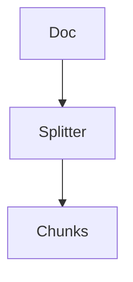

## Chapter 1 — Chunking 🧪

### 1.1 Why Chunking Is the Most Critical RAG Decision

Every RAG system stores knowledge as discrete fragments — chunks — indexed in a vector database. The chunking strategy determines the size, boundaries, and structure of these fragments, and it is the single design decision with the greatest downstream impact on system quality.

Chunking affects three fundamental properties of a RAG system:

**Retrieval precision.** Small chunks produce more focused retrievals but may lack the surrounding context needed to answer a question. Large chunks contain more context but reduce the precision of similarity matching — the model must search for the relevant sentence within a large block of text.

**Context quality.** The LLM can only reason over what is placed in its context window. Poorly chunked content — fragments that cut mid-sentence, separate a question from its answer, or break structured tables — directly degrades generation quality.

**Token economics.** Every retrieved chunk consumes context window budget. Unnecessarily large chunks inflate costs and reduce the number of independent sources that can be consulted.

```
Too small (< 128 tokens):
  ✓ High retrieval precision
  ✗ Insufficient context for generation
  ✗ Many chunks needed to cover a document

Too large (> 1024 tokens):
  ✓ Rich context per chunk
  ✗ Low retrieval precision (noisy embeddings)
  ✗ High token cost per retrieval
  ✗ Fills context window with few sources

Sweet spot (256–512 tokens for most domains):
  ✓ Sufficient context for generation
  ✓ Meaningful embeddings
  ✓ Manageable token budget
```

The right chunk size depends heavily on document type, query pattern, and embedding model. There is no universal answer — but there is a systematic way to find it, covered in the hands-on lab at the end of this chapter.

---

### 1.2 Fixed-Size Chunking

Fixed-size chunking splits text into segments of a predetermined token or character count, regardless of content structure. It is the simplest strategy and the appropriate baseline.



**Python — Fixed-size chunking:**
```python
from dataclasses import dataclass
from typing import Iterator

@dataclass
class Chunk:
    content: str
    index: int
    source: str
    char_start: int
    char_end: int

def fixed_size_chunker(
    text: str,
    chunk_size: int = 512,
    overlap: int = 64,
    source: str = ""
) -> list[Chunk]:
    """
    Split text into fixed-size character chunks with overlap.
    overlap preserves cross-boundary context.
    """
    chunks = []
    step = chunk_size - overlap
    for i, start in enumerate(range(0, len(text), step)):
        end = min(start + chunk_size, len(text))
        content = text[start:end].strip()
        if content:
            chunks.append(Chunk(
                content=content,
                index=i,
                source=source,
                char_start=start,
                char_end=end
            ))
        if end == len(text):
            break
    return chunks
```

**Java — Fixed-size chunking with [LangChain4j](https://docs.langchain4j.dev):**
```java
import dev.langchain4j.data.document.Document;
import dev.langchain4j.data.document.splitter.DocumentSplitters;
import dev.langchain4j.data.segment.TextSegment;

List<TextSegment> chunks = DocumentSplitters
    .recursive(512, 64)          // chunkSize=512, overlap=64
    .split(Document.from(text));

chunks.forEach(chunk ->
    System.out.printf("Chunk [%d chars]: %s...%n",
        chunk.text().length(),
        chunk.text().substring(0, Math.min(80, chunk.text().length())))
);
```

**Strengths:** Simple, predictable, fast. Good for homogeneous text corpora (e.g., support tickets, product descriptions).

**Weaknesses:** Ignores document structure. A chunk boundary may fall mid-sentence, mid-table, or mid-code block, destroying semantic coherence.

---

### 1.3 Recursive Character Chunking

Recursive character splitting attempts to split on natural language boundaries in order of preference: paragraph breaks (`\n\n`), line breaks (`\n`), sentence boundaries (`. `), words, characters. It falls back to the next separator only when the current level would produce a chunk that is too large.

This is the default recommendation for general-purpose RAG and the strategy used by [LangChain](https://python.langchain.com)'s `RecursiveCharacterTextSplitter`.

```python
from langchain.text_splitter import RecursiveCharacterTextSplitter
import tiktoken

# Token-accurate splitting (preferred over character-based in production)
def get_token_splitter(
    chunk_size: int = 512,
    overlap: int = 64,
    model: str = "gpt-4o"
) -> RecursiveCharacterTextSplitter:
    encoding = tiktoken.encoding_for_model(model)

    def token_length(text: str) -> int:
        return len(encoding.encode(text))

    return RecursiveCharacterTextSplitter(
        chunk_size=chunk_size,
        chunk_overlap=overlap,
        length_function=token_length,
        separators=["\n\n", "\n", ". ", "! ", "? ", " ", ""]
    )

splitter = get_token_splitter(chunk_size=512, overlap=64)
chunks = splitter.split_text(document_text)
print(f"Produced {len(chunks)} chunks")
```

🔓 **On-premise token counting without OpenAI API:**
```python
from transformers import AutoTokenizer

# Works offline with any HuggingFace model
tokenizer = AutoTokenizer.from_pretrained("sentence-transformers/all-MiniLM-L6-v2")

def token_length_local(text: str) -> int:
    return len(tokenizer.encode(text, add_special_tokens=False))
```

**When to use:** Default strategy for mixed document corpora, wikis, manuals, and web content. Produces consistently coherent fragments with minimal configuration.

---

### 1.4 Semantic Chunking

Semantic chunking groups sentences that are topically related, using embedding similarity to detect topic boundaries. When the cosine similarity between consecutive sentence embeddings drops below a threshold, a new chunk begins.


```python
from sentence_transformers import SentenceTransformer
import numpy as np
from sklearn.metrics.pairwise import cosine_similarity

def semantic_chunker(
    text: str,
    model_name: str = "all-MiniLM-L6-v2",
    similarity_threshold: float = 0.75,
    min_chunk_size: int = 100,
    max_chunk_size: int = 800
) -> list[str]:
    """
    Split text at semantic boundary points where topic shifts occur.
    """
    model = SentenceTransformer(model_name)

    # Split into sentences
    sentences = [s.strip() for s in text.replace('\n', ' ').split('. ') if s.strip()]
    if len(sentences) < 2:
        return [text]

    # Embed all sentences
    embeddings = model.encode(sentences)

    # Detect breakpoints: where similarity between adjacent sentences drops
    breakpoints = []
    for i in range(len(sentences) - 1):
        sim = cosine_similarity([embeddings[i]], [embeddings[i + 1]])[0][0]
        if sim < similarity_threshold:
            breakpoints.append(i + 1)

    # Assemble chunks from breakpoints
    chunks = []
    prev = 0
    for bp in breakpoints:
        chunk = '. '.join(sentences[prev:bp]) + '.'
        if len(chunk) >= min_chunk_size:
            # Merge if chunk is too large
            if len(chunk) > max_chunk_size:
                # Fall back to fixed split within this segment
                chunks.extend(_split_large_segment(chunk, max_chunk_size))
            else:
                chunks.append(chunk)
            prev = bp
    # Final chunk
    final = '. '.join(sentences[prev:])
    if final:
        chunks.append(final)

    return chunks

def _split_large_segment(text: str, max_size: int) -> list[str]:
    """Fallback: split oversized semantic segments at sentence boundaries."""
    result, current = [], ""
    for sentence in text.split('. '):
        if len(current) + len(sentence) > max_size and current:
            result.append(current.strip())
            current = sentence + '. '
        else:
            current += sentence + '. '
    if current.strip():
        result.append(current.strip())
    return result
```

**Strengths:** Produces topically coherent chunks. Particularly effective for long-form documents, academic papers, and technical manuals where topics shift gradually.

**Weaknesses:** Computationally expensive during ingestion (requires embedding every sentence). More complex to tune than fixed-size splitting.

---

### 1.5 Document-Structure-Aware Chunking

Structured documents — Markdown files, HTML pages, PDFs with headers, legal contracts — encode their own natural chunk boundaries in their formatting. Structure-aware chunking respects and exploits this hierarchy.

```python
import re
from dataclasses import dataclass, field
from typing import Optional

@dataclass
class StructuredChunk:
    content: str
    heading: Optional[str]
    level: int  # Heading level: 1=H1, 2=H2, etc.
    source: str
    metadata: dict = field(default_factory=dict)

def markdown_chunker(
    markdown_text: str,
    source: str = "",
    max_chunk_size: int = 600
) -> list[StructuredChunk]:
    """
    Split Markdown by heading hierarchy.
    Each section becomes a chunk, split further if too large.
    """
    chunks = []
    heading_pattern = re.compile(r'^(#{1,6})\s+(.+)$', re.MULTILINE)
    headings = list(heading_pattern.finditer(markdown_text))

    for i, match in enumerate(headings):
        level = len(match.group(1))
        heading = match.group(2).strip()
        start = match.end()
        end = headings[i + 1].start() if i + 1 < len(headings) else len(markdown_text)
        section_text = markdown_text[start:end].strip()

        if not section_text:
            continue

        # Section fits in one chunk
        if len(section_text) <= max_chunk_size:
            chunks.append(StructuredChunk(
                content=f"# {heading}\n\n{section_text}",
                heading=heading,
                level=level,
                source=source,
                metadata={"heading_level": level}
            ))
        else:
            # Split large sections into paragraphs
            paragraphs = [p.strip() for p in section_text.split('\n\n') if p.strip()]
            current, current_len = [], 0
            for para in paragraphs:
                if current_len + len(para) > max_chunk_size and current:
                    chunks.append(StructuredChunk(
                        content=f"# {heading}\n\n" + '\n\n'.join(current),
                        heading=heading,
                        level=level,
                        source=source,
                        metadata={"heading_level": level, "partial": True}
                    ))
                    current, current_len = [para], len(para)
                else:
                    current.append(para)
                    current_len += len(para)
            if current:
                chunks.append(StructuredChunk(
                    content=f"# {heading}\n\n" + '\n\n'.join(current),
                    heading=heading,
                    level=level,
                    source=source,
                    metadata={"heading_level": level}
                ))

    return chunks
```

**When to use:** Internal documentation, wikis, API references, legal documents, and any corpus with consistent heading structure. The heading text preserved in each chunk significantly improves retrieval quality.

---

### 1.6 Sliding Window Chunking

Sliding window chunking creates heavily overlapping chunks to ensure no cross-boundary information is lost. Each chunk overlaps significantly with its neighbors.

```python
def sliding_window_chunker(
    text: str,
    window_size: int = 400,
    stride: int = 100,        # How far to advance per window
    source: str = ""
) -> list[Chunk]:
    """
    Dense overlapping chunks. stride < window_size creates overlap.
    overlap = window_size - stride
    """
    words = text.split()
    chunks = []
    for i, start in enumerate(range(0, len(words), stride)):
        end = min(start + window_size, len(words))
        content = ' '.join(words[start:end])
        if len(content.strip()) > 50:  # Skip near-empty trailing chunks
            chunks.append(Chunk(
                content=content,
                index=i,
                source=source,
                char_start=start,
                char_end=end
            ))
        if end == len(words):
            break
    return chunks
```

**When to use:** Documents where answers frequently span structural boundaries — technical specifications, legal clauses, contracts. High overlap increases retrieval recall at the cost of index size.

**📐 Architecture decision:** Sliding window significantly increases index size (by a factor of `window_size / stride`). For a corpus of 10GB of text with a stride of 100 and window of 400, expect ~4x storage compared to non-overlapping chunking. Only use when cross-boundary retrieval is a demonstrated quality problem.

---

### 1.7 Hierarchical Chunking (Parent-Child)

Hierarchical chunking maintains two levels of granularity: small child chunks for precise retrieval, and larger parent chunks for rich generation context. Retrieval uses child chunks; generation uses the corresponding parent.

```python
from dataclasses import dataclass
from typing import Optional

@dataclass
class HierarchicalChunk:
    chunk_id: str
    parent_id: Optional[str]
    content: str
    level: str  # "parent" | "child"
    source: str

def hierarchical_chunker(
    text: str,
    parent_size: int = 1024,
    child_size: int = 256,
    source: str = ""
) -> tuple[list[HierarchicalChunk], list[HierarchicalChunk]]:
    """
    Returns (parent_chunks, child_chunks).
    Each child references its parent by parent_id.
    Retrieval indexes child embeddings; generation uses parent content.
    """
    parents, children = [], []

    # Create parent chunks
    for pi, p_start in enumerate(range(0, len(text), parent_size)):
        p_text = text[p_start:p_start + parent_size].strip()
        if not p_text:
            continue
        parent_id = f"{source}_p{pi}"
        parents.append(HierarchicalChunk(
            chunk_id=parent_id,
            parent_id=None,
            content=p_text,
            level="parent",
            source=source
        ))
        # Create children within this parent
        for ci, c_start in enumerate(range(0, len(p_text), child_size)):
            c_text = p_text[c_start:c_start + child_size].strip()
            if c_text:
                children.append(HierarchicalChunk(
                    chunk_id=f"{parent_id}_c{ci}",
                    parent_id=parent_id,
                    content=c_text,
                    level="child",
                    source=source
                ))

    return parents, children

# At query time: retrieve children, return parent content
def retrieve_with_parent_expansion(
    query_embedding: list[float],
    child_collection,
    parent_store: dict[str, str],
    top_k: int = 5
) -> list[str]:
    # Search child index
    results = child_collection.query(
        query_embeddings=[query_embedding],
        n_results=top_k
    )
    child_ids = results["ids"][0]
    # Map to parent IDs and return parent content
    seen_parents = set()
    context_chunks = []
    for child_id in child_ids:
        # Extract parent_id from child_id
        parent_id = "_".join(child_id.split("_")[:-1])
        if parent_id not in seen_parents:
            seen_parents.add(parent_id)
            context_chunks.append(parent_store[parent_id])
    return context_chunks
```

**When to use:** Documents with high information density where precision of retrieval (child) and richness of generation context (parent) are both required. Particularly effective for technical manuals and knowledge bases.

---

### 1.8 Choosing the Right Strategy

```
Document type              → Recommended strategy
─────────────────────────────────────────────────
Plain text / blog posts    → Recursive character
Markdown / wikis / docs    → Structure-aware (heading-based)
Legal / contractual text   → Sliding window (high overlap)
Dense technical manuals    → Hierarchical (parent-child)
Q&A pairs / structured KB  → Fixed-size (one Q&A per chunk)
Long scientific papers      → Semantic chunking
```

**Chunk size guidelines by domain:**

| Domain | Recommended chunk size | Reasoning |
|---|---|---|
| Customer support KB | 256–384 tokens | Short, focused answers |
| Legal documents | 512–768 tokens (+ overlap) | Cross-boundary clauses |
| Technical documentation | 384–512 tokens | Code + explanation pairs |
| Financial reports | 512–1024 tokens | Dense numeric context |
| Academic papers | Semantic boundaries | Topic-driven structure |
| Code repositories | Function/class level | Structural unit integrity |

---

### 1.9 Chunk Metadata Enrichment

Raw text alone is insufficient for production RAG. Every chunk should carry metadata that enables filtering, attribution, and debugging.

```python
from datetime import datetime
from dataclasses import dataclass, field
from typing import Optional

@dataclass
class EnrichedChunk:
    content: str
    source: str
    chunk_index: int
    total_chunks: int
    heading: Optional[str]
    document_title: Optional[str]
    document_type: str          # pdf | markdown | html | txt
    created_at: str
    token_count: int
    language: str = "en"
    tags: list[str] = field(default_factory=list)

def enrich_chunk(
    raw_content: str,
    source: str,
    chunk_index: int,
    total_chunks: int,
    metadata: dict
) -> EnrichedChunk:
    import tiktoken
    enc = tiktoken.encoding_for_model("gpt-4o")
    return EnrichedChunk(
        content=raw_content,
        source=source,
        chunk_index=chunk_index,
        total_chunks=total_chunks,
        heading=metadata.get("heading"),
        document_title=metadata.get("title"),
        document_type=metadata.get("type", "txt"),
        created_at=datetime.utcnow().isoformat(),
        token_count=len(enc.encode(raw_content)),
        tags=metadata.get("tags", [])
    )
```

---

### 🧪 Hands-on Lab: Chunking Strategy Comparison

**Objective:** Compare four chunking strategies on the same document corpus. Measure retrieval quality using hit rate and average precision.

**Prerequisites:** Python 3.11+, packages: `langchain`, `sentence-transformers`, `chromadb`, `tiktoken`, `scikit-learn`

**Step 1 — Prepare a sample corpus:**

```python
import chromadb
from sentence_transformers import SentenceTransformer
from langchain.text_splitter import RecursiveCharacterTextSplitter
import tiktoken
import json

SAMPLE_DOCUMENT = """
# Refund Policy

Our standard refund policy allows customers to return products within 30 days
of purchase for a full refund. Items must be in original condition and packaging.
Digital products are non-refundable once downloaded.

---
[« Back to rag_engineering Index](index.md) | [🏠 Home](../../index.md)