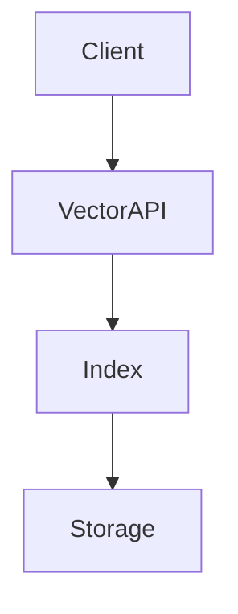

## Chapter 3 — Vector Databases

### 3.1 The Role of Vector Storage in RAG

A vector database is specialised storage infrastructure designed to index high-dimensional vectors and serve approximate nearest-neighbour (ANN) queries efficiently. In a RAG system it fulfils three responsibilities:

**Index storage:** Persisting chunk embeddings and their associated metadata.

**Similarity search:** Finding the top-K vectors closest to a query vector in sub-linear time, using ANN algorithms.

**Metadata filtering:** Combining vector similarity with structured attribute filters (e.g., `source = "HR_Policy_2024.pdf"`) to constrain retrieval scope.



Vector databases are distinct from traditional databases in one fundamental way: queries are not exact matches (`WHERE id = 42`) but approximate similarity searches (`NEAREST TO [0.023, -0.187, ...]`). This probabilistic nature — trading exactness for speed — is a deliberate design choice that must be understood by architects making infrastructure decisions.

---

### 3.2 ANN Indexing Algorithms

The performance characteristics of a vector database are largely determined by its indexing algorithm. Understanding the trade-offs enables informed infrastructure decisions.

**HNSW (Hierarchical Navigable Small World)**

The dominant algorithm in most modern vector databases. Builds a multilayer graph where nodes at higher layers provide fast long-range navigation and lower layers provide precise local search.

```
Properties:
  ✓ High query throughput
  ✓ Excellent recall/speed trade-off
  ✓ Supports incremental updates
  ✗ High memory usage (graph structure in RAM)
  ✗ Index construction slower than IVF
Used by: Weaviate, Qdrant, Chroma, Milvus (default)
```

**IVF (Inverted File Index)**

Partitions the vector space into clusters (Voronoi cells). Queries search only nearby clusters rather than the full index.

```
Properties:
  ✓ Lower memory footprint than HNSW
  ✓ Scales to billions of vectors with quantisation
  ✗ Requires full index rebuild to add vectors
  ✗ Lower recall than HNSW at equivalent speed
Used by: FAISS, Milvus (IVF variant)
```

**Key index parameters (HNSW):**

| Parameter | Effect | Default |
|---|---|---|
| `M` (connections per node) | Higher → better recall, more memory | 16 |
| `ef_construction` | Higher → better index quality, slower build | 100 |
| `ef` (query time) | Higher → better recall, slower query | 64 |

---

### 3.3 Vector Database Comparison

| Database | Deployment | Index | Filtering | Highlights |
|---|---|---|---|---|
| [Pinecone](https://docs.pinecone.io) | Cloud only | HNSW + proprietary | ✓ | Fully managed, serverless option |
| [Weaviate](https://weaviate.io/docs) | Cloud + self-hosted | HNSW | ✓ (GraphQL) | GraphQL API, built-in modules |
| [Qdrant](https://qdrant.tech/documentation) | Cloud + self-hosted | HNSW | ✓ | Rust-based, payload filters, high performance |
| [Milvus](https://milvus.io/docs) | Self-hosted | HNSW + IVF | ✓ | Billion-scale, GPU acceleration |
| [Chroma](https://docs.trychroma.com) | Embedded + hosted | HNSW ([FAISS](https://faiss.ai)) | ✓ | Simple API, ideal for development |
| [FAISS](https://faiss.ai) | Library (embedded) | IVF + HNSW | ✗ | Meta's library; no persistence layer |
| Azure AI Search | Cloud (Azure) | Proprietary | ✓ | Native Azure integration, hybrid search |

**Selection framework:**

```
Development / prototyping    → Chroma (zero infrastructure)
Enterprise cloud             → Pinecone or Qdrant Cloud
Enterprise self-hosted       → Qdrant or Weaviate
Billion-scale on-premise     → Milvus
Java Spring ecosystem        → Qdrant or Weaviate (REST APIs)
Azure-native                 → Azure AI Search
```

---

### 3.4 Metadata Filtering

Hybrid queries — combining vector similarity with attribute filters — are essential in enterprise RAG systems where knowledge is segmented by department, document type, or date.

**Python — Metadata-filtered retrieval with [Qdrant](https://qdrant.tech/documentation):**
```python
from qdrant_client import QdrantClient
from qdrant_client.models import (
    Distance, VectorParams, PointStruct,
    Filter, FieldCondition, MatchValue, Range
)

client = QdrantClient(host="localhost", port=6333)

# Create collection
client.create_collection(
    collection_name="enterprise_docs",
    vectors_config=VectorParams(size=1536, distance=Distance.COSINE)
)

# Index chunks with metadata
points = [
    PointStruct(
        id=i,
        vector=embedding,
        payload={
            "content": chunk.content,
            "source": chunk.source,
            "department": "HR",
            "year": 2024,
            "doc_type": "policy"
        }
    )
    for i, (chunk, embedding) in enumerate(zip(chunks, embeddings))
]
client.upsert(collection_name="enterprise_docs", points=points)

# Query with filters
def search_with_filter(
    query_vector: list[float],
    department: str,
    min_year: int = 2023,
    top_k: int = 5
) -> list[dict]:
    results = client.search(
        collection_name="enterprise_docs",
        query_vector=query_vector,
        query_filter=Filter(
            must=[
                FieldCondition(key="department", match=MatchValue(value=department)),
                FieldCondition(key="year", range=Range(gte=min_year))
            ]
        ),
        limit=top_k
    )
    return [
        {"content": r.payload["content"], "score": r.score, "source": r.payload["source"]}
        for r in results
    ]
```

**Python — Metadata filtering with [Chroma](https://docs.trychroma.com) (development):**
```python
import chromadb

client = chromadb.PersistentClient(path="./chroma_db")
collection = client.get_or_create_collection("enterprise_docs")

# Query with metadata filter
results = collection.query(
    query_embeddings=[query_embedding],
    n_results=5,
    where={
        "$and": [
            {"department": {"$eq": "HR"}},
            {"year": {"$gte": 2023}}
        ]
    }
)
```

---

### 3.5 Operational Considerations

**Index persistence and backups:** HNSW indexes are stored in memory during operation. Ensure your deployment persists the index to disk and includes backup procedures, especially for [Qdrant](https://qdrant.tech/documentation) and [Weaviate](https://weaviate.io/docs) self-hosted deployments.

**Index rebuilding:** When embedding model or chunk strategy changes, the entire index must be rebuilt. Plan zero-downtime rebuilds using a blue-green index pattern: build the new index in parallel, then switch traffic.

**Scalability patterns:**

```python
# Blue-green index rotation
class VectorIndexManager:
    def __init__(self, client: QdrantClient):
        self.client = client
        self.active_collection = "docs_v1"

    def rebuild_index(self, new_collection: str, chunks_and_embeddings):
        """Build new index while old one serves traffic."""
        # 1. Build new collection
        self.client.create_collection(
            collection_name=new_collection,
            vectors_config=VectorParams(size=1536, distance=Distance.COSINE)
        )
        # 2. Populate in batches
        batch_size = 1000
        for i in range(0, len(chunks_and_embeddings), batch_size):
            batch = chunks_and_embeddings[i:i+batch_size]
            self.client.upsert(new_collection, points=batch)

        # 3. Atomic switch (in practice: update config/env var, no downtime)
        old = self.active_collection
        self.active_collection = new_collection
        # 4. Clean up old collection after validation
        self.client.delete_collection(old)
```

---

### 3.6 Java Integration Patterns

**Java — [Weaviate](https://weaviate.io/docs) client:**
```java
import io.weaviate.client.WeaviateClient;
import io.weaviate.client.Config;
import io.weaviate.client.v1.graphql.query.argument.NearVectorArgument;
import io.weaviate.client.v1.graphql.query.fields.Field;

WeaviateClient client = new WeaviateClient(
    new Config("http", "localhost:8080")
);

// Query by vector similarity
Float[] queryVector = /* embedding vector */;

var result = client.graphQL().get()
    .withClassName("Document")
    .withFields(
        Field.builder().name("content").build(),
        Field.builder().name("source").build(),
        Field.builder().name("_additional")
            .withFields(Field.builder().name("certainty").build())
            .build()
    )
    .withNearVector(NearVectorArgument.builder()
        .vector(queryVector)
        .certainty(0.7f)
        .build())
    .withLimit(5)
    .run();
```

**Java — [Qdrant](https://qdrant.tech/documentation) REST client (Spring WebClient):**
```java
import org.springframework.web.reactive.function.client.WebClient;
import java.util.Map;
import java.util.List;

@Service
public class VectorSearchService {
    private final WebClient qdrantClient;

    public VectorSearchService() {
        this.qdrantClient = WebClient.builder()
            .baseUrl("http://localhost:6333")
            .build();
    }

    public List<Map<String, Object>> search(
        float[] queryVector,
        String department,
        int topK
    ) {
        Map<String, Object> body = Map.of(
            "vector", queryVector,
            "filter", Map.of(
                "must", List.of(
                    Map.of("key", "department",
                           "match", Map.of("value", department))
                )
            ),
            "limit", topK,
            "with_payload", true
        );

        return qdrantClient.post()
            .uri("/collections/enterprise_docs/points/search")
            .bodyValue(body)
            .retrieve()
            .bodyToMono(Map.class)
            .map(r -> (List<Map<String, Object>>) r.get("result"))
            .block();
    }
}
```

---

> ### 📋 Chapter Summary
>
> - Vector databases provide ANN search over high-dimensional embeddings. The primary algorithms are **HNSW** (best recall/speed trade-off, high memory) and **IVF** (lower memory, batch-oriented).
> - **Metadata filtering** is essential in enterprise RAG for scoping retrieval to relevant document subsets.
> - Database selection follows a clear framework: [Chroma](https://docs.trychroma.com) for development, [Qdrant](https://qdrant.tech/documentation) or [Weaviate](https://weaviate.io/docs) for self-hosted enterprise, [Milvus](https://milvus.io/docs) for billion-scale.
> - **Index rebuilding** must be planned with zero-downtime strategies (blue-green) when changing embedding models or chunk strategies.

---

> ### ❓ Comprehension Questions
>
> 1. A RAG system uses HNSW indexing and achieves 95% recall at 50ms p99 latency. The team increases `M` from 16 to 64. What are the effects on recall, latency, and memory usage?
> 2. An enterprise knowledge base contains documents from 12 departments. Users should only retrieve documents from their own department. Describe the metadata schema and query architecture that enforces this.
> 3. The embedding model is being upgraded from `text-embedding-3-small` to `text-embedding-3-large`. Design a zero-downtime index migration strategy.
> 4. Compare [FAISS](https://faiss.ai) and [Qdrant](https://qdrant.tech/documentation) for a production RAG use case with 5 million documents, metadata filtering requirements, and a team of 3 engineers. Which would you choose and why?
> 5. A vector database query returns the correct top-5 results 95% of the time. The remaining 5% are false negatives (relevant chunks missed). What index parameters would you tune to improve recall, and what is the cost?

---

## References

### Papers
- [Efficient and Robust Approximate Nearest Neighbor Search Using HNSW](https://arxiv.org/abs/1603.09320) — Malkov & Yashunin, 2016. The foundational HNSW paper.
- [Billion-scale similarity search with GPUs](https://arxiv.org/abs/1702.08734) — Johnson et al. (Meta), 2017. FAISS and IVF at scale.
- [ANN Benchmarks](https://ann-benchmarks.com) — Aumuller et al. Comprehensive ANN algorithm comparison.

### Documentation
- [Weaviate Documentation](https://weaviate.io/docs) — Vector database with GraphQL interface.
- [Qdrant Documentation](https://qdrant.tech/documentation) — High-performance Rust-based vector database.
- [Milvus Documentation](https://milvus.io/docs) — Billion-scale vector database.
- [Chroma Documentation](https://docs.trychroma.com) — Embedded vector database for development.
- [FAISS Documentation](https://faiss.ai) — Meta's vector similarity search library.
- [Pinecone Documentation](https://docs.pinecone.io) — Managed vector database service.
- [LangChain4j Vector Stores](https://docs.langchain4j.dev/integrations/embedding-stores/) — Java vector store integrations.

---

---
[« Back to rag_engineering Index](index.md) | [🏠 Home](../../index.md)